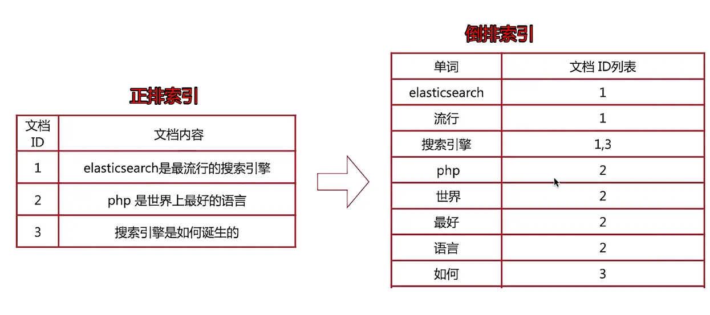
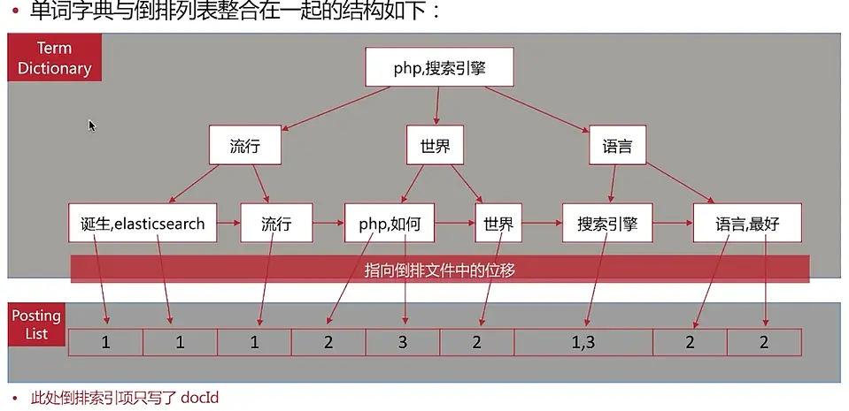
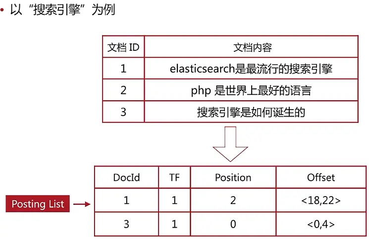
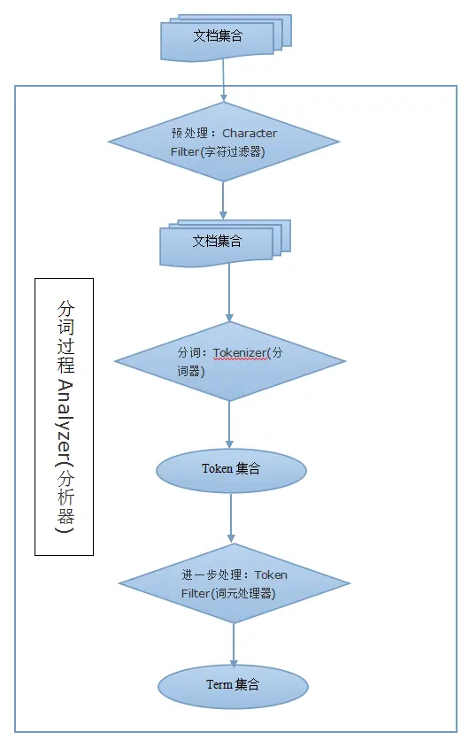

## 搜索引擎

全文搜索引擎会用某种算法对要建索引的文档如下进行分析:

1. 从文档中提取出若干 `Token(词元)`， 这些算法称为 **Tokenizer(分词器)**
2. Token 被进一步处理,这些处理算法被称为 **Token Filter(词元处理器)** 被处理后的结果被称为 `Term(词)`
    - 文档中包含了几个这样的Term被称为 `Frequency(词频)`
    - 搜索引擎会建立 Term和原文档的 `倒排索引`， 这样就能 **根据Term很快到找到源文档**
3. 文本被 Tokenizer 处理前可能要做一些预处理,这些处理的算法被称为 **Character Filter(字符过滤器)**
4. 上述整个的分析算法被称为 **Analyzer(分析器)**

- `正排索引`
  - 文档ID -> 文档内容/单词的关联关系, 类比于书记的目录页
- `倒排索引`
  - 单词->文档Id 的关联关系
  - 将文档内容进行分词得到单词,每个单词对应一个文档 ID 组,最后得到一个文档ID列表,与单词对应

### 查询流程示意

> 倒排索引和正排索引结合的查询流程, 以查询包含 "搜索引擎"的文档为例

1. 先通过倒排索引找到对应的文档id ->1和3
2. 然后通过正排索引查询 文档id为1 和3 的完整内容
3. 返回结果



## 1.2 倒排索引详解

**倒排索引是搜索引擎的核心**,主要包含两部分:

1. **单词词典** (Term Dictionary)
2. **倒排列表** (Posting List)

下面是倒排索引的组成图 [其中倒排列表此处只写了文档ID]



### 单词词典

单词词典有如下的特性

1. 记录所有文档的单词, 一般比较大
2. 记录单词到 倒排列表的关联信息
3. 单词词典一般采用 B+ 树

### 倒排列表

- 倒排列表记录了单词对应的文档集合,由 `倒排索引项` 组成
- 注意: **ES 存储的是 JSON 格式文档,包含了多个字段,每个字段都会有自己的倒排索引**
- 倒排索引项主要包含以下的信息:
  - `文档ID`
    - 用于获取原始信息
  - `单词频率 (Term Frequency)`
    - 记录该单词在该文档中出现的次数   -> 用于后续相关性算分
  - `位置 (Position)`
    - 记录单词在文档中的分词位置(多个)  -> 用于做词语搜索
  - `偏移 (Offset)`
    - 记录单词在文档中开始和结束的位置  -> 用于做高亮显示



## 分词(Analysis)

将文本转化为一系列单词 (Term 或 Token) 的过程称为分词,也可以称为文本分析。比如 "ElasticSearch 是最流行的搜索引擎" ,可以分词为 "ElasticSearch"、"流行"、"搜索引擎"

分词器(Analyzer)是ES的分词组件,组成以及执行顺序如下

1. `Character Filters`
    - 字符过滤器,针对原始文本进行处理
    - 比如去除 HTML 特殊标记符
2. `Tokenizer`
    - 分词器,将原始文本按照一定的规则切分为单词(token 或者 term)
3. `Token Filters`
    - 词元处理器,针对 Tokenizer 处理的单词进行加工
    - 比如转小写,删除或新增等处理



### 分词api (_analyze)

Es 提供了一个测试分词的API 接口,方便验证分词效果, endpoint 是 `_analyze`。通过 api 可以:

1. `analyzer + text`
    - 直接指定 分析器和文本内容进行测试
2. `field + text`
    - 直接指定 索引中的字段和文本内容进行测试
3. `tokenizer + filter + text`
    - 直接指定 分词器、词元处理器和文本内容进行测试

#### analyzer + text

- ES 默认的分析器 ==> `standard`
- 格式

  ```json
  POST _analyze 
  { 
    "analyzer":"指定分析器" ,
    "text":"测试文本"
  }
  ```

##### 基本示例

> 测试使用指定的分析器

```json
# 测试Api
POST /_analyze
{
  "analyzer": "standard",
  "text":"Hello World"
}

#返回结果 => 返回token(词元)
{
  "tokens": [
    {
      "token": "hello",  
      "start_offset": 0,
      "end_offset": 5,
      "type": "<ALPHANUM>",
      "position": 0
    },
    {
      "token": "world",
      "start_offset": 6,
      "end_offset": 11,
      "type": "<ALPHANUM>",
      "position": 1
    }
  ]
}
```

#### field + text

- 格式

  ```json
  #  field如果是索引字段,必须是可分词的类型
  POST /索引名/_analyze
  {
    "field": "进行分词的字段",
    "text": "自定义文本"
  }
  ```

##### 基本示例

> 测试指定索引字段和自定义文本内容

```json
# 测试Api
POST /test_index/_analyze
{
  "field": "username",
  "text": "Elastic Search"
}

# 返回结果
{
  "tokens": [
    {
      "token": "elastic",
      "start_offset": 0,
      "end_offset": 7,
      "type": "<ALPHANUM>",
      "position": 0
    },
    {
      "token": "search",
      "start_offset": 8,
      "end_offset": 14,
      "type": "<ALPHANUM>",
      "position": 1
    }
  ]
}
```

#### tokenizer + filter + text

- **格式:**

  ```json
  POST /_analyzer
  {
      "tokenizer": "指定的分词器",
      "filter": "指定的词元处理器",
      "text":"自定义文本内容"
  }
  ```

##### 基本示例

```json
# 测试 api
POST /_analyze
{
  "tokenizer": "standard",
  "filter": ["lowercase"],
  "text":"elasticsearch IS BEST"
}
# 返回结果
{
  "tokens": [
    {
      "token": "elasticsearch",
      "start_offset": 0,
      "end_offset": 13,
      "type": "<ALPHANUM>",
      "position": 0
    },
    {
      "token": "is",
      "start_offset": 14,
      "end_offset": 16,
      "type": "<ALPHANUM>",
      "position": 1
    },
    {
      "token": "best",
      "start_offset": 17,
      "end_offset": 21,
      "type": "<ALPHANUM>",
      "position": 2
    }
  ]
}
```


### 使用指定分析器 [analyzer]

Es有如下自带的 Analyzer (分析器) 以及其特点:

1. `standard`
    - 默认分析器
    - 按词切分,支持多语言 -> 使用小写处理[词元处理器]
2. `simple`
    - 按非字母切分(过滤掉非字母字符) -> 使用小写处理[词元处理器]
3. `Whitespace`
    - 按空格进行切分
4. `stop`
    - 在 simple analyzer 下,多了对Stop Word的处理
    - 移除预期助词等修饰性的词语,比如 The,an,的,这 等等
5. `keyword`
    - 不分词,将输入直接作为一个单词输出
6. `pattern`
    - 通过正则表达式自定义分隔符
    - **默认是\W+**, (即非字词的符号作为分隔符: simple analyzer)
7. `language`
    - 提供了30+ 常见语言分词器
8. `custom`
    - 一个Tokenizer, 零个或多个Token Filter, 零个或多个Char Filter

#### simple

```json
# 测试 api
POST /_analyze
{
  "analyzer": "simple",
  "text":"Elastic Search 22 搜索引擎"
}
# 返回结果
{
  "tokens": [
    {
      "token": "elastic",
      "start_offset": 0,
      "end_offset": 7,
      "type": "word",
      "position": 0
    },
    {
      "token": "search",
      "start_offset": 8,
      "end_offset": 14,
      "type": "word",
      "position": 1
    },
    {
      "token": "搜索引擎",
      "start_offset": 18,
      "end_offset": 22,
      "type": "word",
      "position": 2
    }
  ]
}
```

#### whitespace

```json
# 测试 api
POST /_analyze
{
  "analyzer": "whitespace",
  "text":"Elastic Search 22 搜索引擎"
}
# 返回结果
{
  "tokens": [
    {
      "token": "Elastic",
      "start_offset": 0,
      "end_offset": 7,
      "type": "word",
      "position": 0
    },
    {
      "token": "Search",
      "start_offset": 8,
      "end_offset": 14,
      "type": "word",
      "position": 1
    },
    {
      "token": "22",
      "start_offset": 15,
      "end_offset": 17,
      "type": "word",
      "position": 2
    },
    {
      "token": "搜索引擎",
      "start_offset": 18,
      "end_offset": 22,
      "type": "word",
      "position": 3
    }
  ]
}
```

#### keyword

```json
# 测试 api
POST /_analyze
{
  "analyzer": "keyword",
  "text":"Elastic Search 22 搜索引擎"
}
# 返回结果
{
  "tokens": [
    {
      "token": "Elastic Search 22 搜索引擎",
      "start_offset": 0,
      "end_offset": 22,
      "type": "word",
      "position": 0
    }
  ]
}
```

## 自定义字符过滤器 (Character Filter)

> 在Tokenizer之前对原始文本进行处理,比如 增加,删除或者替换字段等

Es 自带的Character Filters 如下:

1. `html_strip`
    - 去除html标签和转换html实体
2. `mapping`
    - 去除html标签和转换html实体
    - 有以下的属性
      - "mappings":["原始值=>替换值","原始值=>替换值","..."]
3. `pattern_replace`
    - 进行正则匹配替换
    - 有以下的属性
      - "pattern" : "正则表达式"
      - "replacement":"替换值"

- **格式**

  ```json
  POST /_analyze 
  {
   "char_filter":
    [
       {
          "type":"指定字符过滤器",
            属性1,属性2...
        }
        ...
    ]
    "text":"测试文本"
  }
  ```

### 基本示例

```json
# 测试 api
POST  /_analyze
{
  "char_filter": 
  [
     {
        "type": "html_strip" 
     },{
       "type": "mapping",
       "mappings": ["@=>and","|=>or","!=>not"]
     }
  ],
  "tokenizer": "keyword",
  "filter": ["lowercase"],
  "text": "<b>i&apos;m so happy | sad?</b>"
}

# 返回结果
{
  "tokens": [
    {
      "token": "i'm so happy or sad?",
      "start_offset": 3,
      "end_offset": 31,
      "type": "word",
      "position": 0
    }
  ]
}
```

## 分词器(Tokenizer)

Es有如下自带的分词器:

1. `standard`
    - 按单词进行分割
2. `keyword`
    - 不进行分词
3. `letter`
    - 按非字符进行分词
4. `whitespace`
    - 按 空格进行分词
5. `uax_url_email`
    - 采用standard 进行分词,但是不会切分邮箱 和 Url
6. `nGram`
7. `edgeNGram`
8. ...

### 中文分词

- 中文分词就是 将一个汉字序列切分为一个一个单独的词,中文分词有如下的几个难点:
  - 英文中,单词以空格作为自然分隔符,而中文中没有形式上的分隔符
  - 内容一致,但是不同的分词会导致歧义问题
- 常见的中文分词系统
  - `IK`
    - 实现中英文的切分,支持 ik_smart ,ik_maxword等模式
    - 可自定义词库,支持热更新分词词典
    - 地址: http://github.com/medcl/elasticsearch-analysis-ik
  - `jieba`
    - python中最流行的分析系统,支持分词和词性标注
    - 支持繁体分词,自定义词典,并行分词等
    - 地址: http://github.com/sing1ee/elasticsearch-jieba-plugin
- 基于自然语言处理的分词系统
  - `Hanlp`
    - 由一系列模型与算法组成的Java工具包,目标是普及自然语言在生产环境中的应用
    - 地址:http://github.com/hankcs/HanLP
  - `THULAC`
    - 地址: http://github.com/microbun/elasticsearch-thulac-plugin

## 词元处理器(Token Filter)

Es有如下自带的词元处理器

1. `standard`
    - 什么都不做
2. `length`
    - 用于去掉过长或者过短的单词,有以下的属性
    - `min` : 定义最短长度
    - `max` : 定义最长长度

3. `lowercase/uppercase`
    - 将词元文本规范化为小写/大写
4. `single`
    - 将相邻的两个词元组很成新的词元,有以下的属性
    - `output_unigrams`: 是否保留输入词元原样加入token
5. `stop`
    - 移除指定的单词, 有以下的属性
    - `stopwords` : 指定需要移除的单词,比如 "stopwords": ["test","a"]
6. `stemmer_override`
    - 将指定的词元映射为其他的单词, 有以下的属性
    - `rules` : 映射规则,比如 "rules":["this=>These"]
7. `reverse`
    - 将词元进行简单的翻转
8. `truncate`
    - 截取词元到特定长度
9. `unique`
    - 去除**相邻的重复的**词元
  
- 使用格式

  ```json
  POST /_analyze 
  {
   "filter":
    [
       {
          "type":"指定分词处理器",
            属性1,属性2...
        }
        ...
    ]
    "text":"测试文本"
  }
  ```

### 基本使用

```json
# 测试 api
POST _analyze
{
    "tokenizer" : "standard",
    "filter": [{"type": "length", "min":1, "max":3 }],  
    "text" : "this is a test"
}
#返回结果
{
  "tokens": [
    {
      "token": "is",
      "start_offset": 5,
      "end_offset": 7,
      "type": "<ALPHANUM>",
      "position": 1
    },
    {
      "token": "a",
      "start_offset": 8,
      "end_offset": 9,
      "type": "<ALPHANUM>",
      "position": 2
    }
  ]
}
```

## 自定义分析过程

- 创建索引的时候,进行通过`setting` 进行设置
  - 分词配置,可以自定义 char_filter , tokenizer , filter , analyzer

- 基本格式

  ```json
  PUT /索引名  
  {
      "settings": 
      {
          "analysis" : 
          {
              "char_filter" :{
                  自定义过滤器名: {
                      "type": "指定的字符过滤器",
                       属性1,属性2...
                  }
              },
              {...},..,{...},
              "tokenizer":{
                  自定义分词器名: {
                      "type": "指定的分词器"
                      属性1,属性2...
                  }
                  
              },
          {...},..,{...},
              "filter" :{
                  自定义词元处理器名: {
                      "type": "指定词元处理器"
                      属性1,属性2...
                  }                
              },
              {...},..,{...},
              "analyzer":{
                  自定义分析器名: {                    
                      "type": "custom",  
                      "tokenizer": "指定的分词器",
                      "char_filter":["指定字符过滤器1","指定字符过滤器2","..."],
                      "filter":["指定词元处理器1","指定词元处理器2","..."]
                  }
              }
          }
      }
  }
  ```

### 基本示例

```json
# 在索引下创建
PUT  /test
{
  "settings": {
    "analysis": {
      "char_filter": {
        "myCharFilter" : {
              "type":"html_strip"
        },
        "myCharFilter2":{
            "type":"mapping",
            "mappings": ["@=>and","|=> or"]
        }
      },
      "tokenizer": {
        "myTokenizer":{
          "type":"standard"
        }
      },
      "filter": {
        "myFiler1":{
          "type":"stop",
          "stopwords":["this"]
        }
      },
      "analyzer": {
          "myAnalyzer":{
          "type":"custom",
          "tokenizer": "standard",
          "char_filter":["myCharFilter","myCharFilter2"],
          "filter":["myFiler1"]
        }
      }
    }
  }
}

#然后测试使用 自定义的分析器

POST  /test/_analyze
{
  "analyzer": "myAnalyzer", 
  "text":"i'm so happy | sad?"
}


# 返回结果
{
  "tokens": [
    {
      "token": "i'm",
      "start_offset": 0,
      "end_offset": 3,
      "type": "<ALPHANUM>",
      "position": 0
    },
    {
      "token": "so",
      "start_offset": 4,
      "end_offset": 6,
      "type": "<ALPHANUM>",
      "position": 1
    },
    {
      "token": "happy",
      "start_offset": 7,
      "end_offset": 12,
      "type": "<ALPHANUM>",
      "position": 2
    },
    {
      "token": "or",
      "start_offset": 13,
      "end_offset": 14,
      "type": "<ALPHANUM>",
      "position": 3
    },
    {
      "token": "sad",
      "start_offset": 15,
      "end_offset": 18,
      "type": "<ALPHANUM>",
      "position": 4
    }
  ]
}
```

## 分词使用说明

- 分词一般在两种情况下使用

  1. 创建或者更新文档时,会对相应的文档进行分词护理
     - 创建非结构化索引(index mapping)时,在properties 中指定 分析器 (analyzer)
  2. 查询时,会对查询语句进行分词
     - 查询时,指定分析器(analyzer)
     - 创建非结构化索引(index mapping)时,在properties 中指定 查询分析器 (search_analyzer)
- 如果字段不需要分词,将不需要分词的字段设置为keyword类型
