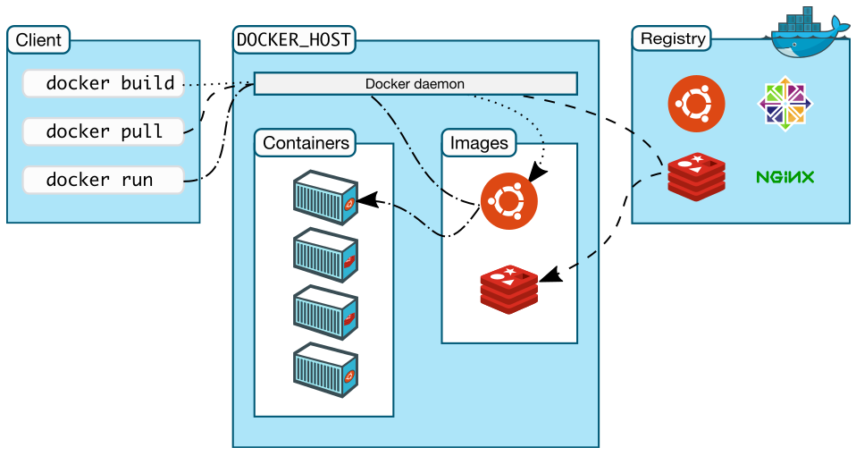
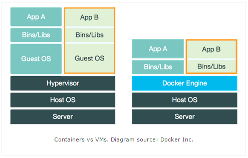

## Docker简介

Docker 是一个开源的**容器引擎**, 它可以帮助我们更快地交付应用。Docker可**将应用程序和基础设施层隔离,并且能将基础设施当作程序一样进行管理**。使用Docker,可更快地打包、测试以及部署应用程序,并可**减少从编写到部署运行代码的周期**

Docker相关的资源网站

1. [Docker 官方网站](https://www.docker.com/)
2. [Docker GitHub](https://github.com/docker/docker)
3. [Docker 命令指南](https://docs.docker.com/engine/reference/run/)
4. [Docker Engine API (v1.41)](https://docs.docker.com/engine/api/v1.41/)

## 发展历程

| Docker版本         | Docker基于{?}实现          |
| ------------------ | ------------------------ |
| Docker 0.7之前     | 基于 [LXC](https://linuxcontainers.org/lxc/introduction/)                   |
| Docker0.9后        | 改用 [libcontainer](https://github.com/docker/libcontainer)         |
| **Docker 1.11后**  | 改用 [runC](https://github.com/opencontainers/runc) 和 [containerd](https://github.com/containerd/containerd)  |

常见的术语:

1. [OCI](https://www.opencontainers.org/) : 定义了容器运行的标准,其[规范文档](http://www.infoq.com/cn/news/2017/02/Docker-Containerd-RunC)作为一个项目在GitHub上维护
2. `runC`
   - **标准化容器执行引擎**
   - 根据根据 OCI 规范编写的,生成和运行容器的CLI工具,是按照开放容器格式标准（OCF, Open Container Format）制定的一种具体实现。由 libcontainer 中迁移而来的,实现了容器启停、资源隔离等功能
3. `containerd`
   - **用于控制 runC 的守护进程,构建在 OCI 规范和runC之上**。目前內建在 Docker Engine 中
   - [参考文档](https://blog.docker.com/2015/12/containerd-daemon-to-control-runc/),以及[译文](http://dockone.io/article/914)

:::tip 拓展阅读

1. [Docker 背后的容器管理——Libcontainer 深度解析](https://www.infoq.cn/article/docker-container-management-libcontainer-depth-analysis/)
2. [Docker背后的标准化容器执行引擎——runC](https://www.infoq.cn/article/docker-standard-container-execution-engine-runc/)
3. [Docker、Containerd、RunC…:你应该知道的所有](http://www.infoq.com/cn/news/2017/02/Docker-Containerd-RunC)
:::

## Docker架构

Docker官方文档的架构图,如图所示:



上图中包含的组件:

1. `Docker daemon`
   - **Docker 守护进程**
   - 是一个运行在宿主机(**DOCKER_HOST**)的后台进程。我们可通过 Docker 客户端与之通信
2. `Client`
   - **Docker客户端**
   - 是 Docker 的用户界面,它**可以接受用户命令和配置标识,并与 Docker daemon 通信**。比如 docker build 、docker pull、docker run... 都是 Docker 的相关命令
3. `Images`
   - **Docker镜像**
   - **是一个只读模板,它包含创建Docker容器的说明**。它和系统安装光盘有点像(我们使用系统安装光盘安装系统,同理,我们使用Docker镜像运行Docker镜像中的程序)
4. `Container`
   - **容器,是镜像运行的实例,镜像启动后的实例称为一个容器,容器是独立运行的一个或一组应用**。
   - 容器的定义和镜像几乎一模一样，也是一堆层的统一视角，唯一区别在于容器的最上面那一层是可读可写的
   - 镜像和容器的关系有点类似于面向对象中,类和对象的关系。**我们可通过 Docker API 或者 CLI 命令来启停、移动、删除容器**
5. `Registry`
   - **镜像仓库**
   - Docker Registry 是一个集中存储与分发镜像的服务。我们构建完Docker镜像后,就可在当前宿主机上运行。但如果想要在其他机器上运行这个镜像,我们就需要手动拷贝。此时,我们可借助Docker Registry来避免镜像的手动拷贝
   - 最常用的 Docker Registry 莫过于官方的Docker Hub,这也是默认的Docker Registry。

## Docker & 虚拟机



- Hypervisor 层被 Docker Engine 取代
- 虚拟化粒度不同
  - 虚拟机利用Hypervisor虚拟化CPU、内存、IO设备等实现的,然后在其上运行完整的操作系统,再在该系统上运行所需的应用。**资源隔离级别:OS级别**
  - 运行在Docker容器中的应用直接运行于宿主机的内核,容器共享宿主机的内核,容器内部运行的是Linux副本,没有自己的内核,直接使用物理机的硬件资源,因此CPU/内存利用率上有一定优势。**资源隔离级别:利用Linux内核本身支持的容器方式实现资源和环境隔离**

:::tip 拓展阅读
[Docker、LXC、Cgroup的结构关系](https://blog.51cto.com/speakingbaicai/1359825)
:::

## Docker应用场景

[八个Docker的真实应用场景](http://dockone.io/article/126)

## 安装Docker(Centos)

> 系统要求:
>
>   1. **CentOS 7** 或更高版本
>   2. **centos-extras** 仓库必须处于启用状态,该仓库默认启用
>   3. 建议使用 **overlay2** 存储驱动

### yum安装

#### 卸载老版本的Docker

在CentOS中,老版本Docker名称是docker 或docker-engine ,而Docker CE的软件包名称是docker-ce 。因此,如已安装过老版本的Docker,需使用如下命令卸载:
  
```Shell
sudo yum remove docker \
                  docker-client \
                  docker-client-latest \
                  docker-common \
                  docker-latest \
                  docker-latest-logrotate \
                  docker-logrotate \
                  docker-engine
```

需要注意的是,执行该命令**只会卸载Docker本身,而不会删除Docker存储的文件**,例如镜像、容器、卷以及网络文件等。这些文件保存在 `/var/lib/docker` 目录中,需要**手动删除**

#### 卸载 Docker Engine

1. 卸载Docker引擎、CLI、containerd和Docker Compose软件包。

   ```shell
   sudo yum remove docker-ce docker-ce-cli containerd.io docker-buildx-plugin docker-compose-plugin docker-ce-rootless-extras
   ```

2. 主机上的Images、Container、Volumes或定制的配置文件不会被自动删除。要删除所有图像、容器和卷

   ```shell
   sudo rm -rf /var/lib/docker
   sudo rm -rf /var/lib/containerd
   ```

#### 使用仓库安装

1. 设置仓库,安装 yum-utils 软件包(提供 yum-config-manager工具 ), 并设置 Docker 仓库

   ```shell
   sudo yum install -y yum-utils
   sudo yum-config-manager \
      --add-repo \
      https://download.docker.com/linux/centos/docker-ce.repo
   ```

2. 安装 Docker Engine

   ```shell
   sudo yum install docker-ce docker-ce-cli containerd.io docker-buildx-plugin docker-compose-plugin
   ```

3. 启动 Docker

   ```shell
   sudo systemctl start docker
   ```

4. 验证安装是否正确。

   ```shell
   sudo docker run hello-world
   ```

   执行该命令 Docker 会下载测试镜像,并使用该镜像启动一个容器。如能够看到类似如下的输出,则说明安装成功。

   ```txt
   Unable to find image 'hello-world:latest' locally
   latest: Pulling from library/hello-world
   b04784fba78d: Pull complete
   Digest: sha256:f3b3b28a45160805bb16542c9531888519430e9e6d6ffc09d72261b0d26ff74f
   Status: Downloaded newer image for hello-world:latest

   Hello from Docker!
   This message shows that your installation appears to be working correctly.

   To generate this message, Docker took the following steps:
    1. The Docker client contacted the Docker daemon.
    2. The Docker daemon pulled the "hello-world" image from the Docker Hub.
    3. The Docker daemon created a new container from that image which runs the
       executable that produces the output you are currently reading.
    4. The Docker daemon streamed that output to the Docker client, which sent it
       to your terminal.

   To try something more ambitious, you can run an Ubuntu container with:
    $ docker run -it ubuntu bash

   Share images, automate workflows, and more with a free Docker ID:
    https://cloud.docker.com/

   For more examples and ideas, visit:
    https://docs.docker.com/engine/userguide/
   ```

### Shell一键安装

```shell
curl -fsSL https://get.docker.com -o get-docker.sh
sudo sh get-docker.sh
```

### 加速安装

注册阿里云,参考该页面的[内容](https://cr.console.aliyun.com/#/accelerator)安装即可

## 配置 Docker

### Docker 开启启动

许多现代Linux发行版使用systemd来管理系统启动时的服务。在Debian和Ubuntu上，Docker服务默认在启动时启动。在其他使用systemd的Linux发行版上，要在开机时自动启动Docker和containerd，请运行以下命令。

```shell
# 设置开启启动
sudo systemctl enable docker.service
sudo systemctl enable containerd.service
# 取消开机启动
sudo systemctl disable docker.service
sudo systemctl disable containerd.service
```
