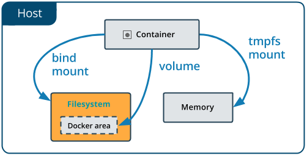
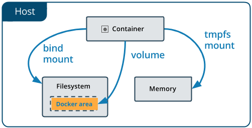
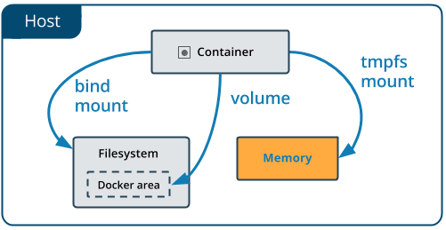

> 通过 Docker 可以将运行的运行的环境打包成镜像,并且通过容器的方式运行。但是如果不通过[commit](Docker容器命令#提交镜像)的方式生成新的镜像,那么当容器删除后数据就没有了。

我们希望 docker 容器中产生的数据可以持久化,甚至实现容器之间可以共享数据。docker 支持下面下种方式实现数据的持久化 :

1. [数据卷(volume)](Docker数据持久化#数据卷)
2. [数据卷容器(volumes-from)](Docker数据持久化#数据卷容器)

## 数据卷

> 默认情况下，**在容器内创建的所有文件都存储在一个可写的容器层上**。这意味着:
>
> 1. **当该容器不再存在时，数据不会持续存在，而且如果另一个进程需要这些数据，就很难将其从容器中取出**
> 2. **容器的可写层与容器所运行的主机紧密相连,你不能轻易地把数据移到别的地方**。
>     - 写入容器的可写层需要一个存储驱动来管理文件系统
>     - 存储驱动提供一个联合文件系统，使用Linux内核。与使用数据卷相比，这种额外的抽象降低了性能，数据卷直接写到主机文件系统。
>
> Docker有两个选项, 可以让容器在主机上存储文件，这样即使容器停止后，文件也会持续存在：`卷(Volume)和绑定挂载(Bind mounts)`
>
> Docker还支持容器在主机上的内存中存储文件。这些文件不会被持久化。
>
> 1. 如果在Linux上运行Docker，tmpfs挂载被用来在主机的系统内存中存储文件
> 2. 如果在Windows上运行Docker，命名的管道被用来在主机的系统内存中存储文件。

- **数据卷就是目录或文件,数据卷是一个可供一个或多个容器使用**。它**从宿主机挂载到容器**,但不属于 UnionFs(联合文件系统),因此能够绕过 UnionFS 提供一些用于持续存储或共享数据的特性
  - 类似于 Linux 下对目录或文件进行 mount,把容器内部对应的目录称之为**挂载点**

- 数据卷的设计目的就是**数据的持久化**,完全独立于容器的生存周期, 因此 **docker不会在容器删除时删除其挂载的数据卷**

- 数据卷有以下的特点:
  - **数据卷可以在容器之间共享和重用**
  - **对数据卷的修改会立马生效**
  - **对数据卷的更新,不会影响镜像**
  - **数据卷默认会一直存在,即使容器被删除**
  - **一个容器可以挂载多个数据卷**

- 有下面两种方式来使用数据卷
  - `使用命令添加`
  - `DockerFile`

## 命令添加

Docker提供了三种不同的方式将数据从宿主机目录挂载到容器中:

1. `volumes (卷)` : 最为常用

2. `bind mounts (绑定挂载)`

3. `tmpfs mounts (临时挂载)`

:::tip 关于具名挂载、匿名挂载、指定路径挂载?

- 匿名挂载
  - 一般的命令格式: `-v 容器内路径`
  - 会随机生成一个数字字母的卷名,且在 `$DOCKER_PATH/volumes/` 生成对应的目录
- 具名挂载: `-v 卷名:容器内路径`
- 指定路径挂载: `-v /宿主机路径:容器内路径`
  - 容器内生成的数据的存储在 **宿主机路径** 下

:::

### Bind mounts

> 事实上, Bind mounts(挂载绑定) 在 docker的早期就已经存在了,但是和 volumes 相比,bind mounts 的功能有限。

- 在使用 bind mounts 的时候,主机 host 上的文件或者目录被挂载到容器中,这个文件或者目录是主机 host 上的绝对路径,并且**该文件或目录是通过它在主机上的绝对路径来引用的**。相比之下, [Volumes 的挂载方式](Docker数据持久化#volumes) 则是在主机上的 `$DOCKER_PATH/volumes/` 目录中会创建一个新的目录,并且 docker 会管理该目录的内容。当然,**该文件或目录不需要在Docker主机上已经存在。如果它还不存在,就按需创建**

- **bind mounts 的性能非常好,但它们依赖于主机的文件系统以及其特定的目录结构**



:::caution 注意

Bind mounts 在不同的主机OS 是不可移植的,比如 Windows 和 Linux 的目录结构是不一样的, bind mount所指向的host目录也不能一样。这也是为什么 Bind mounts 不能出现在 Dockerfile 中的原因, 因为这样 Dockerfile 就不可移植了

:::

docker 支持通过 `--volume` 、 `--mount` 两种命令将实现 bind mounts

#### --volume

> 参见[创建并启动容器](Docker容器命令#创建并启动容器)

`--volume` 后面**由三个字段组成, 用冒号字符（:）隔开**。这些字段必须有正确的顺序, 而且每个字段的含义并不明显。

1. 第一个字段是主机上的文件或目录的路径(不存在的话会创建)

2. 第二个字段是该文件或目录在容器中被挂载的路径,也就是挂载点
    - 如果这个挂载点路径如果在容器中不存在,docker会自动创建

3. 第三个字段是**可选的**,是一个以逗号分隔的选项列表,如**ro、z和Z**。

- 基本的命令
  - `docker run --volume /宿主机绝对路径目录:/容器内目录[:ro] IMAGE镜像[:TAG标签]`
    - **:ro**: read-only,数据卷对容器来说是只读的

```shell
# 查看本地的目录结构
➜ tree
.
└── get-docker.sh

# 通过 --volume 的方式进行 bind mounts
➜ docker run --name tomcat-volume -d -p 8080:8080 --volume /root/tomcat-volume-data:/usr/local/tomcat/logs  tomcat
7bf86cc58cd39225868006eab07486d6d2391742f7f1e8dbef6bd03561708733 

# 查看本地的目录结构
➜  tree
.
├── get-docker.sh
└── tomcat-volume-data
    ├── catalina.2023-02-28.log
    └── localhost_access_log.2023-02-28.txt

# 查看容器对象的信息,
➜ docker inspect tomcat-volume --format "{{.Mounts}}"
[{
  "Type": "bind",
  "Source": "/root/tomcat-volume-data",
  "Destination": "/usr/local/tomcat/logs",
  "Mode": "",
  "RW": true,
  "Propagation": "rprivate"
}]
```

#### --mounts

> 参见[创建并启动容器](Docker容器命令#创建并启动容器)

`--mount` 后面 **由多个键值对组成,用逗号隔开,每个键值对由一个 `key=value`键值对组成**, --mount 语法比 --volume(-v) 更为冗长,但键的顺序并不重要,而且标志的值更容易理解。

1. `type`
   - **挂载的类型**
   - 有下面的可选值: `bind、volume、tmpfs`

2. `source | src`
    - **挂载的来源,也就是宿主机的目录**
    - 对于 bind mounts 来说,这个是宿主机上的文件或者目录的路径

3. `target | destination | dst`
    - **绑定到容器中文件或目录的路径**
    - 如果这个挂载点路径如果在容器中不存在,docker会自动创建

4. `readonly | ro`
    - 可选参数
    - 如果存在的话,会**导致绑定的挂载以只读的方式挂载到容器中**

5. `bind-propagation`
    - 可选参数,有下面的可选值: `rprivate、private、rshared、shared、rslave、slave`
    - 如果存在的话,会改变 bind 的传播方式

:::caution 使用 --mount 进行挂载绑定的注意点

1. **--mount 不支持 z 或 Z 选项!**
2. 如果宿主机上的指定目录不存在, docker 不会自动创建,而是抛出一个错误

:::

```shell
# 查看本地的目录结构
➜ tree
.
└── get-docker.sh

# 启动一个容器,并且通过 --mount 参数进行 bind mounts,其中src 的路径在本地不存在
➜ docker run \
  --name tomcat-volume \
  -d -p 8080:8080 \
  --mount type=bind,src=/root/tomcat-mount,dst=/usr/local/tomcat/logs \
  tomcat
docker: Error response from daemon: invalid mount config for type "bind": bind source path does not exist: /root/tomcat-mount.
See 'docker run --help'.

# 创建目录
➜ mkdir tomcat-mount
➜ tree
.
├── get-docker.sh
└── tomcat-mount

# 启动一个容器,并且通过 --mount 参数进行 bind mounts, 但是 src 的路径在本地存在
➜ docker run \
  --name tomcat-volume \
  -d -p 8080:8080 \
  --mount type=bind,src=/root/tomcat-mount,dst=/usr/local/tomcat/logs \
  tomcat
38e91e80af64e313175a088f77d313e9628382da39acfedb650c12917c0b53fe
➜ tree
.
├── get-docker.sh
└── tomcat-mount
    ├── catalina.2023-02-28.log
    └── localhost_access_log.2023-02-28.txt

1 directory, 3 files

# 查看容器对象的信息
➜ docker inspect tomcat-volume --format "{{.Mounts}}"
[{
  "Type": "bind",
  "Source": "/root/tomcat-mount",
  "Destination": "/usr/local/tomcat/logs",
  "Mode": "",
  "RW": true,
  "Propagation": "rprivate"
}]

```

### Volumes

#### 概述

> 这是保存由Docker容器产生和使用的数据的首选机制, [Bind mounts](Docker数据持久化#bind-mounts) 依赖于主机的目录结构和操作系统, 而卷则完全由Docker管理



**卷 vs 绑定挂载**

1. 卷比绑定挂载更容易备份或迁移
2. 可以使用 Docker CLI 命令 或Docker API 来管理卷
3. 卷在Linux和Windows容器上都可以使用, 而 绑定挂载依赖于OS
4. 卷可以更安全地在多个容器之间共享
5. 卷的驱动可以让你在远程主机或云供应商上存储卷, 对卷的内容进行加密, 或添加其他功能
6. 新的卷可以由容器预先填充其内容
7. Docker桌面上的卷比来自Mac和Windows主机的绑定挂载的性能高得多

**Volume CLI 命令**

> 命令的可选参数可以参见[这里](https://docs.docker.com/engine/reference/commandline/volume_ls/)

- `docker volume create [OPTIONS] VOLUME1 VOLUME2 ...`
  - 创建一个或者多个自定义的 Volume 卷, 数据位置在 **/var/lib/docker/volumes**

- `docker volume ls [OPTIONS]`
  - 查看所有的 Volume 卷

- `docker volume rm [OPTIONS] VOLUME1 VOLUME2 ...`
  - 删除一个或者多个 Volume 卷

:::tip 绑定方式

和bind mounts一样的, docker 支持通过 `--volume` 、 `--mount` 两种命令将 volume卷 与容器绑定

:::

#### --volume

> 参见[创建并启动容器](Docker容器命令#创建并启动容器)

`--volume` 后面**由三个字段组成, 用冒号字符（:）隔开**。这些字段必须有正确的顺序, 而且每个字段的含义并不明显。

1. 在命名卷的情况下, 第一个字段是卷的名称, 在一个特定的主机上是唯一的(对于匿名卷, 第一个字段被省略了)
2. 第二个字段是文件或目录在容器中被挂载的路径
    - 如果这个挂载点路径如果在容器中不存在,docker会自动创建
3. 第三个字段是可选的, 是一个用逗号隔开的选项列表, 比如**ro**。

- 基本的命令
  - `docker run --volume Volume卷:/容器内目录[:ro] IMAGE镜像[:TAG标签]`
    - **:ro**: read-only,数据卷对容器来说是只读的

```shell
# 创建一个volume卷
➜ docker volume create tomcat-volume
tomcat-volume

# 查看所有的卷
➜ docker volume ls
DRIVER    VOLUME NAME
local     tomcat-volume

# 查看卷本地的目录
➜ ls -la /var/lib/docker/volumes/
total 36
drwx-----x  3 root root   4096 Feb 24 15:41 .
drwx--x--- 12 root root   4096 Feb 17 10:23 ..
brw-------  1 root root 253, 1 Feb 17 10:23 backingFsBlockDev
-rw-------  1 root root  32768 Feb 24 15:41 metadata.db
drwx-----x  3 root root   4096 Feb 24 15:41 tomcat-volume

# 查看卷本地目录的数据
➜ tree
.
└── _data

# 创建并启动一个容器,并且容器与卷 tomcat-volume绑定
➜ docker run --name volumeDemo --volume tomcat-volume:/usr/local/tomcat/logs -d -p 8080:8080 tomcat
35f37e14f78aa33cdb6cd14f5e2ebe1a207e8872a2584f10bf3fb59fd5e3b347

# 查看卷本地目录的数据
➜ tree
.
└── _data
    ├── catalina.2023-02-24.log
    └── localhost_access_log.2023-02-24.txt

1 directory, 2 files

# 我们再对卷 tomcat-volume 进行检查
➜ docker inspect --type volume tomcat-volume
[
    {
        "CreatedAt": "2023-02-24T15:41:04+08:00",
        "Driver": "local",
        "Labels": null,
        "Mountpoint": "/var/lib/docker/volumes/tomcat-volume/_data",
        "Name": "tomcat-volume",
        "Options": null,
        "Scope": "local"
    }
]
```

#### --mount

> 参见[创建并启动容器](Docker容器命令#创建并启动容器)

`--mount` 后面 **由多个键值对组成,用逗号隔开,每个键值对由一个 `key=value`键值对组成**, --mount 语法比 --volume(-v) 更为冗长,但键的顺序并不重要,而且标志的值更容易理解。

主要有下面几个的参数:

1. `type`
   - **挂载的类型**
   - 有下面的可选值: `bind、volume、tmpfs`

2. `source | src`
    - **挂载的来源**
    - 对于命名的卷,这是卷的名称。对于匿名卷,这个字段被省略了

3. `target | destination | dst`
    - **绑定到容器中文件或目录的路径**
    - 如果这个挂载点路径如果在容器中不存在,docker会自动创建

4. `readonly | ro`
    - 可选参数
    - 如果存在的话,会**导致绑定的挂载以只读的方式挂载到容器中**

5. `volume-opt`
    - 可选参数
    - 可以指定多次,需要一个**由选项名称和其值组成的键值对**

```shell
# 创建一个volume卷
➜ docker volume create tomcat-mount
tomcat-mount

# 查看所有的卷
➜ docker volume ls
DRIVER    VOLUME NAME
local     tomcat-mount
local     tomcat-volume

# 查看本地的卷 tomcat-mount 的目录结构
➜ tree /var/lib/docker/volumes/tomcat-mount/
/var/lib/docker/volumes/tomcat-mount/
└── _data

1 directory, 0 files

# 创建启动一个容器, 并且通过 --mount 的方式挂载一个卷
➜ docker run --name mountDemo -d -p 8081:8080 --mount type=volume,src=tomcat-mount,dst=/usr/local/tomcat/logs tomcat
dc30d6db8b86cde413667c0328f58f55675cbcfcdb8aa118b94ffa85d66d3b4f

# 查看本地的卷 tomcat-mount 的目录结构
# 可以看到tomcat 的log同步到了这个 tomcat-mount 卷目录中了
➜ tree /var/lib/docker/volumes/tomcat-mount
/var/lib/docker/volumes/tomcat-mount
└── _data
    ├── catalina.2023-02-24.log
    └── localhost_access_log.2023-02-24.txt

1 directory, 2 files

# 通过inspect 查看卷 tomcat-mount 信息
➜ docker inspect --type volume tomcat-mount
[
    {
        "CreatedAt": "2023-02-24T16:15:30+08:00",
        "Driver": "local",
        "Labels": null,
        "Mountpoint": "/var/lib/docker/volumes/tomcat-mount/_data",
        "Name": "tomcat-mount",
        "Options": null,
        "Scope": "local"
    }
]
```

### tmpfs mounts



- [Volumes](Docker数据持久化#volumes) 和 [Bind mounts](Docker数据持久化#bind-mounts) 可以实现**Docker容器和主机之间共享文件**,这样就可以保证容器在停止的时候,数据也不会丢失

- 如果在 **Linux** 上运行docker 的话,还有另外的一个选择: `tmpfs mounts`。和 volumes 与 bind mounts 不同的是, tmpfs mounts 是临时的, 只在主机内存中持续存在。当容器停止时, tmpfs挂载会被删除, 写在那里的文件也不会被持久化。

- tmpfs mounts 的限制
  - 和 volumes 与 bind mounts 不同的是, tmpfs mounts 无法在多个容器之间共享
  - 只有在Linux上运行Docker时才可用

## DockerFile 添加

基本步骤:

1. 创建一个文件夹,并在文件夹内部创建一个`DockerFile`的文件
2. 通过 `Volume` 指令来**指定容器中文件、目录的挂载点路径**.类似于 --mount 的dst参数,设置尝试有下面几种:
    - VOLUME ["Volume1","Volume2"...]
    - VOLUME Volume1  Volume2  ...
3. 通过 `build` 命令构建 docker 镜像
4. 启动容器

```shell
# 创建目录,并且目录中添加 dockerfile 文件
➜ mkdir dockerfile-volume
➜ cd dockerfile-volume/
➜ vim Dockerfile

# 查看 dockerfile 内容
➜ cat Dockerfile 
  # 指定基础镜像
  FROM tomcat
  # 指定容器中的一个目录具有存储数据的功能
  VOLUME /root/test
  RUN echo "finish"
  RUN /bin/bash

# 通过 docker build 打包镜像
➜  cd ..
➜  docker build dockerfile-volume
[+] Building 0.3s (5/5) FINISHED
 => [internal] load build definition from Dockerfile      0.0s
 => => transferring dockerfile: 100B                      0.0s
 => [internal] load .dockerignore                         0.0s
 => => transferring context: 2B                           0.0s
 => [internal] load metadata for docker.io/library/tomcat:latest      0.0s
 => [1/3] FROM docker.io/library/tomcat                   0.0s
 => CACHED [2/3] RUN echo "finish"                        0.0s
 => CACHED [3/3] RUN /bin/bash                            0.0s
 => exporting to image                                    0.0s
 => => exporting layers                                   0.0s
 => => writing image sha256:112f3d2be32cfc78e8d968aa364b574e1751d6752185863d901fe3d6ddaed091

# 启动容器
➜ docker run --name dockerfileVolume -it -p 8080:8080 112f3d2be32c
➜ cd /root
➜ ls
test

# 使用 inspect 查看启动的容器的信息,可以看到 Source 是一串随机的数字字母文件夹(匿名挂载)
➜ docker inspect dockerfileVolume --format "{{.Mounts}}"
[{
"Type": "volume",
"Name": "588c5c475dd8bb0de283d2d237cf8f0849d6100fd93e59a75b8b6d1f6b98869c",
"Source": "/var/lib/docker/volumes/588c5c475dd8bb0de283d2d237cf8f0849d6100fd93e59a75b8b6d1f6b98869c/_data",
"Destination": "/root/test",
"Driver": "local",
"Mode": "",
"RW": true,
"Propagation": ""
}]
```

:::tip 提示

- 通过 VOLUME 指令创建的挂载点，无法指定挂载到宿主主机上对应的目录([匿名挂载](Docker数据持久化#命令添加)),当然在创建容器的时候可以通过`--mount、--volume`参数进行修改

- 创建容器没有指定 -v、--mount 参数的话,会默认在宿主机的 `$DOCKER_PATH/volumes/` 下创建一个数字字符的文件夹

:::

---

## 数据卷容器

> 虽然多个容器可以使用同一个主机上的同一个数据卷作为数据存储的位置,但是还是推荐通过**数据卷容器**让数据在多个容器之间共享

- 数据卷容器就是: **将一个运行的容器作为数据卷，其他容器可以通过挂载这个容器实现数据共享**
- 数据卷容器的优势
  1. 轻松的将数据卷进行归类和汇总
  2. 能够更好的管理容器与数据卷之间的关系
  3. 更加合理的控制数据卷的生命周期
- 基本命令
  - `docker run --volumes-from 数据卷容器ID/数据卷容器NAME IMAGE镜像[:TAG标签]`
- 使用场景
  - 使用纯数据容器来持久化数据库、配置文件或者数据文件等

```shell
# 创建一个数据卷
➜ docker volume create container-share
container-share

#  查看 volume 目录
➜ tree
.
├── backingFsBlockDev
├── container-share
│   └── _data
└── metadata.db
# 创建并且运行一个数据卷容器
➜ docker run \
  --name data-container \ 
  --mount type=volume,src=container-share,dst=/root/shareData \
  -d -it -p 8080:8080 tomcat
d91bce7d983406f83f4c61c6e59891322a1d7eb602e2a5aa87766f5beec242f2

# 创建容器A,并且设置其数据卷容器,并且查看A容器挂载点目录下的结构
➜ docker run \
   --name tomcat1 \
   --volumes-from data-container \
   -d -it -p 8081:8080 tomcat
625eefaa4ebb0d4903232c218f1075d9fe50479fa0aef1b3cfaa45b60d5953e9
➜ docker exec tomcat1 ls /root/shareData

# 创建容器B, 并且设置其数据卷容器,并且查看B容器挂载点目录下的结构
➜ docker run \
   --name tomcat2 \
   --volumes-from data-container \
   -d -it -p 8082:8080 tomcat
0857323f99be526a5eab544658c1f7a1b4147c927a4867b192eeb2cbdfac253d
➜ docker exec tomcat2 ls /root/shareData

# A容器向数据卷容器中写入数据
➜ docker exec tomcat1 touch /root/shareData/tomcat1.txt
➜ docker exec tomcat1 ls /root/shareData
tomcat1.txt

# 查看B容器挂载点目录下的结构
➜ docker exec tomcat2 ls /root/shareData
tomcat1.txt

# 查看数据卷容器中的挂载点的目录结构
➜ docker exec data-container  ls /root/shareData
tomcat1.txt

# 查看本地volume下的目录结构
➜ tree
.
├── backingFsBlockDev
├── container-share
│   └── _data
│       └── tomcat1.txt
└── metadata.db
```
