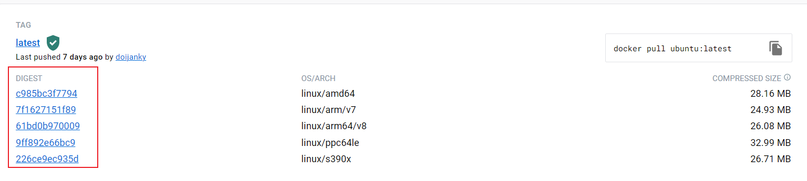

## 搜索镜像

> 可使用`docker search` 命令搜索存放在Docker Hub中的镜像。

### 命令

- 命令格式

  ```shell
  docker search [OPTIONS] TERM
  ```

- 可选项[OPTIONS]

  | Name(shorthand) | Default | Description      |
  | --------------- | ------- | ---------------- |
  | `--filter, -f`  |         | 根据指定条件过滤结果          |
  | `--format`      |         | 使用Go模板格式化输出结果      |
  | `--limit`       | `25`    | 搜索结果的最大条数            |
  | `--no-trunc`    |         | 不截断输出,显示完整的输出      |

### 基本使用

通过执行下面的命令, 查询 Docker Hub中搜索包含 "java" 这个关键词的镜像仓库

```shell
docker search java
```

执行该命令后,可看到类似于如下的输出结果:

```txt
docker search java
NAME                                 DESCRIPTION                                     STARS     OFFICIAL   AUTOMATED
node                                 Node.js is a JavaScript-based platform for s…   12320     [OK]       
tomcat                               Apache Tomcat is an open source implementati…   3472      [OK]       
java                                 DEPRECATED; use "openjdk" (or other JDK impl…   1976      [OK]       
ghost                                Ghost is a free and open source blogging pla…   1598      [OK]       
couchdb                              CouchDB is a database that uses JSON for doc…   504       [OK]       
jetty                                Jetty provides a Web server and javax.servle…   388       [OK]       
amazoncorretto                       Corretto is a no-cost, production-ready dist…   277       [OK]       
groovy                               Apache Groovy is a multi-faceted language fo…   138       [OK]       
circleci/node                        Node.js is a JavaScript-based platform for s…   130                  
ibmjava                              Official IBM® SDK, Java™ Technology Edition …   107       [OK]       
tomee                                Apache TomEE is an all-Apache Java EE certif…   101       [OK]       
ibmcom/ibmjava                       IBM® SDK, Java™ Technology Edition Docker Im…   21                   
bitnami/java                         Bitnami Java Docker Image                       14                   [OK]
appdynamics/java-agent               Java Agent for Kubernetes                       9                    
amazon/aws-lambda-java               AWS Lambda base images for Java                 7                    
openwhisk/java8action                Apache OpenWhisk runtime for Java 8 Actions     2                    
circleci/java                        This image is for internal use                  2                    
circleci/java-nginx                  Java+nginx image. This image is for internal…   1                    
kasmweb/java-dev                     Ubuntu Java development desktop for Kasm Wor…   1                    
ibmcom/java-acceleration-amd64                                                       0                    
submitty/java                        Official Repository for Submitty Java Images    0                    
airbyte/java-datadog-tracer-base     Docker image that provides the DataDog Java …   0                    
datadog/dd-trace-java-docker-build   Docker container to build Java APM Tracer       0                    [OK]
kope/java7                                                                           0                    
ibmcom/java-websphere-traditional                                                    0                    
```

该输出结果中包含五列,含义如下:

1. `NAME`:镜像仓库名称。
2. `DESCRIPTION`:镜像仓库描述。
3. `STARS`:镜像仓库收藏数,表示该镜像仓库的受欢迎程度,类似于GitHub的Stars。
4. `OFFICAL`:表示是否为官方仓库,该列标记为 [OK] 的镜像均由各软件的官方项目组创建和维护。由结果可知,java这个镜像仓库是官方仓库,而其他的仓库都不是镜像仓库。
5. `AUTOMATED`:表示是否是自动构建的镜像仓库。


### 完整的搜索结果

查询的时候可以选择输出完整的结果

```shell
docker search --no-trunc  java
```

执行该命令后,可看到类似于如下的输出结果:

```txt
NAME                                 DESCRIPTION                                                                                            STARS     OFFICIAL   AUTOMATED
node                                 Node.js is a JavaScript-based platform for server-side and networking applications.                    12320     [OK]       
tomcat                               Apache Tomcat is an open source implementation of the Java Servlet and JavaServer Pages technologies   3472      [OK]       
java                                 DEPRECATED; use "openjdk" (or other JDK implementations) instead                                       1976      [OK]       
ghost                                Ghost is a free and open source blogging platform written in JavaScript                                1598      [OK]       
couchdb                              CouchDB is a database that uses JSON for documents, an HTTP API, & JavaScript/declarative indexing.    504       [OK]       
...                    
```

### 限制搜索结果

通过参数 `--limit` 可以设置**搜索结果的最大条数**,且它的可选值为 **[1~100]** , 默认值是**25**

```shell
docker search --limit 3  java
```

执行该命令后,可看到如下的输出结果:

```txt
NAME      DESCRIPTION                                     STARS     OFFICIAL   AUTOMATED
node      Node.js is a JavaScript-based platform for s…   12320     [OK]       
tomcat    Apache Tomcat is an open source implementati…   3472      [OK]       
ghost     Ghost is a free and open source blogging pla…   1598      [OK]       
```

### 过滤

通过参数 `--filter | -f` 可以对输出结果进行过滤, 过滤条件采用 **key=value** 的方式,并且**支持一个或多个过滤条件**。比如: *--filter is-automated=true --filter stars=3*

现在支持的过滤条件有:

1. `stars [int]`
   - number of stars the image has
2. `is-automated [boolean, true or false]`
   - 镜像是否是自动构建的
3. `is-official  [boolean, true or false]`
   - 是否是官方镜像

执行下面的命令,对输出结果进行过滤:

```shell
docker search --filter is-automated=true --filter stars=3 java
```

执行该命令后,可看到如下的输出结果:

```txt
NAME           DESCRIPTION                 STARS     OFFICIAL   AUTOMATED
bitnami/java   Bitnami Java Docker Image   14                   [OK]
```

### 格式化输出

通过参数 `--format` 可以使用**Go模板**格式化输出结果

有以下的合法的占位符:

1. `.Name`: 镜像的 NAME
2. `.Description` : 镜像的 DESCRIPTION
3. `.StarCount` : 镜像的 STARS
4. `.IsOfficial` : 镜像的 OFFICIAL
5. `.IsAutomated` : 镜像的 AUTOMATED

如果使用了 `--format` 参数,那么搜索结果将会以指定的模板进行输出,但如果使用 **table** 指令,那么则会以表格的方式输出搜索结果

#### 示例1

> 用 : 将 Name 和 STARS连接起来

```shell
docker search --format "{{.Name}}: {{.StarCount}}" nginx
```

```txt
nginx: 18005
linuxserver/nginx: 183
bitnami/nginx: 150
ubuntu/nginx: 75
privatebin/nginx-fpm-alpine: 73
bitnami/nginx-ingress-controller: 23
rancher/nginx-ingress-controller: 11
kasmweb/nginx: 4
ibmcom/nginx-ingress-controller: 4
bitnami/nginx-ldap-auth-daemon: 3
bitnami/nginx-exporter: 3
...
```

#### 示例2

> 用 : 将 Name 和 STARS连接起来,但是以表格的形式呈现

```shell
docker search --format "table {{.Name}}: {{.StarCount}}" nginx
```

```txt
NAME: STARS
nginx: 18005
linuxserver/nginx: 183
bitnami/nginx: 150
ubuntu/nginx: 75
privatebin/nginx-fpm-alpine: 73
bitnami/nginx-ingress-controller: 23
rancher/nginx-ingress-controller: 11
kasmweb/nginx: 4
ibmcom/nginx-ingress-controller: 4
bitnami/nginx-ldap-auth-daemon: 3
bitnami/nginx-exporter: 3
circleci/nginx: 2
...
```

## 拉取镜像

> 使用命令`docker pull` 命令即可从Docker Registry上下载镜像。

### 命令
- 命令格式

  ```shell
  docker pull [OPTIONS] NAME[:TAG|@DIGEST]
  ```

- 可选参数[OPTIONS]

  | Name, shorthand           | Default | Description |
  | ------------------------- | ------- | ----------- |
  | `--all-tags, -a`          |         | 下载所有标签的镜像   |
  | `--disable-content-trust` | `true`  | 忽略镜像的校验     |

- 其他参数
  - **:TAG**: 表示标签, 多为软件的版本。默认是`latest`
  - **@DIGEST**: 表示摘要信息

### 基本使用

通过执行下面的命令, 从 Docker Hub 中下载 **debian**的镜像,且版本是默认的 **:latest**

```shell
docker image pull debian
```

在拉取镜像的时候,可以看到以下的输出信息:

```txt
Using default tag: latest
latest: Pulling from library/debian
e756f3fdd6a3: Pull complete
Digest: sha256:3f1d6c17773a45c97bd8f158d665c9709d7b29ed7917ac934086ad96f92e4510
Status: Downloaded newer image for debian:latest
docker.io/library/debian:latest
```

:::tip 说明
**Docker 镜像可以由多层组成,并且层可以被镜像重复使用。** 例如,debian:bullseye 镜像共享 debian 镜像的层, 因此,拉取 debian:bullseye 镜像**只拉动它的元数据,而不是它的层,因为该层已经存在于本地**。

```shell
# 拉取 debian 镜像
docker image pull debian

# 输出结果
# Using default tag: latest
# latest: Pulling from library/debian
# bbeef03cda1f: Pull complete 
# Digest: sha256:534da5794e770279c889daa891f46f5a530b0c5de8bfbc5e40394a0164d9fa87
# Status: Downloaded newer image for debian:latest
# docker.io/library/debian:latest

# 在上面的基础上, 拉取 debian:bullseye 镜像,可以看到没有进行任何的下载
docker image pull debian:bullseye

# bullseye: Pulling from library/debian
# Digest: sha256:534da5794e770279c889daa891f46f5a530b0c5de8bfbc5e40394a0164d9fa87
# Status: Downloaded newer image for debian:bullseye
# docker.io/library/debian:bullseye
```

:::


### 摘要(Digest,不可改变的标识符)

> Docker 使用了**内容可寻址的镜像存储, 镜像ID是一个涵盖镜像配置和层的SHA256摘要**
> 
> 在上面的示例中, debian:bullseye和debian:latest有相同的镜像ID,因为他们是同一个镜像,不过是被标记了不同的名字,因为它们是同一个镜像,它们的图层只被存储一次,不会消耗额外的磁盘空间

一般来说,我们可以通过 **NAME:TAG** 的格式拉取某个 TAG 的镜像,并且**每次执行都会拉取该TAG的最新镜像**, 但是同一个镜像即使 TAG 是相同的,但镜像也可能不同,因为打包的时候可以使用同一个 TAG。所以,在某些情况下,我们不需要拉取某个TAG最新的版本的话,就需要使用`镜像的 Digest 摘要` 拉取指定镜像。





通过执行下面的命令, 从 Docker Hub 中下载 **debian**的镜像,且指定了 Digest

```shell
docker pull ubuntu@sha256:26c68657ccce2cb0a31b330cb0be2b5e108d467f641c62e13ab40cbec258c68d 

# docker.io/library/ubuntu@sha256:26c68657ccce2cb0a31b330cb0be2b5e108d467f641c62e13ab40cbec258c68d: Pulling from library/ubuntu
# 125a6e411906: Pull complete 
# Digest: sha256:26c68657ccce2cb0a31b330cb0be2b5e108d467f641c62e13ab40cbec258c68d
# Status: Downloaded newer image for ubuntu@sha256:26c68657ccce2cb0a31b330cb0be2b5e108d467f641c62e13ab40cbec258c68d
# docker.io/library/ubuntu@sha256:26c68657ccce2cb0a31b330cb0be2b5e108d467f641c62e13ab40cbec258c68d
```

:::tip 提示

1. 当将镜像 push 到仓库中时, Docker 也会打印出镜像的摘要。如果想锁定刚刚推送的镜像的一个版本, Digest 就会很有用。

2. Digest 也可以用在 Dockerfile 的 `FROM` 指令中

  ```dockerfile
  FROM ubuntu@sha256:26c68657ccce2cb0a31b330cb0be2b5e108d467f641c62e13ab40cbec258c68d
  ```

:::

## 列出镜像

使用 `docker images` 命令即可列出已下载的镜像,执行该命令后的输出结果包含下面的信息

1. `REPOSITORY` : 镜像所属仓库名称
2. `TAG` : 镜像标签。默认是latest,表示最新
3. `IMAGE ID` : 镜像ID,表示镜像唯一标识
4. `CREATED` : 镜像创建时间
5. `SIZE` : 镜像大小

### 命令

- 命令格式

  ```shell
  docker images [OPTIONS] [REPOSITORY[:TAG]]
  ```

- 可选项[OPTIONS]

  | Name(shorthand) | Default | Description      |
  | --------------- | ------- | ---------------- |
  | `--all, -a`     |         | 列出本地所有的镜像（含中间映像层,默认情况下,过滤掉中间映像层） |
  | `--digests`     |         | 显示摘要信息                        |
  | `--filter, -f`  |         | 显示满足条件的镜像                   |
  | `--format`      |         | 通过Go语言模板文件展示镜像            |
  | `--no-trunc`    |         | 不截断输出,显示完整的镜像信息         |
  | `--quiet, -q`   |         | 只显示镜像ID                         |

- 其他参数
  - **REPOSITORY**: 镜像所属仓库名称
  - **:TAG**: 表示标签, 多为软件的版本。默认是`latest`

### 基本使用

通过执行下面的命令, 列出最近创建的镜像

```shell
docker images

REPOSITORY              TAG        IMAGE ID       CREATED         SIZE
debian                  bullseye   20473158e8b3   4 days ago      124MB
debian                  latest     20473158e8b3   4 days ago      124MB
ubuntu                  <none>     d2e4e1f51132   9 months ago    77.8MB
openwhisk/java8action   latest     a3b03869cfff   18 months ago   640MB
```

### TAG & NAME

- 我们还可以在命令后面加上 **[REPOSITORY[:TAG]]** 参数,将查询结果限制在与该参数相匹配的镜像上。如果指定了 REPOSITORY,但没有指定 TAG,那么 docker images 命令就会列出指定存储库中的所有镜像

- TAG & NAME的匹配是一种`精确匹配,` 即 **docker images jav 命令不能匹配到 java 镜像**

```shell
# REPOSITORY
docker images debian
REPOSITORY   TAG        IMAGE ID       CREATED      SIZE
debian       bullseye   20473158e8b3   4 days ago   124MB
debian       latest     20473158e8b3   4 days ago   124MB

# REPOSITORY:TAG
docker images debian:bullseye
REPOSITORY   TAG        IMAGE ID       CREATED      SIZE
debian       bullseye   20473158e8b3   4 days ago   124MB

# 精确匹配,而不是模糊匹配
docker images deb
REPOSITORY   TAG       IMAGE ID   CREATED   SIZE
```

### 过滤

通过参数 `--filter | -f` 可以对输出结果进行过滤, 过滤条件采用 **key=value** 的方式,并且**支持一个或多个过滤条件**。比如: *--filter "foo=bar" --filter "bif=baz"*

现在支持的过滤条件有

1. `dangling [boolean]`
    - 格式: **dangling = true|false**
    - 是否展示虚悬镜像
2. `label [string]`
    - 格式 : **label="key" | label="key=value"**
    - 过滤符合指定标签的镜像
3. `before [string]`
    - 格式 : **before = "镜像NAME[:TAG] | 镜像ID | 镜像@Digest"**
    - 过滤在指定镜像(可以通过镜像的NAME、ID、Digest)之前创建的镜像

4. `since`
    - 格式 : **since="镜像NAME[:TAG] | 镜像ID | 镜像@Digest"**
    - 过滤在指定镜像(可以通过镜像的NAME、ID、Digest)之前创建的镜像

### 格式化输出

通过参数 `--format` 可以使用**Go模板**格式化输出结果

有以下的合法的占位符:

1. `.ID`: 镜像的 ID
2. `.Repository`: 镜像的 Repository
3. `.Tag` : 镜像的 Tag
4. `.Digest` : 镜像的 Digest
5. `.CreatedSince` : 镜像创建了多久
6. `.CreatedAt` : 镜像什么时候创建的
7. `.Size` : 镜像的大小

如果使用了 `--format` 参数,那么搜索结果将会以指定的模板进行输出,但如果使用 **table** 指令,那么则会以表格的方式输出搜索结果

**示例:**

```shell
docker images --format "table {{.ID}}\t{{.Repository}}\t{{.Tag}}"

IMAGE ID       REPOSITORY              TAG
20473158e8b3   debian                  bullseye
20473158e8b3   debian                  latest
d2e4e1f51132   ubuntu                  <none>
a3b03869cfff   openwhisk/java8action   latest
```

## 删除本地镜像
