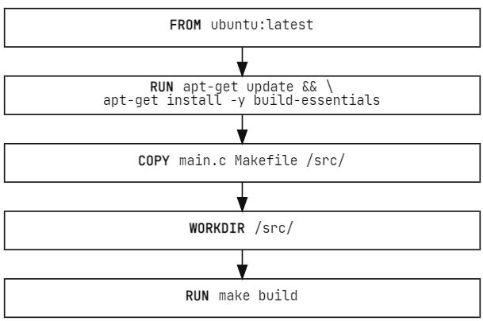
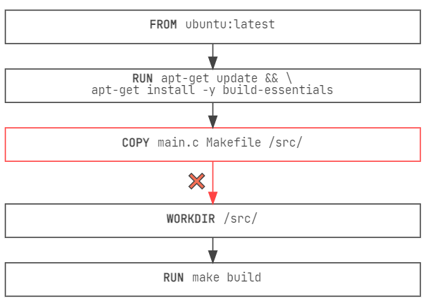
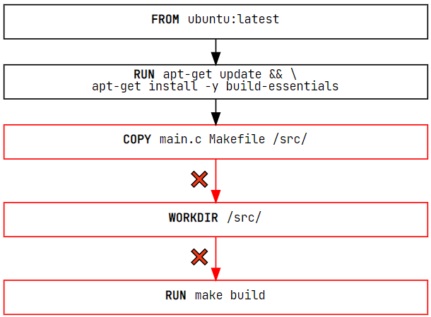

实际的开发中能会一次又一次地重建同一个Docker镜像,无论是为你的软件的下一个版本，还是在本地开发期间。由于构建镜像是一项常见的任务，Docker提供了一些工具来加速构建。

提高构建速度的最重要的功能就是 Docker 的`构建缓存`

## 构建缓存如何运行

下面是一个简单的 Dockerfile 的示例:

```docker
# syntax=docker/dockerfile:1
FROM ubuntu:latest

RUN apt-get update && apt-get install -y build-essentials
COPY main.c Makefile /src/
WORKDIR /src/
RUN make build
```

这个 Dockefile中的每条指令（大致）都转化为最终镜像中的一个层, 可以把镜像层想象成一个堆栈，每一层都会在之前的层上添加更多的内容,比如:



**每当一个层发生变化，该层就需要重新构建**。比如你在main.c文件中对的代码做了一个修改,在这个改变之后，COPY 命令将不得不再次运行，以使这些改变出现在镜像中。换句话说，**Docker 将使这个层的缓存失效**



**如果一层发生变化，所有在它之后的其他图层也会受到影响。当带有COPY命令的图层被废止时，所有后面的图层也需要重新运行**



:::info 总结

简单来说一旦一个层发生变化，那么所有的下游层也需要重新构建,即使它们的构建方式没有什么不同，它们仍然需要重新运行

:::