## JUC基础知识概述

### 进程与线程

- 什么是JUC？

  - `java.util.concurrent` 工具包的简称，用于处理线程的工具包

- **并行与并发**

  - `串行(serial)`

    - **所有任务都一一按先后顺序进行 (一次只能取得一个任务，并执行这个任务)**
  - `并行(parallel)`

    - **可以同时取得多个任务，并同时去执行所取得的这些任务**
    - 并行的效率从代码层次上强依赖于多进程/多线程代码, 从硬件角度上 则依赖于多核 CPU
  - `并发(concurrent)`

    - <mark>多个程序可以同时运行的现象</mark>, 更细化的是<strong>多进程可以同时运行</strong>或者<strong>多指令可以同时运行</strong>

      - 但实际上，对于单核心 CPU 来说，同一时刻 只能运行一个线程
      - 所以，这里的**同时运行** 表示的不是真的同一时刻有多个线程运行的现象(**这是并行的概念**), 而是提供一种功能让用户看来多个程序同时运行起来了，但实际上这些程序中的进程不是一直霸占 CPU 的，而是**执行一会停一会**
    - **要解决大并发问题，通常是将大任务分解成多个小任务**, 由于操作系统对进程的调度是随机的，所以切分成多个小任务后，可能会从任一小任务处执行,可能会出现一些现象:
      - <mark>一个小任务执行了多次，还没开始下个任务的情况</mark>

        - <font color="red">这时一般会采用队列或类似的数据结构来存放各个小任务的成果</font> 
      - <mark>还没准备好第一步就执行第二步的可能</mark>

        - <font color="red">这时，一般采用多路复用或 异步的方式，比如只有准备好产生了事件通知才执行某个任务</font> 
      - 可以多进程/多线程的方式并行执行这些小任务。也可以单进程/单线程执行这 些小任务，这时很可能要配合多路复用才能达到较高的效率
  - 总结
    - 并发： 同一时刻多个线程在访问同一个资源，多个线程对一个点 (春运抢票 电商秒杀...)
    - 并行: 多项工作一起执行，之后再汇总

- **进程与线程**

  - `进程`
    - 系统中正在运行的有一个应用程序。进程时一个资源分配的最小单位
  - `线程`
    - 系统分配处理器时间资源的基本单元，或者说进程内独立执行的一个单元执行流
    - CPU为每个线程分配时间片(每个线程的执行时间),时间片十分短(一般是几十毫秒)。CPU通过时间片分配算法循环的处理任务,当前线程执行一个时间片后切换到下一个线程
      - <font color="red">切换前会保存上一个任务的状态,以便下一次切换回这个任务时,可以再加载这个任务的状态 -> 一次保存到加载的过程就是线程上下文切换</font>
    - 线程 -> 程序执行的最小单位
    - java中有两种创建线程的方式: 继承Thread、实现Runnable接口
      - 继承Thread 是重写run方法，而实现Runnable也是实现其run方法
      - **Thread 本身是实现了Runnable接口的，所以如果自定义的Runnable接口实现类传入Thread构造器，在start启动线程时调用run方法时，会转到Runnable的实现类上**
        ```java
          // Thread 构造器中传入 Runnable 实现类,启动线程的时候会调用 target.run
          public Thread(Runnable target) {
            init(null, target, "Thread-" + nextThreadNum(), 0);
          }
        ```

  ```java
  // 通过Thread 和 Runnable 创建线程
  
  // Thread的方式
  public class createByThread extends Thread {
      public createByThread(String name) {
          super(name);
      }
  
      @Override
      public void run() {
          try {
              System.out.println("内部线程开始==>"+ThreadUtil.getThreadInfo());
              TimeUnit.SECONDS.sleep(3);
              System.out.println("内部线程结束==>"+ThreadUtil.getThreadInfo());
          } catch (InterruptedException e) {
              e.printStackTrace();
          }
      }
  
      public static void main(String[] args) {
          System.out.println("主线开始:"+ ThreadUtil.getThreadInfo());
          Thread t1 = new createByThread("ThreadA");
          System.out.println(ThreadUtil.getThreadInfo2(t1));
          System.out.println("启动子线程");
          t1.start();
          System.out.println(ThreadUtil.getThreadInfo2(t1));
          System.out.println("主线结束:"+ThreadUtil.getThreadInfo());
      }
  }
  
  
  // Runnable的方式
  public class Thread1 {
  
      public static void main(String[] args) {
          // 通过Runnable的方式创建线程
          System.out.println("主线开始:"+ThreadUtil.getThreadInfo());
          Thread t1 = new Thread(() -> {
              try {
                  System.out.println("内部线程开始==>"+ThreadUtil.getThreadInfo());
                  TimeUnit.SECONDS.sleep(3);
                  System.out.println("内部线程结束==>"+ThreadUtil.getThreadInfo());
              } catch (InterruptedException e) {
                  e.printStackTrace();
              }
          }, "ThreadA");
          System.out.println(ThreadUtil.getThreadInfo2(t1));
          System.out.println("启动ThreadA线程");
          t1.start();
          System.out.println(ThreadUtil.getThreadInfo2(t1));
          System.out.println("主线结束:"+ThreadUtil.getThreadInfo());
      }
  }
  ```

  

  **思考：如果既继承Thread，又实现Runnable的run方法，会执行哪个？**

  可以看到,执行了继承Thread的方式，*因为Thread 的子类将父类覆写了，所以Runnable传进来没有效果*

  ```java
  public class Demo1 extends Thread {
      @Override
      public void run() {
          //super.run();
          System.out.println("由继承Thread方式实现");
      }
  
      public Demo1(Runnable target) {
          super(target);
      }
  
      public static void main(String[] args) {
          new Demo1(() -> {
              System.out.println("runnable 的方式");
          }).start();
      }
  }
  
  /*
  	由继承Thread方式实现
  */
  ```


### 线程的状态

- <font color="red">线程的状态 -> 通过 getState() 获取</font>

  - <mark>Thread.State</mark>

    - `NEW`
      - 新建状态
      - 当new创建一个线程对象，但是还没有调用start方法的时候，就处于新建状态
    - `RUNNABLE`
      - 可运行
      - 一旦调用 Thread对象的start方法，线程就处于 runnable状态
      - <font color="red">当然，可运行状态的线程可能没有正在运行，java没有为正在运行的线程提供单独的状态,</font> 即<code>正在运行的线程也是 RUNNABLE 状态</code>
    - `BLOCKED`
      - 阻塞
      - 当一个线程尝试获取一个内部的对象锁(<font color="red">不是LOCK</font>)，而这个对象的锁被其他线程占有，那么这个线程就处于阻塞状态，直到其他对象释放了锁，并且线程调度器允许该线程持有锁的时候，该线程才会变成非阻塞状态。
    - `WAITING` 
      - 等待
      - 当线程等待另一个线程 `通知调度器` 出现一个条件时，这个线程会进入等待状态
    - `TIMED_WAITING` 
      - 计时等待
      - 有几个方法带有超时参数，让线程进入计时等待状态
    - `TERMINATED`
      - 终止
      - 线程会因为以下的两个原因而终止
        - run方法正常结束退出
        - 因为一个没有捕获的异常终止了run方法，从而让线程意外退出

  - 一般将 `Blocked`、`Waiting`、`Timed_Waiting` 统一称为**阻塞状态**

  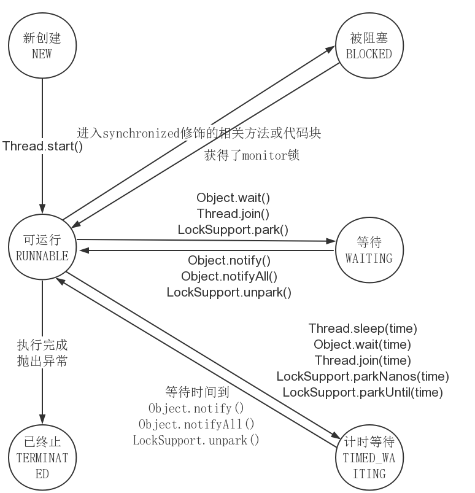

  

:::tip 线程状态的变迁

  线程创建之后，处于`NEW` 的状态，然后调用start()方法开始运行。当线程执行wait()方法后,线程会进入`WAITING`状态。进入等待状态的线程需要通过其他线程的通知才能够返回到运行状态，而`TIME_WAITING` 状态相当于在等待的基础上加上了超时限制，也就是超时时间到达后就会返回到可运行状态。

  在线程调用Synchronized同步方法的时候，如果没有获取到锁，就会进入阻塞状态`BLOCKED`

  <font color="red">注意:阻塞状态是线程在进入Synchronized 修饰的同步方法、同步代码块的时没有获取锁的状态。而进入lock没有获取锁的是等待状态。因为Lock的锁是依赖于LockSupport类</font> 

:::

  **1.Synchronized同步代码阻塞，锁状态演示**

  ```java
  public class Demo1 {
      public synchronized void get() throws InterruptedException {
          TimeUnit.SECONDS.sleep(100);
      }
  
      public static void main(String[] args) {
          Demo1 demo1 = new Demo1();
          new Thread(() -> {
              try {
                  demo1.get();
              } catch (Exception e) {
                  e.printStackTrace();
              }
          }).start();
  
          new Thread(() -> {
              try {
                  demo1.get();
              } catch (Exception e) {
                  e.printStackTrace();
              }
          }).start();
      }
  }
  ```

  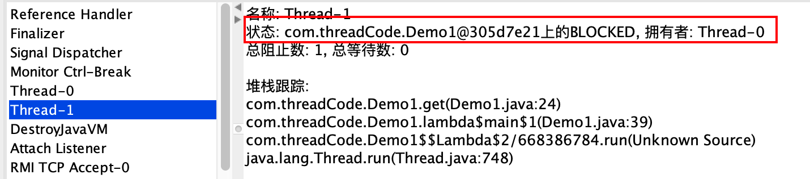

  

  **2.Lock代码阻塞，锁状态演示**

  ```java
  public class Demo1 {
      private static final ReentrantLock lock = new ReentrantLock();
      public void get2() {
          try {
              lock.lock();
              TimeUnit.SECONDS.sleep(100);
          } catch (InterruptedException e) {
              e.printStackTrace();
          } finally {
              lock.unlock();
          }
      }
      public static void main(String[] args) {
          Demo1 demo1 = new Demo1();
          new Thread(() -> {
              try {
                  demo1.get2();
              } catch (Exception e) {
                  e.printStackTrace();
              }
          }).start();
  
          new Thread(() -> {
              try {
                  demo1.get2();
              } catch (Exception e) {
                  e.printStackTrace();
              }
          }).start();
      }
  }
  
  ```

  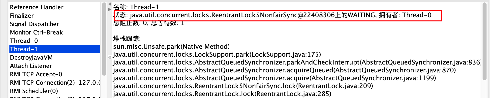

  

#### 线程状态变迁

  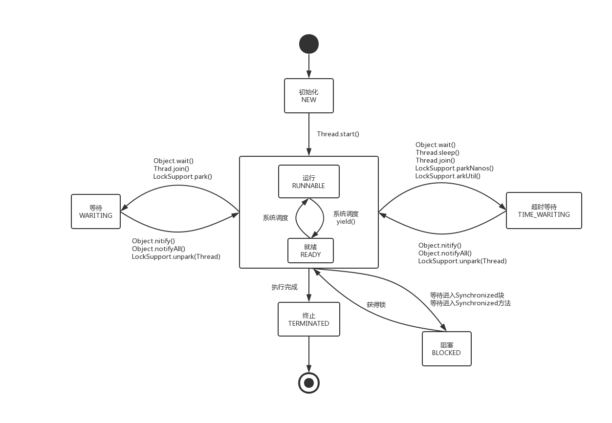


  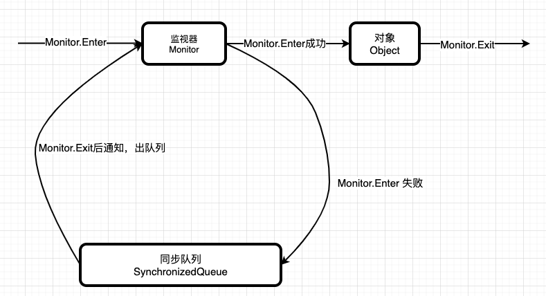

  

  ### 线程属性

  #### 线程ID

  - 从 `1` 开始计数，并且由于启动java程序会创建多个线程，所以自定义线程的线程ID不一定是2

  ```java
  public class ThreadIdDemo {
      public static void main(String[] args) {
          Thread thread = new Thread();
          System.out.println(ThreadUtil.getThreadInfo());
          System.out.println(ThreadUtil.getThreadInfo2(thread));
      }
  }
  /*
  	{线程名称: main,ID:1,状态:RUNNABLE,优先级:5}
  	{线程名称: Thread-0,ID:11,状态:NEW,优先级:5}
  */
  ```

  

#### 中断线程

  - <mark>中断线程</mark> -> 中断状态就是线程的一个标志位

    - 当run() 方法处理结果或者方法中有没有处理的异常，线程就会终止

    - 当对某个线程使用 interrupt() 方法时，会向线程**发送中断请求**，清除这个线程的`中断状态`, **只是发送一个通知请求，线程并不一定会立即响应**

        - 被中断的线程可以决定如何响应中断，比如不终止程序，继续执行

    - <mark>每个线程都应该不时的检查这个标志来判断线程是否被中断</mark>

        ```java
        while(!Thread.currentThread().isInterrupted()&& xxx) {
          // do something 
        }
        ```

    - <font color="red">对阻塞方法(sleep、await)进行中断时，会清除线程的中断状态，并且抛出InterruptedException异常处理中断</font>

      - <font color="red">如果线程被阻塞，是无法检查中断状态 -> 所以不需要去检查线程的中断状态</font>
      
    - <font color="red">注意：在中断异常中，不要什么都不做</font>
    
        - 可以在异常中输出异常信息
        - 可以设置线程的中断状态
    
    - <mark>支持响应中断的方法</mark>
    
        - `Object.wait()`
        - `Thread.sleep()`
        - `Thread.join()`
        - `BlockingQueue.take()` 、`BlockingQueue.put(E)`
        - `Lock.lockInterruptibly()`  -> 获取一个可中断的锁
        - `CountDownLatch.await()`
        - `CyclicBarrier.await()`
        - `Exchanger.exchange(V)`
        - `nio.channels.InterruptibleChannel相关方法`
        - `nio.channels.Selectors相关方法`

##### 未捕获异常处理器

  - <mark>未捕获异常的处理器</mark> 

    - <font color="red">由于run方法无法抛出异常，但是某些方法可能导致线程终止, 实际上，线程在死亡之前，会将异常传递给 <strong>处理未捕获异常的处理器</strong></font> 

      - 处理器必须实现 `Thread.UncaughtExceptionHandler`接口
    - 如何使用呢？
      - `Thread.setDefaultUncaughtExceptionHandler` 设置一个全局的处理器
      - `Thread.setUncaughtExceptionHandler` 为某个线程设置

    ```java
    class ExceptionHandler implements  Thread.UncaughtExceptionHandler {
        @Override
        public void uncaughtException(Thread t, Throwable e) {
            System.out.println("线程发生异常==>" + ThreadUtil.getThreadInfo2(t));
            e.printStackTrace();
        }
    }
    public class exceptionThead {
        public static void main(String[] args) {
            System.out.println("主线开始:"+ThreadUtil.getThreadInfo());
            Thread t1 = new Thread(() -> {
                System.out.println("内部线程开始==>"+ThreadUtil.getThreadInfo());
                // 这个异常是非检查异常
                int a = 10/0;
                System.out.println("内部线程结束==>"+ThreadUtil.getThreadInfo());
            }, "ThreadA");
            System.out.println(ThreadUtil.getThreadInfo2(t1));
            System.out.println("启动ThreadA线程");
            t1.setUncaughtExceptionHandler(new  ExceptionHandler());
            t1.start();
            System.out.println(ThreadUtil.getThreadInfo2(t1));
            System.out.println("主线结束:"+ThreadUtil.getThreadInfo());
        }
    }
    ```

    

  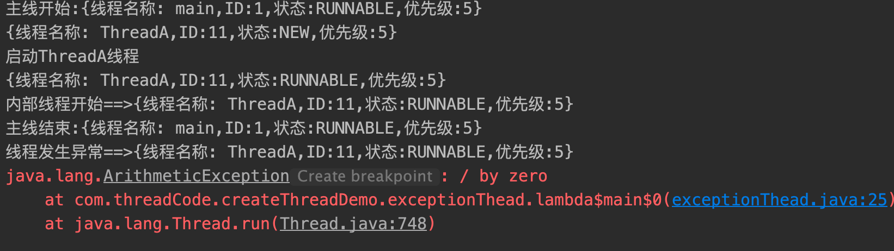

  

### 关闭停止线程

  - <mark>错误的方法</mark>

    - `stop、suspend、resume`
      - stop 在中断线程时不能保证线程的资源被正常的释放，比如说导致线程运行一般突然停止
      - suppend 在调用后，线程并不会释放占有的资源（比如锁），而是占有着资源进入睡眠状态，这样容易导致死锁问题
    - 使用volatile 设置boolean标记位
      - 无法处理阻塞的情况，因为阻塞的时候无法重新获取boolean标记位的值，所以也无法中断线程
    
  - <mark>正确的方式</mark>
    
    - `interrupt`
    
  - <mark>中断的最佳实现方式</mark>

    1. 优先选择: `传递中断`, 即抛出中断异常
    2. 不想或者无法传递: `恢复中断`, 即<font color="red">在异常处理中，再次调用当前线程的interrupt方法，重新设置中断状态</font> 
    3. 不应该`屏蔽中断`

    ```java
    Thread t1 = new Thread(() -> {
      try {
       	bussinessMethod();
      } catch (InterruptedException e) {
        e.printStackTrace();
      }
      System.out.println("处理结束");
    });
    t1.start();
    TimeUnit.SECONDS.sleep(1);
    t1.interrupt();
    
    // 方式1:  业务处理的异常不用try-catch，而是传递异常给调用方
    public void bussinessMethod() throws InterruptedException{
      	Thread.sleep(3000);
    }
    
    // 方式2: 方法内部恢复中断状态
    public void bussinessMethod2() {
      	try {
          Thread.sleep(3000);
        } catch(InterruptedException ex) {
          	Thread.currentThread.interrupt();
            ex.printStackTrace();
        }
    }
    ```

    

#### ①. 没有sleep、wait方法

  > run方法中没有sleep、wait等方法时，可以直接使用 interrupt方法让通知线程中断停止,`但是仅仅是通知`，如果需要停止，还应该不断的判断线程的中断状态

  ```java
  public class StopWithoutSleep {
      public static void main(String[] args) throws InterruptedException {
          Thread t1 = new Thread(() -> {
              int num = 0;
	      long start = System.currentTimeMillis();
              // 每次循环的时候,都去判断线程的中断状态
              while(!Thread.currentThread().isInterrupted() && num <= Integer.MAX_VALUE / 2) {
                  if (num % 10000 == 0) {
                      System.out.println(num+"是10000的倍数");
                  }
                  num++;
              }
      	      long end = System.currentTimeMillis();
      	      System.out.println("处理结束,耗时:"+(end - start) / 1000);
          });
          t1.start();
          // 主线程等待1s
          TimeUnit.SECONDS.sleep(1);
          // 停止t1线程
          /**
           * 如果不使用 interrupt,输出的最后一个数据是: 1073740000是10000的倍数
           * 使用 interrupt 方法的话,输出的最后一个数据是: 445550000 是10000的倍数
           */
          t1.interrupt();
      }
  }
  ```

  

#### ②. 对调用sleep方法的线程进行中断

  > run方法中带有sleep、wait等方法时，使用interrupt方法中断时会抛出异常并清除线程的中断状态,所以不需要也无法中断状态（除非再手动的设置中断状态）

:::danger 注意

  1. 对sleep()方法进行中断，除了会清除中断状态,还会抛出一个中断异常, 所以通过在try-catch中再次调用interrupt方法重新设置中断状态
  2. 但是如果将sleep的异常处理放在是通过try-catch，由于sleep方法会清除中断状态，所以线程的run方法并不知道内部异常了, 即 **try-catch不应该放在while 内部**

:::

  

  ```java
  public class StopThreadWithSleep {
      public static void main(String[] args) throws InterruptedException {
          Thread t1 = new Thread(() -> {
              try {
                  int num = 0;
                  while(num <= 300) {
                      if (num % 100 == 0) {
                          System.out.println(num+"是100的倍数");
                      }
                      num++;
                  }
                  Thread.sleep(3000);
              } catch (InterruptedException e) {
                  e.printStackTrace();
              }
              System.out.println("处理结束");
          });
          t1.start();
          // 主线程等待1s
          TimeUnit.SECONDS.sleep(1);
          // t1线程处于中断状态时对它进行中断,会抛出异常
          t1.interrupt();
      }
  }
  /*
  	0是100的倍数
    100是100的倍数
    200是100的倍数
    300是100的倍数
    java.lang.InterruptedException: sleep interrupted
      at java.lang.Thread.sleep(Native Method)
      at com.threadCode.StopThread.StopThreadWithSleep.lambda$main$0(StopThreadWithSleep.java:22)
      at java.lang.Thread.run(Thread.java:748)
    处理结束
  */
  ```

### 停止线程相关函数解析

  - `interrupt方法`
    - 向线程发送中断请求，线程的中断状态被设置为true
    - 如果线程处于阻塞的状态，且阻塞方法可以被中断，那么会抛出中断异常

  - 判断线程是否被中断的相关方法
    - `static boolean interrupted()`
      - 测试当前正在执行的线程是否被中断
      - <font color="red">注意：该方法会将当前线程的中断状态设置为false</font> 
      
    - `boolean isInterrupted()`
      - 测试指定的线程是否被中断，但是不会设置线程的中断状态
      
    - `Thread.Interrupted()` 的目的对象
    
      - <font color="red">目标对象是当前运行的线程，与调用该方法的实例对象无关</font>
    
        ```java
        public static boolean interrupted() {
          return currentThread().isInterrupted(true);
        }
        ```

  ```java
  public class InterruptDemo {
      public static void main(String[] args) {
          Thread t1 = new Thread(() -> {
              for( ; ; ) {
  
              }
          });
          t1.start();
          t1.interrupt();
  
          // 获取中断标志
          System.out.println("isInterrupt:" + t1.isInterrupted());
  
          // 获取中断标志,并且重置中断状态 -> 与调用该方法的实例对象无关
          System.out.println("isInterrupt:" + t1.interrupted());
  
          // 获取中断标志,并且重置中断状态 -> 与调用该方法的实例对象无关
          System.out.println("isInterrupt:" + Thread.interrupted());
  
          // 获取中断标志
          System.out.println("isInterrupt:" + t1.isInterrupted());
      }
  }
  
  /*
  	isInterrupt:true
    isInterrupt:false
    isInterrupt:false
    isInterrupt:true
  */
  ```

  

  - 如何深入探究jvm源码？
    - https://github.com/openjdk-mirror/jdk7u-jdk 中查询类
    - https://github.com/openjdk-mirror/jdk7u-hotspot/中对应需要查看的c++源码

    

### 监视器/锁/管程(monitor)

  - <font color="red">是一种同步的机制，保证同一时刻只有一个线程访问被保护的数据或者代码(临界区)</font> ,即锁内定义的操作在同一时刻只被一个线程调用(由编译器实现)

    - 但是这样并不能保证进程以设计的顺序执行

  - <mark>jvm中的同步是基于进入和退出管程(monitor)对象实现的</mark> ,每个对象都会有一个管程 (monitor)对象，管程(monitor)会随着 java 对象一同创建和销毁

  - <font color="red">执行线程首先要持有锁对象，然后才能执行方法，当方法完成之后会释放锁，方法在执行时候会持有锁，其他线程无法再获取同一个锁</font> 

### 条件对象

  - 线程进入临界区后发现只有满足条件后才能执行，可以使用条件对象<font color="red">管理已经获得一个锁但是不能工作的线程</font>
    - Lock.newCondition().await()
    - Lock.newCondition().signal()
    - `lock.getWaitQueueLength(Condition con)` 可以获某个条件对象中的等待队列中的数量

### 用户线程、守护线程

  - 用户线程:平时用到的普通线程,是自定义线程
  - 守护线程:运行在后台,是一种特殊的线程,比如垃圾回收
    - 当主线程结束后,用户线程还在运行,JVM 存活 
    - 如果没有用户线程,都是守护线程,JVM 结束 (不会立即结束)

### 竞态条件

  > 如果两个及以上的线程需要共享的对同一个数据进行存取，可能会导致线程之间相互覆盖 -> 这种数据是否正确取决于线程操作数据的顺序就是 “竞态条件”

  ```java
  // 伪代码 多线程向账户存款
  
  account +=amount
  ```

  - 多线程操作数据，线程A将账户余额设置为5500，B将账户余额设置为5900，B先将数据提交，A后提交。
    - 由于 account +=amout不是原子操作，具体操作有三步
      1. 将account加载到线程的寄存器中
      2. 增加 amout
      3. 将结果更新到account
    - 可以线程执行到某一步后，它的运行权被抢占，然后其他线程操作时，数据还是旧的，最后提交时就会将原数据覆盖

  


## Lock接口

### synchronized 关键字

- <font color="red">同步锁、内置锁、监视器锁</font>，线程在进入同步方法时自动获得锁，并且在退出同步方法时自动释放锁

- 内置锁是一种互斥锁，即最多只有一个线程可以持有该锁。

  - <font color="red">原子性: 由于每次只有一个线程能执行内置锁保护的代码，所以内置锁保护的代码会以原子的方式执行，多线程执行代码互相不干扰</font>

  - <font color="red">内存可见性: 多个线程进行读写操作，并且这些读写操作使用的是同一把锁(保证互斥)，那么线程之间的操作是可见的</font>

    - 线程B执行锁保护的同步代码时，可以看到线程A之前在同一个同步方法中的操作结果
  
- <font color="red">注意: synchronized 中的代码不会因为CPU时间到了就释放锁，而是继续执行</font>
- synchronized修饰的对象有以下几种

  1. <mark>代码块 [同步方法块]</mark>

  - 其作用的范围是大括号{} 括起来的代码, **作用的对象是调用这个代码块的对象**
  - <font color="red">锁是 Synchronized 括号中配置的对象</font>

  ```java
  // 当在某个线程中执行这段代码块，该线程会获取对象synObject的锁，从而使得其他线程无法同时访问该代码块
  // synObject可以是this，代表获取当前对象的锁，也可以是类中的一个属性，代表获取该属性的锁
  synchronized(synObject) {
           
  }
  ```

  2. <mark>普通方法</mark>

  - 被修饰的方法称为同步方法，其作用的范围是整个方法, *作用的对象是调用这个方法的对象*

  - <font color="red">锁是当前调用该方法的实例对象</font> 

    ```java
    public synchronized void method() {
      // .... 
    }
    ```


  3. <mark>静态方法</mark>

  - 作用的范围是整个静态方法,<font color="red">作用的对象是 `这个类的所有对象`</font>
  - <font color="red">锁是当类的Class对象</font> 

- <font color="red">多线程编写一般步骤</font>

  1. 创建资源类没在资源类中创建属性和操作方法
  2. 在资源类的操作方法中进行以下步骤
     - 判断
     - 执行任务
     - 通知
  3. 创建多个线程，调用资源类的操作方法
  4. 防止虚假唤醒的问题, 比如将条件放在while 循环中,即wait方法返回后,还会再次进行条件判断

#### synchronized 售票案例

> 3个售票员，一共卖出30张票 -> 3个线程处理30个数据

```java
class Ticket {
    private int ticketNum = 10;
		// synchronized 修饰的同步方法，锁是调用的对象
    public synchronized void sell() {
        if (this.ticketNum > 0) {
            System.out.println(Thread.currentThread().getName()+"卖出:"+ (this.ticketNum--)+"剩余:"+this.ticketNum);
        }
    }
}

public class TicketSell {
    public static void main(String[] args) {
        Ticket ticket = new Ticket();
        new Thread(() -> {
            for (int i = 0; i < 100; i++) {
                ticket.sell();
            }
        },"售票员1").start();
        new Thread(() -> {
            for (int i = 0; i < 100; i++) {
                ticket.sell();
            }
        },"售票员2").start();
        new Thread(() -> {
            for (int i = 0; i < 100; i++) {
                ticket.sell();
            }
        },"售票员3").start();
    }
}
```


### Lock接口概述

:::danger 为什么要有Lock?

- 如果一个代码块被 `synchronized` 修饰了，当一个线程获取了对应的锁，并执行该代码块时，其他线程便只能一直等待，等待获取锁的线程释放锁，而获取锁的线程释放锁只会有两种情况
  - 获取锁的线程执行完了该代码块，然后线程释放锁
  - 线程执行发生异常，此时 JVM 会让线程自动释放锁
- 那么如果这个获取锁的线程由于要等待 IO 或者其他原因(比如调用 sleep 方法)被阻塞了，但是又没有释放锁，其他线程便只能等待
  - 因此就需要有一种机制可以不让等待的线程一直无期限地等待下去(比如只等待一定的时间或者能够响应中断)，通过 Lock 就可以办到

:::

- <font color="red">什么是Lock？</font>

  - Lock 锁实现提供了比使用同步方法和语句可以获得的更广泛的锁操作。
    - 它们允许更灵活的结构，能具有非常不同的属性，并且可能支持多个关联的条件对象

```java
public interface Lock {
  void lock();
  void lockInterruptibly() throws InterruptedException;
  boolean tryLock();
  boolean tryLock(long time, TimeUnit unit) throws InterruptedException; 
  void unlock();
  Condition newCondition();
}
```

#### Lock 常见方法

- `tryLock(long timeout, TimeUnit unit)` 
  - 如果获取了锁定立即返回true，如果别的线程正持有锁，会等待参数给定的时间，在等待的过程中，如果获取了锁定，就返回true，如果等待超时，返回false
  - 如果在等待获取锁的过程中，线程被中断，会抛出 `InterruptedException`
- `lock()`
  - 用来获取锁对象
    - 如果获取了锁立即返回
    - 如果锁被别的线程持有，那当前线程会一直处于休眠状态，直到获取锁
  - <mark>lock方法不能被中断</mark>
- `unlock()`
- `newCondition()` 
  - 获取与锁对象关联的条件对象返回 `Conition` 条件对象
  - <font color="red">注意：一个锁<code>可以有多个</code>与之关联的条件对象</font> 

#### Lock VS Synchronized

- Lock不是java 语言内置的，synchronized 是 Java 语言的关键字，是内置特性
- Lock 是一个类，通过这个类可以实现同步访问
- Lock 和 synchronized 有一点非常大的不同
  - <font color="red">采用 Synchronized 不需要手动释放锁，当 synchronized 方法或者 synchronized 代码块执行完之后， 系统会自动让线程释放对锁的占用</font>
  - <font color="red">Lock 则必须要用户去手动释放锁，如果没有主动通过<code>unlock</code>释放锁，就有可能导致出现死锁现象</font>
- Lock 可以让**阻塞等待锁**的线程中断(可中断锁)，而synchronized不行（非可中断锁）
  - <font color="red">使用synchronized 时，等待的线程会一直等待下去，无法响应中断(除非获取了锁)</font>
- 通过Lock可以知道有没有成功获取锁，而synchronized不行
- Lock可以提高多个线程进行读操作的效率

:::tip

- 采用 Lock，必须主动去释放锁，并且在发生异常时，不会自动释放锁
  - 因此一般来说，使用 Lock 必须在 try-catch{}块中进行，并且将释放锁的操作放在 finally 块中进行，以保证锁一定被被释放，防止死锁的发生
- 通常使用 Lock 来进行同步的话，是以下面这种形式去使用的

```java
Lock lock = xxxx；  
lock.lock(); // 获取锁
try{
	//处理任务
}catch(Exception ex){ 
	// 异常的处理
}finally{
	 lock.unlock(); //释放锁
}
```

:::

#### Lock实现售票

```java
class Ticket {
    private int ticketNum = 10;
  	// 创建一个Lock锁对象（这里是可重入锁）
    private final ReentrantLock lock = new ReentrantLock();

    public  void sell() {
        lock.lock();
        try
        {
            if (this.ticketNum > 0) {
                System.out.println(Thread.currentThread().getName()+"卖出:"+ (this.ticketNum--)+"剩余:"+this.ticketNum);
            }
        }finally {
            lock.unlock();
        }
    }
}
public class LockDemo {
    private int num = 30;
    public static void main(String[] args) {
        Ticket ticket = new Ticket();
        new Thread(() -> {
            for (int i = 0; i < 100; i++) {
                ticket.sell();
            }
        },"售票员1").start();
        new Thread(() -> {
            for (int i = 0; i < 100; i++) {
                ticket.sell();
            }
        },"售票员2").start();
        new Thread(() -> {
            for (int i = 0; i < 100; i++) {
                ticket.sell();
            }
        },"售票员3").start();
    }
}

```

### 线程间通信

> 案例： 有两个线程，对一个初始变量进行操作，A线程对初始值+1，B线程对初始值-1

#### Synchronized方案

##### 等待通知机制

:::caution 等待通知机制概述

1. **什么是等待/通知机制?**
   - 线程A调用了对象Obj的 wait() 方法进入等待状态，而另一个线程B调用了对象Obj的notify()/notifyAll()方法，线程A收到通知后再从对象Obj的wait()方法返回，然后执行后续的操作 -> <font color="red">每个对象都有一个内部锁，并且这个内部锁有一个内部条件!</font>
     - 锁管理尝试进入Synchronized方法的线程，而锁的内部条件对象可以管理调用了await方法的线程
   - 线程A和线程B之间通过对象Obj来完成交互
2. 等待/通知的相关方法都被定义在<code>java.lang.Object</code> 上，且都是 <code>native</code>方法<
3. 等待通知相关的方法
   - `notify()`
     - 随机唤醒 **一个**正在对象的等待的线程，使该线程从wait()方法返回,**返回的前提是该线程获取到了对象的锁**
   - `notifyAll()`
     - 唤醒 <font color="red">**所有**</font> 正在等待这个对象的monitor的线程
   - `wait([time],[timeUint])`
     - 调用该方法的线程的 线程状态从 RUNNING -> WAITING，让当前线程阻塞,并将该线程放在条件对象的等待队列上。只有等待另外的线程通知或者中断才会返回。

       - <font color="red">注意:wait() 方法让线程在哪里等待，被notify唤醒等到monitor后，就会在等待的地方继续执行下去</font>
4. 使用wait()、notify()、notifyAll()时必须先拥有锁, 即放在同步方法/代码块中
5. notify()和notifyAll()方法调用后,等待线程也不会从wait()方法返回，<strong>需要等调用notify方法的线程释放锁</strong> ,等待线程才有机会从wait()方法返回 
6. 注意: 等待通知机制依赖于同步机制 -> 目的就是wait()方法返回后,线程能在调用wait()的地方继续往下走
7. 不要使用 `Thread.wait()`，当Thread执行完后会自动的唤醒等待的线程

:::

**等待通知的流程图**

> 1. 线程B首先获取到了对象的锁,然后调用对象的wait()方法,从而放弃了锁并且进入对象的等待队列WaitQueue中,并且进入 `WAITING` 状态
>
> 2. 由于线程B释放了对象的锁,线程A紧接着获取了对象的锁,并且调用对象的 notify()方法,将线程B从等待队列迁移至同步队列中,此时线程B处于`BLOCKED`阻塞状态
> 3. 线程A释放了锁,然后线程B获取了锁并且从阻塞的wait()方法返回,并继续执行下面的步骤

  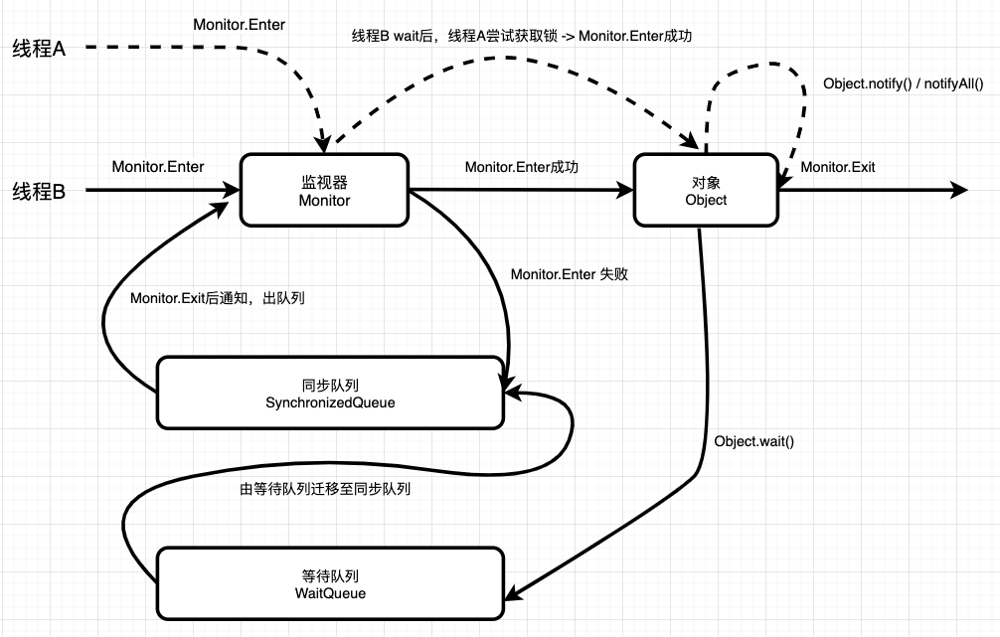

---


**两个线程之间通信**

```java
class  Share {
    /**
     * 公共资源
     */
    private int num = 0;

    public synchronized void add() throws InterruptedException {
        // 判断是否满足执行条件
        if (num !=0) {
            // 不满足条件,调用Object对象的wait()进行等待，同时释放锁(同步方法的锁对象就是调用方法的对象实例 -> share对象实例)
            this.wait();
        }
        // 满足条件,执行处理任务
        System.out.println("["+Thread.currentThread().getName() + "] 当前Num:"+(num++) + "变更后:"+num);
        this.notifyAll();
    }
    public synchronized void min() throws InterruptedException {
        // 判断是否满足执行条件
        if (num !=1) {
            // 不满足条件,调用Object对象的wait()进行等待，同时释放锁(同步方法的锁对象就是调用方法的对象实例 -> share对象实例)
            this.wait();
        }
        // 满足条件,执行处理任务
        System.out.println("["+Thread.currentThread().getName() + "] 当前Num:"+(num--) + "变更后:"+num);
        this.notifyAll();
    }
}
public class ThreadDemo {
    public static void main(String[] args) {
        Share share = new Share();
        for (int i = 0; i < 500; i++) {
            new Thread(() -> {
                try {
                    share.add();
                } catch (InterruptedException e) {
                    e.printStackTrace();
                }
            },"线程A"+i).start();
            new Thread(() -> {
                try {
                    share.min();
                } catch (InterruptedException e) {
                    e.printStackTrace();
                }
            },"线程B"+i).start();
        }

    }
}

```

##### 虚假唤醒的问题

> 执行上述的代码，可能偶发的出现下图中的问题，出现的原因主要是：`wait()方法是阻塞的，在哪里释放锁等待，被通知唤醒后就会在哪里返回并继续执行`
>
> - 比如num=1时,线程B397调用min()方法if语句中的wait()方法后阻塞,于是线程B397在此处等待并释放锁对象
> - 然后由线程B400拿到了锁对象,并且由于num=1,执行了min()方法,将num设置为0,并且执行notifyAll()方法后,释放锁并且通知同步队列中所有等待的线程
> - 然后线程B397拿到了锁对象,于是wait()方法返回,并开始执行下面的流程 -> 将num减1,于是num变成了 -1


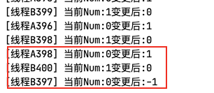


**虚假唤醒的一般处理方式**

- 将判断放在while() {} 循环中,这样当 this.wait()方法返回后,还会再次判断是否满足while条件

```java
// 以min()方法为例子
// 修改前:
public synchronized void min() throws InterruptedException {
  if (num !=1) {
    this.wait();
  }
  System.out.println("["+Thread.currentThread().getName() + "] 当前Num:"+(num--) + "变更后:"+num);
  this.notifyAll();
}

  
// 修改后
public synchronized void min() throws InterruptedException {
  while (num !=1) {
    this.wait();
  }
  System.out.println("["+Thread.currentThread().getName() + "] 当前Num:"+(num--) + "变更后:"+num);
  this.notifyAll();
}

```


##### 生产者消费者模式

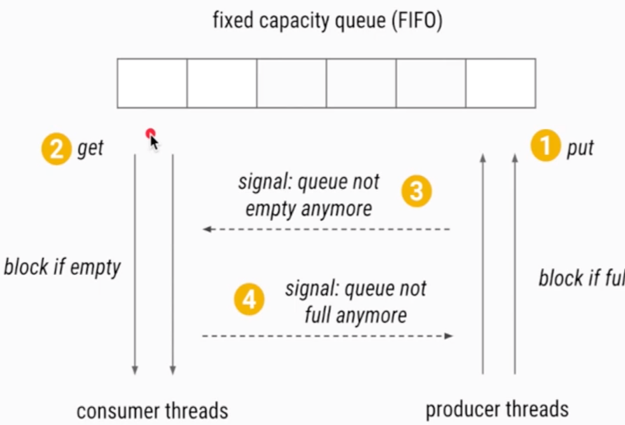


```java
/**
 * <b>生产者和消费者模式(仅使用wait 和 notify)</b>
 * @author <a href="mailto:zhuyuliangm@gmail.com">zyl</a>
 */
public class ProducerAndConsumer {
    public static void main(String[] args) throws InterruptedException {
        Storage store = new Storage(10);

        Thread producer = new Thread(() -> {
            for (int i = 0; i < 20; i++) {
                try {
                    store.put("data"+i);
                } catch (InterruptedException e) {
                    e.printStackTrace();
                }
            }
        },"producer");

        Thread consumer = new Thread(() -> {
            for (int i = 0; i < 20; i++) {
                try {
                    store.take();
                } catch (InterruptedException e) {
                    e.printStackTrace();
                }
            }
        },"consumer");
        producer.start();
        // 让生产者先生产数据
        TimeUnit.SECONDS.sleep(1);
        consumer.start();
    }
    /**
     * 定义一个阻塞队列
     */
    static class Storage {
        private int maxSize;
        private LinkedList<String> store;
        public Storage(int maxSize) {
            this.maxSize = maxSize;
            this.store = new LinkedList<>();
        }

        /**
         * 同步方法的monitor是当前对象实例
         * 如果被中断则抛出异常
         */
        public synchronized void put(String data) throws InterruptedException {
            System.out.println(ThreadUtil.getThreadInfo() + "尝试放入数据["+data+"]...");
            while(store.size() == maxSize) {
                System.out.println(ThreadUtil.getThreadInfo() + "存储满了...");
                wait();
            }
            System.out.println(ThreadUtil.getThreadInfo() + "存储有剩余空间...");
            store.add(data);
            // 通知消费者消费
            notify();
        }
        public synchronized void take() throws InterruptedException {
            System.out.println(ThreadUtil.getThreadInfo() + "尝试取出数据...");
            while(store.size() == 0) {
                System.out.println(ThreadUtil.getThreadInfo() + "存储空了...");
                wait();
            }
            System.out.println(ThreadUtil.getThreadInfo() + "存储有数据了,同时取出数据:"+store.poll());
            // 通知生产者生产数据
            notify();
        }
    }
}
```


#### Lock方案

- Lock接口的 newContition()方法返回 Condition 对象，`Condition也可以实现等待/通知模式`,而且可以进行选择性的通知,Condition常用的方法
  - `await()`
    - 使当前线程等待并将线程放在Condition对象的等待队列中,同时会释放锁,当其他线程调用 signal()时,线程会重新获得锁,并继续执行
  - `signal()`
    - 从条件的等待队列中随机唤醒一个等待的线程
- 注意
  - 在调用 Condition 的 await()/signal()方法前，也需要线程持有相关的Lock 锁
  - 调用 await()后线程会释放这个锁
  - 在singal()调用后会从当前 Condition 对象的等待队列中，唤醒一个线程，唤醒的线程尝试获得锁，一旦获得锁成功就继续执行。

```java
class Shared {
    private int num = 0;
    // 声明锁对象
    private Lock lock = new ReentrantLock();
    // 声明条件
    private Condition condition = lock.newCondition();

    public void add() throws InterruptedException {
        lock.lock();
        try {
            // 判断
            while (num !=0) {
                condition.await();
            }
            System.out.println("["+Thread.currentThread().getName() + "] 当前Num:"+(num++) + "变更后:"+num);
            condition.signalAll();
        }finally {
            lock.unlock();
        }
    }
    public void min() throws InterruptedException {
        lock.lock();
        try {
            // 判断,使用while 防止虚假唤醒
            while (num !=1) {
                condition.await();
            }
            // 满足条件执行
            System.out.println("["+Thread.currentThread().getName() + "] 当前Num:"+(num--) + "变更后:"+num);
            // 通知其他的线程
            condition.signalAll();
        }finally {
            lock.unlock();
        }
    }
}
public class LockDemo {
    public static void main(String[] args) {
        Shared share = new Shared();
        for (int i = 0; i < 500; i++) {
            new Thread(() -> {
                try {
                    share.add();
                } catch (InterruptedException e) {
                    e.printStackTrace();
                }
            },"线程A"+i).start();
            new Thread(() -> {
                try {
                    share.min();
                } catch (InterruptedException e) {
                    e.printStackTrace();
                }
            },"线程B"+i).start();
        }
    }
}

```


### 线程间定制化通信

> 案例：实现 A线程打印5次A，B 线程打印10次B，C线程打印15次C,按照 此顺序循环 10 轮 -> 唤醒指定的线程

- 实现思路: A执行完后,通知B线程,B执行完后通知C线程 -> 创建多个Condition与A,B,C进行绑定

```java
/**
 * 需求: A输出五次,B输出10次,C输出15次
 *
 * @author <a href="mailto:zhuyuliangm@gmail.com">zyl</a>
 */

class customShared {
    private int num = 0;
    // 声明一个锁对象
    private Lock lock  = new ReentrantLock();

    // 创建一个A的条件
    private Condition conditionA = lock.newCondition();
    // 创建一个B的条件
    private Condition conditionB = lock.newCondition();
    // 创建一个C的条件
    private Condition conditionC = lock.newCondition();

    public void printA () throws InterruptedException {
        lock.lock();
        try {
            // 判断条件 -> num=0 的时候,输出A
            while (num != 0) {
                conditionA.await();
            }
            for (int i = 1; i <= 5; i++) {
                System.out.printf("线程[%s]--->A[%d]\r\n",Thread.currentThread().getName(),i);
            }
           num = 1;
            // 唤醒B
            conditionB.signal();
        }finally {
            lock.unlock();
        }
    }
    public void printB () throws InterruptedException {
        lock.lock();
        try {
            // 判断条件 -> num=1 的时候,输出B
            while (num != 1) {
                conditionB.await();
            }
            for (int i = 1; i <= 10; i++) {
                System.out.printf("线程[%s]--->B[%d]\r\n",Thread.currentThread().getName(),i);
            }
            num = 2;
            // 唤醒C
            conditionC.signal();
        }finally {
            lock.unlock();
        }
    }
    public void printC () throws InterruptedException {
        lock.lock();
        try {
            // 判断条件 -> num=2 的时候,输出C
            while (num != 2) {
                conditionC.await();
            }
            for (int i = 1; i <= 15; i++) {
                System.out.printf("线程[%s]--->C[%d]\r\n",Thread.currentThread().getName(),i);
            }
            System.out.println("------------------");
            num = 0;
            // 唤醒C
            conditionA.signal();
        }finally {
            lock.unlock();
        }
    }
}

public class CustomLockDemo {
    public static void main(String[] args) {
        customShared shared = new customShared();
        new Thread(() -> {
            try {
                for (int i = 1; i <= 10; i++) {
                    shared.printA();
                }
            } catch (InterruptedException e) {
                e.printStackTrace();
            }
        },"TheadA").start();
        new Thread(() -> {
            try {
                for (int i = 1; i <= 10; i++) {
                    shared.printB();
                }
            } catch (InterruptedException e) {
                e.printStackTrace();
            }
        }, "ThreadB").start();
        new Thread(() -> {
            try {
                for (int i = 1; i <= 10; i++) {
                    shared.printC();
                }
            } catch (InterruptedException e) {
                e.printStackTrace();
            }
        },"ThreadC").start();
    }
}

```


### Thread的其他方法

#### sleep()

- 特点
  - 让当前线程在预期时间运行，其他时间不占用 CPU资源
  - <font color="red">sleep方法不释放锁，包括 synchronized 和 lock</font>
  - <font color="red">sleep方法可以被中断，会抛出中断异常并且清除中断状态</font>

:::caution wait 和 sleep 的区别?

- 区别1
  - sleep 是Thread 的静态方法
  - wait 是Object的方法，任何对象实例都可以调用
- 区别2
  - sleep 不会释放锁,但是会让出CPU执行权
  - wait 会释放锁，但是调用它的前提是<font color="red">当前线程占有锁(即代码需要在synchronized中)</font>
- wait 和 sleep 都可以被 <font color="red">interrupted()</font>中断  

:::

##### wait释放锁

通过运行结果可以看到，当Thread1调用wait方法后，Thread2就执行了，走出同步代码块并且也释放了锁，然后Thread1获取到了锁，并且执行下一步

```java
public class WaitDemo2 {
    // 创建锁对象
    private static final Object lock = new Object();

    public static void main(String[] args) throws InterruptedException {
        Thread thread1 = new Thread(() -> {
           synchronized (lock) {
               try {
                   System.out.println(ThreadUtil.getThreadInfo() + "\t获取到了monitor锁["+ LocalDateTime.now().toLocalTime() +"]" );
                   lock.wait(5000);
                   System.out.println(ThreadUtil.getThreadInfo() + "\t退出了同步代码块["+ LocalDateTime.now().toLocalTime() +"]" );
               } catch (InterruptedException e) {
                   e.printStackTrace();
               }
           }
        },"Thread1");

        Thread thread2 = new Thread(() -> {
            synchronized (lock) {
                try {
                    System.out.println(ThreadUtil.getThreadInfo() + "\t获取到了monitor锁["+ LocalDateTime.now().toLocalTime() +"]" );
                    System.out.println(ThreadUtil.getThreadInfo() + "\t退出了同步代码块["+ LocalDateTime.now().toLocalTime() +"]" );
                } catch (InterruptedException e) {
                    e.printStackTrace();
                }
            }
        },"Thread2");
        thread1.start();
        TimeUnit.SECONDS.sleep(1);
        thread2.start();
    }
}

/*
	{线程名称: Thread1,ID:11,状态:RUNNABLE,优先级:5}	获取到了monitor锁[16:26:47.242]
  {线程名称: Thread2,ID:12,状态:RUNNABLE,优先级:5}	获取到了monitor锁[16:26:48.216]
  {线程名称: Thread2,ID:12,状态:RUNNABLE,优先级:5}	退出了同步代码块[16:26:48.228]
  {线程名称: Thread1,ID:11,状态:RUNNABLE,优先级:5}	退出了同步代码块[16:26:52.248]
*/
```


##### sleep不释放锁

通过运行结果可以看到，当Thread1调用sleep方法之后，并不会释放锁，只有等sleep时间到了之后，才会继续往下走

```java
public class WaitDemo2 {
    // 创建锁对象
    private static final Object lock = new Object();

    public static void main(String[] args) throws InterruptedException {
        Thread thread1 = new Thread(() -> {
           synchronized (lock) {
               try {
                   System.out.println(ThreadUtil.getThreadInfo() + "\t获取到了monitor锁["+ LocalDateTime.now().toLocalTime() +"]" );
                   TimeUnit.SECONDS.sleep(5);
                   System.out.println(ThreadUtil.getThreadInfo() + "\t退出了同步代码块["+ LocalDateTime.now().toLocalTime() +"]" );
               } catch (InterruptedException e) {
                   e.printStackTrace();
               }
           }
        },"Thread1");

        Thread thread2 = new Thread(() -> {
            synchronized (lock) {
                try {
                    System.out.println(ThreadUtil.getThreadInfo() + "\t获取到了monitor锁["+ LocalDateTime.now().toLocalTime() +"]" );
                    TimeUnit.SECONDS.sleep(2);
                    System.out.println(ThreadUtil.getThreadInfo() + "\t退出了同步代码块["+ LocalDateTime.now().toLocalTime() +"]" );
                } catch (InterruptedException e) {
                    e.printStackTrace();
                }
            }
        },"Thread2");
        thread1.start();
        TimeUnit.SECONDS.sleep(1);
        thread2.start();
    }
}

/*
	{线程名称: Thread1,ID:11,状态:RUNNABLE,优先级:5}	获取到了monitor锁[16:31:07.256]
  {线程名称: Thread1,ID:11,状态:RUNNABLE,优先级:5}	退出了同步代码块[16:31:12.258]
  {线程名称: Thread2,ID:12,状态:RUNNABLE,优先级:5}	获取到了monitor锁[16:31:12.259]
  {线程名称: Thread2,ID:12,状态:RUNNABLE,优先级:5}	退出了同步代码块[16:31:14.260]
*/
```


#### join()

- 等加入的线程执行完后再执行
- <font color="red">join期间，主线程处于WAITING的线程状态</font>

```java
public class joinDemo {
    public static void main(String[] args) throws InterruptedException {
        Thread thread1 = new Thread(() -> {
            System.out.println(ThreadUtil.getThreadInfo() + "开始...");
            try {
                TimeUnit.SECONDS.sleep(3);
            } catch (InterruptedException e) {
                e.printStackTrace();
            }
            System.out.println(ThreadUtil.getThreadInfo() + "结束...");
        });

        Thread thread2 = new Thread(() -> {
            System.out.println(ThreadUtil.getThreadInfo() + "开始...");
            try {
                TimeUnit.SECONDS.sleep(3);
            } catch (InterruptedException e) {
                e.printStackTrace();
            }
            System.out.println(ThreadUtil.getThreadInfo() + "结束...");
        });
        thread1.start();
        thread2.start();
        TimeUnit.SECONDS.sleep(1);
        System.out.println(ThreadUtil.getThreadInfo() + "线程1,线程2加入主线程...");
        thread1.join();
        thread2.join();
        System.out.println(ThreadUtil.getThreadInfo() + "线程1,线程2执行结束后,主线程继续...");
    }
}
```

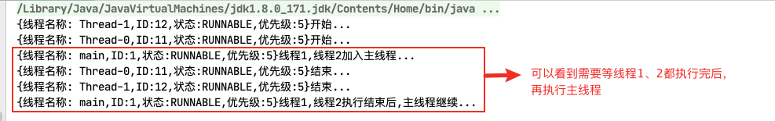


#### yield()

- 释放线程的CPU时间片(资源)，但是不释本身放锁且不会处于阻塞，此时的线程状态依旧是 RUNNABLE


## 集合的线程安全

### 不安全的集合线程

#### ArrayList

```java
/**
 * <b>List集合线程不安全演示</b>
 *
 * @author <a href="mailto:zhuyuliangm@gmail.com">zyl</a>
 */
public class ThreadDemo1 {
    public static void main(String[] args) {
        // 创建ArrayList 集合
        List<String> names = new ArrayList<>();

        // 创建10个线程去操作集合ArrayList
        for (int i = 0; i < 10; i++) {
            new Thread(() -> {
                names.add(UUID.randomUUID().toString().substring(0,8));
                System.out.println(names);
            },String.valueOf('i')).start();
        }

    }
}
```

**多线程下ArrayList 异常 -> 并发修改异常**

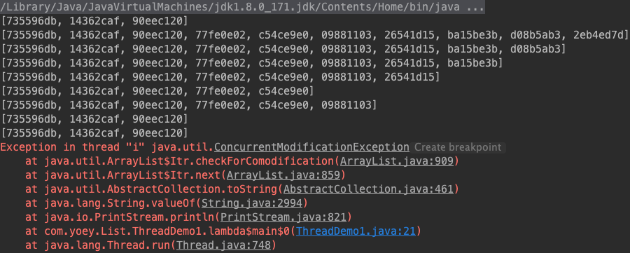


### 安全的集合线程

#### Vector [不推荐]

- Vector 是`矢量队列`, 从JDK1.0 版本引入, 继承于`AbstractList`, 实现了 `List、RandomAccess、Cloneable` 接口
- 它是一个队列,支持 `添加、删除、修改、遍历等功能` ,由于还实现了`RandomAccess` 接口,所以还具有`随机访问的功能`

- <font color="red">和 ArrayList 不同的是，Vector中的操作是线程安全的，因为它的add()方法 是同步方法</font>

```java
/**
 * <b>使用Vector</b>
 *
 * @author <a href="mailto:zhuyuliangm@gmail.com">zyl</a>
 */
public class ThreadDemo2 {
    public static void main(String[] args) {
        // 创建一个Vector 集合
        List<String> names = new Vector<>();

        // 创建30个线程操作集合
        for (int i = 0; i < 30; i++) {
            new Thread(() -> {
                names.add(UUID.randomUUID().toString().substring(0,8));
                System.out.println(names);
            },String.valueOf('i')).start();
        }
    }
}
```

#### Collections工具类 [不常用]

- `Collections.synchronizedList(List<T> list)`: 方法会返回一个线程安全的集合
  - <mark>返回的集合继承自 SynchronizedCollection，并且集合的大部分方法使用 Synchronized进行了处理</mark> 

```java
/**
 * <b>使用Collections 工具类创建一个线程安全的集合</b>
 *
 * @author <a href="mailto:zhuyuliangm@gmail.com">zyl</a>
 */
public class ThreadDemo3 {
    public static void main(String[] args) {
        // 通过 Collections.synchronizedList 创建一个线程安全的集合
        List<String> names = Collections.synchronizedList(new ArrayList<>());

        // 创建30个线程操作集合
        for (int i = 0; i < 30; i++) {
            new Thread(() -> {
                names.add(UUID.randomUUID().toString().substring(0,8));
                System.out.println(names);
            },String.valueOf('i')).start();
        }
    }
}
```


## 多线程锁

### 八锁问题演示[Synchronized]

> 创建一个Phone对象，包含两个同步方法 -> SendSMS、SendEmail，还有一个非同步方法 getHello

```java
public class Phone {
    public synchronized void sendSMS () {
        System.out.println("[Send SMS]");
    }
    public synchronized void sendEmail () {
        System.out.println("[Send Email]");
    }
    public void getHello() {
        System.out.println("[getHello]");
    }

}
```


1. 问题1: 标准操作，先打印谁? -> <font color="red">按顺序打印</font> 

```java
public class Phone {
    public synchronized void sendSMS () throws InterruptedException {
        System.out.println("[Send SMS]");
    }
    public synchronized void sendEmail () {
        System.out.println("[Send Email]");
    }
    public void getHello() {
        System.out.println("[getHello]");
    }
    public static  void one () throws InterruptedException {
        Phone phone = new Phone();
        new Thread(() -> {
            try {
                phone.sendSMS();
            }catch (Exception ex) {
                ex.printStackTrace();
            }
        }, "A").start();
        TimeUnit.MILLISECONDS.sleep(100);
        new Thread(() -> {
            try {
                phone.sendEmail();
            }catch (Exception ex) {
                ex.printStackTrace();
            }
        }, "B").start();
    }
    public static void main(String[] args) throws InterruptedException {
        one ();
    }
}

/*
	[Send SMS]
	[Send Email]
*/
```


2. 停 4 秒在短信方法内，先打印短信还是邮件 -> <font color="red">按顺序打印</font> 

```java
public class Phone {
    public synchronized void sendSMS () throws InterruptedException {
        TimeUnit.SECONDS.sleep(4);
        System.out.println("[Send SMS]");
    }
    public synchronized void sendEmail () {
        System.out.println("[Send Email]");
    }
    public void getHello() {
        System.out.println("[getHello]");
    }

    public static  void two () throws InterruptedException {
        Phone phone = new Phone();
        new Thread(() -> {
            try {
                phone.sendSMS();
            }catch (Exception ex) {
                ex.printStackTrace();
            }
        }, "A").start();
        TimeUnit.MILLISECONDS.sleep(100);
        new Thread(() -> {
            try {
                phone.sendEmail();
            }catch (Exception ex) {
                ex.printStackTrace();
            }
        }, "B").start();
    }   
    public static void main(String[] args) throws InterruptedException {
        three ();
    }
}

/*
  //阻塞4秒后
	[Send SMS]
	[Send Email]
*/
```


3. 停4秒在短信方法内,先调用普通的 getHello 方法，是先打短信还是 hello -> <font color="red">先打印hello</font> 

```java
public class Phone {
    public synchronized void sendSMS () throws InterruptedException {
        TimeUnit.SECONDS.sleep(4);
        System.out.println("[Send SMS]");
    }
    public synchronized void sendEmail () {
        System.out.println("[Send Email]");
    }
    public void getHello() {
        System.out.println("[getHello]");
    }

    public static  void three () throws InterruptedException {
        Phone phone = new Phone();
        new Thread(() -> {
            try {
                phone.sendSMS();
            }catch (Exception ex) {
                ex.printStackTrace();
            }
        }, "A").start();
        TimeUnit.MILLISECONDS.sleep(100);
        new Thread(() -> {
            try {
                phone.getHello();
            }catch (Exception ex) {
                ex.printStackTrace();
            }
        }, "B").start();
    }
    public static void main(String[] args) throws InterruptedException {
        three ();
    }
}

/*
[getHello]
// 阻塞4秒后
[Send SMS]
*/
```


4. 现在有两部手机，停4秒在短信方法内,先打印短信还是邮件 -> <font color="red">先打印Email再打印SMS</font> 

```java
public class Phone {
    public synchronized void sendSMS () throws InterruptedException {
        TimeUnit.SECONDS.sleep(4);
        System.out.println("[Send SMS]");
    }
    public synchronized void sendEmail () {
        System.out.println("[Send Email]");
    }
    public void getHello() {
        System.out.println("[getHello]");
    }
    public static  void four () throws InterruptedException {
        Phone phone1 = new Phone();
        Phone phone2 = new Phone();
        new Thread(() -> {
            try {
                phone1.sendSMS();
            }catch (Exception ex) {
                ex.printStackTrace();
            }
        }, "A").start();
        TimeUnit.MILLISECONDS.sleep(100);
        new Thread(() -> {
            try {
                phone2.sendEmail();
            }catch (Exception ex) {
                ex.printStackTrace();
            }
        }, "B").start();
    }
    public static void main(String[] args) throws InterruptedException {
        four();
    }
}
/*
[Send Email]
// 阻塞4秒后
[Send SMS]
*/
```


5. 将Email 和SMS 改为静态同步方法，1 部手机，先打印短信还是邮件 -> <font color="red">按顺序打印</font> 

```java
public class Phone {
    public static  synchronized void sendSMS () throws InterruptedException {
      	 TimeUnit.SECONDS.sleep(4);
        System.out.println("[Send SMS]");
    }
    public static synchronized void sendEmail () {
        System.out.println("[Send Email]");
    }
    public void getHello() {
        System.out.println("[getHello]");
    }
    public static  void five () throws InterruptedException {
      Phone phone = new Phone();
        new Thread(() -> {
            try {
                phone.sendSMS();
            }catch (Exception ex) {
                ex.printStackTrace();
            }
        }, "A").start();
        TimeUnit.MILLISECONDS.sleep(100);
        new Thread(() -> {
            try {
                phone.sendEmail();
            }catch (Exception ex) {
                ex.printStackTrace();
            }
        }, "B").start();
    }
    public static void main(String[] args) throws InterruptedException {
        five();
    }
}

/*
// 阻塞4秒后
[Send SMS]
[Send Email]
*/
```


6. 将Email 和SMS 改为静态同步方法，2 部手机，先打印短信还是邮件 -> <font color="red">按顺序打印</font> 

```java
public class Phone {
    public static  synchronized void sendSMS () throws InterruptedException {
      	 TimeUnit.SECONDS.sleep(4);
        System.out.println("[Send SMS]");
    }
    public static synchronized void sendEmail () {
        System.out.println("[Send Email]");
    }
    public void getHello() {
        System.out.println("[getHello]");
    }
    public static  void five () throws InterruptedException {
      Phone phone1 = new Phone();
      Phone phone2 = new Phone();
        new Thread(() -> {
            try {
                phone1.sendSMS();
            }catch (Exception ex) {
                ex.printStackTrace();
            }
        }, "A").start();
        TimeUnit.MILLISECONDS.sleep(100);
        new Thread(() -> {
            try {
                phone2.sendEmail();
            }catch (Exception ex) {
                ex.printStackTrace();
            }
        }, "B").start();
    }
    public static void main(String[] args) throws InterruptedException {
        five();
    }
}

/*
// 阻塞4秒后
[Send SMS]
[Send Email]
*/
```


7. 将SMS设置为静态同步方法，Email 设置为普通同步方法，1部手机， 先打印短信还是邮件 -> <font color="red">先打印Email，再打印SMS</font> 

```java
public class Phone {
    public static  synchronized void sendSMS () throws InterruptedException {
        TimeUnit.SECONDS.sleep(4);
        System.out.println("[Send SMS]");
    }
    public synchronized void sendEmail () {
        System.out.println("[Send Email]");
    }
    public void getHello() {
        System.out.println("[getHello]");
    }

    public static  void seven () throws InterruptedException {
        Phone phone = new Phone();
        new Thread(() -> {
            try {
                phone.sendSMS();
            }catch (Exception ex) {
                ex.printStackTrace();
            }
        }, "A").start();
        TimeUnit.MILLISECONDS.sleep(100);
        new Thread(() -> {
            try {
                phone.sendEmail();
            }catch (Exception ex) {
                ex.printStackTrace();
            }
        }, "B").start();
    }
    public static void main(String[] args) throws InterruptedException {
        seven();
    }
}

/*
[Send Email]
// 阻塞4秒后
[Send SMS]
*/
```


8. 将SMS设置为静态同步方法，Email 设置为普通同步方法，2部手机， 先打印短信还是邮件 -> <font color="red">先打印Email，再打印SMS</font> 

```java
public class Phone {
    public static  synchronized void sendSMS () throws InterruptedException {
        TimeUnit.SECONDS.sleep(4);
        System.out.println("[Send SMS]");
    }
    public synchronized void sendEmail () {
        System.out.println("[Send Email]");
    }
    public void getHello() {
        System.out.println("[getHello]");
    }

    public static  void seven () throws InterruptedException {
        Phone phone1 = new Phone();
      	Phone phone2 = new Phone();
        new Thread(() -> {
            try {
                phone1.sendSMS();
            }catch (Exception ex) {
                ex.printStackTrace();
            }
        }, "A").start();
        TimeUnit.MILLISECONDS.sleep(100);
        new Thread(() -> {
            try {
                phone2.sendEmail();
            }catch (Exception ex) {
                ex.printStackTrace();
            }
        }, "B").start();
    }
    public static void main(String[] args) throws InterruptedException {
        seven();
    }
}

/*
[Send Email]
// 阻塞4秒后
[Send SMS]
*/
```


#### 八锁的总结

> 对于普通同步方法，锁是当前实例对象
>
> 对于静态同步方法，锁是当前类的 Class 对象
>
> 对于同步方法块，锁是 Synchonized 括号里配置的对象

:::caution

1. 一个对象里面如果有多个 synchronized 方法，某一个时刻内，只要一个线程去调用其中的 一个 synchronized 方法了， 其它的线程都只能等待
   - 即某一个时刻内，只能有唯一一个线程去访问这些 synchronized 方法
2. 如果锁的是当前对象this，被锁定后，其它的线程都不能进入到当前对象的其它的 synchronized 方法
3. 普通方法和同步锁无关
4. <font color="red">java 中的每一个对象都可以作为锁</font>

:::

- 当一个线程试图访问同步代码块时，它首先必须得到锁，退出或抛出异常时必须释放锁
  - 即如果一个实例对象的非静态同步方法获取锁后，该实例对象的其他非静态同步方必须等待获取锁的方法释放锁后才能获取锁，但是别的实例对象的非静态同步方法因为跟该实例对象的非静态同步方法用的是不同的锁， 所以不需要等待该实例对象已获取锁的非静态同步方法释放锁就可以获取他们自己的锁。 
- 所有的静态同步方法用的也是同一把锁——类对象本身
- <font color="red">静态同步方法和非静态同步方法的两把锁是两个不同的对象 ，所以静态同步方法与非静态同步方法之间是不会有竞态条件的</font>
  - 但是一旦一个静态同步方法获取锁后，其他的静态同步方法都必须等待该方法释放锁后才能获取锁，而不管是否同一个实例对象的静态同步方法，只要它们同一个类的实例对象!

### 公平锁和非公平锁

:::tip 公平锁与非公平锁

公平锁: 多个线程按照申请锁的顺序去获得锁，线程会直接进入等待队列去排队，只有等待队列里的第一个线程可以获取到锁

非公平锁: 多个线程去获取锁的时候，会直接去尝试获取，获取不到，再去进入等待队列，如果能获取到，就直接获取到锁

:::

- 可重入锁 ReentrantLock的构造函数: `ReentrantLock(boolean fair)` 
  - **fair**:是否是公平锁,默认是非公平锁

- <font color="red">两种锁的优缺点:</font>

  - 非公平锁
    - 优点：执行效率高,可以减少CPU唤醒线程的开销，整体的吞吐效率会高点，CPU也不必取唤醒所有线程，会减少唤起线程的数量
    - 缺点: 可能导致队列中间的线程一直获取不到锁或者长时间获取不到锁，导致其他线程饿死
  - 公平锁
    - 优点: 所有的线程都能得到资源,都有执行的机会，不会饿死在队列中
    - 缺点: 吞吐量会下降很多，队列里面除了第一个线程，其他的线程都会阻塞，cpu唤醒阻塞线程的开销会很大

#### 区分公平锁与非公平锁

##### 非公平锁的处理

> <font color="green">通过输出结果可以看到，获取过锁的线程在下面有更大的几率能再次获取到锁</font>

```java
public class SellTicketDemo {
    public static int ticketNumber = 10;
    /**
     * 非公平锁
     */
    public static final ReentrantLock NON_FAIR_LOCK = new ReentrantLock();


    public static void nonFairLock(){
        NON_FAIR_LOCK.lock();
        try {
            if (ticketNumber > 0) {
                System.out.println("线程:" + Thread.currentThread().getName() + "\t卖出:" + (ticketNumber --) + "\t剩余:" + ticketNumber);
            }
        }finally {
            NON_FAIR_LOCK.unlock();
        }
    }
    public static void main(String[] args) {
        new Thread(() -> {
            for (int i = 0; i < 100; i++) {
                nonFairLock();
            }
        },"售票员1").start();
        new Thread(() -> {
            for (int i = 0; i < 100; i++) {
                nonFairLock();
            }
        },"售票员2").start();
        new Thread(() -> {
            for (int i = 0; i < 100; i++) {
                nonFairLock();
            }
        },"售票员3").start();
    }
}

```

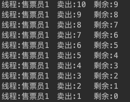


##### 公平锁的处理

> <font color="green">通过输出结果可以看到，每个线程获取锁都是随机的</font>

```java
public class SellTicketDemo {
    public static int ticketNumber = 10;
    /**
     * 公平锁
     */
    public static final ReentrantLock FAIR_LOCK = new ReentrantLock(true);
    public static void fairLock(){
        FAIR_LOCK.lock();
        try {
            if (ticketNumber > 0) {
                System.out.println("线程:" + Thread.currentThread().getName() + "\t卖出:" + (ticketNumber --) + "\t剩余:" + ticketNumber);
            }
        }finally {
            FAIR_LOCK.unlock();
        }
    }
    public static void main(String[] args) {
        new Thread(() -> {
            for (int i = 0; i < 100; i++) {
                fairLock();
            }
        },"售票员1").start();
        new Thread(() -> {
            for (int i = 0; i < 100; i++) {
                fairLock();
            }
        },"售票员2").start();
        new Thread(() -> {
            for (int i = 0; i < 100; i++) {
                fairLock();
            }
        },"售票员3").start();
    }
}
```

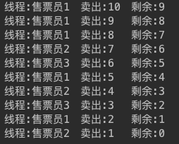


#### 两种锁源码

- 两者都继承自 `Sync -> AbstractQueuedSynchronizer`
- 使用的变量
  - `AbstractQueuedSynchronizer# state -> 同步状态`
  - `AbstractQueuedSynchronizer# head ->  延迟初始化的等待队列头。除了初始化，它只能通过方法setHead进行修改`
    - 注意:如果head存在，它的waitStatus保证不会被CANCELLED
  - `AbstractQueuedSynchronizer# tail -> 等待队列的尾部，惰性初始化。仅通过方法enq修改以添加新的等待节点`

##### 非公平锁

```java
static final class NonfairSync extends Sync {
  private static final long serialVersionUID = 7316153563782823691L;

  final void lock() {
    // 如果同步状态是0，就将 同步状态修改为 1，表示锁被占用
    if (compareAndSetState(0, 1))
      // 设置排他锁，并且更新同步状态state为1
      setExclusiveOwnerThread(Thread.currentThread());
    else
      acquire(1);
  }
  protected final boolean tryAcquire(int acquires) {
    return nonfairTryAcquire(acquires);
  }
}

 // 
 /**
  * 同步状态
  */
 private volatile int state;
	// AbstractQueuedSynchronizer（AQS） 状态State的CAS处理 -> 只有当前同步状态state是0 才可以进行swap
 protected final boolean compareAndSetState(int expect, int update) {
   // stateOffset = unsafe.objectFieldOffset(AbstractQueuedSynchronizer.class.getDeclaredField("state"));
   return unsafe.compareAndSwapInt(this, stateOffset, expect, update);
 }

```


##### 公平锁

```java
static final class FairSync extends Sync {
  private static final long serialVersionUID = -3000897897090466540L;

  final void lock() {
    acquire(1);
  }
  
  protected final boolean tryAcquire(int acquires) {
    final Thread current = Thread.currentThread();
    // 如果同步状态是0，可以获取锁
    int c = getState();
    if (c == 0) {
      // 判断自己是不是队列的第一个
      if (!hasQueuedPredecessors() &&
          compareAndSetState(0, acquires)) {
      	// 设置排他锁，并且更新同步状态state为1
        setExclusiveOwnerThread(current);
        return true;
      }
    }
    // 如果同步状态是1，且占用排他锁是正是当前线程
    else if (current == getExclusiveOwnerThread()) {
      int nextc = c + acquires;
      if (nextc < 0)
        throw new Error("Maximum lock count exceeded");
      // 修改同步状态state
      setState(nextc);
      return true;
    }
    return false;
  }
}

// 判断是不是队列的第一个
public final boolean hasQueuedPredecessors() {
  Node t = tail; 
  Node h = head;
  Node s;
  // 没有头部节点
  return h != t &&
    ((s = h.next) == null || s.thread != Thread.currentThread());
}
```


### 可重入锁[递归锁]

- <font color="red">允许同一个线程多次获取同一把锁, Lock(显式) 和 Synchronized(隐式) 都是可重入锁</font>
- <font color="red">重入锁说明: 锁的操作粒度是”线程“，而不是“调用”</font>
- `lock.getHoldCount()`
  - 查看锁的持有计数,每次调用lock()方法后，这个计数器会加1，unlock()方法会减1，变为0就说明释放了锁

**使用Synchronized的可重入锁**

```java
public class RetranDemo {
  // 可以递归调用，说明了获取到锁后，还可以继续调用加锁的同步方法
   public synchronized  void add() {
        add();
    }
    public static void main(String[] args) {
        Object obj= new Object();
        new Thread(() -> {
            synchronized (obj) {
                    System.out.println("outline:" + Thread.currentThread().getName());
                synchronized (obj) {
                    System.out.println("inline:" + Thread.currentThread().getName());
                }
            }
        }, "t1").start();
    }
}

/*
outline:t1
inline:t1
*/
```


**使用Lock的可重入锁**

```java
public class RetranDemo2 {
    public static final ReentrantLock lock = new ReentrantLock();
    public static void main(String[] args) {
        new Thread(() -> {
            try {
                lock.lock();
                System.out.println("外层:" + Thread.currentThread().getName());
                try {
                    lock.lock();
                    System.out.println("里层:" + Thread.currentThread().getName());
                }finally {
                    lock.unlock();
                }
            }finally {
                lock.unlock();
            }
        },"Demo").start();
    }
}

/*
	外层:Demo
	里层:Demo
*/
```


### 死锁

:::caution

- 死锁: <font color="red">两个或更多线程阻塞着等待其它处于死锁状态的线程释放所持有的锁。死锁通常发生在多个线程同时但以不同的顺序请求同一组锁的时候</font>

- 死锁的四个产生条件
  - `互斥`
    - 当资源被一个线程使用(占有)时，别的线程不能使用
  - `不可抢占`
    - 资源请求者不能强制从资源占有者手中夺取资源，资源只能由资源占有者主动释放
  - `请求和保持`
    - 当资源请求者在请求其他的资源的同时，保持对原有资源的占有
  - `循环等待`
    - 存在一个等待队列：P1占有P2的资源，P2占有P3的资源，P3占有P1的资源。这样就形成了一个等待环路
- 产生死锁的几个常见的原因
  - 系统资源不足
  - 线程运行顺序不合适
  - 资源分配不当
- 避免死锁的几个常见方法：
  - <font color="red">避免一个线程同时获取多个锁</font> 
  - <font color="red">避免一个线程在锁内同时占用多个资源，尽量一个锁只操作一个资源</font>
  - <font color="red">尝试使用定时锁， 使用lock.tryLock(timeout) 来代替内部锁机制</font>
  - <font color="red">对于数据库的锁，加锁和解锁必须在一个数据库连接中，否则会出现死锁</font>
- 验证是否死锁
  - `jps` -> `jstack`

:::

#### 代码演示死锁

由于A线程中获取了A锁后，还想获取B锁;B线程中获取了B锁后，还想获取A锁;两个线程相互等待

```java
public class DemoLockDemo {
    private static final Lock lock_A = new ReentrantLock();
    private static final Lock lock_B = new ReentrantLock();
    public static void main(String[] args) {
        new Thread(() -> {
            try {
                // 锁 lock_A加锁
                lock_A.lock();
                System.out.println("当前线程:"+ Thread.currentThread().getName());
                // 线程sleep 5s
                TimeUnit.SECONDS.sleep(5);
                try {
                    // 锁 lock_B 加锁
                    lock_B.lock();
                }finally {
                    lock_B.unlock();
                }
            } catch (InterruptedException e) {
                e.printStackTrace();
            } finally {
                // 释放A锁
                lock_A.unlock();
            }
        },"Thread-A").start();
        new Thread(() -> {
            try {
                // 锁 lock_B加锁
                lock_B.lock();
                System.out.println("当前线程:"+ Thread.currentThread().getName());
                // 线程sleep 5s
                try {
                    // 锁 lock_A 加锁
                    lock_A.lock();
                }finally {
                    lock_A.unlock();
                }
            } finally {
                // 释放B锁
                lock_B.unlock();
            }
        },"Thread-B").start();
    }
}
```

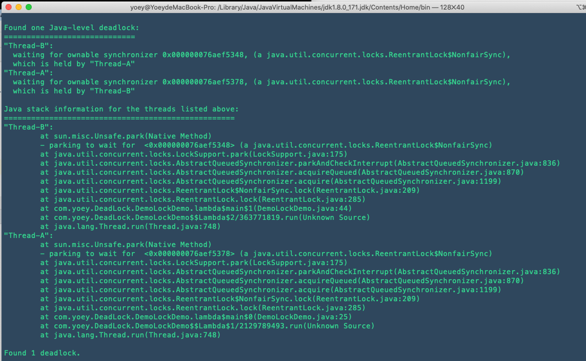


## Callable & FutureTask

> 一般通过创建Thread类、 实现Runable 接口创建线程，但是 Runable 在线程终止时，无法让线程返回结果 -> Callable可以实现

- Callable 接口的特点
  - 需要实现在完成时返回结果的 call()方法
  - call() 可以返回异常，但是Runnable的run方法不尅
  - 不能直接替换 Runnable,因为 Thread 类的构造方法根本没有 Callable
- <font color="red">如何使用Callable</font>

  - 通过 `FutureTask`可以对 Runnable、Callable接口进行包装

    - `task.isDone()`

      - 如果任务完成，则返回 true，否则返回 false

    - `task.get()`
  - 获取call()方法返回的结果
  
- `cancel()`
- FutureTask 的基本原理
  - 在主线程中需要执行比较耗时的操作时，但又不想阻塞主线程时，可以把这些 作业交给 `Future 对象在后台完成`
    -  当主线程将来需要时，就可以通过 Future 对象获得后台作业的计算结果或者执行状态
- FutureTask 特点
  - <font color="red">一般 FutureTask 多用于耗时的计算，主线程可以在完成自己的任务后，再去获取结果</font>
  - <font color="blue"> 仅在计算完成时才能检索结果。如果计算尚未完成，则阻塞get()方法</font>
  - 一旦计算完成，就不能再重新开始或取消计算
  - get() 而获取结果只有在计算完成时获取，否则会一直阻塞直到任务转入完成状态，然后会返回结果或者抛出异常
  - get()只计算一次,因此 get 方法放到最后

```java
public class CallableDemo {
    public static void main(String[] args) throws Exception {
        // 使用 FutureTask
        FutureTask<Date> task = new FutureTask<>(() -> {
            TimeUnit.SECONDS.sleep(4);
            return new Date();
        });
        // 创建Thread 线程
        new Thread(task, "Thread-A").start();

        System.out.println("~~~~~~");
        // 让主线程处理其他任务,这里假设耗时为4s
        TimeUnit.SECONDS.sleep(4);
        // task执行需要4s,所以获取 task 执行结果 此时能立即获取到
        System.out.println(task.get());
    }
}
```


## JUC 辅助类

JUC 中提供了三种常用的辅助类，通过这些辅助类可以很好的解决线程数量过 多时 Lock 锁的频繁操作。这三种辅助类为:

- `CountDownLatch` : 减少计数
- `CyclicBarrier `: 循环栅栏
- `Semaphore` : 信号量

### CountDownLatch

:::caution

- CountDownLatch 类可以设置一个计数器，然后通过 countDown() 方法来进行 减 1 的操作，使用 await 方法等待计数器不大于 0，然后继续执行 await 方法 之后的语句
  - CountDownLatch 主要有两个方法，当一个或者多个线程调用await() 方法时，这些线程会阻塞
  - 其它线程调用 countDown() 方法会将计数器减 1
    - <font color="red">调用 countDown() 方法的线程 不会阻塞</font>
  - 当计数器的值变为 0 时，因 await() 方法阻塞的线程会被唤醒，继续执行

:::

- 特点
  - 在完成一组正在其他线程中执行的操作之前，它允许一个或多个线程一直等待
  - <font color="red">用给定的计数初始化 CountDownLatch由于调用了 countDown() 方法，所以在当前计数到达零之前，await() 方法会一直受阻塞。之后会释放所有等待的线程，await 的所有后续调用都将立即返回</font> 

    - 这种现象只出现一次——计数无法被重置。如果需要重置计数，请考虑使用 `CyclicBarrier`。

- 常用的方法
  - `CountDownLatch(int count)`
    -   构造一个用给定计数初始化的 CountDownLatch
  - `await([long time,TimeUnit unit])`
    - 使当前线程在锁存器倒计数至0之前一直等待，除非线程被中断或超出了指定的等待时间
  - `countDown()`
    - 递减锁存器的计数
      - 如果计数到达零，则释放所有等待的线程
      - 如果当前计数等于零，则不发生任何操作
  - `getCount()`
    - 返回当前计数
- 使用场景： 某个线程需要等待其他线程处理完成之后再继续执行

#### 代码示例

> 需求： 6个同学陆续离开教室后值班同学才可以关门

```java
public class CountDownLatchDemo {
    public static CountDownLatch countDownLatch = new CountDownLatch(6);
    public static void main(String[] args) throws InterruptedException {
        System.out.println("现在的计数器为:" + countDownLatch.getCount());
        // 创建6个线程
        for (int i = 1; i <= 6; i++) {
            new Thread(() -> {
                    try {
                        if (Thread.currentThread().getName().equals("Thread6")) {
                            Thread.sleep(2000);
                        }
                        // 每个线程处理完都将计数器减1,不会阻塞线程
                        countDownLatch.countDown();
                        System.out.println(Thread.currentThread().getName() + "离开了");
                    } catch (InterruptedException e) {
                        e.printStackTrace();
                    }
            },"Thread"+i).start();
        }
        // 主线程等待
        countDownLatch.await();
        // 当countDownLatch的计数=0,继续后续处理
        System.out.println("现在的计数器为:" + countDownLatch.getCount());
    }
}

/*
	现在的计数器为6
  Thread1离开了
  Thread2离开了
  Thread3离开了
  Thread4离开了
  Thread5离开了
  Thread6离开了
  现在的计数器为0

*/
```

### CyclicBarrier - 同步栅栏

:::caution

- <font color="red">允许一组线程互相等待，直到所有线程都到达公共栅栏点 (同步点)，屏障才会打开，所有被屏障拦截的线程才会继续执行 </font> 

  - 屏障打开后会通过notify通知的方式唤醒等待的线程继续后续的处理
  - 在涉及一组固定大小的线程的程序中，这些线程必须不时地互相等待。因为该 barrier 在释放等待线程后可以重用，所以称它为**循环的barrier**
- <font color="red">CyclicBarrier 支持一个可选的 Runnable 命令，在一组线程中的最后一个线程到达之后（但在释放所有线程之前），该命令只在每个屏障点运行一次</font> 
- CyclicBarrier 相对于CountDownLatch是可重置的,而且支持最后一个线程到达后进行额外的处理 -> 此时所有线程没有释放，还处于await等待状态

:::

- 常见的方法
  - `CyclicBarrier(int parties, [Runnable barrierAction])`
    - parties:  在启动 barrier 前必须调用 await() 的线程数
    - barrierAction: 在启动 barrier 时执行的命令；如果不执行任何操作，则该参数为 null
  - `await([long timeout, TimeUnit unit])`
    - 在所有参与者都已经在此屏障上调用 await() 方法之前将一直等待,或者超出了指定的等待时间
  - `getNumberWaiting()`
    - 返回当前在屏障处等待的参与者数目
  - `getParties()`
    - 返回要求启动此 barrier 的参与者数目
  - `isBroken()`
    - 查询此屏障是否处于损坏状态
  - `reset()`
    - 将屏障重置为其初始状态 -> 一批线程处理完成之后，打开屏障。然后另外一批线程处理完成之后，打开屏障，往复循环
- 常见的使用场景
  - 多线程计算数据，最后合并计算结果，在所有线程计算数据完成后调用awit()方法

#### 代码实现

```java
public class CyclicBarrierDemo {
    // 创建固定值
    private static final  int NUM = 3;
  	// 创建 CyclicBarrier 循环栅栏
    private static  CyclicBarrier cyclicBarrier = new CyclicBarrier(NUM, () -> {
        // runnable 的实现
        System.out.println(Thread.currentThread().getName() + "完成了最后的处理...");
    });
    public static void main(String[] args) {
        // 创建3个线程做业务处理
        for (int i = 1; i <= 3 ; i++) {
            new Thread(() -> {
                try {
                    String tName = Thread.currentThread().getName();
                    System.out.println(tName + "处理中...");
                    // 获取当前在屏障处等待的线程数
                    System.out.println("[" + tName + "]: 当前有"+cyclicBarrier.getNumberWaiting()+"个线程在CyclicBarrier的屏障处等待,一共有"+cyclicBarrier.getParties()+"个");

                    // 每个线程都需要使用cyclicBarrier.await() ,cyclicBarrier会拦截线程执行await 后续的处理
                    cyclicBarrier.await();

                    System.out.println("[" + tName + "]: 当前有"+cyclicBarrier.getNumberWaiting()+"个线程在CyclicBarrier的屏障处等待,一共有"+cyclicBarrier.getParties()+"个");

                    // 每个线程在 CyclicBarrier 屏障破损后,会执行await() 后续的处理
                    System.out.println(Thread.currentThread().getName() + "处理完了...");
                    // CyclicBarrier可以重置状态
                    // cyclicBarrier.reset();
                }catch (Exception ex) {
                    ex.printStackTrace();
                }
            }, "线程"+i).start();
        }
    }
}
```

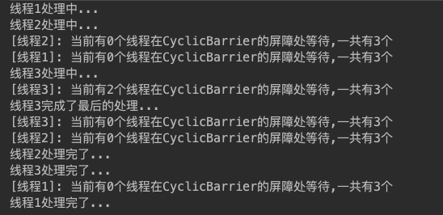


#### 分步计算数据

```java
public class CalDataDemo implements Runnable {
    // 存储计算得到的数据
    public static ConcurrentHashMap<String,Integer> dataMap = new ConcurrentHashMap<>();

    // 将数据计算分为4个线程
    public  CyclicBarrier cyclicBarrier = new CyclicBarrier(4, this);

    @Override
    public void run() {
        int res = 0;
        // 对存储计算得到的数据 data进行合并计算
        for(Map.Entry<String,Integer> data: dataMap.entrySet()) {
            System.out.println(data.getValue());
            res += data.getValue();
        }
        System.out.println("计算结果为:" + res);
    }

    public static void main(String[] args) {
        CalDataDemo calDataDemo = new CalDataDemo();
        // 创建4 个线程
        for (int i = 0; i < 4; i++) {
            new Thread(() -> {
                try {
                    dataMap.put(Thread.currentThread().getName(), new Random().nextInt(10));
                    // 计算完成后,调用await(),等待其他线程完成
                    calDataDemo.cyclicBarrier.await();
                } catch (Exception e) {
                    e.printStackTrace();
                }
            },"Thread" + i).start();
        }
    }
}
```


### Semaphore - 控制并发线程数

:::caution

- <font color="red">Semaphore 的构造方法中传入的第一个参数是最大信号量(可以看成最大线程池)，每个信号量初始化为一个最多只能分发一个许可证</font> 

  - 使用 acquire() 方法获得许可证，release() 方法释放许可
- **Semaphore 通常用于限制可以同时访问某些资源（物理或逻辑的）的线程数目**
- 获得一项任务前，每个线程必须从信号量获取许可，从而保证可以使用该项。该线程结束后，将项返回到池中并将许可返回到该信号量，从而允许其他线程获取该项任务
- 将信号量初始化为 1，使得它在使用时最多只有一个可用的许可，从而可用作一个相互排斥的锁。这通常也称为二进制信号量，因为它只能有两种状态：一个可用的许可，或零个可用的许可
  - 按此方式使用时，二进制信号量具有某种属性（与很多 Lock 实现不同），即可以由线程释放“锁”，而不是由所有者（因为信号量没有所有权的概念）。在某些专门的上下文（如死锁恢复）中这会很有用。

:::

- <mark>Semaphore 是一个<code>计数信号量</code>，信号量维护了一个许可集</mark>

- 常见的方法

  - `Semaphore(int permits, boolean fair)` -> 创建具有给定的许可数和给定的公平设置的 Semaphore
    - `permits`
      - 初始的可用许可数目。此值可能为负数，在这种情况下，必须在授予任何获取前进行释放。
    - `fair`
      - 如果此信号量保证在争用时按先进先出的顺序授予许可，则为 true；否则为 false。
      - <font color="red">通常应该将用于控制资源访问的信号量初始化为公平的，以确保所有线程都可访问资源。为其他的种类的同步控制使用信号量时，非公平排序的吞吐量优势通常要比公平考虑更为重要	</font>
  - `acquire(int permits)`
    -   从此信号量获取给定数目的许可，在提供这些许可前一直将线程阻塞,否则线程被中断
  - `acquireUninterruptibly(int permits)`
    -  从此信号量获取给定数目的许可，在提供这些许可前一直将线程阻塞
  - `release(int permits)`
    - 释放给定数目的许可，将其返回到信号量

  - `availablePermits()`
    - 返回此信号量中当前可用的许可数
  - `drainPermits()`
    - 获取并返回立即可用的所有许可
  - `getQueuedThreads() #Collection<Thread>`
    -  返回一个 collection，包含可能等待获取的线程
  - `	getQueueLength()`
    - 返回正在等待获取的线程的估计数目
  - `hasQueuedThreads()`
    - 查询是否有线程正在等待获取

- 常见的使用场景

  - 可用于做流量控制，特别是公共资源有限的应用场景。

#### 代码实现

```java
public class SemaphoreDemo {
    // 定义信号量,限制访问资源的线程数量为2
    private static final int MAX_AVAILABLE = 2;
    // 让每个线程可以公平的得到信号量的许可
    private static final boolean isFair = false;
    private static volatile Semaphore semaphore = new Semaphore(MAX_AVAILABLE, isFair);
    
    public static void main(String[] args) {
        // 定义10 个线程,都尝试获取资源
        for (int i = 1; i <= 10; i++) {
            new Thread(() -> {
                try {
                    String tName = Thread.currentThread().getName();
                    System.out.printf("线程[%s]正尝试获取许可...\r\n", tName);
                    // 通过 Semaphore.acquire() 获取许可,这里指定获取1个许可,没有获取到许可的线程会在这里等待阻塞后续的处理
                    semaphore.acquire();
                    // 获取到许可后进行后续处理
                    System.out.printf("线程[%s]获取到许可...\r\n",tName);
                }catch (Exception ex) {
                     ex.printStackTrace();
                } finally {
                    // 处理完后,释放占用的许可å
                    semaphore.release();
                }
            }, "Thread-"+i).start();

        }
    }
}
```


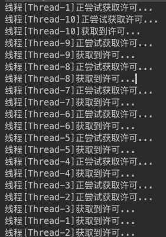


## 读写锁-ReentrantReadWriteLock

> 场景:
>
> 
>
> 对共享资源有读和写的操作，且写操作没有读操作那么频繁。在没有写操作的时候，多个线程同时读一个资源没有任何问题，所以应该允许多个线程同时读取共享资源
>
> 
>
> 但是如果一个线程想去写这些共享资源， 就不应该允许其他线程对该资源进行读和写的操作了

- java 的并发包提供了`读写锁-> ReentrantReadWriteLock`， 它表示两个锁
  - 一个是读操作相关的锁，称为 **共享锁** ,会发生死锁
    - 线程A和线程B都读取记录1，同时也都操作记录1，线程A、都占有锁，此时更新数据需要双方都释放锁，于是两个线程互相等待
  - 一个是写操作相关的锁，称为 **排他锁** ,会发生死锁
    - 线程A操作记录1，将记录1锁住，线程B操作记录2，将记录2锁住。此时线程A还想操作记录2，线程B还想操作记录1，这就导致线程A等待B释放记录2的锁，线B等待A释放记录1的锁,即死锁 
- 读写锁ReentrantReadWriteLock 内部维护了两个锁，一个用于读操作，一个用于写操作
  - 所有 ReadWriteLock实现都必须保证 写锁操作的内存同步效果也要保持与相关读锁的联系。即成功获取读锁的线程会看到写入锁之前版本所做的所有更新
- <mark>线程进入读锁的前提条件</mark>

  - 没有其他线程的写锁
  - 没有写请求, 或者有写请求，但调用线程和持有锁的线程是同一个(可重入锁)
- <mark>线程进入写锁的前提条件</mark>

  - 没有其他线程的读锁
  - 没有其他线程的写锁
- <mark>读写锁的重要特性</mark>

  - `公平选择性`: 支持非公平(默认)和公平的锁获取方式，吞吐量还是非公平优于公平
  - `重进入`: 读锁和写锁都支持线程重进入
    - **读写锁可以按照ReentrantLock的方式重新获取读取锁、写入锁,但是只有当写入线程持有的写入锁被释放后，才允许读线程获取读取锁**
    - **写线程既可以获取写入锁，也可以获取读取锁，但是读线程只能获取读取锁**
  - `锁降级`: 遵循获取写锁、获取读锁再释放写锁的次序，写锁能够降级成为读锁。
    - **允许写入锁以重入的方式降级为读取锁，其实现方式是：先获取写入锁，然后获取读取锁，最后释放写入锁。但是，从读取锁升级到写入锁是`不可能`的**
- 读写锁的缺点
  - 容易造成锁饥饿，一直读没有写操作
  - 读操作的时候，无法进行写操作。只有读完成之后才可以进行写操作。在写操作中是可以读的

:::caution 注意

- 在线程持有读锁的情况下，该线程不能取得写锁(因为获取写锁的时候，如果发现当前的读锁被占用，就马上获取失败，不管读锁是不是被当前线程持有),<font color="red">因为 当线程获取读锁的时候，可能有其他线程同时也在持有读锁，因此不能把 获取读锁的线程“升级”为写锁</font>  

- 在线程持有写锁的情况下，该线程可以继续获取读锁(获取读锁时如果发现写锁被占用，只有写锁没有被当前线程占用的情况才会获取失败),<font color="red">因为 对于获得写锁的线程，它一定独占了读写锁，因此可以继续让它获取读锁，当它同时获取了写锁和读锁后，还可以先释 放写锁继续持有读锁，这样一个写锁就“降级”为了读锁</font>

:::


### 代码示例

> 需求： 使用ReentrantReadWriteLock 对一个 HashMap 进行读和写操作


```java
public class ReentrantReadWriteLockDemo {
    // 保证内存可见性
    private static volatile HashMap<String,Object> cache = new HashMap<>();

    // 创建读写锁对象
    private static final ReentrantReadWriteLock READ_WRITE_LOCK = new ReentrantReadWriteLock(true);

    /**
     * 写数据
     */
    public void setItem(String key,Object value) {
        // 获取写锁对象
        READ_WRITE_LOCK.writeLock().lock();
        try {
            System.out.println("开始对"+key+"进行写操作....");
            cache.put(key, value);
            System.out.println(key+"写入成功....");
        }catch(Exception ex) {
            ex.printStackTrace();
        }
        finally {
            READ_WRITE_LOCK.writeLock().unlock();
        }
    }

    /**
     * 读数据
     */
    public Object getItem(String key) {
        // 获取读锁对象
        READ_WRITE_LOCK.readLock().lock();
        Object obj = null;
        try {
            System.out.println("开始获取"+key+"对应的缓存数据....");
            obj = cache.get(key);
            System.out.println(key+"缓存结果获取成功....");
        }catch(Exception ex) {
            ex.printStackTrace();
        }
        finally {
            READ_WRITE_LOCK.readLock().unlock();
        }
        return obj;
    }

    public static void main(String[] args) throws InterruptedException {
        ReentrantReadWriteLockDemo writeLockDemo = new ReentrantReadWriteLockDemo();
        for (int i = 1; i <= 3; i++) {
            new Thread(() -> {
                writeLockDemo.setItem(Thread.currentThread().getName(), new Date());
            },"Thread-" + i).start();
        }
        TimeUnit.MICROSECONDS.sleep(2000);
        for (int i = 1; i <= 3; i++) {
            new Thread(() -> {
                Object value = writeLockDemo.getItem(Thread.currentThread().getName());
                System.out.println(Thread.currentThread().getName()+"对应的缓存值为"+value);
            },"Thread-" + i).start();
        }
    }
}
```


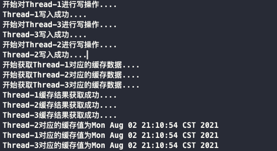


### 锁降级代码示例

*降级步骤： 获取写锁 -> 写数据 -> 获取读锁[重入的方式] -> 读取数据 -> 释放写锁 -> 释放读锁*

```java
public class ReentrantReadWriteLockDemo2 {
    private static String cache = "";
    private static final ReentrantReadWriteLock READ_WRITE_LOCK = new ReentrantReadWriteLock();
    private static final ReentrantReadWriteLock.ReadLock READ_LOCK = READ_WRITE_LOCK.readLock();
    private static final ReentrantReadWriteLock.WriteLock WRITE_LOCK = READ_WRITE_LOCK.writeLock();
    public static void main(String[] args) {
        new Thread(() -> {
            try {
                // 获取写锁
                WRITE_LOCK.lock();
                TimeUnit.SECONDS.sleep(5);
                cache = "写入数据";
                System.out.println(Thread.currentThread().getName() + "\t[写锁]写入完成");
                // 写入线程再次尝试获取读锁
                READ_LOCK.lock();
                System.out.println(Thread.currentThread().getName() + "\t[读锁]获取数据:" + cache);
                // 释放写锁
                WRITE_LOCK.unlock();
                READ_LOCK.unlock();
            } catch (InterruptedException e) {
                e.printStackTrace();
            }
        },"[写入线程]").start();
    }
}

/*
	// 阻塞 5s
	[写入线程]	[写锁]写入完成
	[写入线程]	[读锁]获取数据:写入数据
*/
```


### 锁升级测试？

可以看到，在获取了读锁之后，是无法以重入的方式获取到写锁，**除非在获取写锁之前释放掉读锁**

```java
public class ReentrantReadWriteLockDemo3 {
    private static String cache = "初始值1";
    private static final ReentrantReadWriteLock READ_WRITE_LOCK = new ReentrantReadWriteLock();
    private static final ReentrantReadWriteLock.ReadLock READ_LOCK = READ_WRITE_LOCK.readLock();
    private static final ReentrantReadWriteLock.WriteLock WRITE_LOCK = READ_WRITE_LOCK.writeLock();
    public static void main(String[] args) {
        new Thread(() -> {
            try {
                // 获取读锁
                READ_LOCK.lock();
                System.out.println(Thread.currentThread().getName() + "\t[读锁]获取数据:" + cache);
                // 获取写锁
                System.out.println(Thread.currentThread().getName() + "尝试获取写锁...");
                WRITE_LOCK.lock();
                System.out.println(Thread.currentThread().getName() + "写锁获取成功...");
                TimeUnit.SECONDS.sleep(5);
                cache = "初始值2";
                System.out.println(Thread.currentThread().getName() + "\t[写锁]写入完成");
            		// 释放读锁
                READ_LOCK.unlock();
                // 释放写锁
                WRITE_LOCK.unlock();
            } catch (InterruptedException e) {
                e.printStackTrace();
            }
        },"[读取线程]").start();
    }
}
```

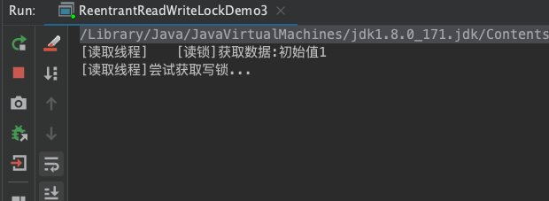


## 阻塞队列(BlockingQueue)

> BlockingQueue 很好的解决了多线程中，如何高效安全 “传输”数据的问题。
>
> 
>
> <font color="red">工作线程可以周期的向阻塞队列中添加数据，其他线程从队列中消费数据(类似于消息队列)</font>  

### BlockingQueue 概述

- BlockingQueue是一个队列, 通过一个共享的队列，可以使得数据 由队列的一端输入，从另外一端输出，有以下的几个特点:
  - **当队列是空的，尝试从队列中获取元素的操作会被阻塞 -> 直到其他的线程向空的队列中插入元素**
  - **当队列是满的，尝试向队列中添加元素的操作会被阻塞 -> 直到其他的线程从队列中移除一个**
  - **队列不接受 NULL 元素，当试图插入一个NULL元素时，会报 空指针异常**
  - **队列可以是限定容量的，通过 remainingCapacity()方法可以返回队列还可以添加多少元素，没有指定队列的大小，默认是`Integer.MAX_VALUE`**

- BlockingQueue 方法以四种形式出现，对于不能立即满足但可能在将来某一时刻可以满足的操作，这四种形式的处理方式不同
  - 抛出一个异常
  - 返回一个特殊值（`null` 或 `false`，具体取决于操作）
  - 在操作可以成功前，无限期地阻塞当前线程
  - 在放弃前，只在给定的最大时间限制内阻塞

|  方法/处理方式    | 抛出异常    | 返回特殊值     | 阻塞     | 超时退出                   |
| ---- | ----------- | ---------- | -------- | ---------------------- |
| 插入 | `add(e)`    | `offer(e)` | `put(e)` | `offer(e, time, unit)` |
| 移除 | `remove()`  | `poll()`   | `take()` | `poll(time,unit)`      |
| 检查 | `element()` | `peek()`   | 不可用   | 不可用                 |


- BlockingQueue 常见的方法:
  - <mark>添加</mark>
  
    - `add(E e)`
      - 将元素插入到队列中(如果能立即插入，且不超过容量限制)
        - 插入成功返回true
        - 如果队列空间不足，则抛出 IllegalStateException
      - **内部调用offer(E) 方法，返回失败的话add方法抛出异常**
    - `offer(E e)`
      -  将元素插入到队列中(如果能立即插入，且不超过容量限制)
         - 插入成功返回true
         - 如果当前没有可用的空间，则返回 false
    - `offer(E e,long timeout, TimeUnit unit)`
      - 将指定元素插入此队列中，如果队列空间不足，会在到达指定的等待时间前，等待可用的空间
    - `put(E e)`
      -  指定元素插入此队列中，如果队列空间不足，会一直等待直到可用的空间
  - <mark>删除</mark>

    - `remove()`
      -  从此队列中移除第一个元素，如果队列中没有元素，则抛出异常
    - `remove(Object obj)`
      -  从此队列中移除指定元素
         -  删除成功返回true, 如果元素不存在，返回false
    - `take()`
      -  获取并移除此队列的头部，如果队列中没有元素, 会一直等待直到元素变得可用
    - `poll(long timeout, TimeUnit unit)`
      - 获取并移除此队列的头部，如果队列中没有元素，会在指定的等待时间前，等待可用的元素
      - 超过指定的时间取不到则返回 NULL
  - <mark>其他</mark>

    - `contains(Object obj)`
      - 判断队列中是否包含指定的元素
      - 从队列中移除元素，并且将这些元素添加到给定的Collection中
      - `maxElements` : 指定需要移除的元素数量。如果不指定，默认移除所有的元素

### 常见的 BlockingQueue的实现

jdk7 提供了7个阻塞队列:

- `ArrayBlockingQueue`  -> 由数据结构组成的有边界阻塞队列
- `LinkedBlockingQueue` -> 由链表结构组成的有边界阻塞队列
- `PriorityBlockingQueue` -> 支持优先级排序的无边界阻塞队列
- `DelayQueue` -> 使用优先级队列实现的无边界阻塞队列
- `SynchronousQueue` -> 不存储元素的阻塞队列
- `LinkedTransferQueue` -> 由链表结构组成的无边界阻塞队列
- `LinkedBlockingDeque` -> 由链表结构组成的双向阻塞队列

#### ArrayBlockingQueue（有界）

- 基于数据的阻塞队列实现,此队列按 FIFO（先进先出）原则对元素进行排序
  - 队列的头部 是在队列中存在时间最长的元素
  - 队列的尾部 是在队列中存在时间最短的元素。新元素插入到队列的尾部，队列获取操作则是从队列头部开始获得元素
- ArrayBlockingQueue 内部，维护了一个定长数组，以便缓存队列中的数据对象。 并且内部还保存着两个整形变量，<font color="red">分别标识着队列的头部和尾部在数组中的位置</font> 
- <font color="red">在创建 ArrayBlockingQueue 时，还可以控制对象的内部锁是否采用公平锁，默认采用非公平锁</font>
- <font color="red">ArrayBlockingQueue 在生产者放入数据和消费者获取数据，都是共用同一个 锁对象</font>

##### 源码实现

```java
	public ArrayBlockingQueue(int capacity, boolean fair) {
        if (capacity <= 0)
            throw new IllegalArgumentException();
    	  // 初始化定长数组
        this.items = new Object[capacity];
    		// 初始化锁
        lock = new ReentrantLock(fair);
    		// 当队列不是空的唤醒条件
        notEmpty = lock.newCondition();
    		// 队列不是满的唤醒条件
        notFull =  lock.newCondition();
    }

    /** 内部维护的定长数组 */
    final Object[] items;

    /** 下一个用于移除的元素的索引位置 */
    int takeIndex;

    /** 下一个用于添加的元素的索引位置 */
    int putIndex;

    /** 队列中元素的数量 */
    int count;

    /** 全局锁，所有的操作用的都是这个锁 */
    final ReentrantLock lock;

    /** 用于唤醒等待删除 */
    private final Condition notEmpty;

    /** 用于唤醒等待添加的条件 */
    private final Condition notFull;
  
    /**
     * 检查队列的元素是否是空的
     */
    private static void checkNotNull(Object v) {
        if (v == null)
            throw new NullPointerException();
    }
    /**
     * 向队列中添加元素，并且通知那些等待从元素删除、获取数据的线程
     */
    private void enqueue(E x) {
        final Object[] items = this.items;
        items[putIndex] = x;
        if (++putIndex == items.length)
            putIndex = 0;
        count++;
        notEmpty.signal();
    }

    /**
     * 从队列中移除元素，并且通知那些需要向队列总添加数据的线程
     */
    private E dequeue() {
        final Object[] items = this.items;
        @SuppressWarnings("unchecked")
        E x = (E) items[takeIndex];
        items[takeIndex] = null;
        if (++takeIndex == items.length)
            takeIndex = 0;
        count--;
        if (itrs != null)
            itrs.elementDequeued();
        notFull.signal();
        return x;
    }

```


##### 代码演示

```java
public class BlockingQueueDemo {
    // 设置队列大小为3
    private static final int capital = 3;
    private static BlockingQueue<String> blockingQueue = new ArrayBlockingQueue<>(capital);
    public static void main(String[] args) throws InterruptedException {
        five();
    }

    /**
     * 测试add()方法:当插入数据超过指定的队列大小,就抛出异常
     *  add() 方法内部还是根据offer(E e)方法来进行的 -> offer返回false的话,add()抛出异常
     *   public boolean add(E e) {
     *         if (offer(e))
     *             return true;
     *         else
     *             throw new IllegalStateException("Queue full");
     *     }
     */
    private static void one() {
        System.out.println(blockingQueue.add("java"));
        System.out.println(blockingQueue.add("python"));
        System.out.println(blockingQueue.add("javaScript"));
        System.out.println(blockingQueue.add("go"));  // 输出: Exception in thread "main" java.lang.IllegalStateException: Queue full
    }

    /**
     * 测试 remove 和 element方法
     *  element()方法内部调用的是peek方法,peek返回null的话就抛出异常
     *      public E element() {
     *         E x = peek();
     *         if (x != null)
     *             return x;
     *         else
     *             throw new NoSuchElementException();
     *     }
     *  remove 实际上调用的就是数组的remove方法
     *      remove(): 在队列中没有元素的时候,抛出异常
     *      remove(Object): 在队列中没有元素的时候或者找不到指定的元素时,返回false
     */
    private static void two() {
        System.out.println(blockingQueue.add("java"));
        System.out.println(blockingQueue.add("javaScript"));
        System.out.println(blockingQueue.element());  // 输出: java
        System.out.println(blockingQueue.remove("java"));   // true
        System.out.println(blockingQueue.remove("js"));     // false
        System.out.println(blockingQueue.element());            // 输出: javaScript
        System.out.println(blockingQueue.remove("javaScript"));     // true
        System.out.println(blockingQueue.remove());     // Exception in thread "main" java.util.NoSuchElementException
    }

    /**
     * 测试offer,poll方法
     *  offer(obj): 向队列中插入元素,插入成功返回true,否则返回false
     *  poll(): 获取并删除指定的元素,如果队列是空的,则返回null
     */
    public static void three() {
        System.out.println(blockingQueue.offer("java"));        //true
        System.out.println(blockingQueue.offer("python"));      //true
        System.out.println(blockingQueue.offer("javaScript"));  //true
        System.out.println(blockingQueue.offer("go"));          //false
        System.out.println(blockingQueue.poll());                  //java
        System.out.println(blockingQueue.poll());                  //python
        System.out.println(blockingQueue.poll());                  //javaScript
        System.out.println(blockingQueue.poll());                  //null
    }

    /**
     * 测试阻塞方法组: put / take
     *  put:  向队列中插入元素,如果插入时队列已经满了,会阻塞
     *  take: 获取并删除首部的元素,如果删除时队列中没有元素,会阻塞
     * @throws InterruptedException
     */
    public static void four() throws InterruptedException {
        blockingQueue.put("java");
        blockingQueue.put("python");
        blockingQueue.put("javaScript");
        // blockingQueue.put("go");                 //由于队列大小为3,存入第四个元素会阻塞等待
        System.out.println(blockingQueue.take());
        System.out.println(blockingQueue.take());
        System.out.println(blockingQueue.take());
        // System.out.println(blockingQueue.take());  // 由于队列大小为3,删除第四个元素会阻塞等待
    }

    /**
     * 测试 offer 超时方法
     *   offer(E e, long timeout, TimeUnit unit) : 向队列添加元素,如果队列满了,会等待一段时间后插入,失败的话返回false
     * @throws InterruptedException
     */
    public static  void five() throws InterruptedException {
        System.out.println(blockingQueue.offer("a"));
        System.out.println(blockingQueue.offer("b"));
        System.out.println(blockingQueue.offer("c"));
        System.out.println(blockingQueue.offer("a",3L, TimeUnit.SECONDS));
    }
}

```


#### LinkedBlockingQueue（无界)

- 基于链表的阻塞队列，同 ArrayListBlockingQueue 类似，其内部也维持着一个由一个链表构成的数据缓冲队列
- <font color="red">生产者端和消费者端分别采用了独立的锁来控制数据同步</font>，这也意味着在高并发的情况下生产者和消费者可以并行地操作队列中的数据，以此来提高整个队列的并发性能。

##### 源码实现

```java
public class LinkedBlockingQueue<E> extends AbstractQueue<E>
        implements BlockingQueue<E>, java.io.Serializable {
  private static final long serialVersionUID = -6903933977591709194L;

  /**
     * Linked list node class
     */
  static class Node<E> {
    E item;
    /**
         * One of:
         * - the real successor Node
         * - this Node, meaning the successor is head.next
         * - null, meaning there is no successor (this is the last node)
         */
    Node<E> next;

    Node(E x) { item = x; }
  }

  /** 指定队列的长度*/
  private final int capacity;

  /** 队列中元素的数量 */
  private final AtomicInteger count = new AtomicInteger();

  /**
     * Head of linked list.
     * Invariant: head.item == null
     */
  transient Node<E> head;

  /**
     * Tail of linked list.
     * Invariant: last.next == null
     */
  private transient Node<E> last;

  /** 从队列移除数据的锁 */
  private final ReentrantLock takeLock = new ReentrantLock();

  /** 移除数据锁对应的条件对象 */
  private final Condition notEmpty = takeLock.newCondition();

  /** 向队列添加数据的锁*/
  private final ReentrantLock putLock = new ReentrantLock();

  /** 向队列添加数据的锁对应的条件对象 */
  private final Condition notFull = putLock.newCondition();
  
  public void put(E e) throws InterruptedException {
    if (e == null) throw new NullPointerException();
    int c = -1;
    Node<E> node = new Node<E>(e);
    // 向队列中添加数据，使用 putLock
    final ReentrantLock putLock = this.putLock;
    final AtomicInteger count = this.count;
    // 获取可中断锁
    putLock.lockInterruptibly();
    try {
      while (count.get() == capacity) {
        // 队列满了，让添加数据锁对应的条件队列等待
        notFull.await();
      }
      enqueue(node);
      // 队列元素数量加1
      c = count.getAndIncrement();
      if (c + 1 < capacity)
        notFull.signal();
    } finally {
      putLock.unlock();
    }
    if (c == 0)
      signalNotEmpty();
  }
   public E take() throws InterruptedException {
          E x;
          int c = -1;
          final AtomicInteger count = this.count;
     			// 删除数据的锁
          final ReentrantLock takeLock = this.takeLock;
          takeLock.lockInterruptibly();
          try {
              while (count.get() == 0) {
                  notEmpty.await();
              }
              x = dequeue();
              c = count.getAndDecrement();
              if (c > 1)
                  notEmpty.signal();
          } finally {
              takeLock.unlock();
          }
          if (c == capacity)
              signalNotFull();
          return x;
      }
}
```


#### PriorityBlockingQueue（无界）

- 基于优先级的阻塞队列,默认情况下元素采用自然排序升序排列 -> **不保证具有同等优先级的元素的顺序**
  - 可以自定义类实现 `Comparable接口的 compareTo()方法`
  - 还可以在初始化 PriorityBlockingQueue时，指定构造器参数 `Comparator`，
- <font color="red">注意：PriorityBlockingQueue 是无界的，不会阻塞数据生产者，而只会在没有可消费的数据时，阻塞数据的消费者</font>

  - **生产者生产数据的速度绝对不能快于消费者消费数据的速度**，否则时间一长，会最终耗尽所有的可用堆内存空间
- <font color="red">在实现 PriorityBlockingQueue 时，内部控制线程同步的锁采用的是公平锁</font>

#### DelayQueue（无界）

- 支持延迟获取元素的阻塞队列，使用 PriorityQueue实现
- 队列中的元素必须实现 <code>Delay</code> 接口，创建元素时指定需要多久才能从队列中获取当前元素, 只有当其指定的延迟时间到了，才能够从队列中获取到该元素

- DelayQueue 是一个无界队列，因此往队列中插入数据的 操作(生产者)永远不会被阻塞，而只有获取数据的操作(消费者)才会被阻塞。
- DelayQueue常见的使用场景:
  - `缓存系统的设计`
    - 用DelayQueue保存缓存元素的有效期，使用线程循环查询DelayQueue，如果从DelayQueue中获取到元素，表示缓存有效期到了
  - `定时任务调度`
    - 使用DelayQueue保存当天需要执行的任务，一旦从DelayQueue中获取到任务就执行，比如TimerQueue就是基于DelayQueue的

#### SynchronousQueue

- <font color="red">是一个不存储元素的阻塞队列，每一个put操作必须等待一个take操作，否则不能添加元素</font> -> 吞吐量高于 ArrayBlockingQueue 和 LinkedBlockingQueue
- **公平与非公平模式的区别**
  - 使用公平锁,并配合一个 FIFO 队列来阻塞多余的生产者和消费者，从而体系整体的公平策略
  - 使用非公平锁，同时配合一个 FILO 队列来管理多余的生产者和消费者

- 由于队列本身不存储任何的元素，非常适合传递性场景

#### LinkedTransferQueue (无界)

- 由链表结构组成的无界阻塞 TransferQueue 队列。相对于其他阻塞队列，LinkedTransferQueue 多了 tryTransfer 和 transfer 方法。
- LinkedTransferQueue 采用一种 <font color="red">预占模式</font>
  - 消费者线程取元素时，如果队列不为空，则直接取走数据
  - 队列为空，那就生成一个节点(节点元素为NULL)入队列，<font color="red">然后消费者线程被等待在这个节点上</font>，后面生产者线程入队时发现有一个元素为 null 的节点，生产者线程就不入队了，直接就将元素填充到该节点，并唤醒该节点等待的线程，被唤醒的消费者线程取走元素，从调用的方法返回

#### LinkedBlockingDeque

- 由链表结构组成的双向阻塞队列，即可以从队列的两端插入和移除元素
- 在初始化 LinkedBlockingDeque 时，可以设置容量方式其过度膨胀，<font color="red">另外双端阻塞队列可以使用在 Fork/Join 的模式中</font>
- 对于一些指定的操作，在插入或者获取队列元素时如果队列状态不允许该操作可能会阻塞住该线程直到队列状态变更为允许操作，这里的阻塞一般有两种情况:
  - 插入元素时: 如果当前队列已满将会进入阻塞状态，一直等到队列有空的位置时 再讲该元素插入
    - 该操作可以通过设置超时参数，超时后返回 false 表示操作失败
    - 也可以不设置超时参数一直阻塞，中断后抛出 InterruptedException 异常
  - 读取元素时: 如果当前队列为空会阻塞住直到队列不为空然后返回元素，同样可以设置超时参数


## 线程池(ThreadPool)

### 线程池概述

> 线程池是一种线程使用模式。线程过多会导致线程上下文切换过于频繁，进而影响缓存局部性和整体性能。而线程池维护多个线程，等待管理者分配可并发执行的任务。这避免了在处理短时间任务时创建与销毁线程的代价。
>
> <font color="red">线程池不仅能够保证内核的充分利用，还能防止过分调度</font>

- <mark>线程池的优点</mark> : 只需要控制运行的线程数量，处理过程中将任务放入队列，然后在线程创建后启动这些任务，如果线程数量超过了最大数量，超出数量的线程排队等候，等其他线程执行完毕，再从队列中取出任务来执行。
- <mark>线程池的主要特点</mark> 

  - `降低资源消耗`: 通过重复利用已创建的线程降低线程创建和销毁造成的销耗。
  - `提高响应速度`: 当任务到达时，任务可以不需要等待线程创建就能立即执行。
  - `提高线程的可管理性`: 线程是稀缺资源，如果无限制的创建，不仅会销耗系统资源，还会降低系统的稳定性，使用线程池可以进行统一的分配，调优和监控。

-  java中的线程池是通过 Executor 框架实现的，该框架中用到了 `Executor，Executors，ExecutorService，ThreadPoolExecutor` 这几个类
- <mark>通过Executors创建线程的几种常见方式</mark> 

  - ` Executors.newFixedThreadPool(int nThreads)` 
    - 采用 LinkedBlockingQueue 无界队列来存储任务
  - ` ExecutorService.newSingleThreadExecutor()` 
    - 一池1个线程
    - 采用 LinkedBlockingQueue 无界队列来存储任务
  - `Executors.newCachedThreadPool()` 
    - 线程池根据需求创建线程，可以扩容，采用 SynchronousQueue存储任务
    - 创建一个可缓存线程池，如果线程池长度超过处理需要，可灵活回收空闲线程，若无可回收，则新建线程
      - 线程池中数量没有固定，可达到最大值(Interger. MAX_VALUE)
      - 线程池中的线程可进行缓存重复利用和回收(回收默认时间为 1 分钟)
      - 当线程池中，没有可用线程，会重新创建一个线程
    - 适用于创建一个可无限扩大的线程池，服务器负载压力较轻，执行时间较短，任务多的场景

### 代码演示

#### newFixedThreadPool

```java
/**
  * 测试 newFixedThreadPool
  */
public static void one() {
  // 创建固定5个线程的线程池
  ExecutorService fixedThreadPool = Executors.newFixedThreadPool(5);
  try {
    for (int i = 1; i <= 10; i++) {
      fixedThreadPool.execute(() -> {
        System.out.println(Thread.currentThread().getName() + "\t正在处理");
      });
    }
  }finally {
    // 关闭
    fixedThreadPool.shutdown();
  }
}

/*
	pool-1-thread-1	正在处理
  pool-1-thread-5	正在处理
  pool-1-thread-1	正在处理
  pool-1-thread-1	正在处理
  pool-1-thread-4	正在处理
  pool-1-thread-3	正在处理
  pool-1-thread-2	正在处理
  pool-1-thread-4	正在处理
  pool-1-thread-1	正在处理
  pool-1-thread-5	正在处理
*/
```


#### newSingleThreadExecutor

```java
 /**
 * Executors.newSingleThreadExecutor(); -> 创建只有一个线程的线程池
 * 只会有一个线程来处理任务
 */
public static void two() {
  ExecutorService singleThreadExecutor = Executors.newSingleThreadExecutor();
  try {
    for (int i = 1; i <= 10; i++) {
      singleThreadExecutor.execute(() -> {
        System.out.println(Thread.currentThread().getName() + "\t正在处理");
      });
    }
  }finally {
    // 关闭
    singleThreadExecutor.shutdown();
  }
}

/*
	pool-1-thread-1	正在处理
  pool-1-thread-1	正在处理
  pool-1-thread-1	正在处理
  pool-1-thread-1	正在处理
  pool-1-thread-1	正在处理
  pool-1-thread-1	正在处理
  pool-1-thread-1	正在处理
  pool-1-thread-1	正在处理
  pool-1-thread-1	正在处理
  pool-1-thread-1	正在处理
*/
```


#### newCachedThreadPool

```java
/**
 * Executors.newCachedThreadPool(); -> 创建可扩容的线程池
 */
public static void three() {
  //
  ExecutorService cachedThreadPool = Executors.newCachedThreadPool();
  try {
    for (int i = 1; i <= 10; i++) {
      cachedThreadPool.execute(() -> {
        System.out.println(Thread.currentThread().getName() + "\t正在处理");
      });
    }
  }finally {
    // 关闭
    cachedThreadPool.shutdown();
  }
}
/*
	pool-1-thread-1	正在处理
  pool-1-thread-5	正在处理
  pool-1-thread-4	正在处理
  pool-1-thread-6	正在处理
  pool-1-thread-3	正在处理
  pool-1-thread-2	正在处理
  pool-1-thread-7	正在处理
  pool-1-thread-8	正在处理
  pool-1-thread-5	正在处理
  pool-1-thread-8	正在处理
*/
```


### 线程池底层工作原理

:::danger 线程池底层工作原理

1. 在创建了线程池后，线程池中的线程数为零
2. 当调用`execute()`方法添加一个请求任务时，线程池会做出如下判断
   - 如果正在运行的线程数量小于 `corePoolSize`，那么马上创建线程运行这个任务
   - 如果正在运行的线程数量大于或等于 `corePoolSize`，那么将这个任务放入队列
   - 如果这个时候队列满了且正在运行的线程数量还小于 `maximumPoolSize`，那么还是要创建非核心线程立刻运行这个任务;
   - 如果队列满了且正在运行的线程数量大于或等于 `maximumPoolSize`，那么线程 池会启动饱和拒绝策略来执行
3. 当一个线程完成任务时，它会从队列中取下一个任务来执行
4. 当一个线程无事可做超过一定的时间(`keepAliveTime`)时，线程会判断:
   - 如果当前运行的线程数大于 `corePoolSize`，那么这个线程就被停掉。
   - 所有线程池的所有任务完成后，它最终会收缩到 `corePoolSize` 的大小

:::


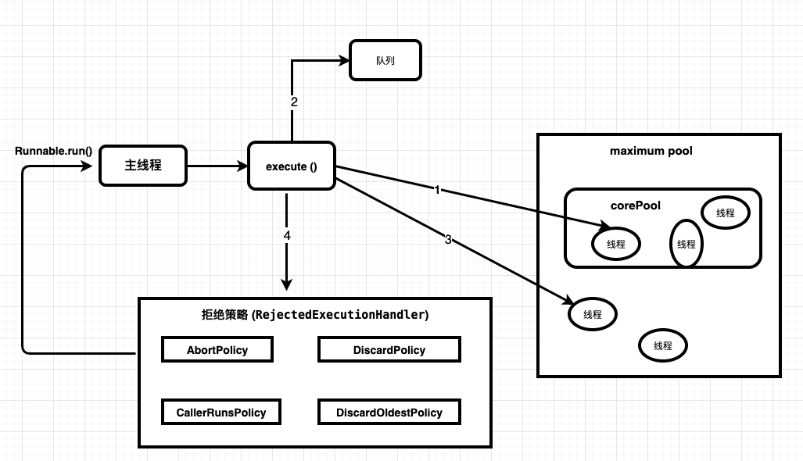

### 线程池参数说明

- `corePoolSize`
  - 线程池的核心线程数
- `maximumPoolSize`
  - 能容纳的最大线程数
- `keepAliveTime` 
  - 空闲线程存活时间
- `unit`
  - 存活的时间单位
- `workQueue` 
  - 存放提交但未执行任务的队列
- `threadFactory` 
  - 创建线程的工厂类
- `handler` 
  - 等待队列满后的拒绝策略

:::danger

- 线程池中，有三个重要的参数决定影响了拒绝策略 -> `当提交的任务数 > workQueue.size() + maximumPoolSize` ，就会触发线程池的拒绝策略
  - corePoolSize: 核心线程数，也即最小的线程数
  - workQueue:阻塞队列、工作队列
  - maximumPoolSize: 最大线程数

:::

#### 拒绝策略 :star2:

- `CallerRunsPolicy`
  - “调用者运行”的一种调节机制
  - 该策略不会丢弃任务，也不会抛出异常，而是将某些任务回退到调用者，从而降低新任务的流量
- `AbortPolicy(默认)`
  - 丢弃任务，并抛出拒绝执行 RejectedExecutionException 异常信息
    - 线程池默认的拒绝策略
  - 必须处理好抛出的异常，否则会打断当前的执行流程，影响后续的任务执行
- `DiscardPolicy`
  - 直接丢弃，其他啥都没有
  - 如果允许任务失败，这个是最好的策略
- `DiscardOldestPolicy`
  - 丢弃阻塞队列中最老的一个任务，并将新任务加入到工作队列中，尝试再次提交当前任务

### 自定义线程池

实际开发中一般不用 Executors来创建线程池,阿里开发手册中中强制规定:


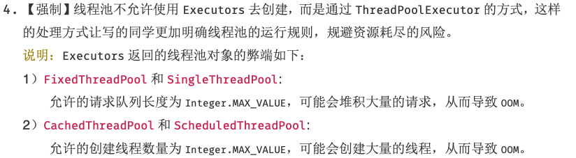


#### 代码实现

```java
public class ThreadPoolDemo2 {
    // 核心线程数,这里使用处理器个数
    public static final int corePoolSize = Runtime.getRuntime().availableProcessors();  // 8
    // 最大线程数
    public static final int maximumPoolSize = corePoolSize * 3;
    // 存活时间
    public static final long keepAliveTime = 2L;
    // 默认的线程工厂
    public static final ThreadFactory factory = Executors.defaultThreadFactory();
    // 拒绝策略
    public static final RejectedExecutionHandler handler = new ThreadPoolExecutor.AbortPolicy();
    public static void main(String[] args) {
        // 创建一个自定义的线程池
        ThreadPoolExecutor poolExecutor = new ThreadPoolExecutor(corePoolSize, maximumPoolSize, keepAliveTime, TimeUnit.SECONDS,
                                                            new LinkedBlockingDeque<>(5), factory,  handler);
        try {
            for (int i = 1; i <= 30; i++) {
                poolExecutor.execute(() -> {
                    System.out.println(Thread.currentThread().getName() + "\t正在处理");
                });
            }
        }finally {
            // 关闭
            poolExecutor.shutdown();
        }
    }
}
```


## Fork/Join 分支合并框架

- <mark>Fork/Join 它可以将一个大的任务拆分成多个子任务进行并行处理，最后将子任务结果合并成最后的计算结果，并进行输出</mark> 。Fork/Join 框架要完成两件事情

  - `Fork`: 把一个复杂任务进行分拆，大事化小: **任务分割**
    - 首先Fork/Join框架需要把大的任务分割成足够小的子任务，如果子任务比较大的话还要对子任务进行继续分割
  - `Join`: 把分拆任务的结果进行合并: **执行任务并合并结果**
    - 分割的子任务分别放到双端队列里，然后几个启动线程 分别从双端队列里获取任务执行
    - 子任务执行完的结果都放在另外一个队列里， 启动一个线程从队列里取数据，然后合并这些数据

- 在 java 的 Fork/Join 框架中，使用两个类完成上述操作

  - `ForkJoinTask`

    - 我们要使用 Fork/Join 框架，首先需要创建一个 ForkJoin 任务。 该类提供了在任务中执行 fork 和 join 的机制

      1. `RecursiveAction` 

         - 用于没有返回结果的任务

      2. `RecursiveTask`

         - 用于有返回结果的任务

         - 继承后可以实现递归(自己调自己)调用的任务

  - `ForkJoinPool`

    - ForkJoinTask 需要通过 ForkJoinPool 来执行


:::caution fork/join 框架的实现原理

ForkJoinPool 由 ForkJoinTask 数组和 ForkJoinWorkerThread 数组组成， ForkJoinTask 数组负责将存放以及将程序提交给 ForkJoinPool，而 ForkJoinWorkerThread 负责执行这些任务。

:::

### Fork、Join方法实现原理

#### Fork方法

1. 当调用 ForkJoinTask的fork()方法时，会把任务放在 `ForkJoinPool.WorkQueue [工作窃取队列]` 中，异步地执行这个任务，然后立即返回结果

   ```java
   public final ForkJoinTask<V> fork() {
     Thread t;
     if ((t = Thread.currentThread()) instanceof ForkJoinWorkerThread)
       ((ForkJoinWorkerThread)t).workQueue.push(this);
     else
       ForkJoinPool.common.externalPush(this);
     return this;
   }
   ```


2. push() 方法把当前任务存放在 ForkJoinTask 数组队列里。然后再调用 ForkJoinPool 的 signalWork()方法唤醒或创建一个工作线程来执行任务

   ```java
   final void push(ForkJoinTask<?> task) {
     ForkJoinTask<?>[] a; 
     ForkJoinPool p;
     int b = base, s = top, n;
     if ((a = array) != null) {   
       int m = a.length - 1;   
       U.putOrderedObject(a, ((m & s) << ASHIFT) + ABASE, task);
       U.putOrderedInt(this, QTOP, s + 1);
       if ((n = s - b) <= 1) {
         if ((p = pool) != null)
           p.signalWork(p.workQueues, this); // 通知唤醒工作线程来执行任务
       }
       else if (n >= m)
         growArray();
     }
   }
   ```

   

#### Join方法

- **Join 方法的主要作用是阻塞当前线程并等待获取结果**
- 首先调用 doJoin() 方法，通过 doJoin()方法得到当前任务的状态来判断返回什么结果，任务状态有 4 种:
  - `normal ->已完成`
    - 如果任务状态是已完成，则直接返回任务结果
  - `cancelled -> 被取消`
    - 如果任务状态是被取消，则直接抛出 CancellationException
  - `signal -> 信号`
  - `exceptional -> 出现异常`
    - 如果任务状态是抛出异常，则直接抛出对应的异常
- <mark>doJoin()方法流程如下:</mark> 

  - 首先通过查看任务的状态，看任务是否已经执行完成，如果执行完成，则直接返回任务状态
  - 如果没有执行完，则从任务数组里取出任务并执行
  - 如果任务顺利执行完成，则设置任务状态为normal，如果出现异常，则记录异常，并将任务状态设置为 exceptional

```java
// java.util.concurrent.ForkJoinTask#join
public final V join() {
  int s;
  if ((s = doJoin() & DONE_MASK) != NORMAL)
    reportException(s);
  return getRawResult();
}


// java.util.concurrent.ForkJoinTask#doJoin
private int doJoin() {
  int s; 
  Thread t; 
  ForkJoinWorkerThread wt; 
  ForkJoinPool.WorkQueue w;
  return (s = status) < 0 ? s :
  	((t = Thread.currentThread()) instanceof ForkJoinWorkerThread) ?
    (w = (wt = (ForkJoinWorkerThread)t).workQueue).
    tryUnpush(this) && (s = doExec()) < 0 ? s :
  wt.pool.awaitJoin(w, this, 0L) :
  externalAwaitDone();
}
// java.util.concurrent.ForkJoinTask#doExec
final int doExec() {
  int s; boolean completed;
  if ((s = status) >= 0) {
    try {
      completed = exec();
    } catch (Throwable rex) {
      return setExceptionalCompletion(rex);
    }
    if (completed)
      s = setCompletion(NORMAL);
  }
  return s;
}
```


#### Fork/Join 框架的异常处理

ForkJoinTask 在执行的时候可能会抛出异常，但是没办法在主线程里直接捕获异常，

- **ForkJoinTask 提供了 `isCompletedAbnormally()`方法来检查任务是否已经抛出异常或已经被取消了，并且可以通过 ForkJoinTask 的 `getException()` 方法获取异常**
- getException 方法返回 Throwable 对象
  - 如果任务被取消了则返回 CancellationException
  - 如果任务没有完成或者没有抛出异常则返回 null

#### 代码实现

> 通过fork/join 计算1到1000 的和

1. 自定义的任务对象

```java
public class MyTask extends RecursiveTask<Integer> {

    private static final int VALUE = 10;  // 拆分差值不超过10
    private int begin;              // 拆分的开始值
    private int end;                // 拆分的结束值
    private int sum;                // 返回结果

    // 创建有参数的构造函数
    public MyTask(int beginValue, int endValue) {
        this.begin = beginValue;
        this.end = endValue;
    }

    /**
     * 自定义任务拆分与合并的逻辑 -> 每次fork会循环的调用这个方法
     */
    @Override
    protected Integer compute() {
        if (end - begin <= VALUE) {
            // 拆分的开始结束值小于10,不需要进行拆分操作,直接累加
            for (int i = begin; i <= end; i++) {
                sum +=i;
            }
        } else {
            // 拆分的开始结束值大于10,进行拆分操作
            int middle = (begin + end) / 2;
            // 对左右边进行拆分
            MyTask taskLeft = new MyTask(begin, middle);
            MyTask taskRight = new MyTask(middle + 1, end);
            // 将本次拆分的任务提交到工作队列中并执行 -> 工作线程会继续执行队列中元素(RecursiveTask对象)的 compute方法
            taskLeft.fork();
            taskRight.fork();
            // 同步阻塞获取结果
            sum = taskLeft.join() + taskRight.join();
        }
        return sum;
    }
}
```


2. 分支合并主逻辑

```java
public class ForkJoinDemo {
    /**
     * 计算 1~1000 的和,拆分时,两个差值不超过10
     * @param args
     */
    public static void main(String[] args) {
        // 定义任务
        MyTask task = new MyTask(1, 1000);
        // 定义分支合并工作池对象
        ForkJoinPool pool = new ForkJoinPool();
        // 向分之合并池中提交任务
        ForkJoinTask<Integer> forkJoinTask = pool.submit(task);
        try {
            System.out.println(forkJoinTask.get());
        } catch (Exception e) {
            e.printStackTrace();
        } finally {
            pool.shutdown();
        }
    }
}
```


## CompletableFuture 异步回调

### CompletableFuture 简介

- CompletableFuture 在 java 里面被用于异步编程，异步通常意味着非阻塞， 可以使得我们的任务单独运行在与主线程分离的其他线程中，并且通过回调可以在主线程中得到异步任务的执行状态、是否完成、是否异常等信息
- CompletableFuture 实现了 `Future`, `CompletionStage` 接口
  - 实现了 Future 接口就可以兼容现在有线程池框架
  - CompletionStage 接口才是异步编程 的接口抽象，里面定义多种异步方法

- <mark>Future 与 CompletableFuture</mark> 

  - Futrue通常用来表示一个异步任务的引用
    - 比如我们将任务提交到线程池里面，然后我们会得到一个 Futrue，在 Future 里面有 isDone() 来判断任务是否处理结束，还有 get()可以一直阻塞直到任务结束然后获取结果
    - 但整体来说Future这种方式还是同步的，因为需要客户端不断阻塞等待或者不断轮询才能知道任务是否完成
  - **Future的缺点**
    - `不支持手动完成`
      - 提交了一个任务，但是执行太慢了，通过其他路径已经获取到了任务结果,但是没法把这个任务结果通知到正在执行的线程，所以必须主动取消或者一直等待它执行完成
    - `不支持进一步的非阻塞调用`
      - 通过 Future 的 get() 会一直阻塞到任务完成，但是想在获取任务之后执行额外的任务，因为 Future 不支持回调函数，所以无法实现这个功能
    - `不支持链式调用`
      - 对于 Future 的执行结果，我们想继续传到下一个 Future 处理使用，从而形成一个链式的 pipline 调用，这在 Future 中是没法实现的
    - `不支持多个 Future 合并`
      - 比如我们有10个Future 并行执行，我们想在所有的 Future 运行完毕之后， 执行某些函数，是没法通过Future实现的
    - `不支持异常处理`
      - Future 的 API 没有任何的异常处理的 api，所以在异步运行时，如果出了问题是不好定位的
- CompletableFuture 常见的方法
  - 异步方法: `supplyAsync、runAsync`
  - 同步方法: `thenApply、thenAccept、thenAcceptBoth、thenRun`
- <mark>CompletableFuture可以指定异步处理流程：</mark> 

  - `thenAccept()` :处理正常结果；
  - `exceptional()` :处理异常结果；
  - `thenApplyAsync()` :用于串行化另一个 CompletableFuture
  - `anyOf()` 和 `allOf()`: 用于并行化多个`CompletableFuture`
- 通过 `get()`方法获取结果，但是会阻塞当前线程。

### 代码实现

<font color="red">想要获取结果使用get()方法</font> 

```java
public class CompletableFutureDemo1 {
    public static void main(String[] args) throws ExecutionException, InterruptedException {
        asyncMethod();
    }
    // 同步调用
    public static void awaitMethod() throws ExecutionException, InterruptedException {
        CompletableFuture<Void> completableFuture = CompletableFuture.completedFuture("message").thenRun( () -> {
            // 一个 completableFuture 是一个任务
            try {
                TimeUnit.SECONDS.sleep(3);
                System.out.println(Thread.currentThread().getName() + "\tawaitMethod...");
            } catch (InterruptedException e) {
                e.printStackTrace();
            }
        });
        // 如果执行成功
        completableFuture.thenAccept((res) -> {
            System.out.println(Thread.currentThread().getName() + "\tsuccess...");
        });
        // 如果执行异常:
        completableFuture.exceptionally((ex) -> {
            ex.printStackTrace();
            return null;
        });
        System.out.println(Thread.currentThread().getName() + "\t 主线程");
    }
    // 异步调用
    public static void asyncMethod() throws ExecutionException, InterruptedException {
        // supplyAsync: 支持返回值的异步
        // runAsync:  不支持返回值
        CompletableFuture<Integer> completableFuture = CompletableFuture.supplyAsync(() -> {
            try {
                TimeUnit.SECONDS.sleep(3);
                System.out.println(Thread.currentThread().getName() + "\tasyncMethod...");
            } catch (InterruptedException e) {
                e.printStackTrace();
            }
            return 100;
        });
        completableFuture.thenAcceptAsync((result) -> {
            System.out.println(Thread.currentThread().getName() + "\t处理结果:"+result);
        });
        System.out.println(Thread.currentThread().getName() + "\t 主线程,子线程结果为:"+completableFuture.get());
    }
}

```


#### 没有返回值的异步任务

```java
public class CompletableFutureDemo2 {
    // 自定义一个线程池
    public static Executor getExecutor() {
        int corePoolSize = Runtime.getRuntime().availableProcessors();
        int maxPoolSize = corePoolSize * 2;
        long aliveTime = 0L;
        BlockingQueue queue = new LinkedBlockingQueue<>();
        ThreadFactory threadFactory = Executors.defaultThreadFactory();
        ThreadPoolExecutor executor = new ThreadPoolExecutor(corePoolSize,maxPoolSize, aliveTime, TimeUnit.SECONDS,queue, threadFactory);
        return executor;
    }
    /**
     * runAsync -> 没有返回值的异步任务
     */
    public static void main(String[] args) throws ExecutionException, InterruptedException {
        System.out.println("线程:" +Thread.currentThread().getName() + "\t开始执行");
        CompletableFuture<Void> future = CompletableFuture.runAsync(() -> {
            try {
                TimeUnit.SECONDS.sleep(3);
                System.out.println("子线程" +Thread.currentThread().getName() + "\t开始执行..");
            } catch (InterruptedException e) {
                e.printStackTrace();
            }
        }).thenAccept((res) -> {
                System.out.println("子线程" +Thread.currentThread().getName() + "\t执行结束..");
        });
        future.get();
        System.out.println("线程:" +Thread.currentThread().getName() + "\t结束");
    }
}

```


#### 有返回值的异步任务

```java
public class CompletableFutureDemo3 {
    public static void main(String[] args) throws ExecutionException, InterruptedException {
        System.out.println("线程:" +Thread.currentThread().getName() + "\t开始执行");
        CompletableFuture<String> future = CompletableFuture.supplyAsync(()-> {
            try {
                System.out.println(Thread.currentThread().getName()+"子线程开始任务");
                Thread.sleep(5000);
            } catch (InterruptedException e) {
                e.printStackTrace();
            }
            return Thread.currentThread().getName()+ "\t处理完成";
        });
        System.out.println("future处理结果为===>" +future.get());
        System.out.println("线程:" +Thread.currentThread().getName() + "\t结束");
    }
}
```


#### 线程依赖

> 当一个线程依赖另一个线程时，可以使用 thenApply 方法来把这两个线程串行化。

```java
public class CompletableFutureDemo4 {
    // 线程依赖,B线程依赖于A线程的结果
    public static void main(String[] args) throws ExecutionException, InterruptedException {
        System.out.println("线程:" +Thread.currentThread().getName() + "\t开始执行");
        CompletableFuture<Integer> future = CompletableFuture.supplyAsync(() -> {
            try {
                System.out.println(Thread.currentThread().getName()+"子线程开始任务");
                Thread.sleep(2000);
            } catch (InterruptedException e) {
                e.printStackTrace();
            }
            return 200;
        }).thenApplyAsync(res -> res * 2);
        System.out.println("线程:" +Thread.currentThread().getName() + "\t处理结束,结果为:"+future.get());
    }
}
```


#### 消费处理结果

> thenAccept 消费处理结果, 接收任务的处理结果，并消费处理，无返回结果

```java
public class CompletableFutureDemo5 {
    public static void main(String[] args) throws ExecutionException, InterruptedException {
        System.out.println("线程:" +Thread.currentThread().getName() + "\t开始执行");
        CompletableFuture.supplyAsync(() -> {
            try {
                System.out.println(Thread.currentThread().getName()+"子线程开始任务");
                Thread.sleep(2000);
            } catch (InterruptedException e) {
                e.printStackTrace();
            }
            return 200;
        }).thenAcceptAsync((res) -> {
            System.out.println(Thread.currentThread().getName()+"处理完成,处理结果为:"+res);
        }).get();
        System.out.println("线程:" +Thread.currentThread().getName() + "\t处理结束");
    }
}
```


#### 异常处理

```java
public class CompletableFutureDemo6 {
    // 异常处理
    public static void main(String[] args) throws ExecutionException, InterruptedException {
        System.out.println("线程:" +Thread.currentThread().getName() + "\t开始执行");
        CompletableFuture.supplyAsync(() -> {
            try {
                System.out.println(Thread.currentThread().getName()+"子线程开始任务");
                Thread.sleep(2000);
            } catch (InterruptedException e) {
                e.printStackTrace();
            }
            return 200 /0;
        }).exceptionally(ex -> {
            ex.printStackTrace();
            return -1;
        }).get();
        System.out.println("线程:" +Thread.currentThread().getName() + "\t处理结束");
    }
}

```

