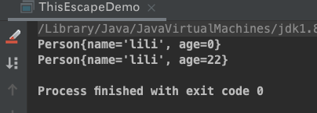
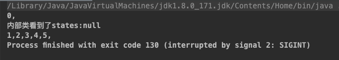
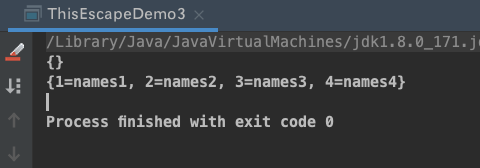
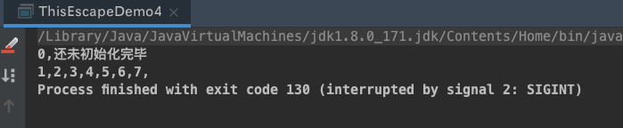

## 概述

- 对象的状态:<font color='red'>存储在状态变量(例如实例变量、静态域)中的数据</font>，当然也包括`其他依赖对象的域`
  - <font color='red'>无状态变量的对象一定是线程安全的!</font> 
- 想编写线程安全的代码，核心在于`对状态访问操作进行管理`，特别是`共享的、可变的 状态的访问`
  - `共享`: 表示状态变量可以由多个线程同时访问
  - `可变`: 表示状态变量的值在生命周期内可以发生变化
- 一个对象是否需要是线程安全的，取决于它是否被多个线程访问
  - 如果需要让对象是线程安全的，<font color='red'>需要采用同步机制来协同对对象可变状态的访问</font>
- <font color='red'>当多个线程访问某个状态变量，并且至少有一个线程对执行写入操作时，必须采用同步机制来协同这些线程对状态变量的访问</font>

  - `synchronized` -> 独占的加锁方式
  - 同步的术语还包含: `显式锁Lock、volatile变量、原子变量`
- 如果多个线程访问同一个可变的状态变量时，没有使用合适的同步，那么就会出现错误。有三种方式可以修复这个问题
  1. <mark>不在线程之间共享该状态变量</mark> 
  2. <mark>将状态变量修改为不可变的变量(final)</mark>
  3. <mark>在访问状态变量时采用同步机制</mark> 
- 需要考虑线程安全的常见情况?
  - <font color='red'>访问<strong>共享</strong>的变量或者资源，会有并发风险。</font>

    - 比如对象的属性、静态变量、共享缓存、数据库等
  
  - <font color='red'>所有依赖时序的操作，即使每一步操作都是线程安全的，还是存在并发问题</font>
  
  - <font color='red'>不同数据之间存在捆绑关系的时候</font>
  
  - <font color='red'>使用其他类时，需要考虑其他类是否是线程安全的</font>

:::danger 线程安全?

1. <font color='red'>当多个线程访问某个对象时,不管这些线程在运行环境下采用哪种调度方式，或者这些线程如何交替运行，并且也不用在主调用代码中进行额外的同步、协同，调用这个对象的行为方法都能获取到<code>正确的结果</code>，那么这个对象就是线程安全的</font>

   - `数据争用`: 数据读写由于同时写，会造成错误

   - `竞争条件`: 即使不是同时写操作错误数据，由于顺序问题依然会造成错误，比如在写入前就读取，导致读取的数据不是最新的

2. 哪些情况下回出现线程安全问题?
   - `运行结果错误`: 自增在多线程下出现错误结果
   - `活跃性问题`: 死锁、活锁、饥饿
   - 对象 `发布` 和 `初始化` 的时候的安全问题

:::

### a++自增问题（竞态条件）

a++自增实质上分为三个步骤: <font color='red'>读取a的值->将值加1->将计算结果写入a</font> , 即`读取->修改->写入`


#### 代码演示(错误数据定位)

```java
/**
 * <b>a++ 计数不准确</b>
 *
 * @author <a href="mailto:zhuyuliangm@gmail.com">zyl</a>
 */
public class ResultError implements Runnable {
    static ResultError instance = new ResultError();
    private static  int index=0;
    // 统计正确的循环次数
    private static AtomicInteger realCount = new AtomicInteger();
    // 统计错误的循环次数
    private static AtomicInteger errorCount = new AtomicInteger();
    // 定义错误的标记位数组
    private static final boolean[] mark = new boolean[Integer.MAX_VALUE/2];

    static volatile CyclicBarrier cyclicBarrier1 = new CyclicBarrier(2);

    @Override
    public void run() {
        /*   这种是错误的,因为状态变量index存在a++的问题
            while(index<10000) {
                realCount.incrementAndGet();
                index++;
            }
        */
        // 0索引是true
        mark[0] = true;
        // i不是状态变量,所以不存在线程安全问题
        for (int i = 0; i < 100_0000; i++) {
            realCount.incrementAndGet();
            // 如果屏障破裂,重置
            if (cyclicBarrier1.isBroken()) {
                cyclicBarrier1.reset();
            }
            try {
                /**
                 * 使用 循环栅栏,保证只有当两个线程同时到达之后,才会进行 ++自增操作
                 * 如果不用循环栅栏:
                 *  可能线程A经常能抢占到CPU执行权,而线程B修改index后没有提交;
                 *  当线程A执行一段时间将mark一部分数据设置为true,线程B获取到了CPU执行权,提交数据,导致index不正常
                 */
                cyclicBarrier1.await();
                index++; // 由于 ++自增操作不是原子性操作, 读取状态变量 -> 修改原子状态变量的值->更新原子变量的值
            } catch (Exception e) {
                e.printStackTrace();
            }
            /**
             * 当 index++ 多线程计算结果冲突:
             * mark也是状态变量,这里使用 synchronized,保证操作可见性 -> 同一时间只有一个线程可以进入到判断标记位以及修改标记位的处理
             * 如果不用使用synchronized :
             *  线程A(index=1) 还没有设置 mark[index] = true , 线程B(index=1)运行到 mark[index] 判断处,由于此时 mark[index]=false,
             *  所以不会将该index++的运行冲突记录下来,然后和线程A一样,走了mark[index] = true的处理.所以会导致错误次数不准确(少)
             */
            synchronized (instance) {
                // 如果 多线程计算结果不冲突，那么每次两个线程每次循环之后，index总是偶数，mark总是偶数位是true
              	// 如果多线程计算结果冲突，那么每次两个线程每次循环之后，index可能是奇数，也会是偶数
                if(mark[index] && mark[index-1]) {
                    System.out.println("发生错误:" + index);
                    errorCount.incrementAndGet();
                }
                mark[index] = true;
            }
        }
    }
    public static void main(String[] args) throws InterruptedException {
        Thread thread1 = new Thread(instance, "Thread1");
        Thread thread2 = new Thread(instance, "Thread2");
        thread1.start();
        thread2.start();
        thread1.join();
        thread2.join();
        System.out.println("表面的测试结果:" + instance.index);
        System.out.println("实际的正确次数:" + realCount.get());
        System.out.println("错误次数:" + errorCount.get());
    }
}

/*
	发生错误:698781
    表面的测试结果:1999999
    实际的正确次数:2000000
    错误次数:1
*/
```


### 死锁

#### 代码演示

```java
public class DeadLockDemo {
    private static final Object lock1 = new Object();
    private static final Object lock2 = new Object();
    public static void main(String[] args) {
        Thread thread1 = new Thread(() -> {
            synchronized (lock1) {
                try {
                    System.out.println(ThreadUtil.getThreadInfo() + "获取到了lock1" + LocalDateTime.now().getNano());
                    TimeUnit.SECONDS.sleep(3);
                } catch (InterruptedException e) {
                    e.printStackTrace();
                }
                synchronized(lock2) {
                    System.out.println(ThreadUtil.getThreadInfo() + "获取到了lock2"+ LocalDateTime.now().getNano());
                }
            }
        });

        Thread thread2 = new Thread(() -> {
            synchronized (lock2) {
                try {
                    System.out.println(ThreadUtil.getThreadInfo() + "获取到了lock2"+ LocalDateTime.now().getNano());
                    TimeUnit.SECONDS.sleep(3);
                } catch (InterruptedException e) {
                    e.printStackTrace();
                }
                synchronized(lock1) {
                    System.out.println(ThreadUtil.getThreadInfo() + "获取到了lock1"+ LocalDateTime.now().getNano());
                }
            }
        });
        thread1.start();
        thread2.start();
    }
}
```


### 发布与逸出

#### 概述

1. <mark>什么是发布(publish)?</mark>

   - `让对象能够在当前作用域范围之外的代码中使用`

     - <font color='red'>将一个指向该对象的引用保存到其他代码可以访问的地方</font>
     - <font color='red'>在非私有方法中返回该对象的引用</font>
     - <font color='red'>将该对象的引用传入其他类的方法中</font> 
   - 在发布对象时，我们需要保证线程安全性，那么就可能需要同步。发布内部状态，可能会破坏封装性。

:::tip <font color='green'>发布对象最简单的方式就是将对象的引用保存到一个公共的静态变量中,以便任何类和线程都能看见该对象</font> 

```java
/*
	在 init方法中创建一个 HashSet对象，并且将该对象的引用保存到 knowSecrets 上来发布对象
*/
public static Set<Secret> knowSecrets;
public void init() {
  Set<Secret> knowSecrets = new HashSet<Secret>();
}
```
:::

2. <mark>什么是逸出(Escape)?</mark>

   - 错误发布的情况,`当某个不应该被发布的对象被发布时，就被称为逸出`

      - <font color='red'>方法返回一个private 对象</font> 
      - <font color='red'>还没有初始化完成(构造函数没有执行完成)，就把对象提供给外界</font>

      - `构造函数中未初始化完成就发布this引用`
      - `隐式逸出，比如注册监听事件`
      - `构造函数中运行线程`

   - 解决逸出的常见方式
     - `返回 "副本"`
     - `工厂方法`

#### 几种常见的逸出

##### 1.方法返回private对象 ❌

-  <font color='red'>一个公共方法返回一个引用，那么会将该对象的引用发布。</font>
-  <font color='red'>当发布一个对象时，该对象内部的 非private对象 也会被发布</font>
-  <font color='red'>如果已经发布的对象，可以通过 非private的变量或者方法，访问到其他对象，那么这些对象也会被发布</font>

:::danger <font color='red'>公共方法发布了内部的私有变量，使内部可变状态逸出</font> 🙅‍♂️(不要这么做)

以下的代码中，通过公共方法发布了内部的私有变量states，这样任何调用者都可以通过公共方法篡改这个私有变量。比如在多线程环境下，其他线程通过公共方法修改了内部的私有变量，导致其他线程读取到了错误的数据

```java
class UnSafeStates {
    private String[] states = new String[] {
            "A","B"
    };
    public String[] getStates() {
        return states;
    }
    public void print() {
        System.out.println(Arrays.toString(states));
    }
}
public class Demo3 {
    public static void main(String[] args) {
        UnSafeStates d = new UnSafeStates();
        String[] res = d.getStates();
        res[0] = "remove";
        d.print();			// [remove, B]
    }
}
```

:::

##### 2.未初始化完成(显式逸出) ❌

在构造函数还没有构造完成时，就将this引用发布了

```java
/**
 * <b>this 引用逸出 - 构造函数未初始化完成就是传递this引用</b>
 * @author <a href="mailto:zhuyuliangm@gmail.com">zyl</a>
 */
public class ThisEscapeDemo {
    static Person person;

    public static void main(String[] args) throws InterruptedException {
        // 这里使用线程创建对象
        new Thread(() -> {
            try {
                person = new Person("lili", 22);
            } catch (InterruptedException e) {
                e.printStackTrace();
            }
        }).start();
        TimeUnit.MILLISECONDS.sleep(10);
        System.out.println(person.toString());
        // 等待 2s 再次输出
        TimeUnit.SECONDS.sleep(2);
        System.out.println(person.toString());
    }
}
class Person {
    private String name;
    private int age;

    public Person(String name, int age) throws InterruptedException {
        this.name = name;
        // 这里存在问题: 此时 Person构造函数尚未初始化完成,就将this引用传递出去(发布)
        ThisEscapeDemo.person = this;
        TimeUnit.SECONDS.sleep(1);
        this.age = age;
    }

    @Override
    public String toString() {
        return "Person{" +
                "name='" + name + '\'' +
                ", age=" + age +
                '}';
    }
}


```




##### 3.this隐式逸出 ❌

:::caution

- 内部类、匿名内部类可以访问外部类的对象的域，是因为内部类构造的时候，编译器会把外部类的对象this隐式地作为一个参数传递给内部类的构造方法。

- 下面的示例中的问题
  - 构造函数中首先注册了一个监听器(操作了隐含的this状态变量)。然后对ThisEscapeDemo2 进行构造初始化。
  - 在创建对象时，由于构造需要一段时间，所以`ThisEscapeDemo2` 还没有构造完成，此时发送一个事件触发了监听器中的onEvent方法
    - 导致了: `ThisEscapeDemo2` 没有构造完成，但是却通过onEvent() 操作了this的引用 -> `this隐式逸出`

:::

```java

/**
 * <b>this隐式逸出 - 注册一个事件监听器</b>
 * @author <a href="mailto:zhuyuliangm@gmail.com">zyl</a>
 */
public class ThisEscapeDemo2 {
    private static String[] states = null;
    public ThisEscapeDemo2(EventSource source) throws InterruptedException {
        // 注册监听器
        source.registerListener(new EventListener() {
            /**
             * 这里发布了匿名内部类 EventListener
             * 匿名内部类可以访问外的对象的域,因为this的引用在内部类构造时被传进来了
             */
            @Override
            public void onEvent(Event event) {
                // 内部类中通过外部来传递的隐式this访问外部类的可变状态变量
                System.out.println("\n内部类看到了states:"+ Arrays.toString(states));
            }
        });
        for (int i = 0; i < 100; i++) {
            System.out.print(i+",");
            Thread.sleep(1000);
        }
        states = new String[] {"person1", "person2", "person3"};
    }

    public static void main(String[] args) throws InterruptedException {
        EventSource source = new EventSource();
        new Thread(() -> {
            try {
                Thread.sleep(1);
                // 发布一个事件: 主线程还没有将 ThisEscapeDemo2 初始化完成，其他线程就可以事件监听器操作 states
                source.publishEvent(new Event() {});
            } catch (InterruptedException e) {
                e.printStackTrace();
            }
        }).start();
        new ThisEscapeDemo2(source);
    }

    static class EventSource {
        private EventListener listener;
        void registerListener(EventListener listener) {
            this.listener = listener;
        }
        void publishEvent(Event e) {
            if (listener != null) {
                listener.onEvent(e);
            } else {
                System.out.println("还未初始化完毕");
            }
        }
    }
    interface Event {}
    interface  EventListener {
        void onEvent(Event event);
    }
}

```




##### 4.构造函数中运行线程 ❌

- 广义来说，和this隐式引用逸出一样，在线程方法内部持有this引用，可以对状态变量进行操作。并且由于多线程没有将states初始化完毕，此时操作数据会出现空指针异常

```java
public class ThisEscapeDemo3 {
    private static Map<Integer,String> states = new HashMap<>();
    public ThisEscapeDemo3() {
        new Thread(() -> {
            try {
                TimeUnit.SECONDS.sleep(1);
                states.put(1, "names1");
                states.put(2, "names2");
                states.put(3, "names3");
                states.put(4, "names4");
            } catch (InterruptedException e) {
                e.printStackTrace();
            }
        }).start();
    }

    public static void main(String[] args) throws InterruptedException {
        ThisEscapeDemo3 demo3 = new ThisEscapeDemo3();
        System.out.println(states);
        TimeUnit.SECONDS.sleep(2);
        System.out.println(states);
    }
}

```




#### 安全的构造对象

##### 工厂方法防止this隐式逸出

:::tip

- 下面示例中:
  - 构造函数初始化了一个监听器还有一些状态变量，并且私有化
  - 定义公共方法`getInstance()` -> 创建`ThisEscapeDemo4` 实例，然后再注册监听器(<font color='red'>发布了监听器</font>)，最后返回`ThisEscapeDemo4` 实例
    - 这样操作: 在注册监听器的时候，已经完成了 `ThisEscapeDemo4` 的构造，所以只有发布事件触发监听器时，不存在this逸出的问题

:::

```java
public class ThisEscapeDemo4 {
    private static String[] states = null;
    private final EventListener listener;
    private ThisEscapeDemo4() throws InterruptedException {
        listener = new EventListener() {
            /**
             * 这里发布了匿名内部类 EventListener
             * 匿名内部类可以访问外的对象的域,因为this的引用在内部类构造时被传进来了
             */
            @Override
            public void onEvent(Event event) {
                // 内部类中通过外部来传递的隐式this访问外部类的可变状态变量
                System.out.println("\n内部类看到了states:"+ Arrays.toString(states));
            }
        };
        for (int i = 0; i < 100; i++) {
            System.out.print(i + ",");
            Thread.sleep(1000);
        }
        states = new String[] {"person1", "person2", "person3"};
    }
    public static ThisEscapeDemo4 getInstance(EventSource source) throws InterruptedException {
        ThisEscapeDemo4 demo4 = new ThisEscapeDemo4();
        source.registerListener(demo4.listener);
        return demo4;
    }

    public static void main(String[] args) throws InterruptedException {
        EventSource source = new EventSource();
        new Thread(() -> {
            try {
                Thread.sleep(1);
                // 发布一个事件
                source.publishEvent(new Event() {});
            } catch (InterruptedException e) {
                e.printStackTrace();
            }
        }).start();
        ThisEscapeDemo4.getInstance(source);
    }

    static class EventSource {
        private EventListener listener;
        void registerListener(EventListener listener) {
            this.listener = listener;
        }
        void publishEvent(Event e) {
            if (listener != null) {
                listener.onEvent(e);
            } else {
                System.out.println("还未初始化完毕");
            }
        }
    }
    interface Event {}
    interface  EventListener {
        void onEvent(Event event);
    }
}
```



##### 工厂方法防止内部线程

```java
public class ThisEscapeDemo31 {
    private static Thread thread;
    private static Map<Integer,String> states = new HashMap<>();
    private ThisEscapeDemo31() {
        thread = new Thread(() -> {
            try {
                TimeUnit.SECONDS.sleep(1);
                states.put(1, "names1");
                states.put(2, "names2");
                states.put(3, "names3");
                states.put(4, "names4");
            } catch (InterruptedException e) {
                e.printStackTrace();
            }
        });
    }

    public static ThisEscapeDemo31 getInstance() {
        ThisEscapeDemo31 thisEscapeDemo31 = new ThisEscapeDemo31();
        thread.start();
        return thisEscapeDemo31;
    }

    public static void main(String[] args) throws InterruptedException {
        ThisEscapeDemo31 demo3 = ThisEscapeDemo31.getInstance();
        TimeUnit.SECONDS.sleep(1);
        System.out.println(states);	// {1=names1, 2=names2, 3=names3, 4=names4}
    }
}
```