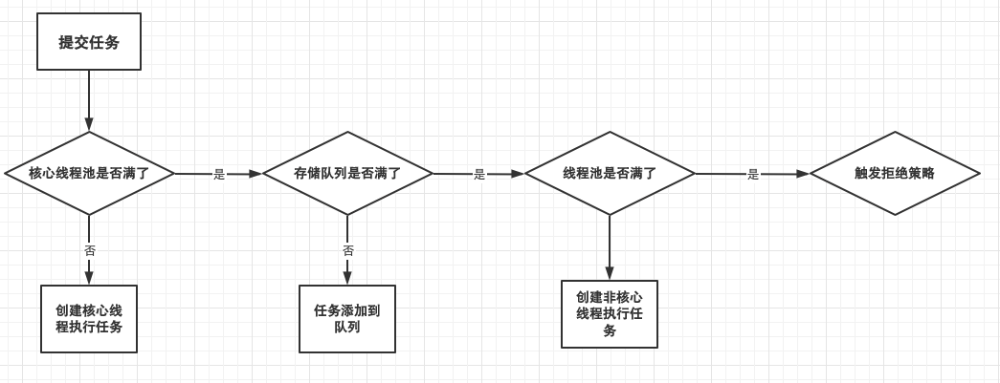
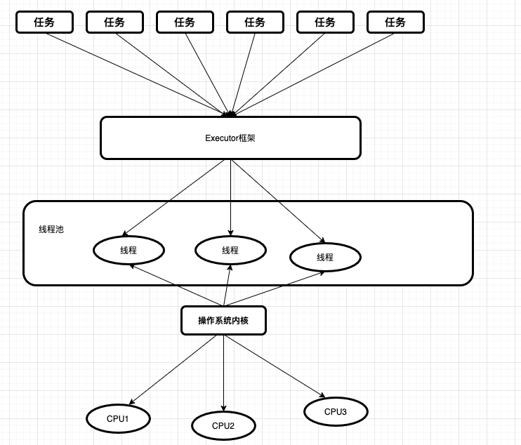
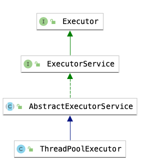

## 并发工具类

### 分类

1. 保证并发安全
   - `互斥同步`
   - `非互斥同步`
   - `结合互斥与非互斥`
   - `无同步方案、不可变`
2. 管理线程、提供效率
3. 线程协作

### 概述

1. 为什么要使用线程池?
   - `反复创建线程开销大`
     - 让线程保持工作状态，并且可以反复执行任务 -> 避免生命周期的损耗
   - `创建太多的线程会占用较多的内存`
     - 使用少量的线程 -> 避免占用较多的内存
2. <font color='red'>线程池的好处</font> 

   - 加快程序的响应速度
   - 合理的利用CPU和内存，根据CPU核数和内存合理创建线程
   - 统一管理线程
3. <font color='red'>线程池适用场合</font>

   - 服务器接收到大量请求时，使用线程池可以大大的减少创建、销毁线程的次数
   - 实际开发中，如果需要创建5个以上的线程
4. <font color='red'>线程池的状态</font>

   - `RUNNING`: 接收新的任务并且可以处理工作队列中的任务
   - `SHUTDOWN`: 不在接收新的任务，但是可以处理工作队列中的任务
   - `STOP`: 不在接收新的任务，并且也不处理工作队列中的任务
   - `TIDYING`: 所有任务都已终止，工作线程数为0。处于TIDYING状态的线程将运行钩子方法terminated()
   - `TERMINATED`: terminated() 执行完成的状态
5. <font color='red'>注意点</font>

   - 避免任务堆积
   - 避免线程数过度增加
   - 排查线程泄露 -> 线程无法被回收

### 线程池的创建与停止

> java中的线程池是通过 Executor 框架实现的，该框架中用到了 `Executor，Executors，ExecutorService，ThreadPoolExecutor`

#### 线程池构造函数的参数

- `corePoolSize`
  - 核心线程数
- `maxPoolSize`
  - 能容纳的最大线程数
- `keepAliveTime` 
  - 空闲线程存活时间
- `unit`
  - 存活的时间单位
- `workQueue` 
  - 存放等待执行的任务的阻塞队列
  - <font color='red'>如果使用的无界队列(比如LinkedBlockingQueue),那么这个参数就没有什么效果 -> 阻塞队列可以存放足够多的任务</font>

- `threadFactory` 
  - 创建线程的工厂类,<font color='red'>当线程池需要新的线程时，会使用threadFactory生成新的线程</font> 
  - 默认创建的线程都属于一个线程组，并且拥有同样的NORM_PRIORITY优先级，且都不是守护线程
  - <font color='red'>可以通过Guava的ThreadFactoryBuilder构建线程工厂</font>
- `handler` 
  - 饱和策略
  - `拒绝的时机?`
    - <font color='red'>当线程池关闭时,提交新任务会被拒绝</font> 
    - <font color='red'>当工作队列已经满了，最大线程也无法处理更多的任务时</font> 

##### 核心线程、最大线程和工作队列

- 三个参数的关系
  - <font color='red'>线程池在完成初始化后，默认情况下线程池中没有任何线程。当任务到来时再去创建线程</font>

    - <font color='red'><em>或者通过 线程池的<code>prestartAllCoreThreads()</code>提前创建并启动所有的线程</em></font>

  - 线程池可能会在核心线程数的基础上，额外的增加一些线程，但是这些线程的数量有个上限，就是*maxPoolSize*
  - <font color='red'>任务提交到线程池后，首先会创建corePoolSize的线程来处理任务，其余的任务会存储到<strong>workQueue</strong>存储队列中，如果存储队列满了，就会创建更多的线程，而线程数量的上限就是 <strong>maxPoolSize</strong></font>

  - 线程池中，有三个参数影响了拒绝策略 -> <font color='red'>当提交的任务数 > workQueue.size() + maximumPoolSize ，就会触发线程池的拒绝策略</font> 
- <mark>可以选择以下的几个工作队列</mark>

  - `ArrayBlockingQueue`
    - **基于数组的有界阻塞队列**,按照 *FIFO*[先进先出]的原则对元素排序
  - `LinkedBlockingQueue`
    - **基于链表的阻塞队列**，按照*FIFO*对元素进行排序。吞吐量一般高于ArrayBlockingQueue
    - Executors.newFixedThreadPool()、newSingleThreadExecutor() 使用的就是这个阻塞队列
  - `SynchronousQueue`
    - **不存储元素的阻塞队列**
    - 每个插入操作比如等到另一个线程调用移除操作，否则插入操作一直处于阻塞状态
    - 通常性能要优于LinkedBlockingQueue
  - `PriorityBlockingQueue`
    - **具有优先级的无限阻塞队列**

##### 饱和策略

- `AbortPolicy【默认策略】`
  - 丢弃任务，并直接抛出拒绝执行 RejectedExecutionException 异常信息
  - 必须处理好抛出的异常，否则会打断当前的执行流程，影响后续的任务执行

- `CallerRunsPolicy`
  - “调用者运行”的一种调节机制
  - 该策略不会丢弃任务，也不会抛出异常，而是将某些任务回退到调用者，从而降低新任务的流量
- `DiscardOldestPolicy`
  - 丢弃阻塞队列中最老的一个任务，并将新任务加入到工作队列中，尝试再次提交当前任务
- `DiscardPolicy`
  - 直接丢弃，其他啥都没有
  - 如果允许任务失败，这个是最好的策略

##### 线程池基本原理

- **在创建了线程池后，线程池中的线程数为零**
- **当调用execute()方法添加一个请求任务时，线程池会做出如下判断**
  - 如果正在运行的*线程数量 小于 corePoolSize*，那么马上创建线程运行这个任务
  - 如果正在运行的*线程数量 大于或等于 corePoolSize*，那么将这个任务放入队列
  - 如果这个时候*队列满了且正在运行的线程数量还小于 maximumPoolSize*，那么还是要创建非核心线程立即处理这个任务
  - 如果*队列满了且正在运行的线程数量大于或等于 maximumPoolSize*，那么线程 池会启动饱和拒绝策略来执行
- **当一个线程完成任务时，它会从队列中取下一个任务来执行**
- **当一个线程无事可做超过一定的时间(keepAliveTime)时，线程会判断:**
  - 如果当前运行的线程数大于 corePoolSize，那么这个线程就被停掉。
  - 所有线程池的所有任务完成后，它最终会收缩到 corePoolSize 的大小

)

:::danger 注意点

- **增减线程的特点**

  - <font color='red'>如果corePoolSize 和maxPoolSize值相同，那么就是创建一个固定大小的线程池</font> 

    - 比如 `java.util.concurrent.Executors#newFixedThreadPool(int nThreads, ThreadFactory threadFactory)`

      ```java
      public static ExecutorService newFixedThreadPool(int nThreads, ThreadFactory threadFactory) {
        return new ThreadPoolExecutor(nThreads, nThreads,
                                      0L, TimeUnit.MILLISECONDS,
                                      new LinkedBlockingQueue<Runnable>(),
                                      threadFactory);
      }
      ```

      

  - 线程池希望保持较少的线程，且只有在负载变大时才去增加它

  - 通过设置maxPoolSize为很高的值、工作队列设置很高的值，都可以允许线程池容纳任意数量的并发任务


:::

#### 手动创建vs自动创建

##### 自动创建的问题

- `newFixedThreadPool`

  - 内部使用的LinkedBlockingQueue是无界的，所以当请求数越来越多，并且处理速度跟不上请求速度，会导致请求大量堆积，可能导致OOM

- `newCachedThreadPool`

  - 可缓存的线程池
  - 由于最大线程数是 `Integer.MAX_VALUE`,核心线程数是`0`,所以每来一个任务就会创建一个线程 【无界线程池】
    - 如果线程空闲了1分钟就会被释放

  ```java
  new ThreadPoolExecutor(0, Integer.MAX_VALUE,60L, TimeUnit.SECONDS,new SynchronousQueue<Runnable>());
  ```

- <font color='red'>应该使用手动创建！</font>

**newFixedThreadPool可能导致OOM**

```java
public class FixedThreadPoolDemo {
    public static void main(String[] args) {
        ExecutorService service = Executors.newFixedThreadPool(1);
        for (int i = 0; i < Integer.MAX_VALUE; i++) {
            service.execute(() -> {
                try {
                    TimeUnit.SECONDS.sleep(100);
                    System.out.println(ThreadUtil.getThreadInfo());
                } catch (InterruptedException e) {
                    e.printStackTrace();
                }
            });
        }
    }
}
```


##### 手动创建建议

- CPU密集型(加密、计算Hash等)
  - <font color='red'>最佳线程数: <strong>CPU核心数的 1~2倍左右</strong></font> 
- 耗时IO型(读写数据库、文件、网络IO)
  - <font color='red'>最佳线程数一般大于CPU核心数很多倍</font> 
- 一般计算公式: `线程数=CPU核心数*(1+平均等待时间/平均工作时间)`
- CPU核心数: <font color='red'>Runtime.getRunTime().availableProcessors()</font> 

#### 停止线程池

> 遍历线程池中的工作线程，然后逐个调用线程的*Interrupt*方法中断线程

- `shutdown()`
  - 将线程池的状态设置为`SHUTDOWN`,然后中断没有正在执行任务的线程
- `shutdownNow()`
  - 将线程池的状态设置为`STOP`,然后中断所有的正在执行或者暂停任务的线程。<font color='red'>并且返回队列中的剩余的任务</font>
  - 这种方式任务不一定会全部都执行完,因为是立即停止执行
- `isShutDown()`
  - 线程池是否停止，调用了*shutdown、shutdownNow* 后，该方法就会返回true
  - **只要线程池状态不是RUNNING，都会返回true**
- `isTerminated()`
  - 线程池是否完全停止。当所有的任务都执行关闭之后，该方法才会返回true

:::tip

线程池关闭后提交的任务将由**拒绝策略**处理

:::

```java
public class StopThreadDemo {
    public static int CORE = Runtime.getRuntime().availableProcessors() * 2;
    public static int MAX = Runtime.getRuntime().availableProcessors() * 2;
    public static void main(String[] args) throws InterruptedException {
        // 创建多个线程
        ThreadPoolExecutor executor = new ThreadPoolExecutor(CORE, 
                                                             	MAX, 
                                                             	0L, 
                                                             	TimeUnit.MICROSECONDS, 
                                                              new LinkedBlockingDeque<>());
        for (int i = 0; i < 100; i++) {
            executor.execute(() -> {
                try {
                    Thread.sleep(500);
                    System.out.println(ThreadUtil.getThreadInfo());
                } catch (Exception e) {
                    e.printStackTrace();
                }
            });
        }
        Thread.sleep(1500);
        System.out.println("isShowDown:"+executor.isShutdown());            // false
        System.out.println("isTerminated:"+executor.isTerminated());        // false
        // 该方法是将线程池状态设置为SHUTDOWN,而这种状态的线程池不会再接收新的任务,同时该方法不会立即停止线程池,而是将工作队列中的任务执行完毕
        executor.shutdown();
        /**  这里再向线程池提交任务的话就会抛出异常,因为线程池不再接收新的任务了
         *    executor.execute(() -> {
         *                 try {
         *                     Thread.sleep(500);
         *                     System.out.println(ThreadUtil.getThreadInfo());
         *                 } catch (Exception e) {
         *                     e.printStackTrace();
         *                 }
         *             });
         */
        System.out.println("isShowDown:"+executor.isShutdown());            // true
        System.out.println("isTerminated:"+executor.isTerminated());        // false
        Thread.sleep(5500);
        System.out.println("isTerminated:"+executor.isTerminated());        //true
    }
}
```

### 钩子方法

> 在每个任务执行前后执行钩子方法

- ThreadPoolExecutor是可拓展的，提供了几个可以在子类中重写的方法,`beforeExecute、afterExecute、terminated`
  - `beforeExecute 和 afterExecute`
    - 分别在给定线程中执行给定的Runnable之前和之后调用。此方法由执行任务的线程调用
      - 可用于重新初始化ThreadLocals、执行日志记录、计时、监视或者统计信息收集等功能
    - <font color='red'>无论是从run()方法中正常返回,还是抛出一个异常返回,`afterExecute`始终会被调用，除非beforeExecute抛出RuntimeException</font>
    - <font color='red'>注意: ThreadPoolExecutor的子类通常应该调用super方法</font> 

#### 拓展ThreadPoolExecutor

> 为线程池增加暂停功能、日志记录功能以及计时功能 -> 可用于线程池的监控

```java
/**
 * <b>给线程池增加暂停的功能,日志,计时功能</b>
 * 在每个任务执行前后放钩子函数
 *
 * @author <a href="mailto:zhuyuliangm@gmail.com">zyl</a>
 */
public class PauseTheadPool extends ThreadPoolExecutor {
    private static Logger log = LoggerFactory.getLogger(PauseTheadPool.class);
    private volatile boolean isPaused;
    private ReentrantLock lock = new ReentrantLock();
    private Condition condition = lock.newCondition();
    private AtomicLong totalTime = new AtomicLong();
    private AtomicLong totalTasks = new AtomicLong();
    private final ThreadLocal<Long> startTime = new ThreadLocal<>();

    public PauseTheadPool(int corePoolSize, int maximumPoolSize, long keepAliveTime, TimeUnit unit, BlockingQueue<Runnable> workQueue) {
        super(corePoolSize, maximumPoolSize, keepAliveTime, unit, workQueue);
    }

    public PauseTheadPool(int corePoolSize, int maximumPoolSize, long keepAliveTime, TimeUnit unit, BlockingQueue<Runnable> workQueue, ThreadFactory threadFactory) {
        super(corePoolSize, maximumPoolSize, keepAliveTime, unit, workQueue, threadFactory);
    }

    public PauseTheadPool(int corePoolSize, int maximumPoolSize, long keepAliveTime, TimeUnit unit, BlockingQueue<Runnable> workQueue, RejectedExecutionHandler handler) {
        super(corePoolSize, maximumPoolSize, keepAliveTime, unit, workQueue, handler);
    }

    public PauseTheadPool(int corePoolSize, int maximumPoolSize, long keepAliveTime, TimeUnit unit, BlockingQueue<Runnable> workQueue, ThreadFactory threadFactory, RejectedExecutionHandler handler) {
        super(corePoolSize, maximumPoolSize, keepAliveTime, unit, workQueue, threadFactory, handler);
    }

    /**
     * 在任务被之前调用(由线程池中每个线程进行调用)
     */
    @Override
    protected void beforeExecute(Thread t, Runnable r) {
        super.beforeExecute(t, r);
        try {
            lock.lock();
            while (isPaused) {
                condition.await();
            }
            log.info("线程:"+ ThreadUtil.getThreadInfo3() +"开始执行");
            startTime.set(System.currentTimeMillis());
        } catch (InterruptedException e) {
            e.printStackTrace();
        } finally {
            lock.unlock();
        }
    }

    /**
     * 任务执行完成后调用(即使任务执行抛出异常，由线程池中每个线程进行调用)
     */
    @Override
    protected void afterExecute(Runnable r, Throwable t) {
        try {
          long endTime = System.currentTimeMillis();
          long taskTime = endTime - startTime.get();
          totalTime.addAndGet(taskTime);
          totalTasks.incrementAndGet();
          log.info("线程:"+ ThreadUtil.getThreadInfo3() +"执行完成");
        } finally {
          super.afterExecute(r, t);
      }
    }

    /**
     * 线程池退出时调用的钩子函数
     */
    @Override
    protected void terminated() {
        try {
            log.info("线程池执行结束,共执行{}个任务,执行总时长:{}ms",totalTasks,totalTime);
        } finally {
            super.terminated();
        }
    }

    public void pause() {
        try {
            lock.lock();
            isPaused = true;
        } finally {
            lock.unlock();
        }
    }
    public void resume() {
        try {
            lock.lock();
            isPaused = false;
            condition.signalAll();
        } finally {
            lock.unlock();
        }
    }

    public static void main(String[] args) throws InterruptedException {
        PauseTheadPool executor = new PauseTheadPool(5, 10, 30, TimeUnit.SECONDS, new LinkedBlockingDeque<>());
        for (int i = 0; i < 1000; i++) {
            executor.execute(() -> {
                try {
                    System.out.println("do Execute...");
                    Thread.sleep(10);
                } catch (InterruptedException e) {
                    e.printStackTrace();
                }
            });
        }
        Thread.sleep(1500);
        System.out.println("暂停线程...");
        executor.pause();
        Thread.sleep(1500);
        executor.resume();
      	// 关闭线程池
        executor.shutdown();
        while (executor.getTaskCount() == 0) {
            executor.shutdownNow();
        }
    }
}

```


### 基本实现原理

- `线程池的组成部分`
  - <font color='red'>线程池管理器</font>
  - <font color='red'>工作线程</font>
  - <font color='red'>任务队列</font> 
  - <font color='red'>任务接口(Task)</font>

#### Executor框架

> 在上层，java将应用分解为若干个任务，然后通过 `用户级的调度器(Executor框架)`将这些任务映射为固定数量的编程
>
> 在底层，操作系统内核将这些线程映射到硬件处理器上




##### Executor框架结构

- `Executor主要有三部分组成`
  - <font color='red'>任务</font>

    - 包括被执行的任务需要实现的接口(Runnable、Callable)
  - <font color='red'>任务的执行</font>

    - 包括任务执行机制的核心接口Executor、以及继承Executor的接口ExecutorService
    - Executor 框架有两个类实现了ExecutorService
      - `ThreadPoolExecutor`
      - `ScheduledThreadPoolExecutor`
  - <font color='red'>异步计算的结果</font> 
  
    - 包括接口Future和实现Future接口的FutureTask




```java
// 执行任务的方法
final void runWorker(Worker w) {
  Thread wt = Thread.currentThread();
  Runnable task = w.firstTask;
  w.firstTask = null;
  w.unlock(); // allow interrupts
  boolean completedAbruptly = true;
  try {
    // 不断的循环获取任务。getTask()获取任务，这个方法会判断任务数是否超过线程池接受范围以及闲置工作非核心线程是否超时
    while (task != null || (task = getTask()) != null) {
      w.lock();
      if ((runStateAtLeast(ctl.get(), STOP) ||
           (Thread.interrupted() &&
            runStateAtLeast(ctl.get(), STOP))) &&
          !wt.isInterrupted())
        wt.interrupt();
      try {
        //钩子函数beforeExecute，在执行任务之前调用
        beforeExecute(wt, task);
        Throwable thrown = null;
        try {
          // 执行任务的run方法
          task.run();
        } catch (RuntimeException x) {
          thrown = x; throw x;
        } catch (Error x) {
          thrown = x; throw x;
        } catch (Throwable x) {
          thrown = x; throw new Error(x);
        } finally {
          // 钩子函数afterExecute在执行任务之后调用，由于放在执行任务的try-catch语句中，所以即使执行任务时抛出异常，也依旧会调用这个方法
          afterExecute(task, thrown);
        }
      } finally {
        task = null;
        w.completedTasks++;
        w.unlock();
      }
    }
    completedAbruptly = false;
  } finally {
    // 工作线程退出时调用的方法
    processWorkerExit(w, completedAbruptly);
  }
}
```


