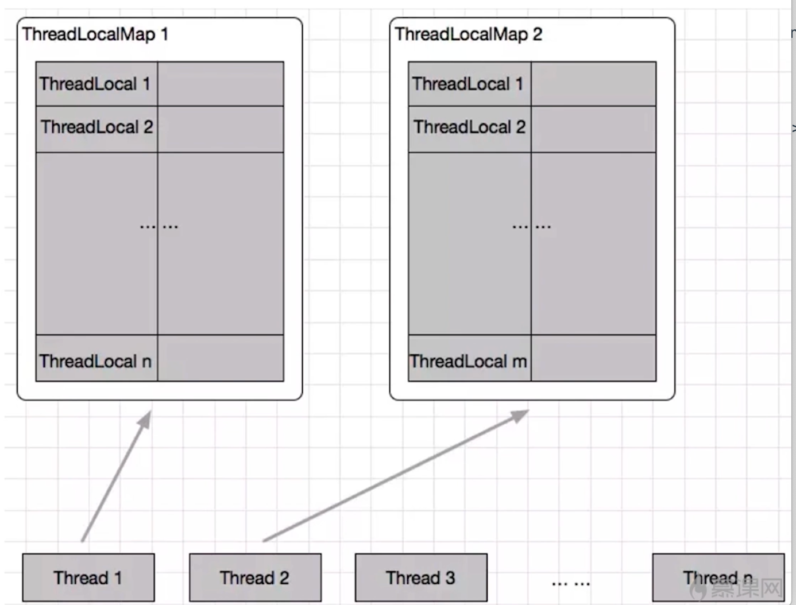
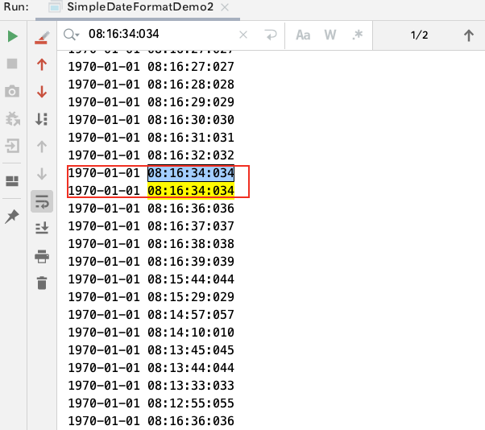
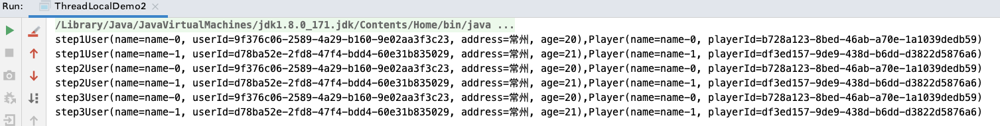
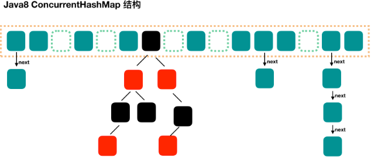
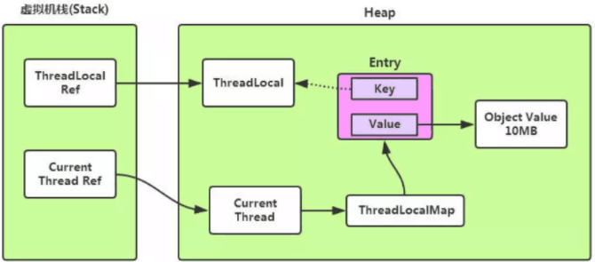

## 概述

> 多线程下访问共享的可变数据时，通常需要使用同步。一种避免同步的方式就是`不共享数据`，如果只在单线程中访问数据，就不会出现线程安全问题，这种技术叫做`线程封闭`
>
> 常见的线程封闭技术有: 局部变量、ThreadLocal(Thread的成员变量)

- <font color='red'>ThreadLocal 可以将线程对象与某个值关联起来。通过set/get方法分别设置、获取变量</font> 
- ThreadLocal通常用于防止对单实例变量、全局变量进行共享
- <font color='red'>每个线程初次调用 ThreadLocal.get()方法时，就会调用initialValue()方法获取初始值</font>

  - Thread维护了一个ThreadLocalMap[ThreadLocal key,Object value] 类型的变量threadLocals,所以一个线程可以拥有多个ThreadLocal对象
    - <font color='red'>即设置的值实际是保存在当前Thread线程对象的 threadLocals属性中，只是通过ThreadLocal进行维护</font>
  - 线程停止后，ThreadLocal中的数据会被作为垃圾回收



**ThreadLocal.set(T value)**

```java
public void set(T value) {
    Thread t = Thread.currentThread();
  	// 返回当前线程的ThreadLocalMap对象
    ThreadLocalMap map = getMap(t);
    if (map != null)
      	// 设置ThreadLocalMap，key是ThreadLocal，value是设置的值 -> 一个Thread可以有多个ThreadLocal
        map.set(this, value);
    else
        createMap(t, value);
}
```

## 使用场景

- <font color='red'>每个线程都需要一个独享的对象</font>(通常是工具类，比如SimpleDateFormat、Random)
- <font color='red'>每个线程内需要保存全局变量，可以让不同方法直接使用，避免参数传递的麻烦</font>(比如拦截器中获取用户信息)

### 场景1:线程独享对象

> 每个线程Thread都有自己的工作内存、实例副本，工作内存占用的数据不共享

#### step1:1000个日期打印任务(线程池)

<font color='red'>问题: </font>1000个线程会创建1000个SimpleDateFormat对象

```java
/**
 * <b>1000个线程打印日期</b>
 *
 * @author <a href="mailto:zhuyuliangm@gmail.com">zyl</a>
 */
public class SimpleDateFormatDemo {
    public String formatDate(int seconds) {
        Date date = new Date(1000 * seconds);
        SimpleDateFormat simpleDateFormat = new SimpleDateFormat("yyyy-MM-dd HH:mm:ss:sss");
        return simpleDateFormat.format(date);
    }

    public static void main(String[] args) throws InterruptedException {
        // 使用线程池
        ExecutorService threadPool = Executors.newFixedThreadPool(10);
        for (int i = 0; i < 1000; i++) {
            int finalI = i;
            threadPool.execute(() -> {
                String str = new SimpleDateFormatDemo().formatDate(finalI);
                System.out.println(str);
            });
        }
        threadPool.shutdown();
    }
}
```


#### step2:提取格式化变量

<font color='red'>问题</font>: 打印的结果出现重回的数据

<font color='red'>原因: 所有线程共用一个SimpleDateFormat出现了线程安全问题 -> **SimpleDateFormat是线程不安全的**</font>

解决方案: 加锁

```java
public class SimpleDateFormatDemo2 {
    private static final SimpleDateFormat DATE_FORMAT = new SimpleDateFormat("yyyy-MM-dd HH:mm:ss:sss");
    public String formatDate(int seconds) {
        Date date = new Date(1000 * seconds);
        return DATE_FORMAT.format(date);
    }

    public static void main(String[] args) throws InterruptedException {
        // 使用线程池
        ExecutorService threadPool = Executors.newFixedThreadPool(10);
        for (int i = 0; i < 1000; i++) {
            int finalI = i;
            threadPool.execute(() -> {
                String str = new SimpleDateFormatDemo2().formatDate(finalI);
                System.out.println(str);
            });
        }
        threadPool.shutdown();
    }
}

```



#### step3:ThreadLocal

<font color='red'>线程池中每个线程都会有一个ThreadLocal对象，而每个ThreadLocal对象内部存储着独显的SimpleDateFormat对象</font> 

```java
public class SimpleDateFormatDemo3 {
    private static ThreadLocal<SimpleDateFormat> threadLocal = ThreadLocal.withInitial(
            () -> {
                return new SimpleDateFormat("yyyy-MM-dd HH:mm:ss:sss");
            }
    );
    public String formatDate(int seconds) {
        Date date = new Date(1000 * seconds);
        // 每个线程内部都有自己的SimpleDateFormat实例对象,且互不共享
        return ThreadUtil.getThreadInfo3()+ "==>" +threadLocal.get().format(date);
    }

    public static void main(String[] args) throws InterruptedException {
        // 使用线程池
        ExecutorService threadPool = Executors.newFixedThreadPool(10);
        for (int i = 0; i < 1000; i++) {
            int finalI = i;
            threadPool.execute(() -> {
                String str = new SimpleDateFormatDemo3().formatDate(finalI);
                System.out.println(str);
            });
        }
        threadPool.shutdown();
    }
}

```


### 场景2:全局变量逐级传递

> 每个线程都会维护一个ThreadLocal

```java
/**
 * <b>参数逐级传递的问题以及一个Thread可以持有多个ThreadLocal</b>
 *
 * @author <a href="mailto:zhuyuliangm@gmail.com">zyl</a>
 */
public class ThreadLocalDemo2 {
    public void step1() {
        User user = UserContextHolder.userHolder.get();
        Player player = PlayerContextHolder.getPlayerContext();
        System.out.println("step1"+user+","+player);

    }
    public void step2() {
        User user = UserContextHolder.getUserContext();
        Player player = PlayerContextHolder.getPlayerContext();
        System.out.println("step2"+user+","+player);
    }
    public void step3() {
        User user = UserContextHolder.getUserContext();
        Player player = PlayerContextHolder.getPlayerContext();
        System.out.println("step3"+user+","+player);
    }

    public static void main(String[] args) {
        ExecutorService threadPool = Executors.newFixedThreadPool(2);
        for (int i = 0; i < 2; i++) {
            User user = new User("name-"+i, UUID.randomUUID().toString(), "常州",20+i);
            Player player = new Player("name-"+i, UUID.randomUUID().toString());
            threadPool.execute(() -> {
                UserContextHolder.setUserContext(user);
                PlayerContextHolder.setPlayerContext(player);
                ThreadLocalDemo2 localDemo2 = new ThreadLocalDemo2();
                localDemo2.step1();
                localDemo2.step2();
                localDemo2.step3();
            });
        }
        threadPool.shutdown();
    }
}
@Data
@AllArgsConstructor
@RequiredArgsConstructor
@ToString
class User {
    private String name;
    private String userId;
    private String address;
    private int age;
}
@Data
@AllArgsConstructor
@RequiredArgsConstructor
@ToString
class Player {
    private String name;
    private String playerId;
}

final class UserContextHolder{
    public static ThreadLocal<User> userHolder = new ThreadLocal<>();
    private UserContextHolder() {
    }
    public static void resetUserContext() {
        userHolder.remove();
    }
    public static void setUserContext( User user) {
        if (user == null) {
            resetUserContext();
        }
        else {
            userHolder.set(user);
        }
    }
    public static User getUserContext() {
        return userHolder.get();
    }
}
final class PlayerContextHolder{
    public static ThreadLocal<Player> playerHolder = new ThreadLocal<>();
    private PlayerContextHolder() {
    }
    public static void resetPlayerContext() {
        playerHolder.remove();
    }
    public static void setPlayerContext( Player player) {
        if (player == null) {
            resetPlayerContext();
        }
        else {
            playerHolder.set(player);
        }
    }
    public static Player getPlayerContext() {
        return playerHolder.get();
    }
}
```




## ThreadLocal常见方法

1. `initialValue()`

   - 返回当前线程对应的“初始值”，这是一个延迟加载的方法，只有在调用get()的时候，才会触发
   - 如果在get之前通过set设置了ThreadLocal，那么就不会再调用 initialValue()

2. `T get()`

   - 获取指定ThreadLocal中的值
   - 取出当前线程的ThreadLocalMap对象，然后通过 map.getEntry方法，传入当前ThreadLocal的引用作为参数传入，从ThreadLocalMap中取出该ThreadLocal的value
     - ThreadLocalMap以及map的key、value都存储在当前线程中，而不是ThreadLocal中

   ```java
   public T get() {
     Thread t = Thread.currentThread();
     ThreadLocalMap map = getMap(t);
     if (map != null) {
       // 这里的this 就是get方法的调用对象threadlocal
       ThreadLocalMap.Entry e = map.getEntry(this);
       if (e != null) {
         T result = (T)e.value;
         return result;
       }
     }
     // ThreadLocalMap中没有数据(没有设置ThreadLocal对象)时，调用initialValue方法
     return setInitialValue();
   }
   ```

   

3. `set(T t)`

   - 为指定的ThreadLocal设置一个新的值

4. `remove()`

   - 删除指定的ThreadLocal

## ThreadLocalMap

:::caution

- ThreadLocalMap类，也就是 Thread.threadLocals
- ThreadLocalMap类是每个线程Thread类里面的一个变量，最重要的是 `Entry[] table`,可以简单的认为是一个map
  - 键: ThreadLocal
  - 值: 设置的变量

:::

- <font color='red'>ThreadLocalMap 和 HashMap 处理元素冲突的区别?</font>

  - HashMap
    - 采用`链表法`,<font color='red'>在冲突的位置建立一个链表，然后将冲突的数据插入到链表的最后</font> ,jdk1.8 中当冲突元素较多(大于8)时，会转化为红黑树存储冲突元素
  - ThreadLocalMap
    - 采用`线性探测法`，<font color='red'>即不停的找下一个空余的位置存储，而不是在原位置建立链表存储</font>




## ThreadLocal使用注意点

### 内存泄漏问题

> - 某个对象不再有用，但是占用着内存不能被回收
>   - jvm的垃圾回收机制，在内存充足的情况下，除非你显式调用System.gc()，否则它不会进行垃圾回收；在内存不足的情况下，垃圾回收将自动运行
>
> - `强引用 [直接new]`
>   - 如果一个对象具有强引用，那垃圾回收器绝不会回收它。
>   - 当内存空间不足，jvm宁愿抛出OOM错误，使程序异常终止，也不会靠随意回收具有强引用的对象来解决内存不足的问题
> - `软引用(SoftReference)`
>   - <font color='red'>如果一个对象只具有软引用，则内存空间足够，垃圾回收器就不会回收它;如果内存空间不足了,就会回收这些对象的内存。</font>
>     - 只要垃圾回收器没有回收它，该对象就可以被程序使用
>     - 软引用可用来实现内存敏感的高速缓存
> - `弱引用(WeakReference)`
>   - 有更短的生命周期
>   - <font color='red'>在垃圾回收器线程扫描它所管辖的内存区域的过程中，一旦发现了只具有弱引用的对象，不管当前内存空间足够与否，都会回收它的内存</font>
>     - 由于垃圾回收器是一个优先级很低的线程，因此不一定会很快发现那些只具有弱引用的对象





- <font color='red'>ThreadLocal 注意点</font> 

  - ThreadLocalMap中 <font color='red'>**每个*Entry* 的key都是对ThreadLocal的弱引用，value是对设置值的强引用**</font>
  - 栈里面引用ThreadLocal的对象被回收后，由于Entry中的key(ThreadLocal)是弱引用的，所以如果外部没有强引用引用它，key就会被回收 
    - **导致ThreadLocalMap中的数据: key=null，但是value不是null**
  - **ThreadLocal出现OOM的原因?**
    - <font color='red'>由于 ThreadLocalMap的生命周期与线程对象Thread一致，并且没有清除掉Entry.key=null的数据，导致Entry对象堆积,达到一定量后可能会导致OOM</font>
    - 正常情况下，线程终止后，Thread对应的ThreadLocalMap会被回收，但是也会出现线程持续运行的情况
      - <font color='green'>比如在线程池中，处理完任务后核心线程一般不会被回收释放，所以线程的ThreadLocalMap会随之膨胀，最终可能导致OOM</font>

- <font color='red'>为什么ThreadLocalMap中Entry的key 是弱引用?</font>

  - <font color='red'>可以在一定程度上预防OOM，因为在调用ThreadLocal的get、set方法时，会扫描key等于null的Entry,并将这些Entry的value设置为null，用来帮助GC</font>
  - 如果将 Entry的key设置为强引用，那么栈里面引用的ThreadLocal的对象被回收后，由于ThreadLocalMap中的key还持有ThreadLocal的强引用，如果不手动删除的话，ThreadLocal就不会被GC回收，达到一定量后就就可能会出现OOM

- <font color='red'>如何避免内存泄漏?</font>

  - **调用remove方法，可以删除对应的Entry对象。所以使用完ThreadLocal之后就应该调用remove方法**


**java.lang.ThreadLocal.ThreadLocalMap#resize**

```java
// 重新设置大小
private void resize() {
  Entry[] oldTab = table;
  int oldLen = oldTab.length;
  int newLen = oldLen * 2;
  Entry[] newTab = new Entry[newLen];
  int count = 0;

  for (int j = 0; j < oldLen; ++j) {
    Entry e = oldTab[j];
    if (e != null) {
      ThreadLocal<?> k = e.get();
      // 如果ThreadLocalMap(Entry) 的key(ThreadLocal)是null，就将对应的值设置为null
      if (k == null) {
        e.value = null; // Help the GC 帮助GC
      } else {
        int h = k.threadLocalHashCode & (newLen - 1);
        while (newTab[h] != null)
          h = nextIndex(h, newLen);
        newTab[h] = e;
        count++;
      }
    }
  }

  setThreshold(newLen);
  size = count;
  table = newTab;
}
```


### 空指针问题

> 没有设置ThreadLocal的值，直接通过get方法获取值的时候，就可能会抛出NPE。

```java
/**
 * <b>ThreadLocal空指针异常</b>
 * @author <a href="mailto:zhuyuliangm@gmail.com">zyl</a>
 */
public class ThreadLocalNPEDemo {
    public static ThreadLocal<Long> threadLocal = new ThreadLocal<>();
    public void set() {
        threadLocal.set(Thread.currentThread().getId());
    }

    /**
     * ThreadLocalMap的value是包装类型的Long,而get方法返回的是基本数据类型long
     * 包装类型的null在进行拆箱的时候,抛出NPE
     * 所以将方法的返回值改成Long即可
     */
    public long get() {
        return threadLocal.get();
    }

    public static void main(String[] args) {
        ThreadLocalNPEDemo threadLocalNPEDemo = new ThreadLocalNPEDemo();
        // threadLocalNPEDemo.set(); 
        System.out.println(threadLocalNPEDemo.get());
    }
}

```


### 共享对象问题

<font color='red'>如果在每个线程中ThreadLocal.set() 的对象是多线程共享的，那么ThreadLocal.get() 取到的还是这个共享对象本身，依旧存在并发访问问题</font>

### 注意点

1. 如果可以不使用ThreadLocal解决问题，就不要使用ThreadLocal
   - 比如可以用局部变量
2. 优先使用框架的支持，而不是自己创造。因为自己使用需要进行维护，比如调用remove方法等
   - Spring有很多ThreadLocal
     - `RequestContextHolder`
       - 获取request请求信息
       - 每个HTTP请求都会对应一个线程，线程之间是独立隔离的
     - `DateTimeContextHolder`
     - ...
