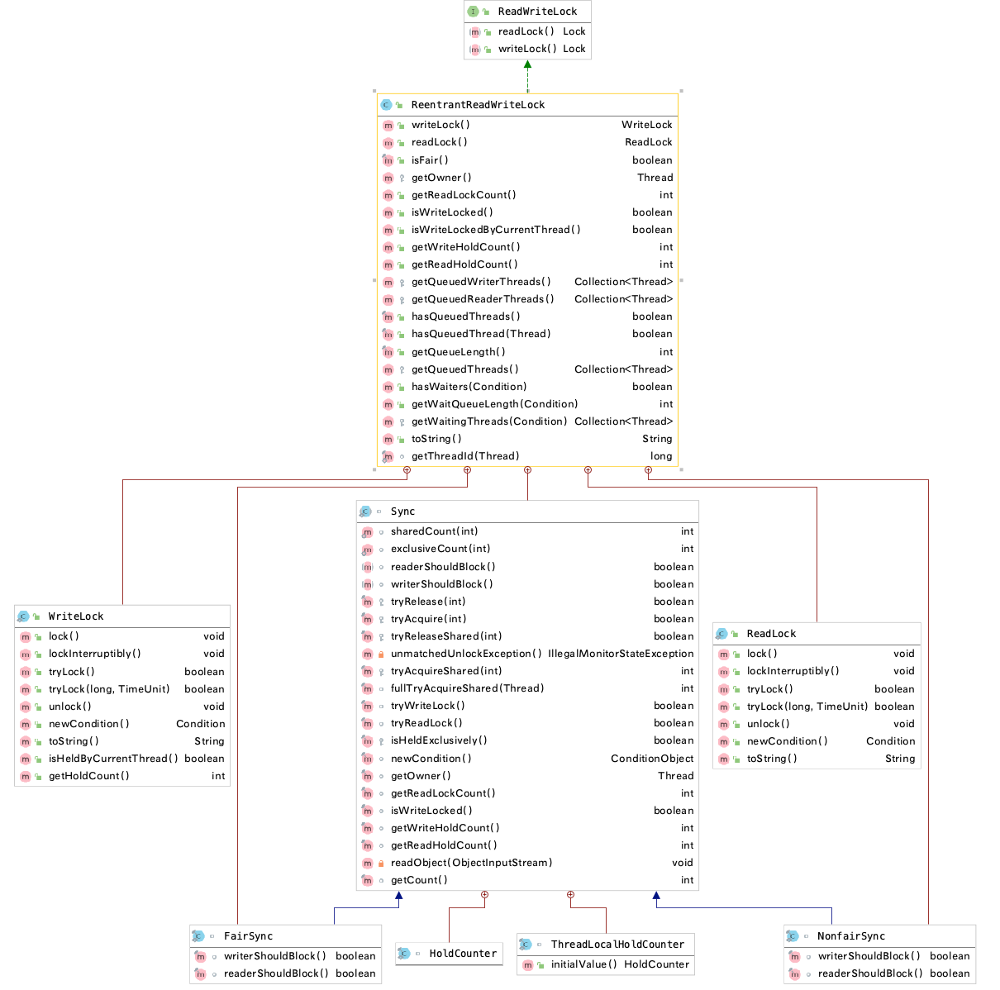

## 锁分类


## Lock接口

### 概述

> 1. 锁是用来控制多个线程访问共享资源的方式。<font color='red'>一般来说,一个锁可以防止多个线程同时访问共享资源,但是有些锁允许多个线程并发的访问共享资源（比如读写锁）</font>
> 2. jdk1.5 后提供了Lock接口以及相关实现类，Lock和synchronized 是两种最常见的锁，都可以达到线程安全的目的，只是Lock锁需要显式的获取和释放锁
> 3. Lock 不是用于代替synchronized，但是相对于synchronized拥有更多高级的功能，比如:可中断的获取锁、超时获取锁等synchronized不具备的功能

Lock的使用基本范式如下:

```java
Lock lock = new ReentrantLock();
lock.lock();	//显式获取锁
try{
	// do something...
} finally {
  lock.unlock();  //最后一定要显式的释放锁
}
```

<br/>

- Lock最常见的实现类是 `ReentrantLock`
- Lock接口提供的synchronized不具备的功能
  - `尝试非阻塞的获取锁`: 当前线程尝试获取锁，如果这一时刻锁没有被其他线程获取到，则会成功的持有锁
  - `能够被中断的获取锁`: 与synchronized不一样的是，获取到锁的线程可以响应中断，当获取到锁的线程被中断时，会抛出中断异常，并且释放锁
  - `超时的获取锁`: 在指定的截止时间之前获取锁，如果到了截止时间还无法获取锁，则返回
- <font color='red'>为什么synchronized不够用?</font>

  - `效率低`: 锁的释放情况少,尝试获取锁的时候不能设置超时、无法中断一个尝试获取锁的线程
  - `不灵活`: 加锁、释放的时机单一，并且每个锁只有一个条件对象。
  - `无法知道是否成功获取到了锁`
- <font color='red'>可见性保证</font> 

  - 拥有和 synchronized一样的内存语义,下一个线程加锁后可以看到前一个线程解锁前的操作

<br/>

### 可中断锁与不可中断锁

> <font color='red'>Lock是可中断锁，而synchronized 不是可中断锁</font> 

- 线程A和B都要获取对象Lock的锁，假设A获取了对象Lock锁，B将等待A释放Lock的锁
  - **如果使用 synchronized, 如果线程A不释放，线程B将一直等下去，且线程B无法被中断**
  - **如果使用 ReentrantLock，如果线程A不释放，可以使线程B尝试获取锁(等待一段时间)，失败后再中断线程B**

#### synchronized无法响应中断

两个线程出现了死锁，使用synchronized的话无法中断两个线程

```java
public class unInterruptLock {
    private static final Object o1 = new Object();
    public static void main(String[] args) throws InterruptedException {
        Thread thread1 = new Thread(() -> {
            System.out.println(new Date().toLocaleString()+":thread1 进入了...");
            synchronized (o1) {
                try {
                    System.out.println(new Date().toLocaleString()+":thread1 获取到锁...");
                    Thread.sleep(20000);
                    System.out.println(new Date().toLocaleString()+":thread1 释放了锁...");
                } catch (InterruptedException e) {
                    System.out.println(new Date().toLocaleString()+":thread1 被中断了...");
                    e.printStackTrace();
                }
            }
        });

        Thread thread2 = new Thread(() -> {
            System.out.println(new Date().toLocaleString()+":thread2 进入了...");
            synchronized (o1) {
                try {
                    System.out.println(new Date().toLocaleString()+":thread2 获取到锁...");
                    Thread.sleep(1000);
                    System.out.println(new Date().toLocaleString()+":thread2 释放了锁...");
                } catch (InterruptedException e) {
                    System.out.println(new Date().toLocaleString()+":thread2 被中断了...");
                    e.printStackTrace();
                }
            }
        });

        thread1.start();
        thread2.start();
        // 主线程休眠一下，让t1,t2线程百分百已经启动，避免线程交替导致测试结果混淆
        Thread.sleep(1000);
        // 中断t2线程的执行
        thread2.interrupt();
        System.out.println(new Date().toLocaleString()+":thread2 尝试中断...");

    }
}

```

<br/>


<br/>

#### Lock响应中断

如果这个线程在等待其他线程释放锁，那么这个线程可以被立即中断

```java
public class interruptLock {
    private static final ReentrantLock lock = new ReentrantLock();
    public static void main(String[] args) throws InterruptedException {
        Thread thread1 = new Thread(() -> {
            System.out.println(new Date().toLocaleString()+":thread1 进入了...");
            try {
                lock.lockInterruptibly();
                System.out.println(new Date().toLocaleString()+":thread1 获取到锁...");
                Thread.sleep(20000);
                System.out.println(new Date().toLocaleString()+":thread1 释放了锁...");
            } catch (InterruptedException e) {
                System.out.println(new Date().toLocaleString()+":thread1 被中断了...");
                e.printStackTrace();
            } finally {
                lock.unlock();
            }
        });

        Thread thread2 = new Thread(() -> {
            System.out.println(new Date().toLocaleString()+":thread2 进入了...");
            try {
                lock.lockInterruptibly();
                System.out.println(new Date().toLocaleString()+":thread2 获取到锁...");
                Thread.sleep(1000);
                System.out.println(new Date().toLocaleString()+":thread2 释放了锁...");
            } catch (InterruptedException e) {
                System.out.println(new Date().toLocaleString()+":thread2 被中断了...");
                e.printStackTrace();
            } finally {
                lock.unlock();
            }
        });

        thread1.start();
        thread2.start();
        // 主线程休眠一下，让t1,t2线程百分百已经启动，避免线程交替导致测试结果混淆
        Thread.sleep(1000);
        // 中断t2线程的执行
        thread2.interrupt();
        System.out.println(new Date().toLocaleString()+":thread2 尝试中断...");

    }
}

```

<br/>


### Lock主要方法介绍

#### 方法概述

- `lock()`
  - 用来获取锁对象，调用该方法的线程将会获取锁，当获取到锁后，从该方法返回
    - 如果锁被别的线程持有，那当前线程会一直处于等待(waiting)状态，直到获取锁
  - *lock方法不能被中断*
- `lockInterruptibly()`
  - <font color='red'>可中断的获取锁</font>
  - 与lock()方法不一样的是，该方法会响应中断，即在锁的获取过程中中断当前线程
- `tryLock([long timeout, TimeUnit unit])`
  - 尝试获取锁(参数时用于配置超时参数的)，当前线程在下面三种情况会返回:
    - *在超时时间内获取到了锁，返回true*
    - *在超时时间内被中断 ->会抛出 `InterruptedException`*
    - *超时时间结束返回false*
- `unlock()`
  - 释放锁
- `newCondition()`
  - 获取与锁对象关联的条件对象返回 `Conition` 条件对象
  - 注意：Lock锁`可以有多个`与之关联的条件对象

#### tryLock 避免死锁

tryLock的方式避免了A线程获取锁后，B线程被阻塞住的情况。而是由代码决定无法获取锁的后续处理。而synchronized只能被阻塞。

*比如在获取了锁1后，尝试获取另一把锁2。如果等待了一段时间后还是没有能获取到锁2，便放弃获取锁2，保证不阻断接下来的流程，从而避免死锁*

```java
public class tryLockDemo {
    public static final Lock lock1 = new ReentrantLock();
    public static final Lock lock2 = new ReentrantLock();
    public static void main(String[] args) {
        Thread thread1 = new Thread(() -> {
            for (int i = 0; i < 100; i++) {
                try {
                  	// 尝试获取 lock1
                    if (lock1.tryLock(3000, TimeUnit.MILLISECONDS)) {
                        try {
                            System.out.println("thread1 获取到了lock1...");
                            Thread.sleep(new Random().nextInt(1000));
                          		// 尝试获取 lock2
                            if (lock2.tryLock(3000, TimeUnit.MILLISECONDS)) {
                                try {
                                    System.out.println("thread1 获取到了lock2...");
                                    System.out.println("thread1 获取到了两把锁...");
                                    break;
                                } finally {
                                    lock2.unlock(); // 获取到lock2,手动释放
                                }
                            } else {
                                System.out.println("thread1 没有获取到lock2,尝试重新获取...");
                            }
                        } finally {
                          	// 获取到lock1需要手动释放
                            lock1.unlock();
                        }
                    } else {
                        System.out.println("thread1 没有获取到lock1,尝试重新获取...");
                    }
                } catch (InterruptedException e) {
                    e.printStackTrace();
                }
            }
        });
        Thread thread2 = new Thread(() -> {
            for (int i = 0; i < 100; i++) {
                try {
                    if (lock2.tryLock(1000, TimeUnit.MILLISECONDS)) {
                        try {
                            System.out.println("thread2 获取到了lock2...");
                            Thread.sleep(new Random().nextInt(1000));
                            if (lock1.tryLock(1000, TimeUnit.MILLISECONDS)) {
                                try {
                                    System.out.println("thread2 获取到了lock1...");
                                    System.out.println("thread2 获取到了两把锁...");
                                    break;
                                } finally {
                                    lock1.unlock(); // 获取到lock1,就释放
                                }
                            }else {
                                System.out.println("thread2 没有获取到lock1,尝试重新获取...");
                            }
                        } finally {
                            lock2.unlock();
                        }
                    } else {
                        System.out.println("thread2 没有获取到lock2,尝试重新获取...");
                    }
                } catch (InterruptedException e) {
                    e.printStackTrace();
                }
            }
        });
        thread1.start();
        thread2.start();
    }
}
```


## 乐观锁与悲观锁

### 概述

- 两者的区别
  - `悲观锁 [互斥同步锁]`
    - <font color='red'>会锁住同步资源。悲观锁认为如果不锁住同步资源,其他的线程就会来争抢，造成数据的错误</font>
    - 悲观锁为了保证结果的正确性，会在每次获取并且修改数据的时候，把数据锁住，不让其他线程访问该数据(无论读取还是写入)，以此保证数据内容的正确
    - 典型的悲观锁: `synchronized与Lock相关的类`
  - `乐观锁 [非互斥同步锁]`
    - <font color='red'>不会锁住同步资源。乐观锁认为自己在处理是，不会有其他的线程来干扰，所以不会锁住被操作的对象</font>
    - 在更新的时候，去对比修改期间数据是否被其他人改变过
      - <font color='red'>如果没有改变过，说明只有当前线程进行操作，那么正常修改数据</font> 
      - <font color='red'>如果改变过，说明其他线程在这段时间内修改过数据，那么就不继续更新，而是选择放弃、报错、重试等策略</font>
    - 乐观锁的实现一般都是通过<font color='red'>**CAS算法**</font>实现的 
    - 典型的乐观锁: `原子类、并发容器等`
    - 其他乐观锁的案例
      - *Git*: 比较版本号，如果版本与本地不一致，那么久提交失败。只有远端仓库与本地版本号一直，才可以提交
      - *数据库*:添加版本号字段，在更新的时候比较版本号
- <mark>互斥同步锁(悲观锁)的劣势</mark>

  - <font color='red'>阻塞和唤醒带来的开销较大，有性能劣势</font> 
  - <font color='red'>永久阻塞</font>

    - 如果持有锁的线程被永久的阻塞，比如遇到了无线循环、死锁等，那么其他等待获取锁的几个线程永远无法执行
  - <font color='red'>优先级反转</font>

    - 等待锁的线程优先级高，持有锁的优先级低，优先级低的线程长时间不释放锁的话，后面的线程无论优先级多高都没有用
- <mark>两种锁的开销比对</mark>

  - 悲观锁的原始开销高于乐观锁，但是特点是**一劳永逸**，临界区斥锁时间就算越来越常，也不会对互斥锁的开销造成影响
  - 乐观锁一开始的开销比悲观锁小，但是**如果自旋的时间很长或者不停的重试，那么消耗的CPU资源也会越来越多**
- <mark>两种锁的使用场景</mark>

  - <font color='red'>悲观锁</font> 

    - <font color='red'>适合并发写入多的情况，适用于临界区持锁时间较长的情况。悲观锁可以避免大量的无用自旋等消耗</font>
    - 典型情况
      - 临界区有IO操作
      - 临界区的代码复杂或者循环量大
      - 临界区竞争非常激烈 -> 如果用乐观锁，由于会多个线程修改，所以CAS比较后大部分都是无法更新，需要重试
  - <font color='red'>乐观锁</font>

    - <font color='red'>适合并发写入少的情况，大部分是读取操作。不加锁可以让读取性能大幅度提高</font> 

### 乐观锁与悲观锁的演示

```java
/**
 * <b>++操作乐观锁与悲观锁的演示</b>
 * @author <a href="mailto:zhuyuliangm@gmail.com">zyl</a>
 */
public class LockDemo1 {
    public static Object obj = new Object();
    public static Lock lock = new ReentrantLock();
  	public static AtomicInteger atomicA = new AtomicInteger(0);
    public static int a;

    /* 悲观锁synchronized演示的示例 */
    public void add(){
        synchronized (obj) {
            a++;
        }
    }
    /* 悲观锁lock的演示 */
    public void add2() {
        lock.lock();
        try {
           a++;
        }finally {
            lock.unlock();
        }
    }
    /* 乐观锁 AtomicInteger,底层采用CAS算法 */
    public void add3() {
        atomicA.incrementAndGet();  //等价于++a
    }
}
```

## 可重入锁与非可重入锁

### 概述

> 可重入的意思是: 任意线程获取到锁之后可以再次获取锁而不会被阻塞
>
> 该特性需要解决两个问题:
>
> 1. 锁的再次获取: 判断请求获取锁的线程是否是当前占有锁的线程，如果是的话可以再次获取成功
> 2. 锁的最终释放: 线程重复n次获取到了锁，那么就在随后的n次释放锁后，其他线程可以获取到锁
>  - 锁的最终释放要求锁在获取的时候进行计数的自增，计数表示当前锁被线程重复持有的次数，而锁被释放的时候，计数自减。
>  - 当计数等于0的时候，表示锁被成功的释放了。

- `可重入锁 [递归锁]`
  - <font color='red'>允许同一个线程多次获取同一把锁，而不需要释放这把锁重新获取。Lock 和 synchronized 都是可重入锁</font> 
  - **重入锁说明 锁的操作粒度是”线程“，而不是“调用”**
- `不可重入锁`
  - 典型的是: <font color='red'>ThreadPoolExecutor#Worker</font> 

- `可重入锁的好处`
  - 避免死锁
  - 提高封装性 -> <font color='red'>利用可重入的性质,可以递归调用方法而不用担心重新释放锁-加锁消耗资源</font>

### ReentrantLock常见方法

- `reentrantLock.getHoldCount()`
  - 查看锁的持有计数
  - 每次调用lock()方法后，这个计数器会加1，unlock()方法会减1，变为0就说明释放了锁
- `reentrantLock.isHeldByCurrentThread()`
  - 锁是否被当前线程持有
- `reentrantLock.getQueueLength()`
  - 返回当前正在等待这把锁的队列有多长

### ReentrantLock关系图

1. ReentrantLock中有一个Sync的内部类，这个内部类实现了AQS
2. <font color='red'>重入锁的状态保存在Sync内部类的的state字段中的(继承自父类AQS)，修改和读取这个状态都是通过AQS实现的</font>
3. 公平与非公平锁的实现是由 ReentrantLock 的内部类 FairSync 和 NonfairSync实现的


### ReentrantLock可重入锁演示

```java
/**
 * <b>演示Lock的可重入锁</b>
 *
 * @author <a href="mailto:zhuyuliangm@gmail.com">zyl</a>
 */
public class ReentrantLockDemo {
    private static final ReentrantLock lock = new ReentrantLock();
    private static Logger log = LoggerFactory.getLogger(ReentrantLockDemo.class);

    public static void main(String[] args) {
        new Thread(() -> {
            lock.lock();
            try {
                log.info("进入第一层锁,当前锁持有次数为:{}",lock.getHoldCount());
                lock.lock();
                try {
                    log.info("进入第二层锁,当前锁持有次数为:{}",lock.getHoldCount());
                }finally {
                    lock.unlock();
                    log.info("释放第二层锁,当前锁持有次数为:{}",lock.getHoldCount());
                }
            }finally {
                lock.unlock();
                log.info("释放第一层锁,当前锁持有次数为:{}",lock.getHoldCount());
            }
        }).start();
    }
}
```


### 可重入的基本原理

1. java.util.concurrent.locks.ReentrantLock.Sync#nonfairTryAcquire
2. java.util.concurrent.locks.ReentrantLock.Sync#tryRelease
3. java.util.concurrent.locks.ReentrantLock.Sync#getHoldCount


### 不可重入的基本原理

1. java.util.concurrent.ThreadPoolExecutor.Worker#tryAcquire
2. java.util.concurrent.ThreadPoolExecutor.Worker#tryRelease


## 公平锁与非公平锁

### 概述

- **区别?**

  - `公平锁`
    - 一个一个来
    - <font color='red'>按照线程请求的顺序来分配锁</font>,线程会直接进入等待队列去排队，只有等待队列里的第一个线程可以获取到锁
  - `非公平锁 [默认]`
    - 谁抢到就是谁的
    - <font color='red'>不完全按照线程请求的顺序来分配锁，在**一定的情况**下可以插队</font>(是在合适的时机才会插队)

  ```java
  // 公平锁与非公平锁的创建
  public ReentrantLock(boolean fair) {
    sync = fair ? new FairSync() : new NonfairSync();
  }
  ```

  

- <font color='red'>两种锁的优缺点</font>

  - 非公平锁
    - 优点：
      - 执行效率高,可以减少CPU唤醒线程的开销，整体的吞吐效率会高点。
      - <font color='red'>避免唤醒带来的空档期</font>，CPU不必取唤醒所有线程，会减少唤起线程的数量
    - 缺点: 可能导致队列中间的线程一直获取不到锁或者长时间获取不到锁，导致其他线程饿死
  - 公平锁
    - 优点: 所有的线程都能得到资源,都有执行的机会，不会饿死在队列中
    - 缺点: 吞吐量会下降很多，队列里面除了第一个线程，其他的线程都会阻塞，cpu唤醒阻塞线程的开销会很大

### 公平锁的演示

- 所有线程都得到执行，并且是按照排队顺序执行
- 线程1占有锁时，线程2请求获取锁。当线程1执行完释放锁后，即使线程1能很快的执行完任务。但是公平锁的持有按照请求顺序分配锁，所以线程2获取到了执行权，线程3也一样。

```java
public class FairLockDemo {
    // 创建一个公平锁
    private static final ReentrantLock fairLock = new ReentrantLock(true);
    private static int ticketNum = 10;

    public static void sellTicket() {
        fairLock.lock();
        try {
            if (ticketNum > 0) {
                System.out.printf("线程%s获取到了锁,当前锁的加锁次数为:%d,等待队列有:%d个,卖出:%d号,剩余:%d\r\n",
                        ThreadUtil.getThreadInfo3(),fairLock.getHoldCount(),fairLock.getQueueLength(),ticketNum,--ticketNum);
            }
        } finally {
            fairLock.unlock();
        }
    }

    public static void main(String[] args) {
        new Thread(() -> {
            for (int j = 0; j < 100; j++) {
                sellTicket();
            }
        },"Thread1").start();
        new Thread(() -> {
            for (int j = 0; j < 100; j++) {
                sellTicket();
            }
        },"Thread2").start();
        new Thread(() -> {
            for (int j = 0; j < 100; j++) {
                sellTicket();
            }
        },"Thread3").start();
    }
}
```


### 非公平锁的演示

- <font color='red'>线程1抢到锁后，线程2会被阻塞处于等待状态。当线程1释放完锁，线程B从等待状态到运行状态需要一定时间。这段时间内，线程1抢到了锁并继续执行。</font>

```java
public class UnFairLockDemo {
    // 创建一个非公平锁
    private static final ReentrantLock unfairLock = new ReentrantLock(false);
    private static int ticketNum = 10;

    public static void sellTicket() {
        unfairLock.lock();
        try {
            if (ticketNum > 0) {
                System.out.printf("线程%s获取到了锁,当前锁的加锁次数为:%d,等待队列有:%d个,卖出:%d号,剩余:%d\r\n",
                        ThreadUtil.getThreadInfo3(),unfairLock.getHoldCount(),unfairLock.getQueueLength(),ticketNum,--ticketNum);
            }
        } finally {
            unfairLock.unlock();
        }
    }

    public static void main(String[] args) {
        new Thread(() -> {
            for (int j = 0; j < 100; j++) {
                sellTicket();
            }
        },"Thread1").start();
        new Thread(() -> {
            for (int j = 0; j < 100; j++) {
                sellTicket();
            }
        },"Thread2").start();
        new Thread(() -> {
            for (int j = 0; j < 100; j++) {
                sellTicket();
            }
        },"Thread3").start();
    }
}
```


### 特例

- <font color='red'>tryLock()方法不遵守设定的公平原则</font>
- <font color='red'>当线程执行tryLock()方法时，一旦有线程释放锁，那么这个tryLock的线程就可以获取到锁，即使等待队列中已经有等待的线程了！</font>
- 注意: **实际上tryLock() 和非公平锁没有尝试获取锁是一样的，都是当前线程有机会获取锁就获取锁**

```java
// 尝试获取锁的方法
final boolean nonfairTryAcquire(int acquires) {
  final Thread current = Thread.currentThread();
  int c = getState();
  // 当前锁的持有计数是0 -> 没有线程持有锁
  if (c == 0) {
    // 设置锁的持有计数=1 并且让当前线程持有锁，然后返回true
    if (compareAndSetState(0, acquires)) {
      setExclusiveOwnerThread(current);
      return true;
    }
  }
  // 重入锁的特性
  else if (current == getExclusiveOwnerThread()) {
    int nextc = c + acquires;
    if (nextc < 0)
      throw new Error("Maximum lock count exceeded");
    setState(nextc);
    return true;
  }
  return false;
}
```


### 公平锁源码

```java
static final class FairSync extends Sync {
  private static final long serialVersionUID = -3000897897090466540L;
	
  // 尝试获取锁
  final void lock() {
    acquire(1);
  }
  
  protected final boolean tryAcquire(int acquires) {
    final Thread current = Thread.currentThread();
    // 获取锁的持有计数
    int c = getState();
    // 锁的持有计数是0，即当前锁没有被任何线程持有
    if (c == 0) {
      // 判断当前线程在队列中是不是第一个(判断等待队列前面是否还有其他的线程)
      if (!hasQueuedPredecessors() &&
          compareAndSetState(0, acquires)) {
         // 设置当前线程的锁为排他锁
        setExclusiveOwnerThread(current);
        return true;
      }
    }
    // 如果锁的持有计数为不是0，且占用排他锁是正是当前线程
    else if (current == getExclusiveOwnerThread()) {
      int nextc = c + acquires;
      if (nextc < 0)
        throw new Error("Maximum lock count exceeded");
      // 增加锁的持有计数
      setState(nextc);
      return true;
    }
    return false;
  }
}

// 判断是不是队列的第一个
public final boolean hasQueuedPredecessors() {
  Node t = tail; 
  Node h = head;
  Node s;
  // 没有头部节点
  return h != t &&
    ((s = h.next) == null || s.thread != Thread.currentThread());
}
```

### 非公平锁源码

```java
static final class NonfairSync extends Sync {
  private static final long serialVersionUID = 7316153563782823691L;
	// 直接尝试加锁
  final void lock() {
    // 如果锁的持有计数为0的话，采用CAS算法的方式去尝试将锁的持有计数从0更新为1
    if (compareAndSetState(0, 1))
       // 设置当前线程的锁为排他锁
      setExclusiveOwnerThread(Thread.currentThread());
    else
      acquire(1);
  }
  protected final boolean tryAcquire(int acquires) {
    return nonfairTryAcquire(acquires);
  }
}
```


## 共享锁与排他锁

### 基本概述

#### **共享锁与排他锁概述**?

- `排他锁` [*独占锁、独享锁*]
  - <font color='red'>该锁在同一时刻只允许被一个线程持有,并且持有排他锁的线程 **即能读数据又能修改数据**</font>
  - **特点**:
    - 某个线程获取到锁后，其他线程想要获取锁,必须等待持有锁的线程释放完锁后才可以
  - 常见的排他锁
    - `synchronized`
    - `ReentrantLock`
- `共享锁` [ *读锁* ]
  - <font color='red'>该锁在同一时刻可以被多个线程持有,但是持有共享锁的线程 **只能读数据,不能修改数据**</font>
  - **特点** 
    - 如果线程A对数据S加上共享锁后，则其他线程只能对S再加共享锁，不能加排它锁
  - **常见的共享锁**
    - `ReentrantReadWriteLock`

#### **读写锁[ReadWriteLock]概述**

- <mark>*ReadWriteLock* 是读写锁的接口</mark>

  - `readLock()`
    - 返回一个读锁，用于读操作
    - <font color='red'>读锁是共享的。只要没有写线程，读锁可以被多个读线程同时持有</font>
    - <font color='red'>获取读锁的条件</font>
      - 没有其他线程的写锁
      - 没有写请求,或者有写请求，但调用线程和持有锁的线程是同一个(锁降级 + 可重入)
  - `writeLock()`
    - 返回一个写锁,<font color='red'>写锁是排他的。</font> 
    - <font color='red'>获取写锁的条件</font>
      - 没有其他线程的读锁
      - 没有其他线程的写锁

  ```java
  public interface ReadWriteLock {
      Lock readLock();
      Lock writeLock();
  }
  ```

- 所有的ReadWriteLock实现必须保证 **writeLock操作的内存同步效果也与相关的readLock保持一致,成功获得读锁的线程将看到在前一次释放写锁之后所做的所有更新**

  - <font color='red'>这说明在写线程获取到锁之后，所有的读线程和其他写线程都会被阻塞</font>

- <mark>读锁与写锁的交互有多种方式，可选的实现包括</mark> 

  - `释放优先`
    - 当一个写入操作释放写锁时，并且等待队列中中同时存在写线程和读线程，那么应该优先选择读线程，还是写线程，还是最先发起获取锁请求的线程
  - `读线程插队`
    - 如果锁是由读线程持有，但是写线程正在等待，那么新到达的读线程是否能立即获取访问权，还是应该在写线程后面等待?
    - 如果允许读线程插队到写线程之前，那么可以提高并发性，但是可能会造成写线程的饥饿

  - `可重入`
    - 读锁和写锁是否是可重入的?
  - `降级`
    - 如果一个线程持有写入锁，那么能否在不释放写锁的情况下获取读锁。这个会导致写锁降级成为读锁，并且不允许其他写线程修改被保护的资源
  - `升级`
    - 读锁能否优先于其他正在等待的读线程和写线程升级为一个写锁?大多数的情况是不允许的，因为没有显式的升级操作，会很容易造成死锁
      - 如果两个读线程尝试同时升级为写锁，那么两个都不会释放读取锁。

- ReadWriteLock常见的实现类是 `ReentrantReadWriteLock` 

:::danger 读写锁使用的注意点

1. **在访问共享数据时，读写锁比互斥锁允许的并发级别更高**
   - 因为: <font color='red'>尽管一次只有一个线程(写线程)可以修改共享数据，但在许多情况下，任意数量的线程都可以并发地读取数据(因此称为读线程)。从理论上讲，使用读写锁所允许的并发性的增加将导致性能的提高，而不是使用互斥锁</font>
2. **使用读写锁能否提高性能的取决于读取数据被修改相比,读和写操作的持续时间**
   - 比如一个集合最初是用数据填充的，之后很少被修改，但经常被搜索(比如某种目录)，这是使用读写锁的理想候选集合
   - <font color='red'>但如果更新变得频繁，那么数据的大部分时间都被排他锁定，并发性几乎没有增加。此外如果读操作太短，读写锁实现(其本质上比互斥锁更复杂)的开销可能会控制执行成本</font>

:::

### ReentrantReadWriteLock

> ReentrantReadWriteLock 是读写锁接口 ReadWriteLock的一个实现

#### 基本概述

- <mark>ReentrantReadWriteLock 对ReadWriteLock交互方式实现</mark>

  - `公平选择性`
    - 支持非公平(默认)和公平的锁获取方式，吞吐量还是非公平优于公平
      - 非公平锁
        - <font color='red'>写锁可以随时插入，读锁只能在等待队列头节点不是想获取写锁的线程的时候可以插队</font>
      - 公平锁
        - 线程来了之后不管读写都去等待队列中等待，不允许插队
    - 读写锁实现了AQS的 `tryAcquire 和 tryReleaseShared`方法分别去获取公平与非公平锁
  - `可重入`
    - 读锁和写锁都支持线程重进入,读写锁可以按照ReentrantLock的方式重新获取读取锁、写入锁。
      - <font color='red'>线程获取了读锁后，还可以再次获取读锁</font>
      - <font color='red'>线程获取了写锁后，这个线程可以再次获取写锁和读锁</font>
  - `锁降级`
    - 遵循 <font color='red'>获取写锁 -> 获取读锁 -> 释放写锁的次序</font>。
    - 写锁能够以重入的方式降级成为读锁。其实现方式是：<font color='red'>先获取写入锁，然后获取读取锁，最后释放写入锁。但是，从读取锁升级到写入锁是**不可能的**</font>

- <mark>ReentrantReadWriteLock 常见的方法</mark>

  - `int getReadLockCount()`
    - 返回当前读锁被获取的次数

  - `int getReadHoldCount()`
    - 返回当前线程持有读锁的次数
    - 通过ThreadLocal保存当前线程获取读锁的次数
  - `int getWriteHoldCount()`
    - 返回当前线程持有写锁的次数

  - `boolean isWriteLocked()`
    - 判断写锁是否被获取

#### 读写锁简单缓存的示例

> 简单的缓存Demo: Cache采用线程不安全的HashMap作为缓存的实现，同时用读写锁保证cache 的读写操作是安全的。

```java
/**
 * <b>读写锁的缓存Demo</b>
 * @author <a href="mailto:zhuyuliangm@gmail.com">zyl</a>
 */
public class ReadWriteLockDemo {
    public static final Map<String,Object> cache = new HashMap<String,Object>();
    private static final ReentrantReadWriteLock READ_WRITE_LOCK = new ReentrantReadWriteLock();
    // 读锁
    private static final Lock read = READ_WRITE_LOCK.readLock();
    // 写锁
    private static final Lock write = READ_WRITE_LOCK.writeLock();
		// 缓存值的获取
    public static final Object get(String key) {
        read.lock();
        try {
            System.out.println(Thread.currentThread().getName()+":获取key="+key+"的缓存值");
         return cache.get(key);
        }finally {
            read.unlock();
        }
    }
  	// 缓存的写入
    public static final void put(String key, Object value) {
        write.lock();
        try {
            System.out.println(Thread.currentThread().getName()+":存储[key="+key+",value="+value+"]的缓存值");
            cache.put(key, value);
        }finally {
            write.unlock();
        }
    }
    public static void main(String[] args) throws InterruptedException {
        ReadWriteLockDemo cache = new ReadWriteLockDemo();
        new Thread(() -> {
            for (int i = 1; i <= 5; i++) {
                cache.put(String.valueOf(i), new Date());
            }
        },"thread1").start();
        // 保证缓存已经写入
        TimeUnit.SECONDS.sleep(2);
        for (int i = 1; i <= 5; i++) {
            int finalNum = i;
            new Thread(() -> {
                Object value = cache.get(String.valueOf(finalNum));
                System.out.println(finalNum+"对应的缓存值为=>"+value);
            },"Thread-" + i).start();
        }
    }
}
```


#### 读锁插队与不插队的示例

> 在ReentrantReadWriteLock的非公平锁的情况下,演示读锁插队与不插队的情况
>
> 根据运行结果可以看到:获取写锁后，后续获取读写锁的请求都会被放在阻塞队列中。当释放了写锁但是头节点是获取了读锁的线程，那么后面新来的尝试获取读锁的线程可以不排队直接拿到读锁(插队)

```java
/**
 * <b>读锁能够插队与不能插队的演示</b>
 *
 * @author <a href="mailto:zhuyuliangm@gmail.com">zyl</a>
 */

public class NonfairBargeDemo {
    // 定义为非公平锁演示插队
    private static final  ReentrantReadWriteLockExt READ_WRITE_LOCK = new ReentrantReadWriteLockExt(false);
    // 读锁
    private static final ReentrantReadWriteLock.ReadLock read =READ_WRITE_LOCK.readLock();
    // 写锁
    private static final ReentrantReadWriteLock.WriteLock write =READ_WRITE_LOCK.writeLock();
    private static final Logger log = LoggerFactory.getLogger(NonfairBargeDemo.class);

    public static final String getCurrentThread() {
        return Thread.currentThread().getName();
    }

    public static final void read() {
        log.info("线程{}尝试获取读锁",getCurrentThread());
        read.lock();
        try {
            log.warn("线程{}成功获取读锁,并开始读取...",getCurrentThread());
            TimeUnit.MILLISECONDS.sleep(20);
        } catch (InterruptedException e) {
            e.printStackTrace();
        } finally {
            log.info("线程{}释放了读锁",getCurrentThread());
            read.unlock();
        }
    }
    public static final void write() {
        log.info("线程{}尝试获取写锁",getCurrentThread());
        write.lock();
        try {
            log.warn("线程{}成功获取写锁,并开始写入...",getCurrentThread());
            TimeUnit.MILLISECONDS.sleep(40);
        } catch (InterruptedException e) {
            e.printStackTrace();
        } finally {
            log.error("线程{}释放了写锁,等待队列中有{}个等待线程",getCurrentThread(),READ_WRITE_LOCK.getQueuedThreads().size());
            write.unlock();
        }
    }

    public static void main(String[] args) throws InterruptedException {
        new Thread(() -> { NonfairBargeDemo.write();},"thread1").start(); //写锁后面的读锁都会被阻塞
        TimeUnit.MILLISECONDS.sleep(20);
        new Thread(() -> { NonfairBargeDemo.read();},"thread2").start();
        new Thread(() -> { NonfairBargeDemo.read();},"thread3").start();
        new Thread(() -> { NonfairBargeDemo.write();},"thread4").start();
        new Thread(() -> { NonfairBargeDemo.read();},"thread5").start();
        new Thread(() -> {
            for (int i = 1; i <= 1000; i++) {
                new Thread(() -> {
                    NonfairBargeDemo.read();
                },"子线程创建线程:"+i).start();
            }
        }).start();
    }
}

/**
 * 拓展ReentrantReadWriteLock,获取队列中等待的线程
 */
class ReentrantReadWriteLockExt extends ReentrantReadWriteLock{
    public ReentrantReadWriteLockExt(boolean fair) {
        super(fair);
    }
    public Collection<Thread> getQueuedThreads() {
        return getQueuedReaderThreads();
    }
}
```


### 读写锁升降级

- <mark>锁降级</mark>
  - <font color='red'>持有住当前拥有的写锁，再获取到读锁，随后释放之前持有的写锁</font>
- <font color='red'>**为了保证数据的可见性**,ReentrantReadWriteLock 支持写锁降级为读锁，但是不支持读锁升级为写锁</font>
  - 如果多个线程获取了读锁，其中任意一个升级为写锁的线程更新了数据，那么这个更新对于其他持有读锁的线程是不可见的
- <mark>降级步骤</mark>
  - <font color='red'>获取写锁 -> 写数据 -> 获取读锁[重入的方式] -> 读取数据 -> 释放写锁 -> 释放读锁</font>

#### 写锁降级示例

```java
public class ReentrantReadWriteLockDemo2 {
    private static String cache = "";
    private static final ReentrantReadWriteLock READ_WRITE_LOCK = new ReentrantReadWriteLock();
    private static final ReentrantReadWriteLock.ReadLock READ_LOCK = READ_WRITE_LOCK.readLock();
    private static final ReentrantReadWriteLock.WriteLock WRITE_LOCK = READ_WRITE_LOCK.writeLock();
    public static void main(String[] args) {
        new Thread(() -> {
            try {
                // 获取写锁
                WRITE_LOCK.lock();
                TimeUnit.SECONDS.sleep(5);
                cache = "写入数据";
                System.out.println(Thread.currentThread().getName() + "\t[写锁]写入完成");
                // 写入线程再次尝试获取读锁
                READ_LOCK.lock();
                System.out.println(Thread.currentThread().getName() + "\t[读锁]获取数据:" + cache);
                // 释放写锁
                WRITE_LOCK.unlock();
                READ_LOCK.unlock();
            } catch (InterruptedException e) {
                e.printStackTrace();
            }
        },"[写入线程]").start();
    }
}

/*
	// 阻塞 5s
	[写入线程]	[写锁]写入完成
	[写入线程]	[读锁]获取数据:写入数据
*/
```

#### 读锁升级测试

可以看到，在获取了读锁之后，是无法以重入的方式获取到写锁，**除非在获取写锁之前释放掉读锁**

```java
public class ReentrantReadWriteLockDemo3 {
    private static String cache = "初始值1";
    private static final ReentrantReadWriteLock READ_WRITE_LOCK = new ReentrantReadWriteLock();
    private static final ReentrantReadWriteLock.ReadLock READ_LOCK = READ_WRITE_LOCK.readLock();
    private static final ReentrantReadWriteLock.WriteLock WRITE_LOCK = READ_WRITE_LOCK.writeLock();
    public static void main(String[] args) {
        new Thread(() -> {
            try {
                // 获取读锁
                READ_LOCK.lock();
                System.out.println(Thread.currentThread().getName() + "\t[读锁]获取数据:" + cache);
                // 获取写锁
                System.out.println(Thread.currentThread().getName() + "尝试获取写锁...");
                WRITE_LOCK.lock();
                System.out.println(Thread.currentThread().getName() + "写锁获取成功...");
                TimeUnit.SECONDS.sleep(5);
                cache = "初始值2";
                System.out.println(Thread.currentThread().getName() + "\t[写锁]写入完成");
            		// 释放读锁
                READ_LOCK.unlock();
                // 释放写锁
                WRITE_LOCK.unlock();
            } catch (InterruptedException e) {
                e.printStackTrace();
            }
        },"[读取线程]").start();
    }
}
```


### ReentrantReadWriteLock 分析

#### ReentrantReadWriteLock结构

1. ReentrantReadWriteLock 实现了 ReadWriteLock接口,分别提供获取读写锁的方法
2. ReentrantReadWriteLock 的内部类 Sync继承了AQS，但是由于存在两把锁，所以将AQS的同步状态按位分隔成高低位，用来存储读写锁的持有计数
   - 提供了可重入的特性
3. ReentrantReadWriteLock 的内部类 Sync有两个子类:FairSync、NonfairSync，用于提供公平和非公平性
4. 读锁的获取与写锁的获取是分离的




#### 同步状态的读写划分

- 读写锁也依赖于AQS实现同步的功能，并且读写状态就是AQS同步器的同步状态(state)，而且同步状态表示锁被一个线程重复持有的计数
  - 由于读写锁包含了两把锁，所以 <font color='red'>需要在同步状态(一个int变量)上维护读锁的持有计数以及写锁的持有计数</font>
  - <font color='red'>如果需要在一个整型变量上维护多种状态，就一定需要使用 **按位分隔** 的技术</font>
- <mark>读写锁将同步状态的变量分成了两部分</mark>
  - **高16位表示读锁的持有计数**
  - **低16位表示写锁的持有计数**

```java
// @see java.util.concurrent.locks.ReentrantReadWriteLock.Sync 
abstract static class Sync extends AbstractQueuedSynchronizer {
  private static final long serialVersionUID = 6317671515068378041L;

  /*
  * Read vs write count extraction constants and functions.
  * Lock state is logically divided into two unsigned shorts:
  * The lower one representing the exclusive (writer) lock hold count,
  * and the upper the shared (reader) hold count.
  */

  static final int SHARED_SHIFT   = 16;
  static final int SHARED_UNIT    = (1 << SHARED_SHIFT);
  static final int MAX_COUNT      = (1 << SHARED_SHIFT) - 1;
  static final int EXCLUSIVE_MASK = (1 << SHARED_SHIFT) - 1;

  /** 获取读锁的持有计数  */
  static int sharedCount(int c)    { return c >>> SHARED_SHIFT; }
  /** 获取写锁的持有计数  */
  static int exclusiveCount(int c) { return c & EXCLUSIVE_MASK; }
	
  // .......
}
```


- 下图表示的一个线程已经获取了写锁，并且重入了两次，同时也连续获取了两次读锁。通过*位运算可以确定读写锁的同步状态*
  - 假设当前同步状态值为S，get和set的操作如下
  ```markdown
      - <mark>获取写状态</mark>
        - S & 0x0000FFFF:将高16位全部抹去
      - <mark>获取读状态</mark>
        - S>>>16:无符号补0: 右移16位
      - <mark>写状态加1</mark> 
        - S+1
      - <mark>读状态加1</mark>
        - S+（1<<16）: S + 0x00010000
  ```
  - <font color='red'>S!=0时，当写状态=0，则读状态>0,即读锁已经被获取</font>


#### 写锁的获取

> 1. setState(c + acquires); => 提供了可重入
>
> 2. if (w == 0 || current != getExclusiveOwnerThread()) => 获取写锁时不允许有读锁被持有与其他写锁被持有 -> 独占性

```java
protected final boolean tryAcquire(int acquires) {
  Thread current = Thread.currentThread();
  // 获取读写锁的同步状态
  int c = getState();
  // 获取读写锁中写锁的同步状态(锁的持有计数)
  int w = exclusiveCount(c);
  // 锁的持有计数>0 -> 存在读锁或者写锁
  if (c != 0) {
    // 存在读锁或者其他写锁独占了该锁 -> 获取锁失败
    if (w == 0 || current != getExclusiveOwnerThread())
      return false;
    if (w + exclusiveCount(acquires) > MAX_COUNT)
      throw new Error("Maximum lock count exceeded");
    // 可重入的处理: 此时持有写锁的是当前写线程，所以将读锁的持有计数加1
    setState(c + acquires);
    return true;
  }
  // 到这里说明此时c=0,读锁和写锁都没有被获取
  // 如果获取写锁被阻塞或者设置同步状态失败 -> 获取锁失败
  if (writerShouldBlock() || !compareAndSetState(c, c + acquires))
    return false;
  // 读写线程都没有持有锁，那么当前写线程独占写锁 -> 成功获取写锁
  setExclusiveOwnerThread(current);
  return true;
}
```

#### 读锁的获取

```java
// 重入+读锁获取的条件
protected final int tryAcquireShared(int unused) {
  Thread current = Thread.currentThread();
 // 获取读写锁的同步状态
  int c = getState();
  // 如果有写线程持有锁，并且不是当前线程
  if (exclusiveCount(c) != 0 && getExclusiveOwnerThread() != current)
    return -1;
  // 获取读锁的持有计数
  int r = sharedCount(c);
  // 如果获取读锁不会被阻塞
  if (!readerShouldBlock() && r < MAX_COUNT && compareAndSetState(c, c + SHARED_UNIT)) {
    // 如果读锁的持有计数=0，设置当前线程是第一个读的
    if (r == 0) {
      firstReader = current;
      firstReaderHoldCount = 1;
    } else if (firstReader == current) {
      firstReaderHoldCount++;
    } else {
      // 通过ThreadLocal存储当前线程持有锁的计数
      HoldCounter rh = cachedHoldCounter;
      if (rh == null || rh.tid != getThreadId(current))
        cachedHoldCounter = rh = readHolds.get();
      else if (rh.count == 0)
        readHolds.set(rh);
      rh.count++;
    }
    return 1;
  }
  return fullTryAcquireShared(current);
}

// 读锁获取的条件
final int fullTryAcquireShared(Thread current) {
  HoldCounter rh = null;
  // 自旋的获取读锁
  for (;;) {
    // 获取读写锁的同步状态
    int c = getState();
    if (exclusiveCount(c) != 0) {
      if (getExclusiveOwnerThread() != current)
        return -1;
      // else we hold the exclusive lock; blocking here
      // would cause deadlock.
    } else if (readerShouldBlock()) {
      // Make sure we're not acquiring read lock reentrantly
      if (firstReader == current) {
        // assert firstReaderHoldCount > 0;
      } else {
        if (rh == null) {
          rh = cachedHoldCounter;
          if (rh == null || rh.tid != getThreadId(current)) {
            rh = readHolds.get();
            if (rh.count == 0)
              readHolds.remove();
          }
        }
        if (rh.count == 0)
          return -1;
      }
    }
    if (sharedCount(c) == MAX_COUNT)
      throw new Error("Maximum lock count exceeded");
    if (compareAndSetState(c, c + SHARED_UNIT)) {
      if (sharedCount(c) == 0) {
        firstReader = current;
        firstReaderHoldCount = 1;
      } else if (firstReader == current) {
        firstReaderHoldCount++;
      } else {
        if (rh == null)
          rh = cachedHoldCounter;
        if (rh == null || rh.tid != getThreadId(current))
          rh = readHolds.get();
        else if (rh.count == 0)
          readHolds.set(rh);
        rh.count++;
        cachedHoldCounter = rh; // cache for release
      }
      return 1;
    }
  }
}
```


#### 读写锁的公平性

```java
static final class FairSync extends Sync {
  private static final long serialVersionUID = -2274990926593161451L;
  final boolean writerShouldBlock() {
    return hasQueuedPredecessors();
  }
  final boolean readerShouldBlock() {
    return hasQueuedPredecessors();
  }
}
```

#### 读写锁的非公平性

> 写锁可以随时插入，读锁只能在等待队列头节点不是想获取写锁的线程的时候可以插队

```java
static final class NonfairSync extends Sync {
  private static final long serialVersionUID = -8159625535654395037L;
  final boolean writerShouldBlock() {
    // 写线程不会被阻塞 -> 写锁随时插入
    return false; // writers can always barge
  }
  final boolean readerShouldBlock() {
    /* As a heuristic to avoid indefinite writer starvation,
    * block if the thread that momentarily appears to be head
    * of queue, if one exists, is a waiting writer.  This is
    * only a probabilistic effect since a new reader will not
    * block if there is a waiting writer behind other enabled
    * readers that have not yet drained from the queue.
    */
    // 头节点是一个独占的锁(写锁的时候),读线程被阻塞
    return apparentlyFirstQueuedIsExclusive();
  }
}

// 判断头节点是不是独占锁(!s.isShared()表示是一个独占的)
final boolean apparentlyFirstQueuedIsExclusive() {
  Node h, s;
  return (h = head) != null &&
    (s = h.next)  != null &&
    !s.isShared()         &&
    s.thread != null;
}

```


## 自旋锁和阻塞锁

### 概念

:::caution 自旋锁概述

- 由于阻塞或者唤醒一个java 线程需要操作系统进行线程上下文的切换，这种切换需要耗费CPU时间。如果同步代码块到代码过于简单，状态转换到时间有可能比用户执行代码到时间还长。

- 在许多场景下，同步资源到锁定时间短，为了这小段时间切换线程,线程的挂起和恢复可能会让系统得不偿失

:::

- 为了当前线程 *稍等一下*, 需要让当前线程进行**自旋**
  - `自旋锁`
    - <font color='red'>如果线程自旋完成后前面锁定同步资源的线程释放了锁，那么当前线程就没必要阻塞，而是直接获取同步资源，从而避免切换线程的开销</font> 

      - <font color='red'>自旋锁的实现依赖于CAS</font>
      - *juc.atomic包下面的类基本都是自旋锁的实现*
    - **缺点**: 如果锁被占用的时间很长，由于自旋锁不会放弃CPU执行，那么自旋的线程只会浪费CPU资源
    - **适用场景**
      - 多用于多核服务器，在并发程度不是很高的情况下，比阻塞锁效率高
      - 适用于临界区较小的情况，如果临界区较大(线程持有锁需要很久才能释放)，会一直占用CPU资源自旋
  - `阻塞锁`
    - <font color='red'> 阻塞锁如果没有拿到锁,会直接把线程阻塞住,直到被唤醒</font>

### 简单的自旋锁

利用了atomic包下面类的CAS操作实现自定义的自旋锁

```java
public class SpinLockDemo {
    private static final AtomicReference<Thread> lock = new AtomicReference<>();
    public static void lock() {
        Thread thread = Thread.currentThread();
        // 只有当lock=null的时候才能更新 => 只有当lock被释放时,才能加"锁"
        while(!lock.compareAndSet(null, thread)) {
            System.out.println("自旋锁获取失败,重试...");
        }
    }
    public static void unlock() {
        Thread thread = Thread.currentThread();
        // 只有当lock=null的时候才能更新 => 只有当lock被释放时,才能加"锁"
        lock.compareAndSet(thread, null);
    }

    public static void main(String[] args) {
        Runnable runnable = new Runnable() {
            @Override
            public void run() {
                System.out.println(Thread.currentThread().getName()+"尝试获取自旋锁");
                SpinLockDemo.lock();
                System.out.println(Thread.currentThread().getName()+"成功获取自旋锁");
                try {
                    TimeUnit.SECONDS.sleep(1);
                } catch (InterruptedException e) {
                    e.printStackTrace();
                } finally {
                    System.out.println(Thread.currentThread().getName()+"释放了自旋锁");
                    SpinLockDemo.unlock();
                }
            }
        };
        new Thread(runnable).start();
        new Thread(runnable).start();
    }
}
```


## 锁优化

### jvm对锁的优化

1. <mark>自旋锁和自适应</mark>

   - 自适应锁就是锁自旋了一段时间后还是无法获取到锁，于是转而变成阻塞锁

2. <mark>锁消除</mark>
3. <mark>锁粗化</mark>
   - 实质是选择合适的锁粒度

### 个人写代码

1. 缩小同步代码块,尽量不锁住方法
2. 减少请求锁的次数
   - 比如说多个业务处理需要加锁，可以通过合并业务处理的方式，减少锁请求来

3. 避免人为制造“热点”
4. 锁中尽量不要嵌套锁
5. 选择合适的锁类型和工具类
