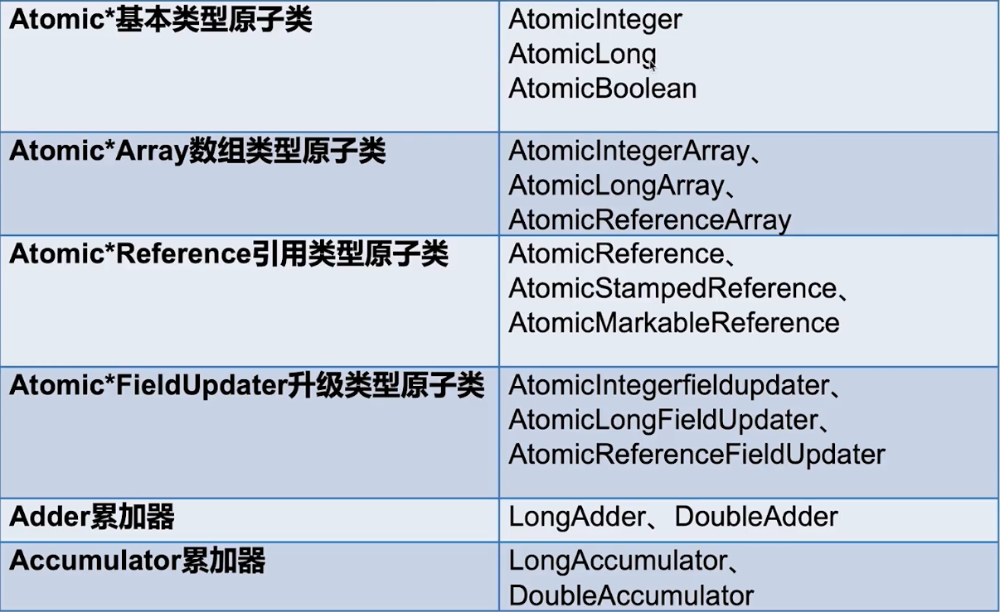
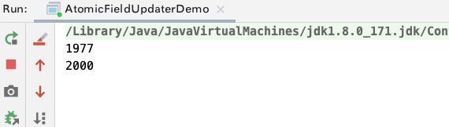
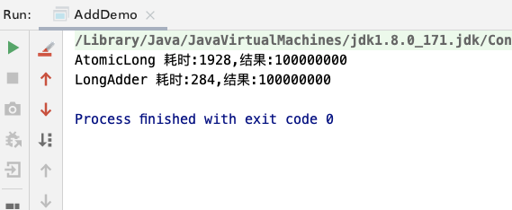

## 非阻塞同步机制与锁

### 非阻塞同步机制概述

- 在juc中的很多类具有比synchronized更高的新能与可伸缩性。这些性能的提升主要来源于: 原子变量与非阻塞的同步机制。

- <font color='red'>非阻塞算法用底层的原子机器指令(比如比较并交换指令)来代替锁来确保数据再并发访问下的一致性。</font>非阻塞算法被广泛的应用于操作系统和jvm中实现线程/进程调度机制、垃圾回收机制以及锁和其他并发数据结构。
- 从 java1.5 开始可以通过 *原子变量类* 来构建非阻塞算法

- <mark>非阻塞算法的优势?</mark>

  - 虽然在设计和实现上要复杂,但是在可伸缩性与活跃性上有巨大的优势。
  - **相对于锁方案来说，可以让多个线程在竞争相同数据的时候不会发生阻塞，所以能在粒度更细的层次对线程进行协调，并且极大的减少了线程调度开销**
  - **非阻塞算法不存在死锁与其他活跃性问题**，而在基于锁的算法中，如果一个线程在休眠或者自旋的过程中同时持有一个锁，那么其他线程都无法执行下去

### 锁的劣势

- <font color='red'>通过使用一致的锁定协议来协调对共享状态的访问，可以确保无论哪个线程持有守护变量的锁，都能采用独占的方式访问这些共享状态。并且对共享状态的任何修改对随后获得这个锁的线程都是可见的</font>
- 当多个线程竞争同一把锁的时候，jvm会将一些线程挂起并在在稍后恢复运行。当线程恢复运行的时，必须等待其他线程执行完它们的CPU时间片后才能被调度。<font color='red'>在挂起和恢复线程等过程中存在着很大的开销，并且通常存在着较长时间的中断</font>
- 和锁相比，volatile是一种轻量级的同步机制，不会生成上下文的切换或者线程调度等操作
- java中锁的语法比较简洁,单jvm和操作系统在管理锁的时候需要完成工作并不简单，<font color='red'>实现锁的时候需要遍历jvm中十分复杂的代码路径，并可能导致操作系统级的锁定、线程的挂起以及上下文的切换等操作</font>

### 硬件对并发的支持

- 在针对多处理器操作而设计的处理器中提供了一些特殊的指令，用于管理对并发数据的访问
  - 早期的处理器中支持原子的测试并设置(Test-and-Set)、获取并递增(Fetch-adn-Increment)和交换(Swap)等指令
  - 现在几乎所有的处理器都包含某种形式的原子读-改-写指令，比如比较并交换(Compare-and-Swap)、关联加载/条件存储(Load-Linked/Store-Conditional)
- 操作系统和jvm通过这些指令来实现锁和并发的数据结构

## 原子类概述

- 原子变量类的优势
	- 粒度更细: 原子变量比锁的粒度更加细，更加轻量级。<font color='red'>原子变量将发生竞争的范围缩小到单个变量上面。</font>
	- 性能较高: 在需要竞争锁的时候，通常会比锁新能更高,因为它不需要挂起或者重新调度线程
- 具有与 volatile相同的内存语义，此外还支持原子的更新操作，从而更加适合于实现`计数器、序列发生器和统计数据收集等`
- 位于 `java.util.concurrent.atomic` 包下面

## 原子类总览




## 常用原子变量类演示

### AtomicInteger

- <mark>常用方法</mark> 

  - `int get()`
    - 获取当前的值
  - `int getAndSet(int newValue)`
    - 获取当前的值并且设置新的值
  - `int getAndIncrement()`
    - 获取当前的值，并且自增
  - `int getAndDecrement()`
    - 获取当前的值,并且自减
  - `int getAndAdd(int delta)`
    - 获取当前的值,并且加上预期值
  - `boolean compareAndSet(int expect, int update)`
    - 如果当前的值等于预期值expect,那么就以原子的方式将当前值更新为输入值update

**代码演示**

```java
/**
 * <b>AtomicInteger的演示</b>
 * 对比非原子变量在多线程下的问题,使用原子变量可以在不加锁的情况下保证线程安全
 * @author <a href="mailto:zhuyuliangm@gmail.com">zyl</a>
 */
public class AtomicIntegerDemo implements Runnable{
    private static volatile int basicCount = 0;
    private static AtomicInteger atomicInteger = new AtomicInteger();
    public static void incrementAtomic() {
        atomicInteger.getAndIncrement();
    }
    public static void incrementNonAtomic() {
        basicCount++;
    }

    @Override
    public void run() {
        for (int i = 0; i < 1000; i++) {
            incrementAtomic();
            incrementNonAtomic();
        }
    }
    public static void main(String[] args) throws InterruptedException {
        AtomicIntegerDemo atomicIntegerDemo = new AtomicIntegerDemo();
        Thread t1 = new Thread(atomicIntegerDemo);
        Thread t2 = new Thread(atomicIntegerDemo);
        t1.start();
        t2.start();
        t1.join();
        t2.join();
        System.out.printf("basicCount:%d, atomicInteger%d",basicCount,atomicInteger.get());
    }
}
```


### Atomic数组

> 原子数组中每个元素的操作都是原子的

- <mark>常用方法</mark>

  - `int get(int index)`
    - 获取数组中指定索引的值
  - `int getAndSet(int index,int newValue)`
    - 获取数组指定索引的值,并且设置新的值
  - `int getAndIncrement(int index)`
    - 获取指定索引的值，并且自增
  - `int getAndDecrement(int index)`
    - 获取指定索引的值,并且自减
  - `int getAndAdd(int index,int delta)`
    - 获取指定索引的值,并且加上预期值
  - `boolean compareAndSet(int index, int expect, int update)`
    - 如果指定索引的值等于预期值expect,那么就以原子的方式将当前值更新为输入值update
    **代码演示**

```java
/**
 * <b>原子数组变量</b>
 *
 * @author <a href="mailto:zhuyuliangm@gmail.com">zyl</a>
 */
public class AtomicArrayDemo {
    public static void main(String[] args) throws InterruptedException {
        // 创建一个原子数组变量
        AtomicIntegerArray integerArray = new AtomicIntegerArray(1000);

        ExecutorService threadPool1 = Executors.newFixedThreadPool(1000);
        threadPool1.execute(() -> {
            for (int i = 0; i < integerArray.length(); i++) {
                integerArray.getAndAdd(i, 2);
            }
        });
        ExecutorService threadPool2 = Executors.newFixedThreadPool(1000);
        threadPool2.execute(() -> {
            for (int i = 0; i < integerArray.length(); i++) {
                integerArray.getAndAdd(i, -1);
            }
        });
        TimeUnit.SECONDS.sleep(1);
        for (int i = 0; i < integerArray.length(); i++) {
            if (integerArray.get(i) != 1) {
                System.out.println(integerArray.get(i));
            }
        }
    }
}
```


### Atomic引用

> 与AtomicInteger没有本质的区别，AtomicInteger可以让一个整数保证原子性，但是AtomicReference可以让一个对象保证原子性。
>
> <font color='red'>AtomicReference的功能比AtomicInteger强，因为一个对象中可以包含很多的属性</font> 


### Atomic字段升级

- <font color='red'>使用`AtomicXxxFieldUpdater`可以对普通变量进行升级</font>

- 适用场景(为什么一开始不设置为一个原子变量呢?)
  - 偶尔需要一个原子的get-set操作
- <mark>常见的方法</mark>

  - `AtomicIntegerFieldUpdater newUpdater(Class tclass,String fieldName) `
- <mark>注意点</mark> 

  - 依赖于反射,所以变量需要注意范围，是不是私有的
  - 变量不支持static

**演示代码**

```java
/**
 * <b>使用AtomicIntegerFieldUpdater 对普通的变量进行升级</b>
 * @author <a href="mailto:zhuyuliangm@gmail.com">zyl</a>
 */
public class AtomicFieldUpdaterDemo implements Runnable{
    static Person tom;
    static Person peter;
    // 创建一个AtomicIntegerFieldUpdater, 对Person.class 的 count 字段进行升级
    static AtomicIntegerFieldUpdater<Person> updater = AtomicIntegerFieldUpdater.newUpdater(Person.class, "count");
    @Override
    public void run() {
        for (int i = 0; i < 1000; i++) {
            tom.count++;
            // 对指定对象的属性进行升级
            updater.getAndIncrement(peter);
        }
    }

    public static class Person{
        volatile int count;
    }
    public static void main(String[] args) throws InterruptedException {
        tom = new Person();
        peter = new Person();
        int corePoolSize = Runtime.getRuntime().availableProcessors();
        ThreadPoolExecutor executor = new ThreadPoolExecutor(corePoolSize, corePoolSize, 60L, TimeUnit.SECONDS, new ArrayBlockingQueue<>(1024));
        AtomicFieldUpdaterDemo updaterDemo = new AtomicFieldUpdaterDemo();
        for (int i = 0; i < 2; i++) {
            executor.execute(updaterDemo);
        }
        TimeUnit.SECONDS.sleep(1);
        System.out.println(tom.count);
        System.out.println(peter.count);
    }
}
```




### Adder累加器
- 在java8 中进行引入，<font color='red'>并且高并发下`LongAdder` 比 `AtomicLong`效率高</font>，不过本质上是`以空间换时间`
- <font color='red'>LongAdder将不同线程对应到不同的Cell上进行修改,从而降低冲突的概率,这是**锁分段**的理念，提高了并发性</font>
- <mark>AtomicLong Vs  LongAdder?</mark>

  - AtomicLong每次的加操作都需要将工作内存的数据从工作内存刷入主内存,在高并发竞争激烈的情况下，会导致CAS冲突比较多
  - LongAdder，<font color='red'>每个线程都会有自己的一个计数器</font>，仅用于自己线程内的计数，这样就不需要实时的将工作内存的刷新到主内存
    - 多线程累加的时候，将不同的线程映射到LongAdder内部的Cell上，并且累加是对Cell中的数据进行累加的
    - 最后sum获取数据的时候是将LongAdder里面不同Cell的数据相加

**AtomicLong和LongAdder测试**

```java
/**
 * <b>AtomicLong 与 LongAdder测试</b>
 *
 * @author <a href="mailto:zhuyuliangm@gmail.com">zyl</a>
 */
public class AddDemo {
    public static void main(String[] args) {
        // 测试AtomicLong的耗时
        AtomicLong atomicLong = new AtomicLong();
        long atomicLongStart = System.currentTimeMillis();
        ExecutorService threadPool1 = Executors.newFixedThreadPool(1000);
        for (int i = 0; i < 10000; i++) {
            threadPool1.submit(() -> {
                for (int j = 0; j < 10000; j++) {
                    atomicLong.getAndIncrement();
                }
            });
        }
        threadPool1.shutdown();
        while(!threadPool1.isTerminated()) {

        }
        System.out.println("AtomicLong 耗时:"+(System.currentTimeMillis() - atomicLongStart)+",结果:"+atomicLong.get());

        //测试LongAdder
        LongAdder adder = new LongAdder();
        long longAdder = System.currentTimeMillis();
        ExecutorService threadPool2 = Executors.newFixedThreadPool(1000);
        for (int i = 0; i < 10000; i++) {
            threadPool2.submit(() -> {
                for (int j = 0; j < 10000; j++) {
                    adder.increment();
                }
            });
        }
        threadPool2.shutdown();
        while(!threadPool2.isTerminated()) {

        }

        System.out.println("LongAdder 耗时:"+(System.currentTimeMillis() - longAdder)+",结果:"+adder.sum());
    }
}
```




#### 源码

```java
// 加操作
public void add(long x) {
  Cell[] as; 
  long b, v; 
  int m; 
  Cell a;
  if ((as = cells) != null || !casBase(b = base, b + x)) {
    boolean uncontended = true;
    if (as == null || (m = as.length - 1) < 0 ||
        (a = as[getProbe() & m]) == null ||
        !(uncontended = a.cas(v = a.value, v + x)))
      longAccumulate(x, null, uncontended);
  }
}
// 最后求和
public long sum() {
  Cell[] as = cells; Cell a;
  long sum = base;
  if (as != null) {
    for (int i = 0; i < as.length; ++i) {
      if ((a = as[i]) != null)
        sum += a.value;
    }
  }
  return sum;
}

```

### Accumulator

- 与LongAdder 十分相似，是一个普通版本的Addder
- <mark>常见方法?</mark>

  - `LongAccumulator(LongBinaryOperator accumulatorFunction,long identity)`
    - accumulatorFunction: 计算函数，会传入两个参数
      - 第一个: 上次计算的结果
      - 第二个: 下次计算的值
    - identity
      - 首次计算的第一个参数的值
- <mark>使用场景</mark>

  - **需要大量的计算、并行的计算**
  - **对计算顺序没有要求**

```java
/**
 * <b>一句话描述</b>
 *
 * @author <a href="mailto:zhuyuliangm@gmail.com">zyl</a>
 */
public class LongAccumulatorDemo {
    public static void main(String[] args) {
        // 多线程计算 1+100
        LongAccumulator longAccumulator = new LongAccumulator((oldValue, newValue) -> oldValue+newValue, 0);
        ExecutorService threadPool = Executors.newFixedThreadPool(8);
        for (int i = 1; i <= 100; i++) {
            int finalI = i;
            threadPool.execute(() -> {
                longAccumulator.accumulate(finalI);
            });
        }
        threadPool.shutdown();
        while (!threadPool.isTerminated()) {

        }
        System.out.println(longAccumulator.getThenReset());
    }
}
```


## CAS概述

- CAS(Compare And Swap)比较并交换。CAS包含了三个操作数:`需要进行读写的内存位置的值V`、`进行比较的值A`、`希望更新的新值B`。<font color='red'>当且仅当 V=A时，CAS才会通过原子的方式将A更新为B，否则不会进行任务操作。最后会返回内存位置的原本的值V</font>
- 当多个线程尝试使用CAS同时更新同一个变量的时候，只有其中一个线程可以更新变量的值，而其他线程都会失败
  - <font color='red'>但是,失败的线程并不会被挂起(这个与锁不一样，锁在获取失败后会被挂起)，而是被告知此次修改失败，并可以再次尝试。当前线程可以选择不执行任何操作</font>
- <mark>CAS的缺点?</mark>

  - 需要由调用者来决定如何处理竞争问题,比如说采用重试、回退还是放弃等，而锁可以自动处理竞争问题(线程在获得锁之前会一直被阻塞)
    - <font color='red'>在高度竞争的情况下，锁可以更加有效的避免竞争。CAS适合于中低程度的竞争。</font>
  - `ABA问题`
  - `自旋过程过长`

- <mark>jvm对CAS的支持</mark>

  - 在jdk1.5之前，不使用明确的代码无法使用CAS。在jdk1.5之后引入了底层的支持，在int、long和对象引用等类型上公开了CAS操作,<font color='red'>并且jvm会将这些操作编译为底层硬件提供的最有效方法</font>
  - **在支持CAS的平台上: 运行时把它们编译为相应的机器指令**
  - **在不支持CAS的平台上:jvm会通过自旋锁**
- <mark>CAS的应用场景</mark>

  - 乐观锁
  - 并发容器
  - 原子变量
- <mark>Unsafe类?</mark>

  - 是CAS的核心类，java无法直接访问底层操作系统，需要通过native方法访问。而unsafe中提供了这些本地方法，提供了硬件级别的原子操作

## 模拟CAS代码

```java
public class SimulatedCAS {
    public int value;

    /**
     * 模拟说明cas的语义(不是实现,因为cas原子的操作由cpu保证,不是synchronized)
     * cas无论是否更新成功,最后都会返回需要修改的内存地址原本的值
     * @param expectValue 期待的内存地址的值
     * @param newValue 需要设置的新值
     * @return 内存地址的原本的值
     */
    public synchronized int compareAndSwap(int expectValue, int newValue) {
        int oldValue = value;
        if (expectValue == oldValue) {
            this.value = newValue;
        }
        return oldValue;
    }
    public synchronized boolean compareAndSet(int expectValue, int newValue) {
        return expectValue == compareAndSwap(expectValue, newValue);
    }
    public static void main(String[] args) {
        intCounter counter = new intCounter();
        int NCPU = Runtime.getRuntime().availableProcessors();
        ThreadPoolExecutor executor = new ThreadPoolExecutor(NCPU,NCPU, 0L, TimeUnit.MILLISECONDS,new ArrayBlockingQueue<>(1024));
        for (int i = 0; i < 5; i++) {
            executor.execute(() -> {
                for (int j = 0; j < 1000; j++) {
                    counter.increment();
                }
            });
        }
        executor.shutdown();
        while (!executor.isTerminated()) {}
        System.out.println(counter.get());
    }
}
// 非阻塞的计数器
class intCounter {
    SimulatedCAS simulatedCAS = new SimulatedCAS();
    public int get() {
        return simulatedCAS.value;
    }
    public int increment() {
        int v;
        do{
            // 比较失败后,将最新的值更新到线程的工作内存中
            v = get();
        }while(v!=simulatedCAS.compareAndSwap(v,v+1));
        return  v+1;
    }
}
```


## ABA问题

- CAS会判断内存地址的实际值与预期值是否一致，一致就更新。但是<font color='red'>可能在判断是否一致的期间，其他线程将内存地址的值改为其他值，然后线程本省或者其他线程又将内存地址值改回去</font>
  - 即虽然内存地址最后的值与预期值是一致的，但是并不能保证期间内存地址的值没有发生改变
- <mark>一种相对简单的解决方案</mark>

  - **在原来的基础上引入版本号，在更新的时候也同时更新内存地址的值与版本号。那么比较的时候即判断内存地址的值也需要判断版本号**
  - 即使内存地址的值与预期的值不一致，但是由于版本号不同也不会更新成功。


