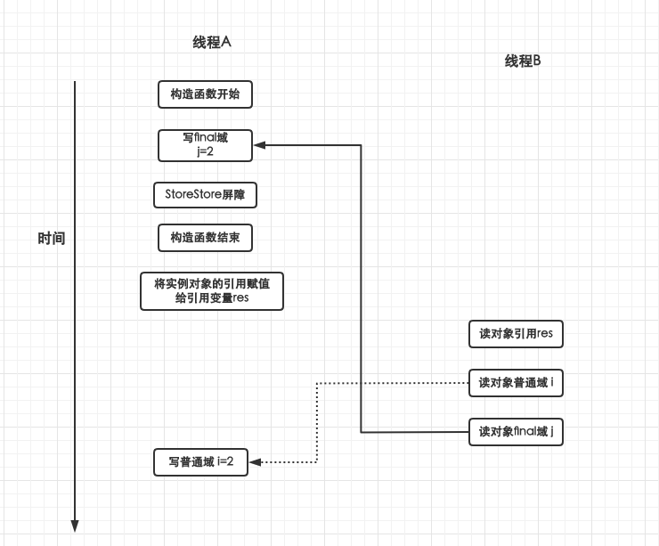
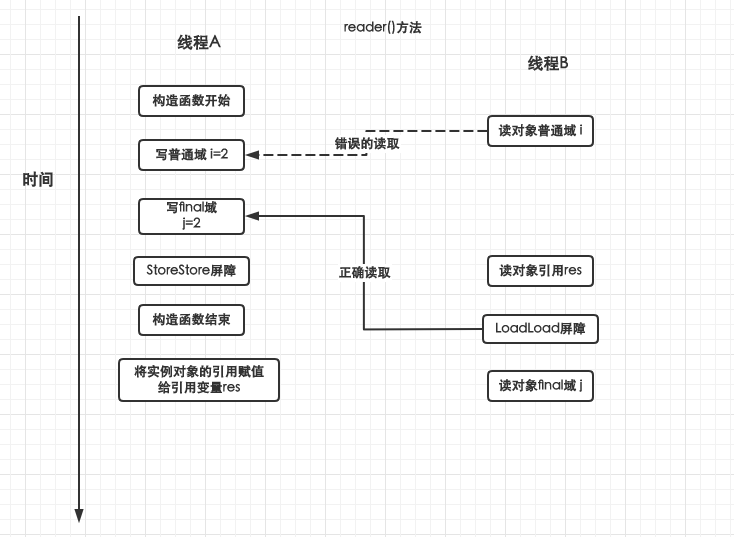

## final不变性

- <mark>不变性</mark>

  - 对象被创建后，里面所有的状态或者对象引用不能被修改，那么这些状态或者对象引用就是不变的
  - <font color='red'>具有不变性的对象一定是线程安全的，不需要采取额外的安全措施就可以保证线程安全</font>
- <mark>final的作用</mark>

  - 修饰类防止被继承、修饰方法方式被重写、修饰变量防止被修改(三种用法)
  - 天生是线程安全的(因为无法被修改)，而且不需要额外的同步开销

## final修饰三种变量

- final instance variable (类中的final属性)
  - 在定义变量的时候赋值
  - 在构造函数中赋值
  - 在构造代码块中赋值
- final static variable (类中的static final 属性)
  - 在定义变量的时候赋值
  - 在静态代码块中赋值
- final local variable (方法中的final变量)
  - 在定义时赋值
  - 在使用前赋值

:::tip final使用回顾点

1. 静态代码块(只执行一次) -> 构造代码块(执行多次) -> 构造函数(执行多次)
2. final初始化后就无法修改(引用类型变量可以修改对象的属性值,但是不能修改变量指向的引用),且声明之后一定要显式的初始化
   - 在声明final变量的时候初始化
   - 在构造代码块中初始化

3. 在构造函数中进行初始化

:::

## final修饰方法

- final修饰的方法无法被override重写,并且不允许子类中存在方法名与参数列表一致的方法
- <font color='red'>static方法也不能被重写，因为static方法属于类本省而不是实例对象。但是子类中可以包含方法名、参数列表好饿父类static方法一致的方法</font>
  - 子类中与父类中一样的静态方法，实际上并不是重写，而是只属于子类，与父类无关

## 栈封闭技术

- <mark>如何通过final实现对象不可变?</mark>

  - 仅将对象所有属性都设置为final？ -> 不行，因为对象里面的属性可能是一个引用类型，无法保证引用类型中属性也都是final的
- <mark>满足以下条件的对象才是不可变的</mark>

  - 对象创建后，它的状态变量不能被修改(注意final修饰的引用类型，引用中的属性可能可以被修改)
  - 所有的属性都是final修饰的
  - <font color='red'>对象**创建过程中**没有发生逸出</font>
- <mark>栈封闭</mark>

  - <font color='red'>只能通过局部变量才能访问对象，因为局部变量封闭在执行线程的内部(栈中)，其他线程无法访问</font>

**代码演示**

首先，persons是一个私有变量，所以无法被外部访问。其次，外部想要操作persons变量只能通过类中提供的方法来实现

这就将 persons 控制在执行线程的内部

```java
public class StackLockDemo {
    private final Set<String> persons = new HashSet<>();
    public StackLockDemo() {
        persons.add("lisi");
        persons.add("lisi2");
        persons.add("lisi3");
    }
    public boolean isPerson(String name){
        return persons.contains(name);
    }
}
```


## final域的内存语义

### final的重排序规则

- 对于final域编译器和处理器需要遵守两个重排序规则
  - 在构造函数中对final域的写入,与随后把这个被构造对象的引用赋值给一个引用变量之间不允许重排序
  - 初次读取一个包含final域的对象的引用,与随后初次读取这个final域之间不允许重排序

```java
public class finalExample {
    int i;
    final int j;

    public finalExample() {
        i=1;
        j=2;
    }
    static finalExample finalExample;

    public static void writer(){
        finalExample = new finalExample();
    }
    public static void reader() {
        finalExample res = finalExample;
        int a = res.i;
        int b = res.j;
        System.out.println("a:"+a+",b:"+b);
    }
}
```

### final写的重排序规则

- <font color='red'>jmm禁止把对final的写重排序到构造函数之外</font>

  - 编译器会在final写之后,构造函数return之前插入一个`StoreStore`的屏障,禁止处理器将final的写重排序到构造函数之外
- <mark>写final域的重排序规则可以保证</mark>

  - <font color='red'>在实例对象的引用为任意线程可见之前,对象final域已经被正确的初始化过了,但是普通域不具有这种保证</font>

**finalExample写final域分析**

在编译器优化时，写普通域的操作可能会被重排序到构造函数之外，那么线程B读取到i的值就是设置为2之前的值。

但是由于final域后面插入了StoreStore屏障，保证构造函数返回对象引用时，final变量j已经被设置为了1，所以线程B读到的是final初始化后的值2



### final读的重排序规则

- <font color='red'>在一个线程中，初次读对象引用与初次读该对象中包含的final域，jmm禁止处理器将这两个操作重排序</font>

  - 编译器会在读取final与的前面插入一个`LoadLoad`屏障
- <mark>读final域可以保证</mark>

  - <font color='red'>在读一个对象的final域之前,一定会先读包含这个final域的对象的引用</font>,即对象引用不是null,那么这个对象中的final域一定被初始化过了

**finalExample读final域分析**

普通域的读可能会被重排序到读取对象引用res之前，可能此时i还没有被设置为2，所以读取到了错误的数据

由于读final域禁止重排序，将读取final变量限制在读取到对象引用之后，并且由于写final域的重排序规则，读取到对象引用时final域一定已经初始化完成，所以读取的是正确的数据


