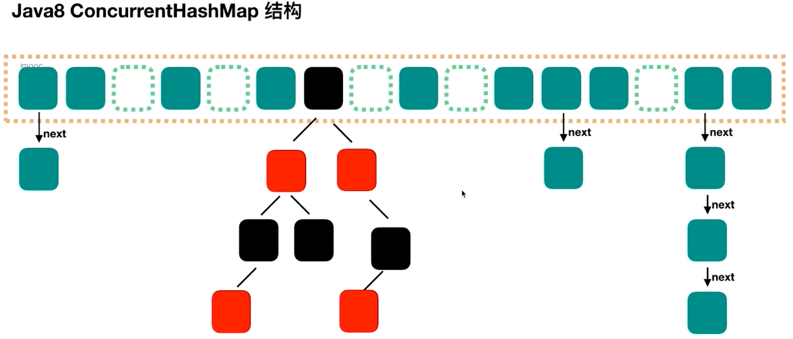
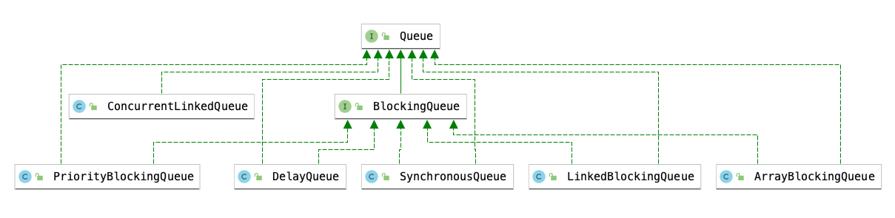

## 概览

### 并发容器概览

- `ConcurrentHashMap`
  - 线程安全的HashMap
- `CopyOnWriteArrayList`
  - 线程安全的List
- `BlockingQueue`
  - 阻塞队列接口,<font color='red'>十分适合作为数据共享的通道</font>
- `ConcurrentLinkedQueue`
  - 高效的非阻塞并发队列,采用链表实现。可以看做一个线程安全的LinkedList
- `ConcurrentSkipListMap`
  - 一个Map,使用跳跃表的数据结构进行快速查找

### 同步容器类

> 同步容器类包含: `Vector`、`Hashtable`。此外还有通过`Collections.synchronizedXxx`工厂方法创建的封装器类。
>
> 这些类实现线程安全的方式就是: *将状态封装起来，并且对每一个公共方法加上同步，使得每次只有一个线程可以访问容器的状态*

1. <mark>同步容器类的问题?</mark> 

    - 同步容器类都是安全的，但是在某些情况下可能需要额外的加锁来保护复合操作
      - **迭代**: 反复访问元素，直到遍历完容器中的所有元素
      - **跳转**: 根据指定顺序找到当前元素的下一个元素
      - **条件运算**: 比如没有则添加
    - 容器的公共方法都是同步方法,意味着执行效率不是很高,并发性能差

### Map概述

- HashMap
  - 通过散列函数计算出对象的hash值，通过hash值查找元素的位置
  - <font color='red'>不是线程安全</font> 
  - <font color='red'>数据迭代时,不允许修改内容</font>
  - <font color='red'>只读的并发是安全的</font> 
  - 允许一个元素的额key=null
- ~~Hashtable~~
- LinkedHashMap
- TreeMap: 实现了SortedMap,Map中的元素时可排序的

#### jdk1.7的HashMap

- <font color='red'>底层采用 <strong>数组+链表</strong></font>
- 采用`链表法`,在冲突的位置建立一个链表，然后将冲突的数据插入到链表的最后


#### jdk1.8的HashMap

- <font color='red'>底层采用 <strong>数组+链表+红黑树</strong></font>
- jdk1.8 中默认用链表存储冲突的元素，但是当冲突元素较多(大于8)时，会将链表会转化为红黑树存储冲突元素
- <mark>红黑树</mark>

  - 是一种 `二叉平衡查找树`
    - 每个节点要么是红色,要么是黑色。但是根节点一定是黑色
    - <font color='red'>红色节点不能连续-> 红色节点的父节点和子节点都不能是红色的</font> 
    - 从任意节点到其子树中每个叶子节点的路径都包含<font color='red'>相同数量的黑色节点</font>
    - 每个叶子节点都是黑色的
  - 常规的二叉树(数据小在节点左侧，大的在节点右侧)可能存在某侧数据较多导致二叉树的不平衡。红黑树会自动平衡，防止极端不平衡的情况下影响查询效率


## ConcurrentHashMap

> 可用取代同步的HashMap，它内部还提供了一些对常规符合操作的支持，比如没有则添加

### 概述

1. <mark>Map -> ConcurrentHashMap</mark>

    - 同步容器类在执行每个操作期间都会持有一把锁，这种方式虽然能够保证并发情况下的线程安全，但是在多个线程竞争锁时性能较低。

    - 与HashMap一样，ConcurrentHashMap 也是基于散列的Map，但是它采用了完全不同的加锁策略来提供更高的并发性与伸缩性

    - <font color='red'>ConcurrentHashMap不是将每个方法都在同一个锁上同步并使得每次只能有一个线程访问容器，而是采用<strong>分段锁</strong>的方式实现更大程度的共享</font>
    - <font color='red'>将数据分成一段一段地存储，然后给每一段数据配一把锁。当一个线程用独占锁访问其中一个数据段的时候,其他线程还可以访问其他数据段</font>

2. <mark>ConcurrentHashMap的 “弱一致性”</mark>

    - ConcurrentHashMap 返回的迭代器具有弱一致性，而不是“快速失败”。弱一致性的迭代器可以容忍并发的修改。当创建迭代器时会遍历已有的元素，并可以(<font color='red'>但是不保证</font>)在迭代器被构造后将修改操作反映给容器

    - 比如 size和 isEmpty 方法语义被弱化了。由于弱一致性,size返回的结果在计算时可能已经过期了。但是在并发的情况下，这些方法的用处很小，因为他们的返回值总是在变化的

3. <mark>分段锁的好处?</mark>

    - <font color='red'>任意数量的读取线程</font>可以并发的访问Map，并且<font color='red'>一定数量的写入线程</font>可以并发的修改Map 


### 为什么要使用它?

1. <mark>HashMap线程不安全</mark>

   - 同时put <font color='red'>扩容、碰撞</font>会导致数据丢失 -> 扩容时机: <font color='red'>容量大小*负载因子</font>
   - <font color='red'>在多线程下使用HashMap进行put操作会引起死循环，导致CPU利用率拉满</font> [注:存在于jdk1.7及以下版本] 

     - 原因: `多线程下会导致HashMap的Entry链表形成环形数据结构，一旦形成环形数据结构，Entry的next节点永远不会为空，就会产生死循环获取Entry`
2. <mark>Hashtable效率低下</mark>

   - Hashtable容器使用synchronized来保证线程安全,但是在线程竞争激烈的情况下，Hashtable的效率很低。比如线程1使用put方法进行元素的添加时，线程2不但不能使用put方法，而且也不能使用get方法获取元素
3. <mark>ConcurrentHashMap的分段锁计数可有效的提高并发效率</mark>

   - Hashtable在竞争激烈的并发环境下效率低下的原因在于访问Hashtable的线程都是使用的同一把锁(同步方法的锁是实例对象本身)
   - ConcurrentHashMap中有多个锁,每个锁用于锁住容器中的一部分数据，<font color='red'>当多线程访问容器中不同数据段的数据时，线程之间不存在锁竞争</font>

**HashMap多线程死循环代码演示**

```java
/**
 * <b>演示HashMap在多线程的情况下死循环的问题(仅在jdk1.7版本及以下)</b>
 *
 * @author <a href="mailto:zhuyuliangm@gmail.com">zyl</a>
 */
public class HashEndlessLoopDemo {
    // 定义一个初始大小为2,负载因子是1.5 的hashmap,添加的数据超过3个就会触发map的扩容
    static HashMap<String, String> hashMap = new HashMap<>(2, 1.5f);
    public static void main(String[] args) throws InterruptedException {

        Thread thread = new Thread(new Runnable() {
            @Override
            public void run() {
                for (int i = 0; i < 1000; i++) {
                    final int finalI = i;
                    new Thread(new Runnable() {
                        @Override
                        public void run() {
                            hashMap.put(UUID.randomUUID().toString(), "");
                        }
                    }, "Thread" + i).start();
                }
            }
        }, "Thread");
        thread.start();
        thread.join();
    }
}
```


### jdk1.7的结构

- 由`Segment数组和HashEntry数组构成的`
  - <mark>Segment</mark>

    - 继承了`ReentrantLock`,也是一种<font color='red'>可重入锁</font>。结构和HashMap类似，是一种链表+数组结构。
    - 一旦初始化后不可以再次初始化，<font color='red'>默认有16个</font>
  - <mark>HashEntry</mark> 

    - 用于存储键值对数据，是一种链表结构
- <font color='red'>每个Segment 维护一个 HashEntry 的数组，当对HashEntry中的数据进行修改时,需要获取 HashEntry对应的Segment锁</font>


### jdk1.8的结构

- 主要采用Node + CAS + synchronized方式实现,数据存储在Node<K,V>[]中
  
  ```java
  // 存储map数据的数组,数组元素数据类型是Node。
  // 并且这个初始化是懒汉式的，在第一次插入的时候才会初始化
  volatile Node<K,V>[] table
  
  // 提供获取map键值对元素的视图
  private transient KeySetView<K,V> keySet;
  private transient ValuesView<K,V> values;
  private transient EntrySetView<K,V> entrySet;
  ```
  
- <mark>Node</mark>

  - ConcurrentHashMap 通过Node 存储数据,Node继承了 *Map.Entry*

  - 提供了下面四个属性

    ```java
    // 元素hash值
    final int hash;	
    // map的键
    final K key;
    // map的值(涉及到并发的修改，使用volatile保证可见性)
    volatile V val;
    // 记录同一个元素位置next
    volatile Node<K,V> next;
    ```





#### putVal流程
1. 判断 key,value的是否为null(ConcurrentHashMap的不允许键值等于null)
2. 计算hash值
3. 如果Node[] 对应位置没有数据,通过CAS的方式将数据插入到Node[]中
4. 如果Node[] 对应位置有数据的话,根据位置节点的类型来处理碰撞冲突的数据
   - 如果是MOVED,就调用helpTransfer
   - 如果不是MOVED,就增长链表或者给红黑树增加节点
5. 检查是否满足 需要转化为红黑树的阈值 TREEIFY_THRESHOLD(默认是8),如果满足就将链表"红黑树化"
6. 返回oldVal

```java
final V putVal(K key, V value, boolean onlyIfAbsent) {
  if (key == null || value == null) throw new NullPointerException();
  int hash = spread(key.hashCode());
  int binCount = 0;
  for (Node<K,V>[] tab = table;;) {
    Node<K,V> f; 
    int n, i, fh;
    // 第一次插入数据时初始化Node[]
    if (tab == null || (n = tab.length) == 0){
      tab = initTable();
    } 
    else if ((f = tabAt(tab, i = (n - 1) & hash)) == null) {
       // no lock when adding to empty bin
      if (casTabAt(tab, i, null,new Node<K,V>(hash, key, value, null))) {       
        break;                   
      }
    }
    else if ((fh = f.hash) == MOVED){
      tab = helpTransfer(tab, f);
    }
    else {
      V oldVal = null;
      synchronized (f) {
        if (tabAt(tab, i) == f) {
          if (fh >= 0) {
            binCount = 1;
            for (Node<K,V> e = f;; ++binCount) {
              K ek;
              if (e.hash == hash && ((ek = e.key) == key || (ek != null && key.equals(ek)))) {
                oldVal = e.val;
                if (!onlyIfAbsent) {
                  e.val = value;
                }
                break;
              }
              Node<K,V> pred = e;
              if ((e = e.next) == null) {
                pred.next = new Node<K,V>(hash, key,value, null);
                break;
              }
            }
          }
          else if (f instanceof TreeBin) {
            Node<K,V> p;
            binCount = 2;
            if ((p = ((TreeBin<K,V>)f).putTreeVal(hash, key,value)) != null) {
              oldVal = p.val;
              if (!onlyIfAbsent) {
                p.val = value;
              }
            }
          }
        }
      }
      if (binCount != 0) {
        if (binCount >= TREEIFY_THRESHOLD) {
          treeifyBin(tab, i);
        }
        if (oldVal != null) {
          return oldVal;
        }
        break;
      }
    }
  }
  addCount(1L, binCount);
  return null;
}
```


#### get流程
1. 计算hash值
2. 找到对应的位置,根据情况进行
   - 直接获取对应位置的值
   - 从红黑树里面查找值、遍历链表取值
3. 返回找到的结果

```java
public V get(Object key) {
  Node<K,V>[] tab; 
  Node<K,V> e, p; 
  int n, eh; K ek;
  int h = spread(key.hashCode());
  if ((tab = table) != null && (n = tab.length) > 0 && (e = tabAt(tab, (n - 1) & h)) != null) {
    if ((eh = e.hash) == h) {
      if ((ek = e.key) == key || (ek != null && key.equals(ek))) {
        return e.val;
      }
    }
    else if (eh < 0) {
      return (p = e.find(h, key)) != null ? p.val : null;
    }
    while ((e = e.next) != null) {
      if (e.hash == h &&((ek = e.key) == key || (ek != null && key.equals(ek)))) {
        return e.val;
      }
    }
  }
  return null;
}
```


### jdk1.8中的升级

1. 数据结构的升级
   - 从原来的Segment变为了Node。并发从原来的默认16个变为每个Node独立，并发能力提高了
2. Hash碰撞
   - 从原来的链表法改为 链表法+红黑树的方式
3. 保证并发安全
   - 1.7中采用的Segment 分段锁，默认有16个Segment
   - 1.8中采用CAS+synchronized的方式
4. 查询复杂度
   - 从O(n) -> O(logn)

### ConcurrentHashMap“线程不安全”

> ConcurrentHashMap 在一些情况也会出现线程不安全的情况,比如复合操作。
>
> <font color='red'>实际上，ConcurrentHashMap保证的是在并发情况下的put不会出现数据错乱</font>


**ConcurrentHashMap复合操作导致线程不安全**

```java
public class ConcurrentHashMapDemo implements Runnable{
    static ConcurrentHashMap<String, Integer> hashMap = new ConcurrentHashMap<>();
    public static void main(String[] args) throws InterruptedException {
        hashMap.put("A", 0);
        Thread thread1 = new Thread(new ConcurrentHashMapDemo());
        Thread thread2 = new Thread(new ConcurrentHashMapDemo());
        thread1.start();
        thread2.start();
        thread1.join();
        thread2.join();
        System.out.println(hashMap.get("A"));
    }

    @Override
    public void run() {
        for (int i = 0; i < 1000; i++) {
            // 先从ConcurrentHashMap中获取,在数据修改后再将数据存入ConcurrentHashMap
            // 而数据修改这部分是线程不安全的
            Integer count = hashMap.get("A");
            count = count + 1;
            hashMap.put("A", count);
        }
    }
}
```


**通过ConcurrentHashMap提供的复合方法**

通过 `hashMap.replace()` 方法在更新时会判断期望值与实际值(CAS)。我们可以通过循环的方式在失败后继续尝试更新数据直到成功

```java
public class ConcurrentHashMapDemo2 implements Runnable{
    static ConcurrentHashMap<String, Integer> hashMap = new ConcurrentHashMap<>();
    public static void main(String[] args) throws InterruptedException {
        hashMap.put("A", 0);
        Thread thread1 = new Thread(new ConcurrentHashMapDemo2());
        Thread thread2 = new Thread(new ConcurrentHashMapDemo2());
        thread1.start();
        thread2.start();
        thread1.join();
        thread2.join();
        System.out.println(hashMap.get("A"));
    }

    @Override
    public void run() {
        for (int i = 0; i < 1000; i++) {
            for(;;) {
                Integer count = hashMap.get("A");
                Integer newCount = count + 1;
                boolean res = hashMap.replace("A", count, newCount);
                if (res) break;
            }
        }
    }
}

```


## CopyOnWriteArrayList

### 概述

> 1. 用于代替 Vector和synchronizedList，就像ConcurrentHashMap代替 synchronizedMap的原因一样
> 2. <font color='red'>Copy-On-Write并发容器还包括 CopyOnWriteArraySet，用于代替 同步的Set</font> 


- <mark>适用场景</mark>

  - <font color='red'>读操作可以尽可能的快，但是写操作即使慢一点也没有太大关系</font> -> 只读操作远多于修改操作,且List大小通常保持很小

    - 黑白名单: 每日更新
    - 监听器: 迭代操作远多余修改操作
- <mark>读写规则 [Vs ReentrantReadWriteLock]</mark>

  - 对于读写锁来说，读是共享锁(所有的读操作共用一把锁)，但是写是独占锁
  - 对于CopyOnWriteArrayList来说，<font color='red'>读取是完全不用加锁的，并且写操作也不会阻塞读取操作。只有写入和写入之间需要同步等待</font>  
- <mark>CopyOnWriteArrayList的缺点</mark>

  - <font color='red'>数据不一致的问题</font>

    - 只能保证最终数据的一致性，不能保证数据的实时一致性。如果希望写入的数据马上就能读到，那么CopyOnWriteArrayList不适合
  - <font color='red'>内存占用问题</font>

    - 因为所有的CopyOnWrite add()、set()和remove()等修改操作需要复制整个基础数组，所以对于内存的开销很大 -> 属于以空间换时间
- <mark>CopyOnWriteArrayList 的特点</mark>

  - <font color='red'>采用读写分离的思想: 在写操作时，在内存中拷贝一份CopyOnWriteArrayList底层数组的备份，然后进行写操作。当写操作完成后，再将底层数组的内存地址指向之前拷贝的数组</font>
  - 它是线程安全的,**写线程获取到锁的时候，其他写线程阻塞。但是读线程不加锁所以也不阻塞**
  - <font color='red'>使用迭代器进行遍历的速度很快，并且不会与其他线程发生冲突。在构造迭代器时，迭代器依赖于不变的数组快照</font> 

### 代码

CopyOnWriteArrayList可以在迭代的期间进行修改。<font color='red'>注意:迭代期间的修改，无法在迭代期间通过next方法获取到。因为迭代器内部的数组是获取迭代器时CopyOnWriteArrayList的快照</font>

```java
public class CopyOnWriteListDemo {
    public static void main(String[] args) {
        CopyOnWriteArrayList<String> list = new CopyOnWriteArrayList<>();
        list.add("1");
        list.add("2");
        list.add("3");
        list.add("4");
        list.add("5");
        Iterator<String> iterator = list.iterator();
        while(iterator.hasNext()) {
            System.out.println("当前List:"+list);
            String next = iterator.next();
            System.out.println(next);
            if(next.equals("3")) {
                list.remove("5");
            }
            if(next.equals("4")) {
                list.add("4444");
            }
        }
    }
}
```


### 源码分析

```java
public class CopyOnWriteArrayList<E> implements List<E>, RandomAccess, Cloneable, java.io.Serializable {
    private static final long serialVersionUID = 8673264195747942595L;
    /** 写操作的锁 */
    final transient ReentrantLock lock = new ReentrantLock();

    /** 
      底层基础数组，只能通过 getArray、setArray 进行访问
    */
    private transient volatile Object[] array;
  
    /**
     * 获取底层基础数组， 没有私有化是因为可以给 CopyOnWriteArraySet 使用
     */
    final Object[] getArray() {
        return array;
    }

    /**
     * 设置底层基础数组
     * 注意：这里将底层基础数组引用地址修改了，那么迭代器COWIterator中的snapshot就是一个获取迭代器时底层数组的快照
     */
    final void setArray(Object[] a) {
        array = a;
    }
  	
    /**
     * 设置一个空的底层基础数组
     */
    public CopyOnWriteArrayList() {
        setArray(new Object[0]);
    }

    /**
     * 如果传入的集合不是 CopyOnWriteArrayList实例，会将集合拷贝为一个Object数组，并且设置到底层基础数组中
     */
    public CopyOnWriteArrayList(Collection<? extends E> c) {
        Object[] elements;
        if (c.getClass() == CopyOnWriteArrayList.class)
            elements = ((CopyOnWriteArrayList<?>)c).getArray();
        else {
            elements = c.toArray();
            if (elements.getClass() != Object[].class)
                elements = Arrays.copyOf(elements, elements.length, Object[].class);
        }
        setArray(elements);
    }
		// 添加操作
    public boolean add(E e) {
      final ReentrantLock lock = this.lock;
        // 获取并且加锁
        lock.lock();
        try {
          // 获取底层基础数组
          Object[] elements = getArray();
          int len = elements.length;
          // 通过基础数组拷贝一个新的数组
          Object[] newElements = Arrays.copyOf(elements, len + 1);
          // 向新的数组中添加元素
          newElements[len] = e;
          // 用拷贝的数组替换掉底层基础数组
          setArray(newElements);
          return true;
        } finally {
          // 释放锁
          lock.unlock();
        }
    }
    // 获取元素时，可以看到是从底层基础数组中获取数据的
    public E get(int index) {
      return get(getArray(), index);
    }
  	// 获取迭代器
    public Iterator<E> iterator() {
      	// getArray() 方法返回的就是CopyOnWriteArrayList 的底层数组
        return new COWIterator<E>(getArray(), 0);
    }
  	// 静态内部类 COWIterator,支持迭代时修改
    static final class COWIterator<E> implements ListIterator<E> {
        /** 当前CopyOnWriteArrayList 底层数组的快照 */
        private final Object[] snapshot;
      	/** 游标位置，确定下一个的位置 */
        private int cursor;
				
        private COWIterator(Object[] elements, int initialCursor) {
            cursor = initialCursor;
            snapshot = elements;
        }
				// ...
    }
}
```


## 并发队列

:::info 为什么需要使用队列

1. 用队列可以在线程间传递数据: 生产者与消费者模式(A生成数据，B消费数据 -> *FIFO*)
2. 在并发情况下线程安全问题从开发人员转移到了 ”队列“ 上

:::

### 概述

- java提供了线程安全的队列,实现线程安全由两种方式:阻塞算法与非阻塞算法，所以存在两种队列
  - <font color='red'>阻塞队列</font> : BlockingQueue 
  - <font color='red'>非阻塞队列</font>

    - `ArrayBlockingQueue` :由数据结构组成的有边界阻塞队列
    - `LinkedBlockingQueue` : 由链表结构组成的有边界阻塞队列
    - `PriorityBlockingQueue`  : 支持优先级排序的无边界阻塞队列
    - `DelayQueue`: 使用优先级队列实现的无边界阻塞队列
    - `SynchronousQueue` : 不存储元素的阻塞队列
    - `LinkedTransferQueue` : 由链表结构组成的无边界阻塞队列
    - `LinkedBlockingDeque` : 由链表结构组成的双向阻塞队列




### 阻塞队列(BlockingQueue)

#### 概述

- <mark>什么是阻塞队列?</mark>

  - 具有<font color='red'> **阻塞功能的队列**</font>, 所以首先是一个队列,其次是具有阻塞功能
    - `阻塞的插入`: 当队列满了后,队列会阻塞插入元素的线程,直到队列不满
    - `阻塞的移除`: 当队列为空的时候，获取元素的线程会等待队列变为非空
  - 通常来说,阻塞队列适用于“**生产者-消费者模型**”，生产者是向队列中添加元素的线程，而消费者是从队列中获取元素的线程

  - <font color='red'>阻塞队列就是生产者用来存放元素,消费者用来获取元素的容器</font>
- **特点**
  - <font color='red'>队列不接受 NULL 元素，</font>当试图插入一个NULL元素时，会报 空指针异常
  - <font color='red'>队列可以是限定容量的</font>，通过 remainingCapacity()方法可以返回队列还可以添加多少元素，没有指定队列的大小，默认是<code>Integer.MAX_VALUE</code>

- 阻塞队列与线程池的关系: 阻塞队列就是线程池的重要组成部分(workingQueue)
- <mark>阻塞式的插入和删除有四种处理方式</mark>

  - `抛出异常`
  - `返回特殊值`
  - `阻塞`
  - `超时退出`

**插入与移除操作的4中处理方式**

|  方法/处理方式    | 抛出异常    | 返回特殊值     | 阻塞     | 超时退出                   |
| ---- | ----------- | ---------- | -------- | ---------------------- |
| 插入 | `add(e)`    | `offer(e)` | `put(e)` | `offer(e, time, unit)` |
| 移除 | `remove()`  | `poll()`   | `take()` | `poll(time,unit)`      |
| 检查 | `element()` | `peek()`   | 不可用   | 不可用                 |


#### 阻塞队列常见方法

- <mark>抛出异常</mark>

  - <font color='red'><strong>add(E e)</strong></font> 

    - 将元素插入到队列中
    - 插入成功返回true，如果队列空间不足则抛出异常
  - <font color='red'><strong><strong>remove()</strong></strong></font>

    -  获取并移除此队列的头部元素
    -  移除成功返回元素,移除失败抛出异常
- <mark>返回特殊值</mark>

  - <font color='red'><strong>offer(E e)</strong></font>

    -  将元素插入到队列中
    -  插入成功返回true,如果队列没有可用的空间则返回 false
  - <font color='red'><strong>poll</strong></font>

    -  获取并移除此队列的头部元素
    -  移除成功返回元素,如果队列中没有数据则返回null
- <mark>阻塞</mark>

  - <font color='red'><strong>put(E e)</strong></font>

    -  将元素插入到队列中
    -  如果队列已满，那么无法继续插入。会一直阻塞直到队列有了空闲空间
  - <font color='red'><strong>take()</strong></font>  

    -  获取并移除此队列的头部元素
    -  如果队列中没有元素, 会一直阻塞直到队列中有数据

- <mark>超时退出</mark>

  - <font color='red'><strong>offer(E e,long timeout, TimeUnit unit)</strong></font>

    - 将元素插入到队列中
    - 如果队列空间不足，会在到达指定的等待时间前，等待可用的空间
  - <font color='red'><strong>poll(long timeout, TimeUnit unit)</strong></font>

    - 获取并移除此队列的头部元素。
    - 如果队列中没有元素，会在指定的等待时间前，等待可用的元素，超过指定的时间取不到则返回 NULL
  
- <mark>其他</mark>

  - <font color='red'><strong>contains(Object obj)</strong></font> 

    - 判断队列中是否包含指定的元素
  - <font color='red'><strong>drainTo(Collections c[,int maxElements])</strong></font>

    - 从队列中移除元素，并且将这些元素添加到给定的Collection中
    - `maxElements` : 指定需要移除的元素数量。如果不指定，默认移除所有的元素

### 常见的阻塞队列

#### ArrayBlockingQueue

##### 概述

- 由 <font color='red'><strong>数组组成的有界阻塞队列</strong></font> , 同时队列按照 FIFO的原则对元素进行排序
  - 队列的头部 是在队列中存在时间最长的元素
  - 队列的尾部 是在队列中存在时间最短的元素。新元素插入到队列的尾部，队列获取操作则是从队列头部开始获得元素
- 默认的情况下不保证线程公平的访问队列，是非公平的
  - <font color='red'>公平访问队列</font> 

    - 按照线程阻塞的先后顺序访问队列，即先阻塞线程的先访问队列
  - <font color='red'>非公平性</font> 

    - 对于先阻塞等待的线程来说是非公平的
    - 当队列变得可用(不满也不空)的时候，则阻塞的线程都具有争抢访问队列的资格。有可能先阻塞的线程最后才可以访问队列
- ArrayBlockingQueue 在生产者放入数据和消费者获取数据，都是共用同一个 可重入锁对象(ReentrantLock)


```java
public ArrayBlockingQueue(int capacity, boolean fair) {
        if (capacity <= 0)
            throw new IllegalArgumentException();
    	  // 初始化定长数组
        this.items = new Object[capacity];
    		// 初始化锁
        lock = new ReentrantLock(fair);
    		// 当队列不是空的唤醒条件
        notEmpty = lock.newCondition();
    		// 队列不是满的唤醒条件
        notFull =  lock.newCondition();
    }

    /** 内部维护的定长数组 */
    final Object[] items;

    /** 下一个用于移除的元素的索引位置 */
    int takeIndex;

    /** 下一个用于添加的元素的索引位置 */
    int putIndex;

    /** 队列中元素的数量 */
    int count;

    /** 全局锁，所有的操作用的都是这个锁 */
    final ReentrantLock lock;

    /** 用于唤醒等待删除 */
    private final Condition notEmpty;

    /** 用于唤醒等待添加的条件 */
    private final Condition notFull;
  
    /**
     * 检查队列的元素是否是空的(不允许队列中的元素时空的)
     */
    private static void checkNotNull(Object v) {
        if (v == null)
            throw new NullPointerException();
    }
    /**
     * 向队列中添加元素，并且通知那些等待从元素删除、获取数据的线程
     */
    public void put(E e) throws InterruptedException {
        checkNotNull(e);
        final ReentrantLock lock = this.lock;
        lock.lockInterruptibly();
        try {
            while (count == items.length)
                notFull.await();
            enqueue(e);
        } finally {
            lock.unlock();
        }
    }

    /**
     * 消费者从队列中移除元素，并且通知那些需要向队列总添加数据的线程
     */
     public E take() throws InterruptedException {
        final ReentrantLock lock = this.lock;
        lock.lockInterruptibly();
        try {
            while (count == 0)
                notEmpty.await();
            return dequeue();
        } finally {
            lock.unlock();
        }
    }

```


##### **代码示例**

简单的生产者-消费者模型，多个消费者同时去消费数据

```java
public class ArrayBlockingQueueDemo {
  	// 或者可以选择使用公平锁保证按照阻塞的顺序消费
    static ArrayBlockingQueue<Integer> workingQueue = new ArrayBlockingQueue<>(3);

    public static void main(String[] args) {
        Producer producer = new Producer(workingQueue);
        Consumer consumer1 = new Consumer(workingQueue);
        Consumer consumer2 = new Consumer(workingQueue);
        new Thread(producer,"producer").start();
        new Thread(consumer1,"consumer1").start();
        new Thread(consumer2,"consumer2").start();
    }
}
// 生产者
class Producer implements Runnable{
    private static final Logger log = LoggerFactory.getLogger(Producer.class);
    ArrayBlockingQueue<Integer> queue;
    public Producer(ArrayBlockingQueue<Integer> queue) {
        this.queue = queue;
    }

    @SneakyThrows
    @Override
    public void run() {
        for (;;) {
            for (int i = 0; i < 7; i++) {
                log.info(ThreadUtil.getThreadInfo()+":开始存入数据{}",i);
                queue.put(i);
                log.info(ThreadUtil.getThreadInfo()+":存入成功",i);
            }
            TimeUnit.SECONDS.sleep(5);
        }
    }
}

class Consumer implements Runnable {
    private static final Logger log = LoggerFactory.getLogger(Producer.class);
    ArrayBlockingQueue<Integer> queue;
    public Consumer(ArrayBlockingQueue<Integer> queue) {
        this.queue = queue;
    }
    @SneakyThrows
    @Override
    public void run() {
        for (int i = 0; i < 7; i++) {
            log.info(ThreadUtil.getThreadInfo()+":开始获取数据...");
            Integer take = queue.take();
            log.info(ThreadUtil.getThreadInfo()+":获取到队列头部数据:{}",take);
        }
    }
}
```


#### LinkedBlockingQueue

- 由**链表组成的无界阻塞队列**,队列的默认与最大长度为 *Integer.MAX_VALUE*。同时队列按照 FIFO的原则对元素进行排序
- 内部结构: Node(链表)、两把锁(都是非公平锁)
  - <font color='red'>生产者端和消费者分别采用了独立的锁来控制数据同步</font>，这也意味着在高并发的情况下生产者和消费者可以并行地操作队列中的数据，以此来提高整个队列的并发性能


```java
public class LinkedBlockingQueue<E> extends AbstractQueue<E>
        implements BlockingQueue<E>, java.io.Serializable {
  private static final long serialVersionUID = -6903933977591709194L;

  /** 链表使用的Node节点 */
  static class Node<E> {
    E item;
    Node<E> next;
    Node(E x) { item = x; }
  }

  /** 指定队列的长度*/
  private final int capacity;

  /** 队列中元素的数量 */
  private final AtomicInteger count = new AtomicInteger();

  /** 队列的头部节点 */
  transient Node<E> head;

  /** 队列的头部节点 */
  private transient Node<E> last;

  /** 控制读操作(消费者)的锁 */
  private final ReentrantLock takeLock = new ReentrantLock();
  private final Condition notEmpty = takeLock.newCondition();

  /** 控制写操作(生产者)的锁*/
  private final ReentrantLock putLock = new ReentrantLock();
  private final Condition notFull = putLock.newCondition();
  
  public void put(E e) throws InterruptedException {
    if (e == null) throw new NullPointerException();
    int c = -1;
    Node<E> node = new Node<E>(e);
    // 向队列中添加数据，使用 putLock
    final ReentrantLock putLock = this.putLock;
    final AtomicInteger count = this.count;
    // 获取可中断锁
    putLock.lockInterruptibly();
    try {
      while (count.get() == capacity) {
        // 队列满了，让添加数据锁对应的条件队列等待
        notFull.await();
      }
      enqueue(node);
      // 队列元素数量加1
      c = count.getAndIncrement();
      if (c + 1 < capacity)
        notFull.signal();
    } finally {
      putLock.unlock();
    }
    if (c == 0)
      signalNotEmpty();
  }
   public E take() throws InterruptedException {
          E x;
          int c = -1;
          final AtomicInteger count = this.count;
     			// 删除数据的锁
          final ReentrantLock takeLock = this.takeLock;
          takeLock.lockInterruptibly();
          try {
              while (count.get() == 0) {
                  notEmpty.await();
              }
              x = dequeue();
              c = count.getAndDecrement();
              if (c > 1)
                  notEmpty.signal();
          } finally {
              takeLock.unlock();
          }
          if (c == capacity)
              signalNotFull();
          return x;
      }
}
```


#### PriorityBlockingQueue

- **支持优先级的无界阻塞队列**,默认情况下元素采用**自然升序排列**
  - 也可以自定义类实现`CompareTo()`方法指定元素的排序规则，或者初始化 PriorityBlockingQueue 时指定构造参数`Comparator`来对元素进行排队
  - 注意: <font color='green'>不能保证相同优先级元素的顺序</font>
- <font color='red'>使用数组存储实现队列元素的存储(如果数组长度不够会通过tryGrow进行扩容),且内部只有一把ReentrantLock锁</font>
- 采用非公平策略访问队列

```java
public class PriorityBlockingQueue<E> extends AbstractQueue<E> implements BlockingQueue<E>, java.io.Serializable {

    /** 默认队列大小为11*/
    private static final int DEFAULT_INITIAL_CAPACITY = 11;
    private static final int MAX_ARRAY_SIZE = Integer.MAX_VALUE - 8;

    /**  存储队列元素的数组 */
    private transient Object[] queue;

    /** 队列中元素的数量 */
    private transient int size;

    /**  排序函数 */
    private transient Comparator<? super E> comparator;

    /** 全局锁,控制读写 */
    private final ReentrantLock lock;
    private final Condition notEmpty;
    private transient volatile int allocationSpinLock;
    private PriorityQueue<E> q;

    public PriorityBlockingQueue(int initialCapacity,
                                Comparator<? super E> comparator) {
      if (initialCapacity < 1)
          throw new IllegalArgumentException();
      this.lock = new ReentrantLock();
      this.notEmpty = lock.newCondition();
      this.comparator = comparator;
      this.queue = new Object[initialCapacity];
    }
    public E take() throws InterruptedException {
      final ReentrantLock lock = this.lock;
      lock.lockInterruptibly();
      E result;
      try {
        while ( (result = dequeue()) == null)
          notEmpty.await();
      } finally {
        lock.unlock();
      }
      return result;
    }
    // put 实际调用的方法是 offer
    public boolean offer(E e) {
      if (e == null)
          throw new NullPointerException();
      final ReentrantLock lock = this.lock;
      lock.lock();
      int n, cap;
      Object[] array;
      while ((n = size) >= (cap = (array = queue).length))
          // 如果空间不够就进行扩容,如果超过 MAX_ARRAY_SIZE 就抛出OOM
          tryGrow(array, cap);
      try {
          // 根据是否传入排序函数,对元素进行排序.并且将元素插入到数组中
          Comparator<? super E> cmp = comparator;
          if (cmp == null)
              siftUpComparable(n, e, array);
          else
              siftUpUsingComparator(n, e, array, cmp);
          size = n + 1;
          notEmpty.signal();
      } finally {
          lock.unlock();
      }
      return true;
    }
    // 使用排序函数的
    private static <T> void siftUpUsingComparator(int k, T x, Object[] array,Comparator<? super T> cmp) {
      while (k > 0) {
          int parent = (k - 1) >>> 1;
          Object e = array[parent];
          if (cmp.compare(x, (T) e) >= 0)
              break;
          array[k] = e;
          k = parent;
      }
      array[k] = x;
    }
	//...
}
```


#### SynchronousQueue

- **是一个不存储元素的阻塞队列**,<font color='red'>每个put操作必须等待一个take操作，否则无法继续添加元素</font> 

- <font color='red'>SynchronousQueue的容量为0，并且不去持有元素，而是直接传递</font> 

  - 可以将生产者线程处理的数据直接传递给消费者线程。队列本身不存储任何的元素，十分适合**直接传递的场景**

- 默认情况下使用 <font color='red'>非公平性策略访问队列</font>,并且支持公平策略

  - 公平策略: 使用 TransferQueue (先进先出)
  - 非公平策略: 使用 TransferStack (先进后出)

- 吞吐量优于 *ArrayBlockingQueue、LinkedBlockingQueue*

  ```java
   public SynchronousQueue(boolean fair) {
     transferer = fair ? new TransferQueue<E>() : new TransferStack<E>();
   }
    /** 有两个实现类: TransferQueue 和 TransferStack */
    abstract static class Transferer<E> {
      abstract E transfer(E e, boolean timed, long nanos);
    }
    public void put(E e) throws InterruptedException {
      if (e == null) throw new NullPointerException();
      // 直接传递出去
      if (transferer.transfer(e, false, 0) == null) {
        Thread.interrupted();
        throw new InterruptedException();
      }
    }
  ```

#### DelayQueue

- **支持延迟获取元素的无界阻塞队列**，使用 PriorityQueue实现
- <font color='red'>队列中的元素必须实现 <code>Delay</code> 接口，创建元素时指定需要多久才能从队列中获取当前元素 -> 只有当其指定的延迟时间到了，才能够从队列中获取到该元素</font>
- DelayQueue常见的使用场景:
  - `缓存系统的设计`
    - 用DelayQueue保存缓存元素的有效期，使用线程循环查询DelayQueue，如果从DelayQueue中获取到元素，表示缓存有效期到了
  - `定时任务调度`
    - 使用DelayQueue保存当天需要执行的任务，一旦从DelayQueue中获取到任务就执行，比如TimerQueue就是基于DelayQueue的

### ConcurrentLinkedQueue(非阻塞)

- **基于链表的无界非阻塞队列**,采用FIFO的规则对队列中的元素进行排序
- 通过CAS非阻塞算法实现线程安全，所以适合对性能要求较高的并发场景


### 如何选择队列

1. 考虑边界,是需要无界的队列还是有界的
2. 空间问题
3. 吞吐量: LinkedBlockingQueue > ArrayBlockingQueue

