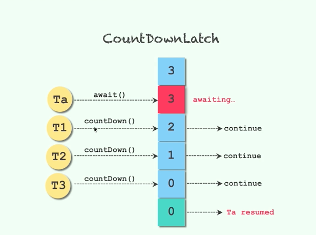
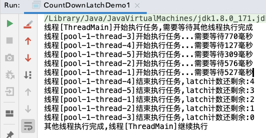
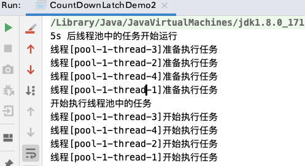
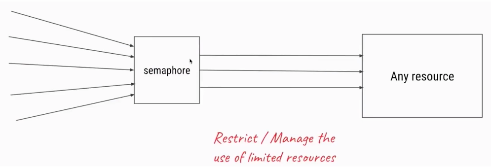
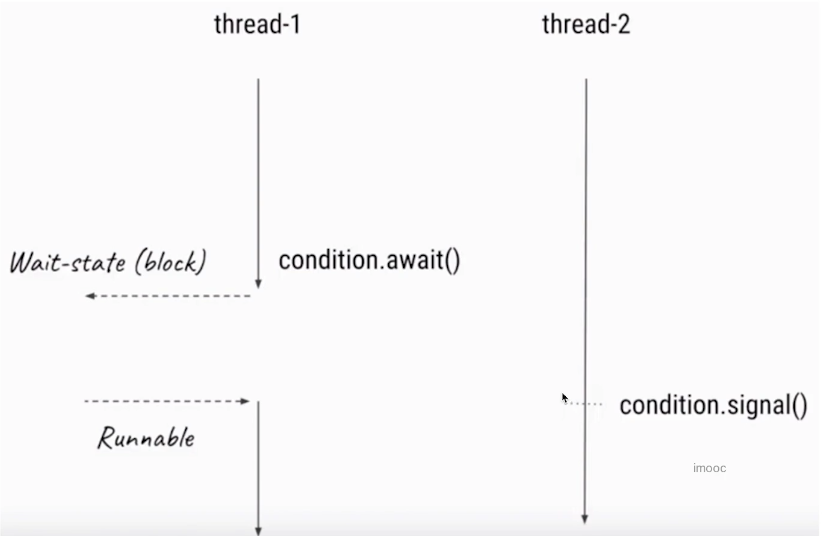
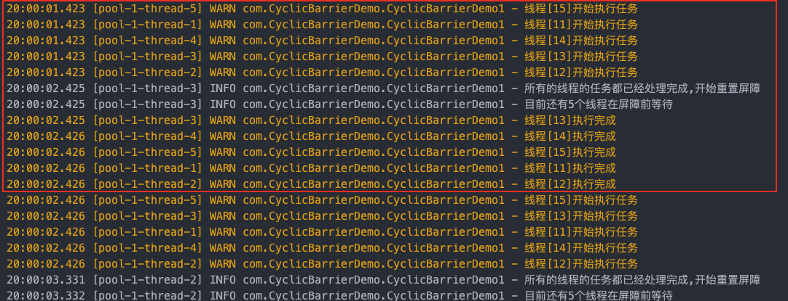

## 概述

- **控制并发流程是什么**

  - 如果没有并发流程的控制，线程的执行通过线程调度器来控制。有些需求需要控制线程的执行顺序或者线程执行数量等，就需要通过控制并发流程的工具类
  - 即控制并发流程的工具类就是<font color='red'>帮助开发人员更容易的让线程之间进行合作</font>，比如线程A等待线程B执行完成之后再执行

- **常见的控制并发流程的工具类**

  - `Semaphore`
    - 信号量,通过控制 “许可证”的数量，来保证线程之间的配合
    - 线程只有在拿到“许可证”后才可以继续运行。相比其他的同步器来说更加的灵活
  - `CyclicBarrier`
    - 循环栅栏。线程会等待,直到足够多的线程达到了事先预定的数量，才会执行下一步的动作
    - 适用于线程之间相互等待处理结果就绪的场景

  - `CountDownLatch`
    - 减少计数。和CyclicBarrier类似，数量递减到0的时候执行下一步
    - 不可重复使用
  - `Condition`
    - 条件对象,可以控制线程的**等待**与**唤醒**
    - 是 *Object.wait()*的升级版，一个Lock可以有多个Condition
  - `Exchanger`
    - 让两个线程在合适的时候交换对象
    - 适用于: 当两个线程工作在同一个类的不同实例上时用于交换数据

## CountDownLatch【倒计时】

### 概述

1. <font color='red'>允许一个或者多个线程等待其他线程完成操作</font>

   - CountDownLatch可以设置一个计数器,然后通过 `countDown()` 来进行减 1 的操作,当`await()`等待计数器`小于等于0`后继续执行 await()之后的语句
2. CountDownLatch 主要有两个方法
   - 当一个或者多个线程调用await() 方法时，这些线程会阻塞
   - 其它线程调用 countDown() 方法会将计数器减 1, <font color='red'>但是调用 countDown() 的线程不会阻塞</font>。当计数器的值 小于等于0 时，因 await() 阻塞的线程会被唤醒，继续执行
3. <font color='red'>一个线程调用 CountDown() 对 其他线程调用 await()后的操作是内存可见的</font>
4. <mark>注意</mark>

   - CountDownLatch 无法重用，如果需用重新计数可以考虑使用 CyclicBarrier 或者创建新的CountDownLatch
   - 支持多个线程等待多个线程



### 常见的方法

- `CountDownLatch(int count)`
  -   仅有一个构造函数
  -   构造一个用给定计数初始化的 CountDownLatch
- `await([long time,TimeUnit unit])`
  - 使当前线程在锁存器倒计数至0之前一直等待，除非线程被中断或超出了指定的等待时间
- `countDown()`
  - 递减锁存器的计数
    - 如果计数小于等于0，则释放所有等待的线程
    - 如果当前计数大于0，则不发生任何操作
- `getCount()`
  - 返回当前计数

### 示例1

> 一个线程等待其他线程都执行完成后，再继续执行

```java
/**
 * <b>一个线程等待多个线程执行完毕后再继续运行</b>
 *
 * @author <a href="mailto:zhuyuliangm@gmail.com">zyl</a>
 */
public class CountDownLatchDemo1 {
    public static void main(String[] args) throws InterruptedException {
        CountDownLatch latch = new CountDownLatch(5);
        ThreadPoolExecutor executor = new ThreadPoolExecutor(5, 5, 60L, TimeUnit.SECONDS, new ArrayBlockingQueue<>(20));
        // 线程池启动的时候就创建核心线程
        executor.prestartAllCoreThreads();
        new Thread(() -> {
            try {
                System.out.printf("线程[%s]开始执行任务,需要等待其他线程执行完成\r\n",Thread.currentThread().getName());
                latch.await();
                System.out.printf("其他线程执行完成,线程[%s]继续执行\r\n",Thread.currentThread().getName());
            } catch (InterruptedException e) {
                e.printStackTrace();
            }
        },"ThreadMain").start();
        // 提交五个任务给线程
        for (int i = 1; i <= 5; i++) {
            executor.execute(() -> {
                try {
                    Long waitTime = (long)(Math.random()*1000);
                    System.out.printf("线程[%s]开始执行任务...需要等待%s毫秒\r\n",Thread.currentThread().getName(),waitTime);
                    TimeUnit.MILLISECONDS.sleep(waitTime);
                    latch.countDown();
                    System.out.printf("线程[%s]结束执行任务,latch计数还剩余:%d\r\n",Thread.currentThread().getName(),latch.getCount());
                } catch (InterruptedException e) {
                    e.printStackTrace();
                }
            });
        }
        executor.shutdown();
    }
}
```




### 示例2

> 多个线程等待某个线程都执行完成后，再继续执行 -> 比如说模拟压测，就需要多个线程等待一个执行的信号

```java
/**
 * <b>多个线程等待一个线程的执行信号</b>
 *
 * @author <a href="mailto:zhuyuliangm@gmail.com">zyl</a>
 */
public class CountDownLatchDemo2 {
    public static void main(String[] args) throws InterruptedException {
        // 只需要一个就可以
        CountDownLatch latch = new CountDownLatch(1);
        ThreadPoolExecutor executor = new ThreadPoolExecutor(5, 5, 60L, TimeUnit.SECONDS, new ArrayBlockingQueue<>(20));
        // 线程池启动的时候就创建核心线程
        executor.prestartAllCoreThreads();

        // 提交五个任务给线程
        for (int i = 1; i <= 4; i++) {
            executor.execute(() -> {
                try {
                    System.out.printf("线程[%s]准备执行任务\r\n",Thread.currentThread().getName());
                    latch.await();
                    System.out.printf("线程[%s]开始执行任务\r\n",Thread.currentThread().getName());
                } catch (InterruptedException e) {
                    e.printStackTrace();
                }
            });
        }
        System.out.println("5s 后线程池中的任务开始运行");
        TimeUnit.SECONDS.sleep(5);
        System.out.println("开始执行线程池中的任务");
        latch.countDown();
        executor.shutdown();
    }
}
```




### 示例3

> 多个线程等待某个线程都执行完成后再继续执行,最后执行结束后有收尾工作

```java
/**
 * <b>多个线程等待一个线程的执行信号</b>
 *
 * @author <a href="mailto:zhuyuliangm@gmail.com">zyl</a>
 */
public class CountDownLatchDemo3 {
    public static void main(String[] args) throws InterruptedException {
        // 开始只需要一个就可以
        CountDownLatch startLatch = new CountDownLatch(1);
      	// 等待其他所有线程执行完成之后再执行后续动作
        CountDownLatch endtLatch = new CountDownLatch(5);
        ThreadPoolExecutor executor = new ThreadPoolExecutor(5, 5, 60L, TimeUnit.SECONDS, new ArrayBlockingQueue<>(20));
        // 线程池启动的时候就创建核心线程
        executor.prestartAllCoreThreads();

        // 提交五个任务给线程
        for (int i = 1; i <= 5; i++) {
            executor.execute(() -> {
                try {
                    System.out.printf("线程[%s]准备执行任务\r\n",Thread.currentThread().getName());
                    startLatch.await();
                    Long waitTime = (long)(Math.random()*2000);
                    System.out.printf("线程[%s]开始执行任务...需要等待%s毫秒\r\n",Thread.currentThread().getName(),waitTime);
                    TimeUnit.MILLISECONDS.sleep(waitTime);
                    endtLatch.countDown();
                } catch (InterruptedException e) {
                    e.printStackTrace();
                }
            });
        }
        System.out.println("5s 后线程池中的任务开始运行");
        TimeUnit.SECONDS.sleep(5);
        System.out.println("开始执行线程池中的任务...");
        startLatch.countDown();
        System.out.println("开始等待线程池中所有的任务执行完成...");
        endtLatch.await();
        System.out.println("线程池中所有的任务执行完成,进行清理工作...");
        executor.shutdown();
    }
}
```


## Semaphore【限流器】

### 概述

1. <font color='red'>用于控制同时访问特定资源的线程数量</font>,通过协调各个线程,以保证合理的使用公共资源。

   - Semaphore 可以做 `流量控制`，比如数据库链接
2. 信号量的作用是<font color='red'>维护一个“许可证”的计数</font>,当信号量拥有的许可证数量为0，那么下一个线程必须等待其他线程释放了许可证
   - 线程可以“获取许可证”，那么信号量剩余的许可证就减1
   - 线程可以“释放许可证”,那么信号量剩余的许可证就加1

3. **基本使用方式**
   - 初始化 Semaphore 并指定许可证的数量
   - 在需要许可证的代码前加上 `acquire() / acquireUninterruptibly()`
   - 在任务执行结束后, 调用 `release()` 释放许可证
4. <mark>注意</mark> 

   - 获取和释放 许可证的时候可以指定数量，所以<font color='red'>获取和释放许可证的数量必须一致</font>，否则可能会导致程序的卡死
   - 初始化信号量的时候需要设置公平性(默认是false的非公平), 有时候可能设置为公平true更加的合理
   - 信号量除了<font color='red'>控制临界区最多有N个线程</font>之外，还有一个作用就是<font color='red'>条件等待</font>
     - 比如线程A需要在线程B后执行，那么就是指定信号量的许可证数量为1，线程B获取到许可证后，线程A调用 acquire()会被阻塞，然后线程B通过 release释放许可证，这时线程A就可以继续往下走



### 常见的方法

  - `Semaphore(int permits, boolean fair)` -> 创建具有给定的许可数和给定的公平设置的 Semaphore
    - `permits`
      - 初始的可用许可数目。此值可能为负数，在这种情况下，必须在授予任何获取前进行释放。
    - `fair`
      - 如果此信号量保证在争用时按先进先出的顺序授予许可，则为 true；否则为 false。
      - <font color='red'>通常应该将用于控制资源访问的信号量初始化为公平的，以确保所有线程都可访问资源。为其他的种类的同步控制使用信号量时，非公平排序的吞吐量优势通常要比公平考虑更为重要	</font>
  - `acquire(int permits)`
    -   从此信号量获取给定数目的许可，在提供这些许可前一直将线程阻塞,否则线程被中断
  - `acquireUninterruptibly(int permits)`
    -  从此信号量获取给定数目的许可，在提供这些许可前一直将线程阻塞
  - `release(int permits)`
    - 释放给定数目的许可，将其返回到信号量

  - `availablePermits()`
    - 返回此信号量中当前可用的许可数
  - `drainPermits()`
    - 获取并返回立即可用的所有许可
  - `getQueuedThreads() #Collection<Thread>`
    -  返回一个 collection，包含可能等待获取的线程
  - `	getQueueLength()`
    - 返回正在等待获取的线程的估计数目
  - `hasQueuedThreads()`
    - 查询是否有线程正在等待获取

### 示例1

> 限制一次只能有少数的线程可以执行任务

```java
/**
 * <b>限制一次只能有少数的线程可以执行任务</b>
 *
 * @author <a href="mailto:zhuyuliangm@gmail.com">zyl</a>
 */
public class SemaphoreDemo1 {
    public static void main(String[] args) {
        Semaphore semaphore = new Semaphore(3,true);

        ThreadPoolExecutor executor = new ThreadPoolExecutor(10, 10, 60L, TimeUnit.SECONDS, new ArrayBlockingQueue<>(20));
        // 线程池启动的时候就创建核心线程
        executor.prestartAllCoreThreads();

        for (int i = 1; i <= 10; i++) {
            executor.execute(() -> {
                try {
                    System.out.printf("线程[%s]尝试获取许可证,Semaphore中剩余%d个\r\n",Thread.currentThread().getName(), semaphore.availablePermits());
                    semaphore.acquire();
                    System.out.printf("线程[%s]获取到了许可证\r\n",Thread.currentThread().getName());
                    TimeUnit.SECONDS.sleep(1);
                    semaphore.release();
                    System.out.printf("线程[%s]释放了许可证\r\n",Thread.currentThread().getName());
                } catch (InterruptedException e) {
                    e.printStackTrace();
                }
            });
        }
    }
}

```


## Condition【执行条件对象】

### 概述

- 任意一个java对象都有一组监视器方法(定义在Object上),主要包括 wait()/notify()方法，这些方法与synchronized可以实现等待/通知机制
  - 但是内置锁只能关联一个条件对象,在实际开发中经常会需要绑定多个条件对象,因此内置锁无法满足需求
- <font color='red'>Condition接口也提供了类似于Object的监视器方法, 与Lock配合可以实现等待/通知模式</font>,但是一个Lock对象可以绑定多个Condition条件对象。同时Condition比内置的条件对象提供了更加丰富的功能
- Condition的作用
  - 当线程1需要等待某个条件的时候,就去执行`condition.await()`方法，一旦执行了await()后线程就会进入阻塞状态
  - 然后另外一个线程执行完任务后调用 `condition.signal()`方法,然后jvm会从被阻塞的线程中找到等待该condition的线程,当线程1收到可执行的信号时，它的线程状态又会变成 Runnable 可执行状态
- **Condition注意点**
  - 调用await方法时会自动释放持有的Lock锁(即<font color='red'>调用await方法必须持有锁</font> )
  
- **signal与signalAll**
  - <font color='red'>signalAll 会唤起所有的正在等待的线程</font>
  - <font color='red'>signal是公平的，只会唤起等待时间最长的线程</font> 




### 基本示例

> Condition的简单用法

```java
/**
 * <b>Condition的基本用法</b>
 *
 * @author <a href="mailto:zhuyuliangm@gmail.com">zyl</a>
 */
public class ConditionDemo1 {
    static ReentrantLock lock = new ReentrantLock();
    static Condition condition = lock.newCondition();

    public static void main(String[] args) throws InterruptedException {
        new  Thread(() -> {
            try {
                // 添加等待时间保证 signal在await之后执行
                TimeUnit.SECONDS.sleep(1);
                lock.lock();
                System.out.println("唤醒其他线程");
                condition.signal();
            } catch (InterruptedException e) {
                e.printStackTrace();
            } finally {
                lock.unlock();
            }
        }).start();
        new Thread(() -> {
            try {
                lock.lock();
                System.out.println("条件不满足,开始await等待");
                condition.await();
                System.out.println("条件满足,开始执行任务");
            } catch (InterruptedException e) {
                e.printStackTrace();
            } finally {
                lock.unlock();
            }
            System.out.println("");
        }).start();
    }
}

```


### 生产者-消费者示例

> 当存储队列中有数据,通知消费者消费数据。当存储没有数据，通知生产者生产数据。

```java
/**
 * <b>生产者-消费者模式</b>
 *
 * @author <a href="mailto:zhuyuliangm@gmail.com">zyl</a>
 */
public class ConditionDemo3 {
    // 定义队列长度
    private static final int queueSize = 20;
    // 存储队列
    private static ArrayBlockingQueue<Integer> store = new ArrayBlockingQueue<>(queueSize);

    private static ReentrantLock lock = new ReentrantLock();
    // 生产的条件
    private static Condition produce = lock.newCondition();
    // 消费的条件
    private static Condition consume = lock.newCondition();

    // 消费者
    static class Consumer implements Runnable{
        @SneakyThrows
        @Override
        public void run() {
            for (;;) {
                try {
                    lock.lock();
                    while(store.size() == 0) {
                        System.out.println(Thread.currentThread().getName()+":队列没有数据,等待");
                        consume.await();
                    }
                    Integer res = store.take();
                    produce.signal();
                    System.out.println(Thread.currentThread().getName()+"获取到了队列的数据:"+res);
                }finally {
                    lock.unlock();
                }
            }
        }
    }
    // 生产者
    static class Producer implements Runnable{

        @SneakyThrows
        @Override
        public void run() {
            for (;;) {
                try {
                    lock.lock();
                    while(store.size() == queueSize) {
                        System.out.println("队列数据满了,等待消费");
                        produce.await();
                    }
                    store.put((int) (Math.random()*1000));
                    consume.signalAll();
                    System.out.println("向队列中插入了一条数据,剩余空间:"+(queueSize-store.size()));
                }finally {
                    lock.unlock();
                }
            }
        }
    }

    public static void main(String[] args) {
        Producer producer = new Producer();
        Consumer consumer1 = new Consumer();
        Consumer consumer2 = new Consumer();

        new Thread(producer).start();
        new Thread(consumer1,"consumer1").start();
        new Thread(consumer2,"consumer2").start();
    }
}
```


## CyclicBarrier【组队突破】

###  概述

- <font color='red'>允许一组线程互相等待，直到所有线程都到达公共栅栏点 (同步点)，屏障才会打开，所有被屏障拦截的线程才会继续执行 </font> 

  - 屏障打开后会通过notify通知的方式唤醒等待的线程继续后续的处理
  - 在涉及一组固定大小的线程的程序中，这些线程必须不时地互相等待。因为CylinderBarrier 在释放等待线程后可以重用，所以称它为 **循环的barrier**
- **特点**
  - <font color='red'>支持一个可选的 Runnable 命令，在一组线程中的最后一个线程到达之后（但在释放所有线程之前，此时所有线程还处于await状态），该命令只在每个屏障点运行一次</font> 
  - 相对于CountDownLatch是可重置的
- <mark>适合场景</mark> 

  - 当有大量的线程需要相互配合，并且在最后需要**统一汇总**的时候，可以使用 CyclicBarrier
  
- **CountDownLatch 与 CyclicBarrier**
  - 作用不一样
    - CyclicBarrier是等待固定数量线程到达后，一起突破屏障 -><font color='red'>用于线程</font>
    - CountDownLatch是倒计时，只要countDown到不大于0，那么就可以继续往下走 -> <font color='red'>用于事件</font>
  
  - 可重用性不一样
    - CyclicBarrier 是可重用的，而CountDownLatch无法重用
  


### 常见的方法
  - `CyclicBarrier(int parties, [Runnable barrierAction])`
    - parties:  在启动 barrier 前必须调用 await() 的线程数
    - barrierAction: 在启动 barrier 时执行的命令；如果不执行任何操作，则该参数为 null
  - `await([long timeout, TimeUnit unit])`
    - 在所有参与者都已经在此屏障上调用 await() 方法之前将一直等待,或者超出了指定的等待时间
  - `getNumberWaiting()`
    - 返回当前在屏障处等待的参与者数目
  - `getParties()`
    - 返回要求启动此 barrier 的参与者数目
  - `isBroken()`
    - 查询此屏障是否处于损坏状态
  - `reset()`
    - 将屏障重置为其初始状态 -> 一批线程处理完成之后，打开屏障。然后另外一批线程处理完成之后，打开屏障，往复循环

### 示例

> 满足了突破循环栅栏需要的线程数后，先执行突破屏障前的最后处理动作(此时线程还在await等待),执行完了之后每个线程再执行await后面的方法

```java
public class CyclicBarrierDemo1 {
    private static final Logger log = LoggerFactory.getLogger(CyclicBarrierDemo1.class);
    private static CyclicBarrier BARRIER;
    // 突破循环栅栏需要的线程数
    private static final Integer THREAD_COUNT = 5;
    // 突破屏障前的最后处理动作是什么
    private static final Runnable finalAction = () -> {
        log.info("所有的线程的任务都已经处理完成,开始重置屏障");
        log.info("目前还有{}个线程在屏障前等待",BARRIER.getNumberWaiting());
    };
    static {
        BARRIER= new CyclicBarrier(THREAD_COUNT, finalAction);
    }

    public static void main(String[] args) {
        ThreadPoolExecutor executor = new ThreadPoolExecutor(
                5,
                5,
                60L, TimeUnit.SECONDS,
                new ArrayBlockingQueue<>(20));
        // 线程池启动的时候就创建核心线程
        executor.prestartAllCoreThreads();
        for (int i = 1; i <= 20; i++) {
            executor.execute(() -> {
                try {
                    log.warn("线程[{}]开始执行任务",Thread.currentThread().getId());
                    TimeUnit.MILLISECONDS.sleep((long)(Math.random()*1000));
                    BARRIER.await();
                    log.warn("线程[{}]执行完成",Thread.currentThread().getId());
                } catch (InterruptedException | BrokenBarrierException e) {
                    e.printStackTrace();
                }
            });
        }
    }

}
```




