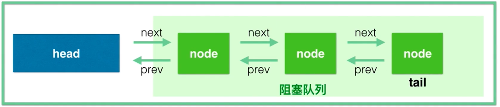

## 概述

### 基本概述

- 队列同步器AbstractQueuedSynchronizer(AQS) 是<font color='red'>用于构建锁或者其他同步组件的基础框架</font>,包括以下三个最核心的部分

  - 表示同步状态信息的`state`: 
  - 控制线程抢锁和配合的`FIFO队列`
  - 期望工具类去实现的`获取、释放等方法`
- 在基于AQS构建的同步类中,最基本的操作包括 <font color='red'>各种形式的获取操作与释放操作</font> 

  - 获取操作是一种依赖于同步状态的操作,并且通常会阻塞
    - 使用锁或者信号量时候,获取的是锁或者许可证
    - 使用CountDownLatch时，获取操作表示等待直到到达结束状态
  - 释放操作时,所有在请求时被阻塞的线程都会开始执行
- <font color='red'>同步器的主要使用方式是继承[**建议被定义为同步组件的静态内部类**],并且实现其中的抽象方法来管理状态信息</font>
- **基本用法**
  - 创建类，实现自定义的获取/释放方法
  - 内部创建 Sync继承 AQS。根据是否独占分别重写 独占或者共享式获取释放同步状态


```java
// 获取操作
boolean accquire() {
  while(当前状态不允许获取操作) {
    if (需要阻塞获取请求) {
	      如果当前线程不在队列中，则将其插入队列
        阻塞当前线程
    } else {
      返回失败
    }
  }
  可能更新同步器状态
  如果线程位于队列中，则将其移除队列
  返回成功  
}

//释放操作
boolean  release() {
  	更新同步器状态
    if (新的状态允许某个被阻塞的线程获取成功) {
      	接触队列中一个或者多个线程的阻塞状态
    }
}
```


### AQS常见方法

#### 可重写的方法

- `protected boolean tryAcquire(int arg)`
  - **独占式的获取同步状态信息**
  - 实现该方法首先获取当前的同步状态信息并判断同步状态信息是否符合预期,然后再进行CAS设置同步状态
- `protected boolean tryRelease(int arg)`
  - **独占式的释放同步状态信息**
  - 此时等待获取同步状态的线程将有机会获取同步状态
- `protected int tryAcquireShared(int arg)`
  - **共享式的获取同步状态信息**
  - 返回值大于0表示获取成功,反之则获取失败
- `protected boolean tryReleaseShared(int arg)`
  - **共享式的释放同步状态信息**
- `protected boolean isHeldExclusively()`
  - 当前同步器是否在独占模式下被当前线程所占用

#### 模板方法

- `void acquire(int arg)`
  - 独占式的获取同步状态
  - 如果当前线程获取同步状态成功,则由该方法返回。否则会进入同步队列中等待
  - 该方法会调用重写的 tryAcquire 方法
- `void acquireInterruptibly(int arg)`
  - 与 acquire(int arg)相同,但是该方法响应中断
  - 如果当前线程在获取同步状态时被中断会抛出异常
- `boolean acquireShared(int arg)`
  - 共享式的获取同步状态
  - 如果当前线程获取同步状态成功,则由该方法返回。否则会进入同步队列中等待
  - <font color='red'>与独占式的获取主要的区别在于: 同一时刻可以有多个线程获取到同步状态</font>
- `boolean release(int arg)`
  - 独占式的释放同步状态
  - 该方法会在释放同步状态之后,将同步队列中的 <font color='red'>第一个节点</font> 包含的线程唤醒
- `boolean releaseShared(int arg)`
  - 共享式的释放同步状态
- `Collection<Thread> getQueuedThreads()`
  - 获取咋等待队列中的线程集合

### 同步状态信息

- state本身使用 *volatile*修饰, 保证并发修改时的线程安全,其他线程可以看到当前线程的修改,同时提供了`compareAndSetState`的方法保证原子的方式修改state

- AQS 提供以下的三个方法来操作同步状态信息

  - `getState()`: 获取当前的同步状态信息
  - `setState()`: 设置当前的同步状态信息
  - `compareAndSetState(int expect,int update)`: 使用CAS的方式更新当前的同步状态信息，保证状态设置的原子性

  ```java
  private volatile int state;
  // 具有volatile读的内存语义
  protected final int getState() {
    return state;
  }
  // 具有volatile写的内存语义
  protected final void setState(int newState) {
    state = newState;
  }
  protected final boolean compareAndSetState(int expect, int update) {
    return unsafe.compareAndSwapInt(this, stateOffset, expect, update);
  }
  ```

  

- **AQS中的同步状态信息在不同实现类中的含义**

  - `ReentrantLock`: 锁的持有线程已经重复获取该锁的次数(可重入)
  - `Semaphore`: 表示剩余的许可证数量
  - `CountDownLatch`: 表示需要倒数的数量
  - `FutureTask`: 表示任务的状态(未开始、正在运行、已完成、已取消)

### 同步队列

- **用来存放等待的线程**,AQS就是队列管理器
  - <font color='red'>当线程获取同步状态失败时,AQS会将该线程以及等待状态信息构造成一个节点(Node)并将其加入到同步队列中。同时通过LockSupport工具类使该线程阻塞</font>
  - <font color='red'>当同步状态释放时,会将第一个节点中的线程通过LockSupport唤醒,并再次尝试获取同步状态</font> 

- 同步队列中的节点(Node)用于保存: **获取同步状态失败的线程的引用、等待状态、前节点和下一个节点**

- **节点的属性类型和名称**
  - `int waitStatus`
  
    - 等待状态,包含以下的几个状态
      - <mark>**CANCELLED**</mark>

        - 值等于 1
        - 由于在同步队列中等待的线程 等待超时或者被中断,需要从同步队列中取消等待
        - 节点进入该状态后不会发生变化
      - <mark>**SIGNAL**</mark>

        - 值等于 -1
        - 后继节点的线程处于等待状态，而前节点的线程如果释放了同步状态或者被取消，就会通知后继节点中的线程继续运行
      - <mark>**CONDITION**</mark>

        - 值等于 -2
        - 节点在等待队列中，节点线程等待在 Condition上当其他线程对Condition调用了signal方法后,该节点会从等待条件队列中转移到同步队列中，加入到对同步状态的获取中
      - <mark>**PROPAGATE**</mark>

        - 值为 -3
        - 表示下一个共享式的同步状态获取将会无条件的被传播下去
      - <mark>**INITIAL**</mark>

        - 值为 0
        - 初始状态
  
  - `Node prev`
  
    - 前节点，当节点添加到同步队列中时被设置
  
  - `Node next`
  
    - 后继节点
  
  - `Node nextWaiter`
    - 等待队列中的后继节点
    - 如果当前节点是共享的，那么这个字段是一个**SHARED**常量
    
  - `Thread thread`

    - 获取同步状态的线程





## 自定义闭锁

```java
/**
 * <b>自己实现的CountDownLatch闭锁</b>
 *
 * @author <a href="mailto:zhuyuliangm@gmail.com">zyl</a>
 */
public class OneShotLatch {
    private final Sync sync;
    public OneShotLatch(int num) {
        if(num < 0) {
            throw  new RuntimeException("错误的阈值...");
        }
        this.sync = new Sync(num);
    }

    // 等待方法->调用的时候查看同步状态是否还是大于0.如果大于0则会阻塞
    public void await() {
        /**
         *  获取共享锁: tryAcquireShared返回小于0时将线程转为Node存入同步队列,如果大于0则什么也不做
         */
        sync.acquireShared(1);
    }
    // 计数器减1
    public void down(){
        /**
         * 释放共享锁: 其中tryReleaseShared返回true,表示后面还有需要释放的
         */
        sync.releaseShared(1);
    }

    /**
     * 自定义静态内部类实现AQS抽象类
     */
    static class Sync extends AbstractQueuedSynchronizer {
        public Sync(int num) {
            setState(num);
        }

        // 获取同步状态
        @Override
        protected int tryAcquireShared(int arg) {
            /**
             * 由于同步状态>0时要阻塞线程,而实际acquireShared方法相反,所以返回的结果要做处理
             *  -> 同步状态大于0变为 -1, 同步状态等于0变为 1
             */
            return getState() == 0 ? 1:-1;
        }

        @Override
        protected boolean tryReleaseShared(int arg) {
            for (;;) {
                int state = getState();
                if (state == 0) {
                    // 返回false表示同步队列中没有需要通知释放的(需要唤醒的线程)
                    return false;
                }
                int nextS = state-arg;
                // CAS的方式设置同步状态
                if (compareAndSetState(state, nextS)) {
                    return nextS == 0;
                }
            }
        }
    }
}

// 测试Demo
public class OneShotLatchTest {
    public static void main(String[] args) {
        OneShotLatch latch = new OneShotLatch(5);
        ThreadPoolExecutor executor = new ThreadPoolExecutor(5, 5, 60L, TimeUnit.SECONDS, new ArrayBlockingQueue<>(20));
        // 线程池启动的时候就创建核心线程
      	executor.prestartAllCoreThreads();
      	new Thread(() -> {
          	System.out.printf("线程[%s]开始执行任务,需要等待其他线程执行完成\r\n",Thread.currentThread().getName());
          	latch.await();
          	System.out.printf("其他线程执行完成,线程[%s]继续执行\r\n",Thread.currentThread().getName());
        },"ThreadMain").start();
        // 提交五个任务给线程
      	for (int i = 1; i <= 5; i++) {
            executor.execute(() -> {
                try {
                    Long waitTime = (long)(Math.random()*10000);
                    System.out.printf("线程[%s]开始执行任务...需要等待%s毫秒\r\n",Thread.currentThread().getName(),waitTime);
                    TimeUnit.MILLISECONDS.sleep(waitTime);
                    latch.down();
                    System.out.printf("线程[%s]结束执行任务\r\n",Thread.currentThread().getName());
                } catch (InterruptedException e) {
                    e.printStackTrace();
                }
            });
        }
        executor.shutdown();
    }
}
```

