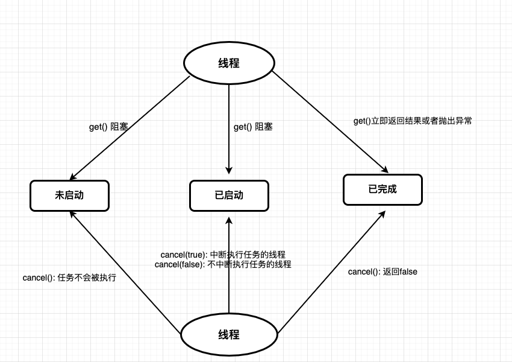
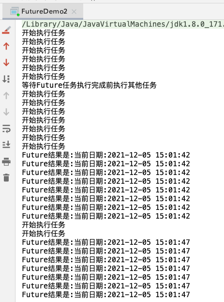
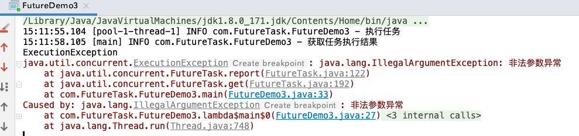
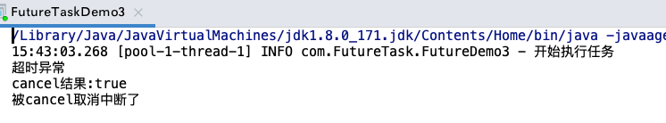
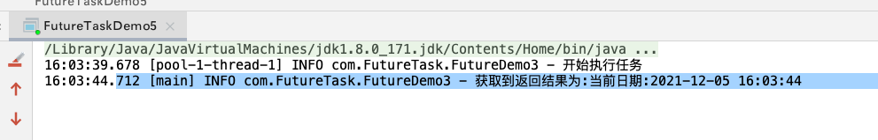

## Future概述

- Runnable 与 Callable接口
  - **Runnable不能返回一个返回值,但是Callable可以**
  - **Runnable无法抛出checked Exception，但是Callable可以**
- Future接口: <font color='red'>表示异步计算的结果</font>
- Future 与Callable
  - 可以通过`get()`获取Callable接口返回的结果、通过`isDone()`来判断任务是否执行完成、取消任务、在指定时间获取任务的结果等
  - <font color='red'>在`call()`未执行完毕之前,调用get()的线程会被阻塞，直到call方法返回了结果，此时get()才会得到结果,被阻塞的线程变为Runnable状态</font>

## Future常见的方法

- `get([long timeout, TimeUnit unit])`
  - 获取线程返回的结果
  - get方法的行为取决于Callable任务的状态,只有以下5种情况
    - **任务正常完成**: get方法立即返回结果
    - **任务没有完成(未开始或者进行中)**: get方法会阻塞直到任务完成
    - **任务抛出异常**: 任务内部的异常，会在调用get方法的时候抛出ExecutionException异常
    - **任务被取消**: get方法会抛出CancellationException
    - **任务超时**: get方法有一个重载方法，可以传入一个延迟时间。如果时间到了还没有获取到结果，就抛出TimeoutException
- `cancel(boolean mayInterruptIfRunning)`
  - 取消任务的执行
  - **mayInterruptIfRunning**: 是否以中断的方式取消任务
  
- `isDone()`
  - 判断线程是否已经执行完成

- `isCancelled()`
  - 判断任务是否被取消

## FutureTask

- 实现了`Future、Runnable`接口,所以FutureTask可以直接交给Executor执行,也可以直接调用线程执行(FutureTask.run)。然后通过FutureTask.get()获取任务结果
- FutureTask可以处于3种状态
  - `未启动`
    - FutureTask.run() 还没有被执行的之前，FutureTask处于未启动状态
  - `已启动`
    - FutureTask.run()方法被执行的过程中，FutureTask处于已启动状态
  - `已完成`
    - FutureTask.run()方法执行完后正常结束、通过FutureTask.cancel()、FutureTask.run()方法抛出异常而结束,FutureTask都处于已完成状态
- <mark>注意点</mark>

  - <font color='red'>当FutureTask处于未启动或者已启动状态的时候,执行FutureTask.get()方法会导致调用线程的阻塞</font>
  - <font color='red'>当FutureTask处于已完成状态时,执行FutureTask.get()方法会导致调用线程立即返回结果或者抛出异常</font>
  - <font color='red'>当FutureTask处于未启动状态时,执行FutureTask.cancel()方法会导致该任务永远不会被执行</font>
  - <font color='red'>当FutureTask处于已启动状态时,执行FutureTask.cancel(true)方法会以中断的方式停止该任务</font>
  - <font color='red'>当FutureTask处于已启动状态时,执行FutureTask.cancel(false)方法不会对正在执行的任务产生影响(让正在执行的任务执行完成)</font>
  - <font color='red'>当FutureTask处于已完成状态时,执行FutureTask.cancel()方法会返回false</font>




## Future代码示例

### 示例1

> 线程池submit方法返回Future对象
>
> 向线程池中提交任务,线程池会立即返回一个空的 Future容器。一旦线程的任务执行完毕后,线程池会将结果回填到之前获取的Future中(不是新建一个Future对象)

```java
/**
 * <b>通过线程池的submit方法返回Future对象</b>
 * @author <a href="mailto:zhuyuliangm@gmail.com">zyl</a>
 */
public class FutureTaskDemo1 {
    private static final int coreNum = Runtime.getRuntime().availableProcessors();
    private static final BlockingQueue QUEUE = new ArrayBlockingQueue(1024);
    private static final RejectedExecutionHandler reject = new ThreadPoolExecutor.CallerRunsPolicy();

    public static void main(String[] args) throws InterruptedException {
        ThreadPoolExecutor executor = new ThreadPoolExecutor(coreNum, 2*coreNum, 60L, TimeUnit.SECONDS,QUEUE,reject);

        Callable<Object> task = () -> {
            System.out.println("开始执行任务");
            TimeUnit.SECONDS.sleep(5);
            return "当前日期:"+LocalDate.now().toString();
        };
        //executor.submit即可以提交Runnable,也可以提交Callable
        Future<Object> future = executor.submit(task);
        try {
            System.out.println("等待Future任务执行完成前执行其他任务");
            TimeUnit.SECONDS.sleep(5);
            System.out.println("Future结果是:"+future.get());
        } catch (ExecutionException e) {
            e.printStackTrace();
        }
    }
}
```


### 示例2

> 多个任务用Future数组批量接收结果

```java
/**
 * <b>批量提交任务</b>
 *
 * @author <a href="mailto:zhuyuliangm@gmail.com">zyl</a>
 */
public class FutureDemo2 {
    private static final int coreNum = Runtime.getRuntime().availableProcessors();
    private static final BlockingQueue QUEUE = new ArrayBlockingQueue(1024);
    private static final RejectedExecutionHandler reject = new ThreadPoolExecutor.CallerRunsPolicy();

    public static void main(String[] args) throws InterruptedException {
        ThreadPoolExecutor executor = new ThreadPoolExecutor(coreNum, 2*coreNum, 60L, TimeUnit.SECONDS,QUEUE,reject);

        ArrayList<Future> futures = new ArrayList();

        Callable<String> task = () -> {
            System.out.println("开始执行任务");
            TimeUnit.SECONDS.sleep(5);
            return "当前日期:" + LocalDateTime.now().format(DateTimeFormatter.ofPattern("yyyy-MM-dd HH:mm:ss"));
        };

        for (int i = 1; i <= 15; i++) {
            futures.add(executor.submit(task));
        }
        System.out.println("等待Future任务执行完成前执行其他任务");
        TimeUnit.SECONDS.sleep(5);
        futures.forEach((future -> {
            try {
                System.out.println("Future结果是:"+future.get());
            } catch (InterruptedException | ExecutionException e) {
                e.printStackTrace();
            }
        }));
    }
}
```




### 示例3

> 任务执行过程中抛出Exception

执行任务中的异常只会在get获取任务执行结果的时候抛出,并且异常为ExecutionException

```java
/**
 * <b>抛出异常 -> 只有在get方法尝试获取的时候才会抛出异常</b>
 *
 * @author <a href="mailto:zhuyuliangm@gmail.com">zyl</a>
 */
public class FutureDemo3 {
    private static final int coreNum = Runtime.getRuntime().availableProcessors();
    private static final BlockingQueue QUEUE = new ArrayBlockingQueue(1024);
    private static final RejectedExecutionHandler reject = new ThreadPoolExecutor.CallerRunsPolicy();
    private static final Logger log = LoggerFactory.getLogger(FutureDemo3.class);

    public static void main(String[] args) {
        ThreadPoolExecutor executor = new ThreadPoolExecutor(coreNum, 2*coreNum, 60L, TimeUnit.SECONDS,QUEUE,reject);

        Callable<Integer> task = () -> {
            log.info("执行任务");
            throw  new IllegalArgumentException("非法参数异常");
        };
        Future<Integer> future = executor.submit(task);
        try {
            TimeUnit.SECONDS.sleep(3);
            log.info("获取任务执行结果");
            future.get();
        } catch (ExecutionException e) {
            System.out.println("ExecutionException");
            e.printStackTrace();
        } catch (InterruptedException e) {
            System.out.println("InterruptedException");
        }

    }
}
```




### 示例4

> 获取任务结果超时与cancel方法的使用

```java
/**
 * <b>get方法获取任务结果超时</b>
 *
 * @author <a href="mailto:zhuyuliangm@gmail.com">zyl</a>
 */
public class FutureTaskDemo3 {
    private static final int coreNum = Runtime.getRuntime().availableProcessors();
    private static final BlockingQueue QUEUE = new ArrayBlockingQueue(1024);
    private static final RejectedExecutionHandler reject = new ThreadPoolExecutor.CallerRunsPolicy();
    private static final Logger log = LoggerFactory.getLogger(FutureDemo3.class);

    public static void main(String[] args) {
        ThreadPoolExecutor executor = new ThreadPoolExecutor(coreNum, coreNum, 60L, TimeUnit.SECONDS, QUEUE, reject);

        // 任务的执行需要5s
        Future<String> future = executor.submit(() -> {
            try {
                log.info("开始执行任务");
                Thread.sleep(4000);
            }catch (InterruptedException ex) {
                System.out.println("被cancel取消中断了");
            }
            return "当前日期:" + LocalDateTime.now().format(DateTimeFormatter.ofPattern("yyyy-MM-dd HH:mm:ss"));
        });
        // 设定为3s超时
        try {
            future.get(3L,TimeUnit.SECONDS);
        } catch (InterruptedException e) {
            System.out.println("中断异常");
        } catch (ExecutionException e) {
            System.out.println("执行任务异常");
        } catch (TimeoutException e) {
            System.out.println("超时异常");
            boolean cancel = future.cancel(true);
            System.out.println("cancel结果:"+cancel);
        }

    }
}
```




## 通过FutureTask创建Future

```java
/**
 * <b>利用FutureTask创建Future</b>
 *
 * @author <a href="mailto:zhuyuliangm@gmail.com">zyl</a>
 */
public class FutureTaskDemo5 {
    private static final int coreNum = Runtime.getRuntime().availableProcessors();
    private static final BlockingQueue QUEUE = new ArrayBlockingQueue(1024);
    private static final RejectedExecutionHandler reject = new ThreadPoolExecutor.CallerRunsPolicy();
    private static final Logger log = LoggerFactory.getLogger(FutureDemo3.class);

    public static void main(String[] args) {
        ThreadPoolExecutor executor = new ThreadPoolExecutor(coreNum, coreNum, 60L, TimeUnit.SECONDS, QUEUE, reject);

        Callable<String> task = () -> {
            log.info("开始执行任务");
            TimeUnit.SECONDS.sleep(5);
            return "当前日期:" + LocalDateTime.now().format(DateTimeFormatter.ofPattern("yyyy-MM-dd HH:mm:ss"));
        };
        FutureTask<String> futureTask = new FutureTask<>(task);
        executor.execute(futureTask);
        try {
            String result = futureTask.get();
            log.info("获取到返回结果为:"+result);
        } catch (InterruptedException e) {
            e.printStackTrace();
        } catch (ExecutionException e) {
            e.printStackTrace();
        }
    }
}
```





