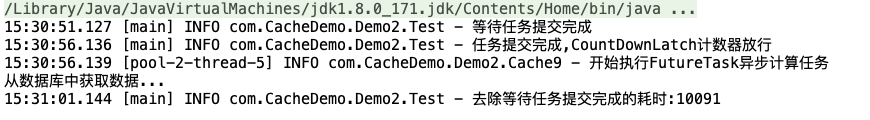

> 利用并发工具类实现一个简单的缓存


## 版本迭代

### V1.0

- 实现: 1.0版本,简单的使用HashMap
- 问题
  - HashMap在多线程的场景下容易出现死循环的问题，导致CPU拉满
  - 复用性差,将查DB的操作耦合到了缓存类中，不适用于其他业务
- 解决思路:
  - 如果使用`synchronized` 将get定义为同步方法的话，性能差。因为同步方法的锁住范围大,并且变成了串行
  - 采用适当的设计模式

```java
/**
 * <b>最简单的Cache - HashMap</b>
 *
 * @author <a href="mailto:zhuyuliangm@gmail.com">zyl</a>
 */
public class Cache1 {
    // 简单的缓存,在单线程的场景下可以使用.但是在多线程下,HashMap容易出现死循环的问题
    private  final HashMap<String,Object> cache = new HashMap<>();

    public synchronized Object get(String key) throws InterruptedException {
        Object result = cache.get(key);
        if (result == null) {
            result = doSearchInDb(key);
            cache.put(key, result);
        }
        return result;
    }

    private Object doSearchInDb(String key) throws InterruptedException {
        TimeUnit.SECONDS.sleep(5);
        return key;
    }
}
```


### V1.1

- 更新点: **通过装饰者模式实现缓存与业务的解耦**

```java
/**
 * <b>简单的计算接口</b>
 *
 * @author <a href="mailto:zhuyuliangm@gmail.com">zyl</a>
 */
public interface Compute<K,V> {
    V doCompute(K k) throws Exception;
}

/**
 * <b>数据库查询</b>
 *
 * @author <a href="mailto:zhuyuliangm@gmail.com">zyl</a>
 */
public class DbCompute implements Compute<String, Object> {
    @Override
    public Object doCompute(String key) throws Exception {
        System.out.println("从数据库中获取数据...");
        TimeUnit.SECONDS.sleep(5);
        return new Person(key);
    }
}                


public class Cache2 {
    private  final HashMap<String,Object> cache = new HashMap<>();
    private  final Compute<String,Object> c;
    public Cache2(Compute<String, Object> c) {
        this.c = c;
    }
    public synchronized Object get(String key) throws Exception {
        Object result = cache.get(key);
        if (result == null) {
            result = c.doCompute(key);
            cache.put(key, result);
        }
        return result;
    }

    public static void main(String[] args) throws Exception {
        Cache2 cache = new Cache2(new DbCompute());
        Object lisi = cache.get("lisi");
        System.out.println(lisi);
        lisi = cache.get("lisi");
        System.out.println(lisi);
    }
}

```


### V1.2

- 更新点: 缩小锁的粒度,用同步同步块替代同步方法
- 缺点:
  - 虽然保证了并发写的线程安全，但是无法保证并发读的线程安全 -> get()

```java
public class Cache3 {
    private  final HashMap<String,Object> cache = new HashMap<>();
    private  final Compute<String,Object> c;
    public Cache3(Compute<String, Object> c) {
        this.c = c;
    }
    public  Object get(String key) throws Exception {
        Object result = cache.get(key);
        if (result == null) {
            result = c.doCompute(key);
          	// 使用 同步块，而不是同步方法
            synchronized(this) {
                cache.put(key, result);
            }
        }
        return result;
    }

    public static void main(String[] args) throws Exception {
        Cache3 cache = new Cache3(new DbCompute());
        Object lisi = cache.get("lisi");
        System.out.println(lisi);
        lisi = cache.get("lisi");
        System.out.println(lisi);
    }
}
```


### V1.3

- 更新点: 使用 ConcurrentHashMap 替代 HashMap
- 缺点
  - 移除了锁,两个线程可以同时从Map中读数据，那么两个线程都没有读取到就都会进行业务处理(数据库查询),导致重复计算

```java
public class Cache4 {
    private  final ConcurrentHashMap<String,Object> cache = new ConcurrentHashMap<>();
    private  final Compute<String,Object> c;
    public Cache4(Compute<String, Object> c) {
        this.c = c;
    }
    public  Object get(String key) throws Exception {
        System.out.println("进入缓存机制...");
        Object result = cache.get(key);
        if (result == null) {
            result = c.doCompute(key);
                cache.put(key, result);
        }
        return result;
    }

    public static void main(String[] args) throws Exception {
        Cache4 cache = new Cache4(new DbCompute());
        new Thread(() -> {
            try {
                Object p = cache.get("丁一");
                System.out.println("thread1:"+p);
            } catch (Exception e) {
                e.printStackTrace();
            }
        }).start();
        new Thread(() -> {
            try {
                Object p = cache.get("孙二");
                System.out.println("thread2:"+p);
            } catch (Exception e) {
                e.printStackTrace();
            }
        }).start();
        new Thread(() -> {
            try {
                Object p = cache.get("丁一");
                System.out.println("thread3:"+p);
            } catch (Exception e) {
                e.printStackTrace();
            }
        }).start();
    }
}
```


### V1.4

- 更新点: 使用Future进行异步计算避免多次计算,通过异步计算的方式避免阻塞式计算
- 缺点
  - 没有真正避免重复计算的问题，因为多个线程可以同时执行`cache.get(key)`方法，此时都没有将Future存入Cache中


```java
/**
 * <b>使用Future来避免重复计算1.0</b>
 *
 * @author <a href="mailto:zhuyuliangm@gmail.com">zyl</a>
 */
public class Cache5 {
    private  final Map<String, FutureTask<Object>> cache = new ConcurrentHashMap<>();
    private  final Compute<String,Object> c;
    public Cache5(Compute<String, Object> c) {
        this.c = c;
    }
    public  Object get(String key) throws Exception {
        FutureTask<Object> future;
            future = cache.get(key);
            if (future == null) {
                future = new FutureTask<>(() -> c.doCompute(key));
                cache.put(key, future);
                System.out.println("开始执行FutureTask异步计算任务");
                future.run();
            }
        return future.get();
    }

    public static void main(String[] args) throws Exception {
        Cache5 cache = new Cache5(new DbCompute());
        new Thread(() -> {
            try {
                Object p = cache.get("丁一");
                System.out.println("thread1:"+p);
            } catch (Exception e) {
                e.printStackTrace();
            }
        }).start();
        new Thread(() -> {
            try {
                Object p = cache.get("孙二");
                System.out.println("thread2:"+p);
            } catch (Exception e) {
                e.printStackTrace();
            }
        }).start();
        new Thread(() -> {
            try {
                Object p = cache.get("孙二");
                System.out.println("thread3:"+p);
            } catch (Exception e) {
                e.printStackTrace();
            }
        }).start();
    }
}
```


### V1.4.1

- 更新点: 通过ConcurrentHashMap的组合操作(putIfAbsent)解决V1.4的bug

```java
/**
 * <b>使用Future来避免重复计算1.0</b>
 *
 * @author <a href="mailto:zhuyuliangm@gmail.com">zyl</a>
 */
public class Cache6 {
    private  final Map<String, FutureTask<Object>> cache = new ConcurrentHashMap<>();
    private  final Compute<String,Object> c;
    public Cache6(Compute<String, Object> c) {
        this.c = c;
    }
    public  Object get(String key) throws Exception {
        FutureTask<Object> future = cache.get(key);
        if (future == null) {
            FutureTask<Object> task = new FutureTask<>(() -> c.doCompute(key));
            future = cache.putIfAbsent(key, task);
            if (future == null) {
                future = task;
                System.out.println("开始执行FutureTask异步计算任务");
                future.run();
            }
        }
        return future.get();
    }

    public static void main(String[] args) throws Exception {
        Cache6 cache = new Cache6(new DbCompute());
        new Thread(() -> {
            try {
                Object p = cache.get("丁一");
                System.out.println("thread1:"+p);
            } catch (Exception e) {
                e.printStackTrace();
            }
        }).start();
        new Thread(() -> {
            try {
                Object p = cache.get("孙二");
                System.out.println("thread2:"+p);
            } catch (Exception e) {
                e.printStackTrace();
            }
        }).start();
        new Thread(() -> {
            try {
                Object p = cache.get("孙二");
                System.out.println("thread3:"+p);
            } catch (Exception e) {
                e.printStackTrace();
            }
        }).start();
    }
}
```


### V1.5

- 更新点: 异常的处理 + 失败重试
- 缺点
  - **缓存污染**: 虽然使用Future可以避免重复计算，但是如果缓存中的FutureTask第一次计算失败后没有将Future清理掉依旧存在Map中,那么下次get获取计算结果时还是会抛出异常,造成只要有一次异常，则会一直重试

```java
public class Cache7 {
    private  final Map<String, FutureTask<Object>> cache = new ConcurrentHashMap<>();
    private  final Compute<String,Object> c;
    public Cache7(Compute<String, Object> c) {
        this.c = c;
    }
    public  Object get(String key) throws ExecutionException, InterruptedException {
        while (true) {
            FutureTask<Object> future = cache.get(key);
            if (future == null) {
                FutureTask<Object> task = new FutureTask<>(() -> c.doCompute(key));
                future = cache.putIfAbsent(key, task);
                if (future == null) {
                    future = task;
                    System.out.println("开始执行FutureTask异步计算任务");
                    future.run();
                }
            }
            try {
                return future.get();
            } catch (CancellationException e) {
                System.out.println("被取消了");
                throw e;
            }
            catch (InterruptedException e) {
                System.out.println("被中断了");
                throw e;
            } catch (ExecutionException e) {
                System.out.println("任务执行异常,重试");
            }
        }
    }

    public static void main(String[] args) throws Exception {
        Cache7 cache = new Cache7(new MayFailCompute());
        new Thread(() -> {
            try {
                Object p = cache.get("丁一");
                System.out.println("thread1:"+p);
            } catch (Exception e) {
                e.printStackTrace();
            }
        }).start();
        new Thread(() -> {
            try {
                Object p = cache.get("孙二");
                System.out.println("thread2:"+p);
            } catch (Exception e) {
                e.printStackTrace();
            }
        }).start();
        new Thread(() -> {
            try {
                Object p = cache.get("孙二");
                System.out.println("thread3:"+p);
            } catch (Exception e) {
                e.printStackTrace();
            }
        }).start();
    }
}
```


### V1.5.1

- 更新点: 修复缓存污染的问题,计算失败后将缓存中对应的Future移除掉,并且重新计算

```java
public class Cache8 {
    private  final Map<String, FutureTask<Object>> cache = new ConcurrentHashMap<>();
    private  final Compute<String,Object> c;
    public Cache8(Compute<String, Object> c) {
        this.c = c;
    }
    public  Object get(String key) throws ExecutionException, InterruptedException {
        while (true) {
            FutureTask<Object> future = cache.get(key);
            if (future == null) {
                FutureTask<Object> task = new FutureTask<>(() -> c.doCompute(key));
                future = cache.putIfAbsent(key, task);
                if (future == null) {
                    future = task;
                    System.out.println("开始执行FutureTask异步计算任务");
                    future.run();
                }
            }
            try {
                return future.get();
            } catch (CancellationException e) {
                System.out.println("被取消了");
                // 执行失败后,将Future从cache中移除
                cache.remove(key);
                throw e;
            }
            catch (InterruptedException e) {
                System.out.println("被中断了");
                // 执行失败后,将Future从cache中移除
                cache.remove(key);
                throw e;
            } catch (ExecutionException e) {
                System.out.println("任务执行异常,重试");
                // 执行失败后,将Future从cache中移除
                cache.remove(key);
            }
        }
    } 
}

```


### V1.6

- 更新点: 缓存过期设定

```java
public class Cache9 {
    private  final Map<String, FutureTask<Object>> cache = new ConcurrentHashMap<>();
    private  final Compute<String,Object> c;
    public Cache9(Compute<String, Object> c) {
        this.c = c;
    }
    private static final Logger log = LoggerFactory.getLogger(Cache9.class);

    // 定义一个定时任务线程池
    private final ScheduledThreadPoolExecutor scheduledThreadPoolExecutor = new ScheduledThreadPoolExecutor(Runtime.getRuntime().availableProcessors());

    public  Object get(String key) throws ExecutionException, InterruptedException {
        while (true) {
            FutureTask<Object> future = cache.get(key);
            if (future == null) {
                FutureTask<Object> task = new FutureTask<>(() -> c.doCompute(key));
                future = cache.putIfAbsent(key, task);
                if (future == null) {
                    future = task;
                    log.info("开始执行FutureTask异步计算任务");
                    future.run();
                }
            }
            try {
                return future.get();
            } catch (CancellationException e) {
                log.info("被取消了");
                throw e;
            }
            catch (InterruptedException e) {
                log.info("被中断了");
                throw e;
            } catch (ExecutionException e) {
                log.info("任务执行异常,重试");
                // 执行失败后,将Future从cache中移除
                cache.remove(key);
            }
        }
    }
    public  Object get(String key, long delay) throws ExecutionException, InterruptedException {
        // 定义清理缓存功能
        scheduledThreadPoolExecutor.schedule(() -> {
            FutureTask<Object> task = cache.get(key);
            if (task != null) {
                // 任务没有完成的话就取消任务
                if (!task.isDone()) {
                    task.cancel(true);
                }
                cache.remove(key);
            }
        },delay, TimeUnit.MILLISECONDS);
        return get(key);
    }

    public static void main(String[] args) throws Exception {
        Cache9 cache = new Cache9(new MayFailCompute());
        new Thread(() -> {
            try {
                // 设置缓存时间10s
                Object p = cache.get("丁一", 10000);
                log.info("第一次取值:"+p);
            } catch (Exception e) {
                e.printStackTrace();
            }
        }).start();
        // 8秒后取值
        TimeUnit.SECONDS.sleep(8);
        log.info("第二次取值:"+cache.get("丁一"));

        // 3s后再次取值已经失效了
        TimeUnit.SECONDS.sleep(3);
        log.info("第三次取值:"+cache.get("丁一"));
    }
}
```


## 测试

> 使用CountDownLatch 进行压力测试,1000个线程同时执行计算操作

```java
/**
 * <b>使用CountDownLatch进行压测</b>
 *
 * @author <a href="mailto:zhuyuliangm@gmail.com">zyl</a>
 */
public class Test {
    private static final CountDownLatch LATCH = new CountDownLatch(1);
    private static final Cache9 CACHE_9 = new Cache9(new DbCompute());
    private static final Logger log = LoggerFactory.getLogger(Test.class);

    public static void main(String[] args) throws InterruptedException {
        ThreadPoolExecutor executor = new ThreadPoolExecutor(8, 8, 60L, TimeUnit.SECONDS, new LinkedBlockingDeque<>());
        Stopwatch stopwatch = Stopwatch.createStarted();
        for (int i = 1; i <= 1000; i++) {
            executor.execute(() -> {
                try {
                    LATCH.await();
                    CACHE_9.get("jacy");
                } catch (ExecutionException e) {
                    e.printStackTrace();
                } catch (InterruptedException e) {
                    e.printStackTrace();
                }
            });
        }
        log.info("等待任务提交完成");
        TimeUnit.SECONDS.sleep(5);
        log.info("任务提交完成,CountDownLatch计数器放行");
        LATCH.countDown();
        executor.shutdown();
        while (!executor.isTerminated()) {

        }
        stopwatch.stop();
        // 总耗时 = 数据库查询时间(5s) + 主线程等待任务提交完成的时间(5s) + 实际缓存查询时间
        log.info("去除等待任务提交完成的耗时:{}",stopwatch.elapsed(TimeUnit.MILLISECONDS));
    }
}
```




