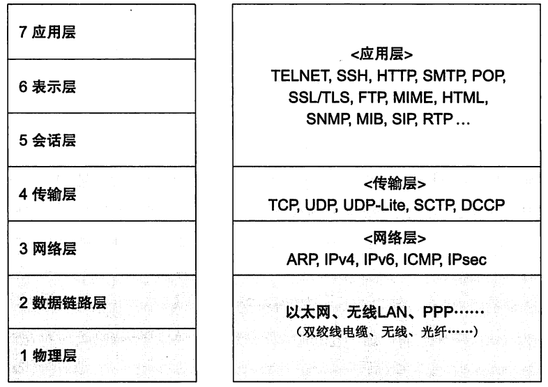
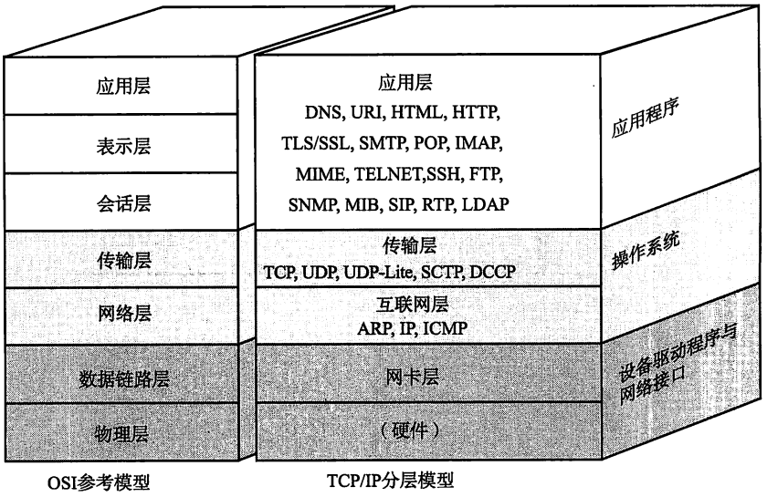
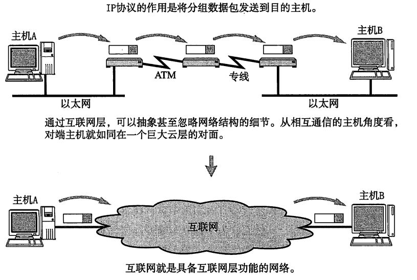
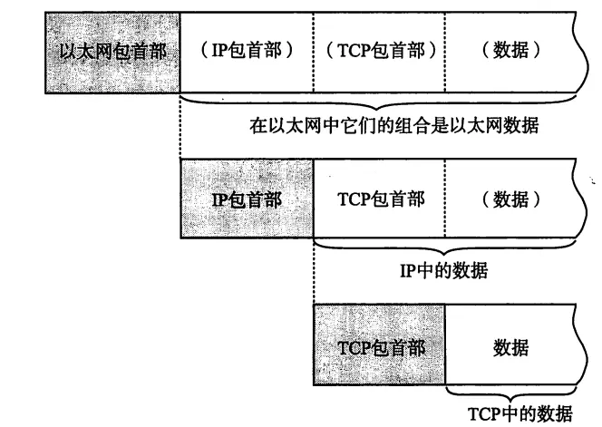
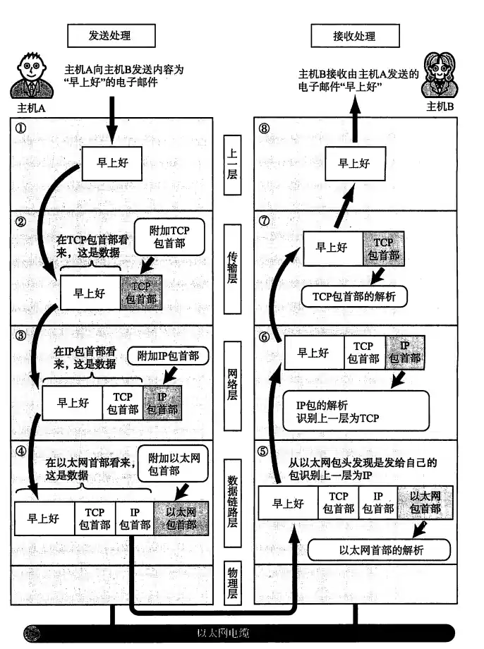
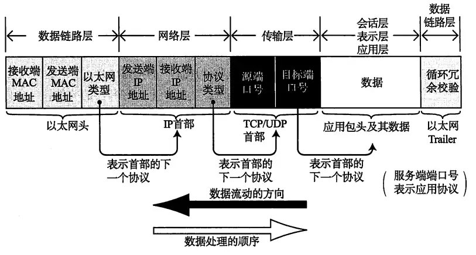

TCP(Transmission Control Protocol) 和 IP(Internet Protocol) 是最著名的通信协议

## TCP/IP协议分层

> 下面是 TC/IP 分层与 OIS 模型的对比

可以看出来,OSI参考模型专注于**通信协议需要有哪些功能**,而TCP/IP分层模型专注于**实现协议应该开发那种应用程序**。换句话说,OSI专注于协议的功能,而TCP/IP分层模型专注于应用程序的实现

### 硬件层(物理层)

TCP/IP 分层模型中最底层是负责数据传输的硬件,相当于是以太网、电话线等物理设备。它无法被节界定,因为人们使用的传输介质不同,导致网络的带宽、可靠性、安全性、延迟等都有区别,然而这些区别并没有一个标准

### 网络接口层(数据链路层)

> 有时候,也会将硬件层和网络接口层加起来称为**网络通信层**

网络接口层利用数据链路层进行通信,也就是说把它作为网络接口卡(NIC,网卡)的"驱动程序"也可以。

### 互联网层(网络层)

> 互联网层常常会使用`IP协议`,并且互联网层相当于是OSI参考模型的第三层(网络层)

IP协议是`基于IP地址转发数据包`,所以IP协议的作用就是将数据包发送到指定的目的地。

我们知道互联网通过各种网络设备连接起来的(路由器、交换机...),如果忽略互联网中设备构成,仅仅考虑两台计算机的通信,那么互联网就是具有互联网层功能的网络

TCP/IP 分层中的互联网层和传输层的功能一般由`操作系统提供`,尤其对于三层交换机(路由器)来说,需要实现互联网层**转发分组数据包的功能**,并且还需要实现**IP功能**,而其他网络设备(中继器、网桥)则不需要

:::tip 关于互联网层的协议

1. `IP`
    - 跨网络传输数据包,并让数据能触达到整个互联网的任意位置的协议,它实现的基础在于使用 IP 地址作为唯一的识别号
    - 虽然 IP 协议也是分组交换的一种协议,但是它**不具有重发机制**,所以即使数据包没有到达对端主机也不会重发,所以**IP协议属于`非可靠性传输协议`**

2. `ICMP`
    - IP数据包在发送途中一旦发生异常没有正确的送到对端的主机,需要**给发送端发送一个异常通知**,ICMP协议就是用来做这个的

3. `ARP`
    - 从分组数据的 IP 地址中解析出物理地址(MAC地址)的一种协议

:::

### 传输层

> 传输层最主要的功能就是让应用程序之间可以实现通信,并且在计算机内部同时运行这个多个程序,通过`端口`来区分哪些程序和哪些程序在通信

在传输层有两个最具代表性的协议:

1. `TCP`
2. `UDP`

#### TCP

> 它是`面向有连接`的传输层协议

1. TCP 协议的优点
    - 可以保证两端通信主机之间的通信可达,可以正确的处理数据包在传输过程中可能出现的**丢包、传输顺序乱掉等异常情况**
    - 可以有效利用带宽(拥堵算法...),缓解网络拥堵

2. TCP 协议的缺点
    - 为了建立连接,所以正常来说至少需要 7 次发包与收包(**3次握手 + 4 次挥手**),这个一定程度上导致了网络流量的浪费
    - 为了提高网络的利用率,TCP 协议定义许多的复杂的规范,这些规范并不利于对实时性要求较高的场景(视频会议等)

#### UDP

和TCP协议不同的是,UDP是`面向无连接`的传输层协议,这个意味着它**不需要知道对端是否接收到了数据**。当然如果需要知道对端是否接收到了数据,则需要在应用程序中实现

<mark>UDP常用于分组数据较少的多播、广播通信、视频会议等领域</mark>

### 应用层(会话层及以上)

在TCP/IP的分层中,将OSI中的会话层、表示层、应用层统一划分为**应用层**,也就是说在应用程序中会实现OSI会话层及以上的所有功能。

现在基于TCP/IP 的应用程序的架构一般都是**C/S模型**,也就是客户端/服务端模型,提供服务资源的是服务端,而接受服务资源的则是客户端。我们将服务资源提前"部署"到服务器上,然后客户端可以随时向服务端发送访问请求

下面是常见的应用:

1. `WWW`
    - 通过浏览器访问服务端上的资源
    - 浏览器与服务器之间通信使用协议的是`HTTP(Hyper Text Transfer Protocol)`,所传输数据的主要格式是`HTML(Hyper Text Markup Protocol)`。与之对应的 HTTP 就是OSI 应用层的协议,而 HTML 就属于表示层的协议

2. `Email`
    - 发送电子邮件时使用的协议是`SMTP(Simple Mail Transfer Protocol)`, 邮件中可以包含图片、文件、视频等,这些都称为`MIME` ,这个 MIME 就属于表示层的协议

3. `FTP(File Transfer Protocol)`
    - 文件传输协议,就是将存储在其他计算机磁盘上的文件保存到本地磁盘上,或者将本地磁盘上的文件传送到其他计算机的磁盘上
    - 在不同操作系统传输文本文件的时候,会自动修改换行符,这一点就是表示层的体现
    - 使用 FTP 的时候,会建立两个 TCP 连接: `发出传输请求的控制连接` 和 `实际传输数据的数据连接`,这两个连接都属于会话层的功能

4. `SSH / TELNET`

## 通信处理

### 数据包首部

每一层都会对发送的数据加上一个首部信息,这个首部信息描述了**该层的必要信息(如目标地址、协议相关的信息)**,通常来说<mark>为协议的是包首部,要发送的内容是数据</mark>。站在下一层的角度看,数据就是上一层的所有数据(包首部+内容)

:::tip 包首部

网络中传输的数据包由两部分组成:

1. 协议需要使用到的`包首部`
2. `上一层传过来的所有数据`(也包含上一层的包首部)

首部信息由**每个协议的具体规范定义**,比如:

- 识别上一层协议的域应该从第几位开始,取多少个 bit 
- 如何计算校验和(checksum),并插入包的哪一位
- ...

不同的协议首部信息是不同的,所以也就无法通信

:::

### 发送过程

> 背景: 计算机 A 向计算机 B 发送一封电子邮件,内容为"早上好", 从TCP/IP通信的角度来看:

#### 应用程序的处理

> 这一步处于 TCP/IP 分层模型的应用层

在电子邮件程序中输入了需要发送的信息,然后点击发送后就进入 TCP/IP 通信了

下面是通信步骤:

1. 首先会进行"格式化",比如这里将邮件内容进行编码,编码集依据应用程序的不同,可以是UTF-8、GBK等,这个步骤对应了 OSI 模型的表示层功能

2. 将邮件编码完成后,不一定会将邮件立即发出去。有的邮件应用程序会支持定时发送、批量发送,那么这种**何时建立通信连接并且何时将邮件发送出去的管理功能**, 对应了 OSI 模型的会话层功能

所以,TCP 通信连接是在邮件"真正发送出去"的时候建立的,建立了 TCP 连接之后,应用程序会将数据发送给下一层的 TCP

#### TCP 模块

> 这一步处于 TCP/IP 分层模型的传输层

TCP 模块会根据上一层的"指示"下**建立连接、发送数据、断开连接**,并且会提供**可靠的连接**将应用层发送过来的数据发送给接收端的计算机 B

为了实现这个功能,TCP 模块会在应用层发送过来的数据基础上,添加**独有的首部信息**:

1. `源端口号`
	  - 发送端应用程序本身的端口号
  	- 接收端在回送数据的时候需要使用到该端口号
2. `目标端口号`
	  - 发送端应用程序的端口号
    - 用于识别接收端主机上的应用程序

3. `序号`
	  - 用以判断发送的数据中**哪一部分是数据**
4. `校验和`
    - 用以判断发送的数据是否被损坏
    - 接收端收到发送端的数据后计算出 CheckSum 并与发送端中的 CheckSum 比较

TCP 模块(传输层) 将附加了 **TCP首部信息**, 然后将数据发送给下一层的 IP 模块

#### IP 模块

> 这一步处于 TCP/IP 分层模型的网络层

IP 将 上一层传过来的 `TCP 首部 + TCP 数据`作为自己的数据,并且在这个数据前加上自己的 `IP首部信息`。所以说 IP 首部 后面是 TCP 首部,然后后面才是应用层的首部和应用层的数据.

IP 首部包含以下的信息:

1. `发送端的IP`
2. `接收端的IP`
3. `传输层使用的是哪个协议(TCP、UDP)`

带有 IP 首部信息的数据包生成后,参考路由控制表决定此数据包的路由或主机,然后将数据发送给连接这些路由器或主机网络接口的驱动程序

如果不知道接收端的 MAC 地址,还会利用`ARP(Address Resolution Protocol)` 进行查找,找到之后就将 MAC 地址和 IP 地址交给下一层进行处理

#### 网络接口模块

> 也可以叫做**以太网驱动模块**, 这一步处于 TCP/IP 分层模型的网络接口层

拿到上一层(网络层)的数据后,以太网驱动会给这个数据附加上`以太网首部信息`,包含以下部分:

1. `发送端 MAC 地址`
2. `接收端 MAC 地址`
3. `标识以太网类型的以太网数据的协议(IP、ARP、ICMP ...)`
4. `FCS(Frame Check Sequence)`: 用于判断数据包是否因为噪声而损坏

这一层的数据会通过物理层传输给接收端

### 接收过程

#### 网络接口模块

主机收到以太网包后,首先会从以太网包首部找获取 `MAC 地址`,然后通过 MAC 地址判断这个包是否是发给自己的,如果不是则会丢弃.

如果收到的包正好是发送自己的,则会查找以太网包中的类型域来获取`以太网类型`

- 比如这里的类型就是 `IP`, 所以会**再将数据传给处理 IP 包的子程序**
- 如果这里的类型不是 IP,而是 ARP,那么则会将数据传给处理 ARP 的子程序。
- 如果都不是,那么就会丢弃数据

#### IP 模块

接收到网络接口传过来的数据(IP 包首部 + IP 包数据)后,也会从 IP 包首部中获取 IP 地址与本身的 IP 地址比较

- 如果相同,则也会从类型域中获取上一层的协议(TCP / UDP),然后将 IP 包数据交给上一层对应的子程序处理
- 如果不同,则会根据路由器中的*路由控制表* 查找应该送达的主机或者路由器,然后再转发数据

#### TCP 模块

到了这一层,会做以下的判断:

1. 计算检验和,然后和 TCP 首部中的校验和比较,从而判断数据包是否有损坏

2. 然后根据序号判断是否在按照序号接收数据

3. 最后根据 TCP 首部的端口号确定具体的应用程序

4. 数据被接收后会将数据交由指定端口的应用程序进行处理

:::caution 关于 TCP 协议的可靠性 - 重发

如果是TCP协议而非UDP协议, 在数据接收完毕之后,接收端会**回送一个"确认收到"的信息给发送端**,如果发送端没有接收到回送信息,那么**发送端会认为接收端没有收到信息而反复发送**,这个是 TCP 协议具有可靠性的一个因素

:::

#### 应用程序的处理

很简单的,主机 B 可以正常显示主机 A 发送过来的电子邮件信息

### 数据包的流动

> 以数据的发送为例,数据的接收过程是数据发送的逆过程

分组数据包在经过以太网的数据链路时,包的**从前往后**一次被加上了: `以太网包首部`、`IP包首部`、`TCP/UDP包首部`、`应用自己的包首部和数据`,并且在包的最后还会加上`以太网包尾(Ethernet Trailer)`

每个包的首部中一定会包含两个信息:

1. `发送端与接收端的地址信息 [地址域]`
    - 以太网中会用 MAC 地址
    - IP 中会用 IP 地址
    - TCP/UDP 则会用端口来标识两端主机的地址
    - 即使是应用层,比如电子邮件,也有邮件地址这样的地址信息进行标识
2. `上一层的协议类型 [类型域]`
    - 以太网包中的 [以太网类型](https://blog.huakucha.top/posts/cs/network/ethernet-type), 比如 IP 协议、ARP 协议

    - IP 包中会指定使用 TCP 或 UDP 协议
    - TCP/UDP 包中会指定端口号
    - 即使是应用层,有时也会包含识别数据类型的标签
