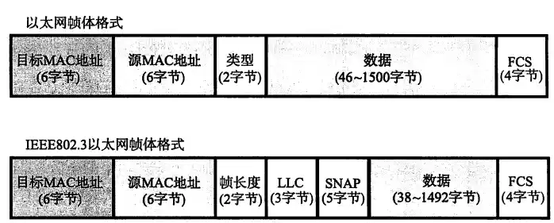

## 作用

> 数据链路指 OSI 参考模型中的数据链路层,有时候也值以太网、无线局域网,但是TCP/IP 中没有对 OSI 参考模型中数据链路层及以下部分定义

数据链路层的协议定义了**通过通信介质进行通信的设备之间传输的规范**,这里的通信介质包含了: *同轴电缆、双绞线电缆、光纤、电波、红外线等*,这些通信介质还可以通过*交换机、网桥、中继器等*中转数据

数据在传输的过程中,**数据链路层**和**物理层**是必须的,我们知道计算机通过 1 和 0 来描述数据信息,而实际上在通信媒介中是以信号的方式,这些信号可以是*电压的高低、光的闪灭等*,**物理层就是用来将 0、1 序列转为这些信号的**,而**数据链路层则是将 0、1 序列集合为一个个数据帧**

## 相关技术

数据链路层有下面的几种常见的技术:

1. MAC 地址
2. 共享介质型网络
3. 非共享介质型网络
4. MAC 地址转发
5. 环路检测
6. VLAN

### MAC 地址

MAC 地址用于**识别数据链路中互连的节点**, MAC 地址长 `48 bit`,在使用网卡(NIC) 的时候, MAC 一般会烧录到 `ROM` 中。正常来说,全世界所有设备的 MAC 地址都是不同的。

从上面可以看出, MAC 地址不同范围的值表示了不同的信息:

1. `3bit ~ 24bit` : 表示厂商识别码,即每个网卡厂商都有自己的唯一的识别编码
2. `25bit ~ 48bit` : 表示厂商内识别码,即这个网卡在厂商内部唯一的识别码 

MAC 地址一般采用 `16 进制` 来表示,按照每 8bit 转换一个值,MAC 地址的格式为: `xx-xx-xx-xx-xx-xx`, 比如: 70-B5-E8-25-DE-F2

:::tip 关于厂商识别码

有种设备叫做网络分析器,可以读取数据帧中发送的 MAC 地址里的厂商识别码,而这些存厂商识别码会公开在[这里](http://standards.ieee.org/develop/regauth/oui/public.html)

并且 MAC 地址的分配,通过[这个站点](http://standards.ieee.org/develop/regauth/oui/index.html)申请

:::

### 共享介质型网络

> 从对通信介质的使用方法上看,可以分为: **共享介质型网络** 和 **非共享介质型网络**

所谓的共享介质型网络,指的是`多个设备共享一个通信介质的网络`,早期的以太网就是这种。这种方式下,多个设备使用`同一个 载波信道`进行发送和接收,所以基本采用`半双工通信`,并且有必要对介质进行`访问控制`。

在共享介质型网络中有两种访问控制方式:

1. `争用方式`
2. `令牌传递方式`

#### 争用方式

指的是`竞争获取数据传输的权力`,也叫做`载波监听多路访问(CSMA, Carrier Sense Multiple Access)`

这种方式需要网络中各个站(节点)采用**先到先得**的方式占用信道发送数据,但是这种方式存在弊端,即如果多个站(节点)同时发送数据帧,那么就会**发生冲突**,并导致网络拥堵、性能下降。

后来出现了一种改良方式`载波侦听多路访问/冲突检测(CSMA/CD,Carrier Sense Multiple Access with Collision Detection)`,这种方式要求每个站(节点)**提前检查冲突,一旦检测到冲突,就尽早释放信道**,这种方式的大致原理如下:

1. 节点在发送数据之前，首先检测载波信道是否空闲(`载波监听`)，如果载波信道空闲则发送，否则就等待(`坚持监听算法`)
2. 在发送出信息后，再对冲突进行检测(比如监控电压)，当发现冲突时，则取消发送,并立即释放载波信道
3. 放弃发送数据后, 随机等待一段时间,然后再重新竞争介质,重新发送数据帧

:::tip 关于站
很多情况下,将数据链路中的**节点**称之为站
:::

#### 令牌传递方式

这种方式会**沿着令牌环发送一种为`令牌`的特殊报文**,是一种控制冲突的方式。这种访问控制方式要求:**只有获取了令牌的站(节点)才可以发送数据**,并且有两个特点:

1. 不存在冲突
2. 每个站(节点)通过轮训的方式可以平等的拥有获取令牌发送数据的机会,在网络拥堵的时候也不存在性能降低的问题

但是这种方式有个问题,由于依赖于令牌控制,没有令牌无法发送数据,这就导致即使在网络并不拥堵的情况下,这个数据链路的利用率无法达到 100%

### 非共享介质型网络

> 和共享介质型网络相反的就是非共享介质型网络,很明显它是**不共享介质**的

非共享介质型网络采用`控制传输方式`,这种方式下,数据链路中的每个站(节点)不会与其他站(节点)直连,而是与**交换机直连**,并且**数据也是通过交换机进行转发**。这种方式下发送端与接收端的设备不会共享介质,那么也就不需要对通信介质进行访问控制,所以这种方式一般都是采用`全双工通信`

这种方式可以利用交换机实现更高级的特性,比如虚拟局域网(VLAN, Virtual Lan),流量控制等,但是它也存在一个弊端,那就是一旦交换机故障了,那与之相连的计算机就无法通信

:::tip 关于半双工和全双工

- 半双工是指只发送或只接收的通信方式,即无法同时发送接收数据
- 全双工是指允许在同一时间发送和接收数据

:::

### MAC 地址转发

使用同轴电缆的以太网等共享介质型网络中,同一时间只能有一台主机发送数据,所以在联网的主机数量增加后,就会导致网络性能下降。而**交换集线器**就是将非共享介质型网络中的交换机用在以太网中的技术,所以交换集线器也被称为`以太网交换机`

以太网交换机就是具有多个端口的网桥,它可以根据数据链路层中数据帧中的 **目标 MAC 地址** 来决定从哪个端口发送数据,所以它内部有一个记录 MAC 地址与端口映射关系的表,我们称之为 `转发表(Forwarding Table),也叫做 MAC 地址表`。这个转发表中的内容不需要用户自己设置,而是可以自动生成的,或者说是一种**自学过程**

举个栗子:

假设 主机 A 需要向主机 B 发送数据,且此时转发表中还没有映射关系:

1. 首先主机 A 将数据从端口 E0 发送出去, 以太网交换机通过检查数据帧中的源MAC地址字段,将该字段的值(主机A的MAC地址) 和 端口E0 放入转发表中
2. 由于此时转发表中没有主机 B 的映射关系, 以太网交换机会将主机 A 的数据帧发送到以太网中的每个设备中
3. 当以太网交换机收到以太网中各个设备的返回的数据后, 也会把他们的地址学习到,写入转发表中,其中就包括主机 B
4. 之后主机 A 再向主机 B 发送数据的话,就可以利用转发表直接将数据从以太网交换机的具体端口发送出去,包括主机 B 将数据发送到主机 A 也是一样的

:::tip 交换机的转发方式
交换机的转发方式有两种

1. 存储(蓄积)转发
    - **需要会将整个数据帧接收下来后转发, 并且需要检查以太网中数据帧末尾的 FCS 位后再进行转发**,可以避免由于冲突导致的错误帧
2. 直通转发
    - **不需要会将整个数据帧接收后再转发**,而是知道目标 MAC 地址后就开始转发,它无法避免由于冲突导致的错误帧
:::

## 以太网

在众多的数据链路中使用最广泛的就是**以太网**,它的规范简单,易于 NIC 实现

### 连接形式

初期以太网是**多个终端用同一根同轴电缆,采用共享介质型的方式连接的**,但是随着接入网络设备的增加以及对于网络性能要求的增加,现代以太网则是采用**终端与交换机之间独占电缆的方式通信**

### 分类

以太网由于通信电缆类型不同、通信速度不同,将以太网分为了下面的主要大类:

| 以太网种类 | 电缆最大长度 | 电缆种类 |
|:---------:|:-----------:|:--------|
| 10Base2   | 185m(最大节点数30) | 同轴电缆 |
| 10Base5   | 500m(最大节点数100) | 同轴电缆 |
| 10Base-T   | 100m | 双绞线(UTP-CAT3-5) |
| 10Base-F   | 1000m | 多模光纤(MMF) |
| 10GBase-T   | 100m | 双绞线(UTP/FTPCAT6a) |
| ...   | ... | ... |

:::caution 注意

- 如果传输速度相同,但是传输介质不同,那么则需要连接那些允许更换传输介质的 **中继器、中继集线器**
- 如果传输速度不同,则需要连接允许更变传输速度的 **网桥、交换集线器、路由器**

:::

### 以太网帧格式

- 以太网帧前面有一个`前导码(Preamble)` 的部分,它由 0、1 数字交替组成,用于表示 **以太网帧的开始**,也是接收端网口能够确保与之同步的标志。

- 前导码的末尾是叫做 `SFD(Start Frame Delimiter)` 的域,它的值是 `11`,这个域之后就是以太网帧的本体了

- 前导码和 SFD 加起来一共有 `8 字节(64bit)`

然后就是以太网帧本体信息,主要可以分为下面几个部分

1. 以太网帧的**首部信息**, 一共占用 `14 字节(112 bit)`,其中分别包含:
    - **6 字节的目标 MAC 地址**
    - **6 字节的源 MAC 地址**
    - **2 字节的以太网类型**,[详细的以太网类型可以参看](https://blog.huakucha.top/posts/cs/network/ethernet-type)

2. 以太网帧的**数据**,一个以太网帧能够容纳的最大数据范围是 `46~1500 字节`
3. 以太网帧的尾部有一个`FCS(Frame Check Sequence,帧校验序列的)`,占用 `4 字节`
    - 这个 FCS 可以检测数据帧在传输过程中是否有损坏

相比以太网规范, IEEEE802.3 以太网帧格式有所不同:

