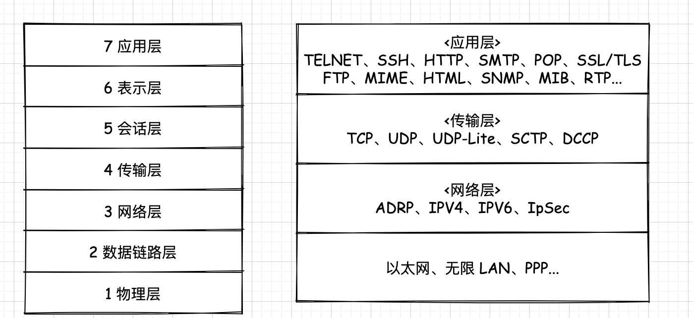

> 阐述了 TCP/IP 需要的基础知识,包括计算机和网络发展的历史以及标准化过程、OSI参考模型、网络概念的本质、网络构建的设备等

## 出现的背景

### 独立模式 TO 网络互联

最开始的时候,计算机以`单机模式`被广泛的使用(也叫作*独立模式*),但是这种方式**无法实现资源的共享**, 所以后来将一个个的计算机连接在一起,从而形成了一个**计算机网络**,这样计算机与计算机之间就实现了`数据共享`,并且两个相距较远的计算机之间还可以传递即时消息。

:::tip 计算机网络

根据它的规模可以划分为: 

- **WAN(Wide Area Network, 广域网)**, 比如多个城市之间的网络
- **LAN(Local Area Network,局域网)**, 比如校园的网络

:::

### 计算机通信 TO 信息通信

最开始的时候,只是简单的将几台计算机连接在一起形成一个计算机网络。比如讲同一公司、学校、实验室中的计算机连接在一起,形成一个`私有网络`,但是这种私有网络下,计算机通信仅仅局限于该私有网络

后来开始将**多个私有网络**连接组成一个更大的私有网络,这种网络后来逐渐演变为后来熟知的**互联网**。计算机在连接到这个互联网以后,计算机的通信就不再仅限于公司、学校、实验室等,而是**可以和互联网中的任意一台计算机通信**

## 发展的阶段

### 批处理

> 为了可以 让更多的人使用计算机,出现了`批处理(Batch Processing)系统`

批处理就是:**事先将用户程序和数据装入卡带、磁带,并且由计算机按照一定的数据读取,使用户所要执行的程序和数据可以一起得到处理**

## 协议

## 协议的定义

## 协议分层、OSI

## OSI参考模型举例

## 传输方式

## 地址

## 网络的构成

## 现代网络