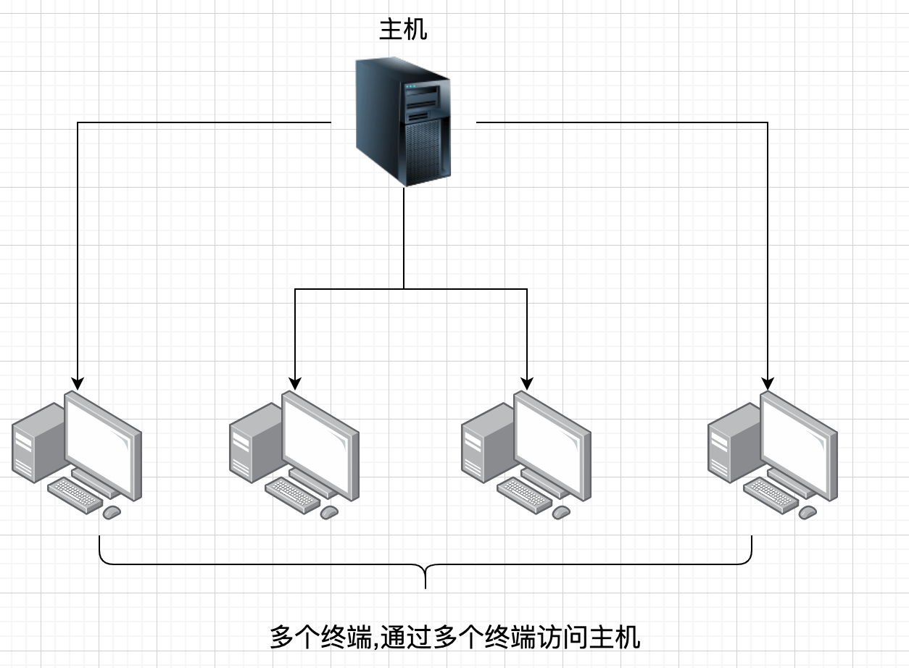

> 阐述了 TCP/IP 需要的基础知识,包括计算机和网络发展的历史以及标准化过程、OSI参考模型、网络概念的本质、网络构建的设备等

## 出现的背景

### 独立模式 TO 网络互联

最开始的时候,计算机以`单机模式`被广泛的使用(也叫作**独立模式**,指计算机没有连接到网络,各自独立使用的方式),但是这种方式**无法实现资源的共享**, 所以后来将一个个的计算机连接在一起,从而形成了一个**计算机网络**,这样计算机与计算机之间就实现了`数据共享`,并且两个相距较远的计算机之间还可以传递即时消息。

:::tip 计算机网络

根据它的规模可以划分为:

- **WAN(Wide Area Network, 广域网)**, 比如多个城市之间的网络
- **LAN(Local Area Network,局域网)**, 比如校园的网络

:::

### 计算机通信 TO 信息通信

最开始的时候,只是简单的将几台计算机连接在一起形成一个计算机网络。比如讲同一公司、学校、实验室中的计算机连接在一起,形成一个`私有网络`,但是这种私有网络下,计算机通信仅仅局限于该私有网络

后来开始将**多个私有网络**连接组成一个更大的私有网络,这种网络后来逐渐演变为后来熟知的**互联网**。计算机在连接到这个互联网以后,计算机的通信就不再仅限于公司、学校、实验室等,而是**可以和互联网中的任意一台计算机通信**

## 发展的阶段

### 批处理

> 为了可以 让更多的人使用计算机,出现了`批处理(Batch Processing)系统`

批处理就是:**事先将用户程序和数据装入卡带、磁带,并且由计算机按照一定的顺序读取,使用户所要执行的程序和数据可以一起得到处理的方式**。

当时的计算机操作起来比较复杂,不是所有的人都可以处理的,所以在实际情况是:程序运行时有专门的操作员去处理,如果有的程序运行时间比较长,那么则需要等待几天再来计算中心取结果

### 分时系统

> 继批处理之后,20世纪 60 年代出现了**分时系统(Time Sharing System, TSS)**

分时系统就是: **与同一个计算机连接,允许多个用户同时使用一台计算机的系统**,这个就让与用户感觉完全是自己一个人“独占一台电脑”,这个也体现了分时系统的一个重要特性: **独占性**

分时系统有下面四个重要特性:

1. **多路性**
2. **交互性**
3. **独占性**
4. **及时性**

分时操作系统的出现,由于其独占性的特点,让装备一套用户可以直接使用的计算机环境变得简单,成本也更低。而且在分时系统中,通常是一个主机与多个终端连接,且多个终端与主机使用通信线路连接形成了星型

### 计算机之间通信

<mark>虽然出现了分时系统,但是也仅限于一个主机与多个终端之间通过通信线路连接,但是并不意味这个多个主机之间可以相互通信</mark> 。后来计算机体积小型化,以及价格的急剧下降,计算机也逐渐在企业的内部使用,为了提高工作效率,后来开始出现**多个计算机主机之间的通信**。

在出现多个计算机之间通信之前,多个计算机之间传递数据是很麻烦的,需要通过外部存储介质(磁带、软盘等)作为中间层来传输数据。然而有了**计算机与计算机键的通信技术(计算机之间用通信线路连接)**,人们可以轻松的**即时的**读取另一台计算机中的数据

计算机之间通信的出现,极大的提高了计算机的可用性。也就是人们不再局限于用一台计算机进行处理,而是用多台计算机**分布式处理**,这就导致企业对计算机的需求量随之增加。

### 计算机网络

20 世纪 70 年代,人们开始试验**基于分组交换技术**的计算机网络,在 80 年代,可以连接多种计算机的网络也随之诞生了,他可以让各种各样的计算机互连,从大型计算机到小型的个人电脑都可以。

## 协议

### 随处可见的协议

在互联网中最具有代表性的协议有: **IP(Internet Protocol)、TCP(Transmission Control Protocol)、HTTP(HyperText Transfer Protocol)**等,而在 LAN(局域网)中最常用的协议有**IPX/SPX**。

计算机网络体系结构将这些网络协议进行了系统的归纳,**TCP/IP 是 IP、TCP、HTTP 等协议的集合**,除此之外,还有其他类型的网络体系结构:

| 网络体系结构 | 协议                                   | 主要用途                 |
| ------------ | -------------------------------------- | ------------------------ |
| TCP/IP       | IP、TCP、UDP、HTTP、TELNET、SNMP、SMTP | 互联网、局域网           |
| IPX/SPX      | IPX、SPX、NPC                          | 个人电脑局域网           |
| AppleTalk    | DDP、RTMP、AEP、ATP、ZIP               | 苹果公司现有产品的局域网 |
| XNS          | IDP、SPP、PEP                          | 施乐公司网络             |

### 协议的必要性

简单来说,协议就是**计算机与计算机之间通过网络实现通信前实现达成的一种`约定`**。这个约定让不同厂商的设备、不同的 CPU以及不同操作系统的计算机之间,只要按照同一个协议就可以利用网络进行通信。就如同人与人之间对话,语言就是"协议"。如果两个人之间使用了不同的语言(不遵守相同的协议),那么他们之间也就无法进行对话。

### 计算机中的协议

对于我们人类而言,语言可以作为沟通的"协议",即使在表达的过程中丢失了几个词,我们也可以通过上下文以及环境明白对方所表达的意思并做出相应的处理。但是"计算机是说一不二的",所以协议在设计时必须考虑到**各种异常的情况**。比如丢包、延迟甚至是计算机设备异常等。

### 分组(包)交换协议

> 我们知道了,分组交换的出现催生了计算机互联网的出现

所谓的分组交换协议就是: **将大数据分割为一个个叫做包(Packet)的较小单位进行传输**。
生活中, 我们在邮寄很多东西的时候,也会选择将需要邮寄的东西拆分为一个一个的小快递,这些的小快递就类似于 packet。

一个较大的数据被分割为多个组的时候,为了标明是原始数据中的哪一部分,就需要将每一组组的序号写入包中,然后接收端在根据序号**重新装配数据**

当进行邮寄的时候,我们往往需要写明寄件人以及收件人,对于分组交换协议来说也是一样的,**计算机通信时也会在每一个分组中附加一个源主机地址和目标主机地址**。这些**发送端地址、接收端地址以及分组的序号写入的部分被称之为:`报文首部`**。

对于计算机来说,既需要按照协议发送数据,也需要通过协议解析数据,所以**对于通信协议来说,通常会规定报文首部中应该写入哪些信息,以及应该如何处理这些信息**,只有这样计算机与计算机之间才能按照协议正确的发送和解析数据

## 协议分层、OSI

### 协议的分层

- ISO 制定的协议,按照必要的功能划分为了 7 层,在这个模型中,**每一层都会接受由它下面一层提供的服务,并且为自己的上一层提供特定的服务。**
- <mark>上下层之间进行交互时所遵守的约定我们称之为<strong>接口</strong>,同一层之间进行交互时所遵守的约定我们称之为<strong>协议</strong></mark>

### 理解分层

> 通过一个对话案例理解分层

小A 和小C 通过电话用汉语进行沟通,其中存在两个简单的协议: **沟通用的汉语协议以及电话协议**,而**人通过电话提供的接口传输数据**

那么如果小A 使用 英语,而小C 使用汉语,那么他们之间就无法正常沟通。同样的,如果电话机将电信号转为声音的方式不同,那么小A 说的内容和小C 实际听到的就不是同一个。这就是**同一层的协议必须相同,否则不同导致无法交互**

那么如果将小A 和小C 使用的语言改为英语,即**修改了同一层的协议**,但由于协议相同所以还是可以通过电话进行沟通的,这说明了**每层协议是模块化的,每一层的模块可以拓展替换**

### OSI参考模型

OSI 参考模型将复杂同的通信协议划分了 7 层:

OSI 参考模型**仅仅只是一个模型,只是对每一层进行了一个粗略的界定,并没有对协议和接口进行详细的定义**。大部分的协议在设计的时候都会参考这个 OSI 参考模型

### OSI 参考模型各层作用

1. `应用层(Application Layer)`
   - **针对特定应用的协议**
   - <mark>为应用程序提供服务并规定应用程序中通信相关的细节</mark> , 包括 文件传输、电子邮件、远程登录(虚拟终端)等协议

2. `表示层(Presentation Layer)`
   - **设备固有格式与网络标准数据格式的转换**
   - <mark>将应用程序的信息转化为适合网络传输的格式,或者将来自下一层的数据转化为上层可以处理的格式</mark>, 它主要负责<strong>数据格式的转换</strong>
   - 具体来说就是**将设备的固有格式转换为网络标准传输格式**,不同设备对同一个比特流的解析结果可能不同,所以这一层主要让他们保持一致

3. `会话层(Session Layer)`
   - **负责建立和断开通信连接的时机,以及数据的分割等数据传输的管理**

4. `传输层(Transport Layer)`
   - **起着可靠传输的作用,只在通信双方节点上处理,而无需在路由器上处理**

5. `网络层(Network Layer)`
   - **将数据传输到目标地址, 目标地址可以是多个网络通过路由器连接而成的某个地址**
   - 这一层主要负责**寻址和路由选择**

6. `数据链路层(DataLink Layer)`
   - **负责物理层上面互连的、节点之间的通信传输**, 比如说与 1 个以太网相连的 2 个节点之间的通信
   - <mark>将 0、1 序列划分为具有意义的<strong>数据帧</strong>传送给对端(数据帧的生成和接收)</mark>

7. `物理层(Physical Layer)`
   - **负责 0、1 比特流(序列)与电压的高低、光的闪灭的互换**

## OSI参考模型举例

> 通过主机A 的用户A 给主机B的用户B发送一封内容为 "Hello" 的邮件为例

### 7层通信

- 通信时,数据发送方从第7层到第1层的顺序**由上而下**的传输数据,数据接收方则是按第1层到第7层的顺序**从下而上**的传输数据。

- 数据发送方在处理上一层传过来的数据时,可以**加上当前分层所必须的"首部信息"**,数据接收方收到数据后,则会**将数据的"首部"和"内容"进行分离**,最终将发送方的数据恢复为原状

### 会话层以上的处理

#### 应用层

- 对于主机A: 用户A输入完需要发送的内容点击发送按钮时,就进入应用层协议进行处理了,该协议会在需要发送数据前面**添加一个首部信息**, 该首部信息标明了邮件的内容以及收件人用户B

- 对于主机B: 主机B 接收到 主机A 发送过来的数据后,会**分析数据首部以及数据正文**,并将邮件存储在磁盘等位置

#### 表示层

> 表示层着重于数据的表现形式

不同的软件对于相同数据的处理呈现方式也是不同的(用记事本打开图片就是一片乱码),解决这种问题的关键就是利用表示层

- 在发送数据时:**将数据从"某个计算机的特定形式"转换为"网络通用的标准数据格式"**
- 在接收数据时:**将"网络通用的标准数据格式" 恢复为 "某个计算机的特定形式"**

在该示例中,会将"Hello" 这段内容根据**编码格式**转为统一的网络数据格式,单从编码格式来说,就有很多种(比如 UTF-8、UTF-16、GBK...),不论接收端还是发送端,如果未按照指定的编码格式对数据进行转换,那么就会出现乱码

<mark>为了保证表示层之间的编码格式的统一,数据在表示层时也会加上一段首部信息</mark>

#### 会话层

> 如何高效的传输数据、采用哪种方式传输数据?

假设用户A需要发送10份邮件给用户B,那么这些邮件的发送方式可以有很多种,比如:

1. 每次发送一封邮件的时候,都去建立一次连接(通信连接),然后发送完了就销毁
2. 建立好连接后,一次将多封邮件连续的发送出去
3. 建立多个连接,将每个邮件同时发送出去

那么到底使用哪一种方式,这就是由会话层来决定的。会话层也和应用层、表示层一样,会在表示层传递的数据基础上添加首部信息,这些首部信息中包含了**数据传送顺序的信息**

### 传输层以下的处理

> 实际上,完成传输数据操作的在 传输层+网络层+数据链路层+物理层

从应用层到会话层,数据经历了: **表示层对数据的格式化编码、会话层标记数据的发送顺序**,但是对于会话层来说,只对**何时建立连接、何时发送数据**等问题进行管理,并不负责实际的传输数据

#### 传输层

主机A 与 主机B 通信,并且准备发送数据,者过程称之为**建立连接**。有了通信连接就可以让 主机A 发送的邮件到达主机B,并且最终由主机B的邮件处理程序处理。当通信传输完成之后,会将连接断开

需要注意的是:

1. **实际进行连接的建立、断开,在两个主机之间创建逻辑上的通信连接时传输层的主要作用**
    - 会话层主要负责的是建立、断开连接的时机,而传输层则进行实际的建立、断开处理
2. 为了确保数据可以能够到达目标主机,传输层会在通信两端的主机之间进行确认,如果数据没有到达,**它会负责进行重发**

:::info 关于重发的说明

比如主机A需要发送"Hello World" 的数据给主机B,但由于某些原因(比如网络异常),主机B只收到了"Hello",后面的"World"数据没有收到,那么主机B会将没有收到"Hello"后面数据的信息告知主机A,主机A收到之后会将后面的"World"重新发给主机B,并再次确认主机B是否收到

:::

为了保证数据传输的可靠性,数据在传输层的时候,传输层也会**为传输的数据加上一个首部**,需要明确的是,将数据传输给对端是依赖于[网络层](net-basic#网络层)的

#### 网络层

网络层的作用是: **在网络连接的情况下,将数据从发送端的主机发送给接收端主机**

在实际发送数据的时候,需要知道目标主机的地址,这个地址是**进行通信的网络中的唯一序号**,只有知道了这个地址,才能将数据发送给网络中的某个设备

#### 数据链路层、物理层

通信传输本质上是通过**物理的传输介质**实现的,数据链路层的作用就是**在这些通过传输介质互联的设备之间进行数据处理**

在物理层中,将数据的0、1转为电压和脉冲光传输给物理的传输介质,而**相关直连的设备之间使用地址实现传输**,这个地址被称为`MAC( Media Access Control,介质访问控制)`,也可以叫做`物理地址、硬件地址`。

同样的,物理层也会**将包含MAC地址信息的首部附加到从网络层转发过来的数据上**,并将其发送到网络

## 传输方式

网络中通信可以按照数据发送方法进行分类,主要有下面几种分类方式:

1. 面向有连接与面向无连接
2. 电路交换与分组交换
3. 依据接收端数量

### 面向有连接vs面向无连接

> 通过网络发送数据,大致可以分为面向有连接、面向无连接两种类型

- 面向有连接主要有下面几种协议:
  1. ATM
  2. 帧中继
  3. TCP
  4. ...

- 面向无连接主要有下面几种协议:
  1. 以太网
  2. IP
  3. UDP
  4. ...

在面向有连接中,在发送数据之前,需要在发送端和接收端之间建立一条**通信线路**,这个通信线路在不同分层中的含义是不同的

- 数据链路层: 物理的通信线路的连接
- 传输层: 负责创建和管理逻辑上的连接

在面向无连接中,**不要求建立、断开连接**, 发送端可以**随时的、自由的发送数据**,接收端无法知道**何时、从哪里接收到数据**。所以对于接收端来说,需要经常确认是否收到了数据。

:::info 无连接说明
由于面向无连接不需要确认接收端是否存在,所以即使接收端不存在或者无法接收数据,发送端也一样可以发送数据
:::

### 电路交换vs分组交换

网络通信方式大致可以分为

1. `电路交换`
2. `分组交换`

#### 电路交换

> 在电路交换中, **交换机**主要负责`数据的中转处理`

所谓的电路交换就是: 计算机首先被连接到电路交换机上,电路交换机之间再通过多个通信线路继续连接,所以计算机之间在发送数据的时候,**需要通过电路交换机与目标主机建立通信电路**,建立好通信电路后,用户就可以一直使用这条线路,直到该连接被断开。

电路交换存在的问题:

1. 如果说某条电路只是用来连接两台计算机,这个意味着两台计算机之间可以`独占线路`进行数据传输,但如果多个计算机需要使用这条电路,那么**只能等待占用电路的计算机断开连接后才能使用这条通信线路**。

2. 由于计算机之间通信需要独占一条电路,如果**并发用户数超过了交换机之间的通信线路数**,那么无法实现通信

#### 分组交换

> 电路交换独占通信线路的特点,导致无法保证大数量的用户进行通信

分组交换就是: 让连接到通信线路的计算机将需要发送的数据**分成多个数据包,按照一定的顺序排列之后分别发送**

- 所有的计算机可以一起收发数据,不需要独占通信线路,提高了通信线路的利用率
- 在分组的过程中,会在每个分组的**首部加上发送端、接收端的地址**,保证了即使使用了同一条通信线路,也可以很好的其区分**每一组数据是由哪个计算机发送的,以及数据的接收方是谁**

分组交换中,`分组交换机(路由器)`是很重要的组件,通信线路通过分组交换机连接起来,通常计算机与路由器、路由器与路由器之间只有一条通信线路

:::tip 分组交换机大致处理过程

发送端计算机将数据分组之后发送给路由器,路由器在收到这些分组的数据后,会将其缓存到自己的缓冲区(缓冲到相应的队列中),然后再按照FIFO的顺序将其转发给目标计算机,所以分组交换器也叫做`蓄积交换`

:::

#### 电路交换vs分组交换

- 在电路交换中: 由于独占一条通信线路,所以计算机3与计算机之间的传输速是不变的
- 在分组交换中: 由于计算机之间使用的是一条共享通信线路,通信线路的传输速度在不同情况(比如网络拥堵)下是不同的,此外**如果路由器出现缓存溢出时,还可能发生数据丢失的情况**

### 接收端数量

网络通信中,根据目标地址的数量以及后续的行为可以分为下面几个:

1. 单播(Unicast)
    - 就是 1对1 的通信,比如很早的固定电话就是单播
2. 广播(Broadcast)
    - 将消息发送从1台主机发送给与之相连的所有其他主机
3. 多播(Multicast)
    - 虽然也是1对多的发送数据,但是**多播会限定某一组主机作为接收端**
4. 任播(Anycast)
    - 和多播很像,都是面向特定的一群主机,但是任播的`行为`和多播是不同的
    - 任播会**从主机群中选择一台最符合网络条件的主机作为目标主机,随后特定的主机会返回一个单播信号,然后发送端主机只会和这条特定的主机进行通信**

## 地址

在通信传输中,发送端和接收端都可以作为一个通信主体,它们都能有由"地址信息"加以标识

### 唯一性

在通信中,**地址和主体对象是一一对应的**,也就是一个地址对应一个主体对象。在同一个通信网络中不会存在多个相同地址的通信主体

### 层次性

> 在地址不多的时候,可以很简答的通过唯一地址找到通信主体,但是随着通信主体的增加,地址总数也越来越多,那么高效的找到地址就很重要
>
> 所以地址除了具有唯一性,还需要具有**层次性**。比如电话号码就具有层次性,它包含了国家区号以及国内城市区号

MAC 地址和 IP 地址在标识通信主体的时候都具有唯一性,但是它们当中只有IP具有层次性,因为Mac地址虽然有唯一性,但是它是由网卡厂商内部指定的,对于寻找通信对象没有任何作用

:::tip IP地址实现分层

IP地址由`网络号+主机号`组成,如果通信主体地址的网络号相同,那么说明通信主体**处于同一个网段**, 一般来说同一个网段的主机在同一个地域,所以IP地址具有一定的层次性

:::

### 传输与地址流程

> 在网络传输中,每个节点会根据分组数据的地址信息来判断该报文应该由哪个网卡发出
>
> MAC寻址和IP寻址都会参考一张`发出接口列表`
>
> - MAC寻址参考的叫做: `地址转发表`
> - IP寻址参考的是: `路由控制表`

步骤:

1. 主机A先查看自己的路由控制表,再根据这个表将发送主机β 的数据先发给路由器1
2. 接收到数据的交换机1则根据自己的地址转发表将数据转发给路由器1
3. 接收到数据的路由器1根据自己的路由控制表将数据发给路由器3
4. 接收到数据的路由器3根据自己的路由控制表将数据发给交换机3
5. 接收到数据的交换机3根据自己的地址转发表将数据发给主机β

## 网络的构成

> 搭建一套网络环境涉及到了各种电缆以及网络设备

| 设备            | 作用 |
|:---------------:|:---:|
|`网卡`              |让计算机联网的设备(Network Interface)|
|`中继器(Repeater)`  |从物理层上延长网络的设备|
|`网桥(Bridge)/2层交换机`  |从数据链路层上延长网络的设备|
|`路由器(Router)/3层交换机`  |从网络层上转发分组数据的设备|
|`4~7层交换机`      |处理传输层以上各层网络传输的设备|
|`网关`            |转换协议的设备|

### 通信媒介与数据链路

计算机网络指的是计算机与计算机连接形成的网络,现实中计算机通过`电缆`相互连接,电缆可以分为很多种,常见的有:

1. 双绞线电缆
2. 光纤电缆
3. 同轴电缆
4. 串行电缆

根据数据链路(Datalink,相互直连的设备之间通信所涉及的协议及其网络)的不同,选用的电缆类型也不同:

:::tip 传输速率与吞吐量

1. 传输速率: **在数据传输的过程中,两个设备之间数据流动的物理速度**,单位为 `bps(Bit Per Seconds)`。传输速率并不是单位数据流动的速度有多快,而是单位时间内传输的的数据量有多少。所以传输速率又叫做`带宽(Bandwidth)`,带宽越大网络传输能力越大

2. 吞吐量: **主机之间实际的传输速率**,吞吐量不仅能衡量网络,还可以衡量`主机的CPU处理能力、网络拥堵程度、报文中数据字段的占有份额`...

:::

### 网卡

任何一台计算机连接网路的时候,都必须使用`网络接口卡`(NIC, Network Interface Card),有时也叫做: **网络适配器、网卡、LAN卡**

### 中继器(Repeater)

中继器是基于OSI模型的第一层(物理层)上延长网络的设备, 它将**由电缆传过来的电信号或者光信号进过中继器的波形调整和放大后再传给另一个电缆**,有下面的特点:

1. 中继器是对减弱的信号进行`放大并发送`的设备
2. 中继器是通过`物理层`的连接延长网络
3. 即使在数据链路层出现数据错误,中继器也仍然会转发数据
4. 中继器`无法改变传输速度`, 所以不能中继器传输速度不同的媒介中转发,如果需要连接两个不同传输速度的w网络需要使用网桥或者路由器这样的设备

5. 一般来说,中继器的两端连接的是`相同的通信媒介`,但是有的中继器可以实现不同媒介的(比如可以在同轴电缆和光缆之间调整信号),**但是这种情况下中继器只是单纯的负责将电信号转为光信号**

6. 通过中继器虽然可以将通信网络延长,但并不是无限制的延长

:::tip 说明

有些中继器可以提供多个端口的服务,这种中继器被称为中继集线器(集线器)

:::

### 网桥(2层交换机)

网桥(Bridge)是在OSI模型的第二层-`数据链路层`上连接多个网络的设备, 有以下的功能:

1. 能`识别`数据链路层中的数据帧,并将这些数据帧`临时存储`在内存中,然后`重新生成`信号作为一个新的帧`转发`给相连的`另一个网段`。这意味着它**可以连接不同传输介质、不同传输速率的数据链路**,并且不限制连接网段的个数

2. 数据链路层的数据帧中有一个数据位叫做`FCS`,用于校验数据帧是否正确的送到目的地,而**网桥会校验这个值来将那些被损坏的数据丢弃,从而避免发送给其他网段**

3. 网桥可以通过`地址自学机制和过滤功能控制网络流量`,比如主机A和主机B进行通信的时候,网桥可以只针对主机A发送数据帧
   - 网桥是基于数据链路层的,所以这里的地址就是`MAC地址(硬件地址、物理地址、适配器地址)`

4. 自学式网桥可以判断是否将数据报文转发给相邻的网段,该类型的网桥可以记住**自己转发的所有数据帧的MAC地址,并且存在自己的内存中(MAC地址表)**

交换集线Hub 建立MAC地址表过程:

- 假设主机 A 向主机 B 发送一个数据帧,当该数据帧从 E0 端口进入网桥后,网桥通过检查数据帧中的源MAC地址字段,将该字段的值(主机A的MAC地址)放入 MAC 地址表中,并把它与 E0 端口对应起来,表示 E0 端口所连接的是主机 A

- 由于在MAC地址表中没有关于主机C的MAC地址, **网桥会将该数据帧向除了E0端口以外的所有端口转发**,从而保证主机C能收到该帧(这种操作叫`泛洪(flooding)` )

- 同理,当交换机收到主机B、C、D的数据后也会把他们的地址学习到,写入地址表中,并将相应的端口和MAC地址对应起来, 最终会把所有的主机地址都学习到,构建出完整的MAC地址表

- 当构建完MAC地址表后, 如果主机A再向主机C发送一个数据帧,网桥会根据它的MAC地址表中的地址对应关系,将此数据帧仅从它的E2端口转发出去, 从而仅使主机C接收到主机A发送给它的数据帧,不再影响其他端口

:::tip 说明

- 数据帧和分组数据的意思基本相同,不过在数据链路层中一般称之为数据帧/帧。**每一个数据帧中都包含有源MAC地址和目的MAC地址**

- 以太网等网络中经常使用的`交换集线器(Hub)` 基本也属于网桥的一种

:::

### 路由器(3层交换机)

- 路由器(Router) 是在OSI模型的第三层-`网络层`上连接多个网络,**并对分组报文进行转发的设备**
  - 网桥是根据`MAC地址`(物理地址)进行处理的
  - 路由器则是根据`IP地址`进行处理的,所以TCP/IP中网络层就成为了IP地址
- 路由器可以**连接两个不同的数据链路**

### 4~7层交换机

4~7层交换机负责处理OSI模型中4层~7层(传输层-应用层)的数据,如果以TCP/IP模型来说,就是**以TCP等协议的传输层及其以上的应用层为基础,分析收发数据,并进行特定的处理**

我们常见的`负载均衡器`就是4~7层交换机,它可以将同一个URL请求分发到后台的多个服务器上:

除此之外,4~7层交换机还支持`带宽控制`,比如希望在网络拥堵的时候可以优先处理某些请求。而且,4~7层交换机还支持`广域网加速、特殊应用访问加速、防火墙`等功能

### 网关(Gateway)

网关是**负责将从传输层到应用层的数据进行转换和转发**的设备,虽然和4~7层交换机一样处理传输层以上的数据,但是网关不仅转发数据,还会对数据进行`转换`。

通常会使用一个表示层或者应用层网关,在两个不能进行直接通信的协议之间进行"翻译",最终实现两者之间的通信。

## 现代网络
